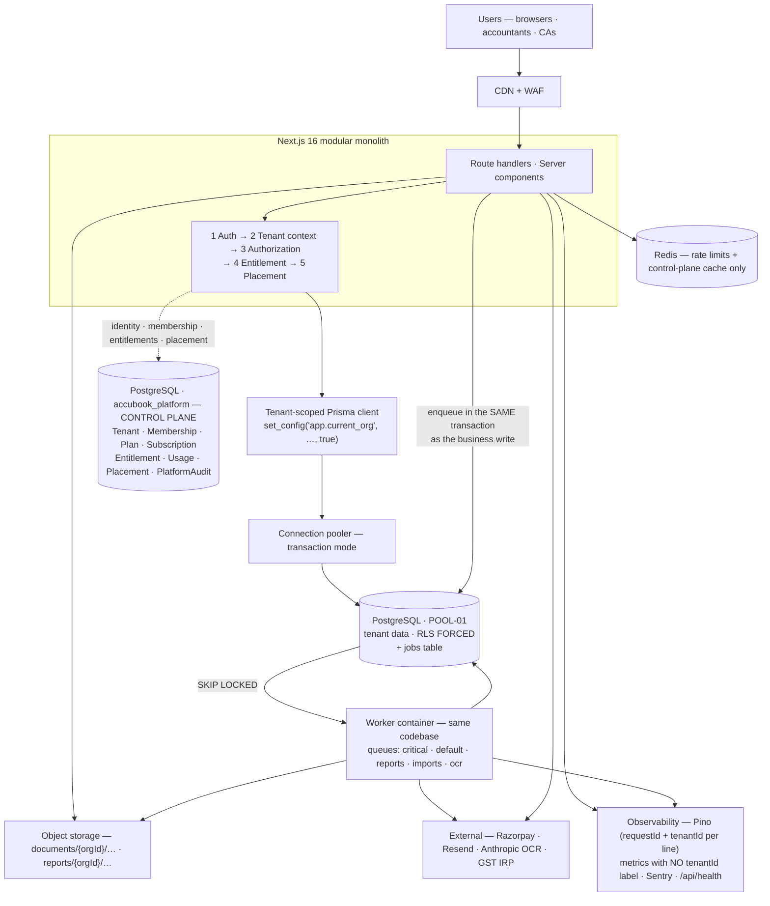

# AccuBook — Architecture Brief

**Read this one.** It is the working summary of `docs/Architecture.md`, which stays as the reference: 108 tables, 36 diagrams, 15 ADRs, section-by-section detail. Section numbers below (§n) point into it.

**Measured against** branch `fix/hr-tenancy-batch-atomicity`, commit `f371d13`, 26 August 2026. **No repository changes have been made.**

Claims are tagged **[VERIFIED-REPO]** (measured here), **[VERIFIED-TEST]** (observed by running the code), **[PATTERN]** (established industry practice), **[VENDOR-CHECK]** (a vendor fact, current to May 2026, re-verify before spending money), **[ASSUMPTION]**, or **[JUDGEMENT]**.

***

## 1. The decision

**Pooled, single-database, shared-schema multi-tenancy, with PostgreSQL Row-Level Security as the enforcement floor, a separate Platform (control-plane) database, and a `tenant_placement` indirection layer built in V1 even though V1 will only ever have one placement.**

Stay a **modular monolith** on Next.js. Split out exactly one process — a **worker** — because background work has genuinely different runtime requirements from HTTP handling, not because "services scale better".

| Decision | Choice | Reason |
|---|---|---|
| Tenancy model | POOL — shared DB, shared tables, `organizationId` | 100,000 databases is an operational cost no small team survives; 100,000 rows in a partitioned table is free |
| Isolation | App guard **+ PostgreSQL RLS** | The guard stops attackers; RLS stops *your own developers*, which is the failure mode that actually leaks data |
| Control plane | Separate Platform DB | Tenant lifecycle, billing and placement must not live in the books they govern |
| Placement | `tenant_placement`, all rows → `POOL-01` | ~2 days now; a rewrite in year 3 if skipped |
| App shape | Modular monolith + one worker | Two deployables a team of 2–5 can operate at 2 a.m. |
| Database | One Postgres → vertical scale → read replicas → partition → shard | Every step reversible, none requires an application rewrite |
| Jobs | Postgres queue (`FOR UPDATE SKIP LOCKED`), tenant context in the payload | You already have the database; a queue is not a reason to add Redis, Kafka or SQS |
| Cache | Redis for rate limits, tenant metadata, entitlements — **never accounting data** | A cached ledger balance is how you ship a wrong trial balance |
| Deployment | Vercel + Neon for V1, plus a container-hosted worker | Small team, app is already there; migration triggers in §43.2 |
| Not in V1 | Kubernetes, Kafka, Elasticsearch, microservices, multi-region active-active, CQRS, event sourcing | Each has a named trigger condition in §62 |

### Why not database-per-tenant

It is the model most first-time SaaS architects choose, and it is genuinely attractive: perfect blast radius, trivial single-tenant restore, no `WHERE` clause can leak. At 100,000 tenants it also produces **100,000 migrations per release** (at an optimistic 2 s each with 50-way parallelism, ~67 minutes of orchestrated, resumable, partially-failing work — you would be operating a migration platform as a *product*), a connection problem with no good answer (poolers multiplex *within* a database, not across databases), 100,000 backup schedules and monitoring targets, and a per-tenant cost floor because managed Postgres bills per instance.

The decisive argument is economic. AccuBook's market — Indian SMEs on Tally, Zoho Books, Vyapar and Excel — is a ₹300–3,000/month market. **A per-tenant infrastructure floor above roughly ₹50/month destroys the business model.** [JUDGEMENT] Pooling amortises one well-run database across thousands of small tenants; silo tenancy amortises nothing. That is why mass-market SMB accounting SaaS is pooled and the silo model appears almost only in enterprise-priced products (§8).

What silo gets right — blast radius, restore, noisy-neighbour immunity — we buy back selectively via placement, at the point where one tenant is large enough to pay for it. **That is the hybrid, and it is why the placement indirection must exist from day one while doing nothing.**

### Why RLS, when the code already filters by `organizationId`

The existing guard is good. **[VERIFIED-REPO]** All 110 org-scoped route files are wrapped in `withOrgAuth`; none opts out of the role check. It is still not sufficient, for one reason: `withOrgAuth` proves who the caller is and which organisation they may act in — it cannot prove that the query the handler then writes stays inside that organisation.

```ts
// Compiles. Passes withOrgAuth. Returns every tenant's invoices.
const invoices = await prisma.invoice.findMany({ where: { status: "OVERDUE" } });
```

With RLS that query returns **zero rows**. The mistake becomes a visible bug in the developer's own tenant instead of an invisible breach in someone else's. The repo already contains `findForeignReferences` **[VERIFIED-REPO]**, written because someone recognised this bug class for client-supplied foreign keys — the right instinct, applied at one layer. RLS applies it at every layer: raw SQL, reports, background jobs, and the code not yet written.

***

## 2. Where the code actually stands

**[VERIFIED-REPO]** The brief's figures were close but stale:

| Metric | Brief said | Actual |
|---|---|---|
| Prisma models | 72 | **74** — and **0 enums**; every status is free text |
| API routes | 102 | **122** (110 org-scoped, all wrapped, **0** `skipRoleCheck`) |
| Migrations | 14 | **18** (`0_init` … `17_hr_masters_per_tenant`) |
| Test files | 32 | **62** — 640/640 unit tests pass in 2.4 s **[VERIFIED-TEST]** |
| `Decimal` columns | — | **169**; `Float` columns: **0** — correct for money |
| Soft-delete columns | — | **0** |

Read the divergence as a positive signal: the codebase is ~25% larger and has roughly twice the test coverage assumed. **That materially strengthens the case for evolving it rather than rewriting it.**

### What is already right, and must be preserved

1. **A single fail-closed authorisation guard.** `withOrgAuth` does session-or-API-key auth, membership lookup, `isActive`, same-origin CSRF on mutating requests, and a role-permission check derived from `(pathname, method)` — in one place, for all 110 routes. **An unregistered path returns 403, not 200.** Fail-closed by construction is rare.
2. **API keys cannot exceed their creator's role** — scopes are intersected with the issuing user's permissions, closing the standard privilege-escalation-by-key-minting hole.
3. **Foreign-key tenant validation exists** — `findForeignReferences` returns the same answer for "belongs to another tenant" and "does not exist". No existence oracle.
4. **Money is correct** — 169 `Decimal(18,4)`, zero `Float`.
5. **Real concurrency handling, with the reasoning recorded** — `posting.ts` uses raw `INSERT … ON CONFLICT … RETURNING` with a comment explaining that Prisma's `upsert` under the driver adapter degrades to select-then-insert and loses the race, plus an integration test that proves it.
6. **A migration guard born from a real incident** — `migrate-on-deploy.mjs` restricts `prisma migrate deploy` to `VERCEL_ENV=production` after preview builds migrated production. Keep this behaviour through any deployment change.

***

## 3. The four findings that matter

### 3.1 33 of 74 models have no `organizationId` — 22 of them are tenant-owned

RLS cannot express "this row belongs to tenant X" for a table that does not say which tenant it belongs to. The 33 split three ways, and conflating them is a mistake:

| Category | Models | Treatment |
|---|---|---|
| Platform / identity | `User`, `Account`, `Session`, `VerificationToken`, `Organization` | Move to the Platform DB (§10) |
| Genuinely global reference data | `Currency`, `ExchangeRate` | Keep global, read-only to tenants |
| **Tenant-owned, scoped only through a parent** | `VoucherEntry`, `InvoiceItem`, `InvoiceTax`, `BillItem`, `BillTax`, `InvoicePayment`, `Stock`, `Batch`, `StockMovement`, `SalesOrderItem`, `QuotationItem`, `PurchaseOrderItem`, `BomItem`, `ItemUnit`, `BankTransaction`, `BankReconciliation`, `Attendance`, `Leave`, `Payslip`, `ExpenseClaim`, `BudgetLine`, `ApprovalWorkflowStep`, `FiscalPeriod` | **Backfill `organizationId`** (§20.5) |

**`VoucherEntry` is the general-ledger detail table** — the most sensitive table in an accounting system — and it carries no tenant column at all.

The work is mechanical and safe (an expand/contract backfill plus a denormalised column) but it is **prerequisite**, it touches large tables, and it must land before RLS means anything. This is the concrete answer to "what do we do first".

### 3.2 A live cross-tenant defect: `Role`, `VoucherType`, `UnitOfMeasure`

These three are *global* tables that behave as if tenant-owned (§2.6):

- **`Role`** — a custom role created by one tenant is assignable by all, and editing it silently changes their permissions.
- **`VoucherType.code`** and **`UnitOfMeasure.name`** are globally unique — the first tenant to create code `SALES` blocks every other tenant from ever creating it.

This is present today, not a future risk. Migration `17_hr_masters_per_tenant` already applied the correct system-vs-tenant split to `Department` and `Designation`; the same pattern just needs completing here.

### 3.3 Preview deployments read and write the production database

`migrate-on-deploy.mjs` correctly stopped previews *migrating* production after that incident. But preview code on an unmerged branch still reads and writes live books (§45.3). Per-PR database branches fix it in about a day.

### 3.4 There is no way to charge anyone

**[VERIFIED-REPO]** There is no `Plan`, `Subscription`, `Feature`, `Entitlement` or `Usage` model in the schema. This is a commercial blocker, not a scaling one, and **it arrives before any scaling problem does** (§23–24).

### What breaks first, in order [JUDGEMENT]

1. Cross-tenant leak via a hand-written query or report — nothing structural prevents it today (§35).
2. Connection exhaustion under serverless fan-out — the pool cap of 3 per instance is a thoughtful choice, but concurrency × 3 is unbounded above by design (§17).
3. Synchronous reports timing out — Trial Balance / P&L / GSTR-1 over a busy tenant's year will exceed the function limit well before 1,000 tenants (§29).
4. `audit_logs`, `voucher_entries`, `stock_movements` growth — append-only and unbounded; unpartitioned, they degrade first (§18).
5. No subscription or entitlement model (§23–24).
6. Migration/deploy coupling — acceptable now, untenable once migrations take minutes (§20).

***

## 4. The V1 architecture



Five gates run in fixed order on every request: **authentication → tenant context → authorization → entitlement → placement**. Tenant identity is resolved server-side from the authenticated session's membership and **never** from a request parameter. Context reaches the database as a transaction-local `set_config`, which is what makes it compatible with a transaction-mode pooler.

***

## 5. The fifteen decisions, one line each

Full context, options, trade-offs and reconsider-triggers are in §60.

| ADR | Decision | Reconsider when |
|---|---|---|
| 001 Tenancy model | Pooled + RLS now; hybrid (POOL/BRIDGE/SILO) as the designed target | An enterprise segment pays >₹40k/mo *and* demands isolation, or a regulator mandates it |
| 002 Engine & layout | PostgreSQL; two databases (`accubook_platform`, `accubook`), same cluster in V1 | §19.2 sharding triggers fire |
| 003 Isolation | Defence in depth: `withOrgAuth` + filters + RLS forced against a non-owner role + composite FKs + CI tests | Measured overhead exceeds 5 ms p95 — then narrow scope table-by-table, in writing |
| 004 Control plane | Separate Platform DB for tenants, identity, plans, entitlements, usage, placement | Foundational — do not |
| 005 Tenant context | `AsyncLocalStorage`, derived from membership, propagated via transaction-local `set_config`; jobs carry a NOT-NULL `tenant_id` | ALS proves lossy — fall back to explicit context objects, RLS unchanged |
| 006 Prisma | Keep it. One client **per placement**, from a registry, wrapped in a `$extends` scoping extension. Raw client not exported | Prisma p99 overhead becomes material |
| 007 Pooling | Transaction-mode pooler; small app pool (3 serverless, 10–20 worker) | Moving off serverless — but keep the transaction-local mechanism regardless |
| 008 Jobs | Postgres queue with `SKIP LOCKED`, worked by a container. **Transactional enqueue removes the need for an outbox** | Sustained load >~5,000 jobs/s, or queue IO measurably harms OLTP |
| 009 Caching | Redis for rate limits and control-plane metadata only. **No financial data, ever** | Do not, for financial figures |
| 010 Object storage | Tenant-prefixed keys, access only via org-scoped routes after a row read under RLS, short-lived signed URLs | Storage exceeds ~1 TB — evaluate R2/S3 for egress cost |
| 011 Observability | `tenantId` on every log line; **never** as a metric label (use `tenant_tier`); per-tenant aggregates as rows in Postgres | A contractual SLA needs real-time per-tenant metrics — allow-list those tenants |
| 012 Deployment | Vercel + Neon + one worker container. No Kubernetes | Two or more §43.2 triggers fire — most likely India data residency |
| 013 Disaster recovery | RPO ≤ 5 min via PITR; RTO ≤ 4 h; **single-tenant restore as a written, rehearsed script**; quarterly rehearsals | Enterprise contracts demand tighter RTO — that is a SILO conversation, and it should be priced |
| 014 Subscriptions | Plan → Feature/Limit → **materialised Entitlement**, with overrides, trials and metered usage. **Never `if (plan === 'PRO')`** | Foundational |
| 015 Monolith vs services | **Modular monolith + one worker.** Enforced in-process boundaries, no extraction in V1 | One module has a genuinely different scaling profile (OCR is likeliest), or the team exceeds ~15 |

**On ADR-015:** posting an invoice touches invoices, GL, stock, tax and audit **in one transaction**. Splitting that across services replaces a database transaction with a distributed saga — eventual consistency where strong consistency is required. A team of 2–5 cannot operate a distributed system and ship an ERP.

***

## 6. Top risks

Ranked by severity × likelihood on the current trajectory. Full list of 20 in §61.1; 30 architectural red flags in §61.2.

| # | Risk | Severity | Likelihood | Mitigation |
|---|---|---|---|---|
| 1 | **Cross-tenant data leak** | Critical | Medium without RLS | RLS + composite FKs + isolation matrix + CI schema test + 404-not-403 |
| 2 | **Restore fails when needed** | Critical | Medium — **never tested** | Automated restore verification + quarterly rehearsal + immutable backups |
| 3 | **Bad migration destroys data** | Critical | Medium | Expand/contract enforced in CI + pre-migration snapshot + production-only guard ✅ |
| 4 | **Financial inconsistency** — unbalanced books, duplicate posting | Critical | Medium | Balance constraints + immutability trigger + idempotency + nightly reconciliation alarm |
| 5 | **A job runs in the wrong tenant** | Critical | Medium | `tenant_scope_required` CHECK + assertion + isolation matrix row 10 |
| 6 | Platform DB is a SPOF | High | Medium | Stale-while-error cache + degraded mode + HA at Stage 4 |
| 7 | Connection exhaustion | High | **High** without a pooler | Transaction pooler + small pools + workers off serverless |
| 8 | Noisy neighbour | High | **High** | Rate limits + queue isolation + in-flight caps + timeouts + placement |
| 9 | **Cannot charge** | High | **Certain today** | Subscription + entitlements before launch |
| 10 | Reports time out | High | **High** | Tiering + async jobs + summary tables + replica |
| 11 | `Role`/`VoucherType`/`UnitOfMeasure` collision | High | **Certain — present today** | System-vs-tenant split |
| 12 | Previews share production data | High | **Certain — present today** | Per-PR database branches |

A representative few of the red flags, with today's status: money as `Float` *(absent ✅)*; `organizationId` taken from a request parameter *(absent ✅)*; `tenantId` cached in a JWT and trusted *(absent ✅)*; a global table tenants can write to **(present — §2.6)**; a child table with no tenant column **(present — 22 tables)**; a financial write endpoint with no idempotency key **(present — all of them)**; a status column with no enum and no check constraint **(present — 0 enums)**; a backup never restored **(present)**; a preview environment pointed at the production database **(present)**.

***

## 7. The order of work

**[ASSUMPTION]** 2–3 engineers. Nothing starts before this is reviewed and approved. Phase detail — deliverables, dependencies, rollback, gates — is in §64.

| Phase | Weeks | What it delivers | Blocks launch? |
|---|---|---|---|
| **0 Foundation** | 1 | Approved ADRs; structural CI tests; `statement_timeout`/`lock_timeout`/`idle_in_transaction_session_timeout`; wraparound alert; secret scanning; **per-PR preview databases (fixes risk 12)** | **yes** |
| **1 Tenant data completeness** | 2–3 | `organizationId` backfilled on 22 tables via expand/contract; composite FKs `(organizationId, parentId)`; org-leading indexes; **system-vs-tenant split (fixes risk 11)**; schema conformance test | **yes** |
| **2 Control plane** | 3–4 | `accubook_platform` DB; Tenant/Membership/Placement/MigrationState/SupportGrant; identity migrated out; `tenant_placement` → `POOL-01`; client registry; stale-while-error cache | **yes** |
| **3 Authorization** | 2 | Tenant status gate; branch scope; 404-not-403 uniformly; permission-map completeness test; break-glass flow; admin plane separated | **yes** |
| **4 RLS** | 3–4 | `app_tenant`/`app_platform`/`app_report`/`app_admin_support` roles; Prisma scoping extension; RLS rolled out per table behind flags; **the 28-row isolation matrix**; overhead measured against the ≤5 ms budget | **yes** |
| **5 Jobs** | 2–3 | `jobs` table with `tenant_scope_required`; worker container; queue separation; per-tenant in-flight cap; retries, backoff, DLQ; crons converted to per-tenant enqueue | **yes** |
| **6 Commercial** | 3–4 | Plan/Feature/Limit/Subscription/Entitlement/Usage/Billing; entitlement gate in `withOrgAuth`; usage metered transactionally; **hard OCR and storage caps**; Razorpay with verified deduplicated webhooks; trial/upgrade/downgrade/dunning **(fixes risk 9)** | **yes** |
| **7 Reporting** | 2–3 | T1/T2/T3 tiering; async reports → object storage → signed URL; summary tables maintained in the posting transaction + nightly reconciliation alarm; async exports and imports | **yes** |
| **8 Observability** | 2 | `requestId`/`tenantId` on every line and span; alert set with runbooks; per-tenant aggregate metrics; tenant health score; on-call rotation | **yes** |
| **9 Backup/restore** | 2 | PITR verified on both DBs; immutable separately-credentialed backup storage; weekly automated restore verification; **the single-tenant restore script**; rehearsed full-restore runbook **(fixes risk 2)** | **yes** |
| **10 Disaster recovery** | 1–2 | DR playbook; degraded mode implemented and tested; four manual chaos experiments; incident response with named owners; status page | recommended |
| **11 Load testing** | 2 | k6 suite; production-shaped staging data; **the noisy-neighbour test**; documented breaking points | recommended |
| **12 Hardening** | 2–3 | CSP enforced; malware scanning; magic-byte validation; pen test scoped to include multi-tenant isolation; data classification register; DPDP legal review; DPA and sub-processor list | **yes** |
| **Total** | **~22–28 weeks** | with some parallelism (6 runs alongside 3–5; 7 alongside 8; 9 alongside 10) | |

**[JUDGEMENT]** Five to seven months to a defensible V1 for a small team, on top of a codebase that is already substantially complete. Phase 4 carries the highest execution risk in the programme — a mistake returns zero rows, or far worse, the wrong rows; matrix rows 19–21 must be green before any high-traffic table is enabled. **Do not launch without Phase 9.**

If the schedule must be compressed, cut in this order: Phase 11 (do it after launch, at low volume), then Phase 10 (write the playbook, defer the automation), then parts of Phase 8. **Phases 1, 4 and 9 cannot be cut** — they are isolation, isolation, and the ability to recover from your own mistakes.

***

## 8. Start here — the first fortnight

Highest value per unit of effort. None of it depends on approving the rest of the architecture.

| # | Action | Effort | Value |
|---|---|---|---|
| 1 | Set `statement_timeout`, `lock_timeout`, `idle_in_transaction_session_timeout` | **hours** | **very high** |
| 2 | Give preview deployments their own database branch | 1 day | **very high** |
| 3 | Extend rate limiting to sign-in and password reset (only register is limited today) | 1 day | **very high** |
| 4 | CI test: every org route is wrapped in `withOrgAuth` | 1 day | **very high** |
| 5 | Transaction-ID wraparound + backup-age alerts | hours | high |
| 6 | Secret scanning in CI and pre-commit | hours | high |
| 7 | `organizationId` indexes on the three tables missing them | hours | medium |
| 8 | Write — do not yet run — the single-tenant extraction script | 2 days | **very high** |
| 9 | Immutability trigger on posted vouchers | 1 day | high |
| 10 | Nightly trial-balance reconciliation alarm | 1 day | **very high** |

**[JUDGEMENT]** Items 1, 2, 3 and 10 together are under a week and remove four of the twenty risks.

***

## 9. What I need from you

These change the answers above, and several are on the critical path.

1. **Plan tiers and prices?** §23.3 is my assumption and it drives the whole entitlement model.
2. **Realistic 12-month tenant target?** If it is 500 rather than 5,000, Phases 7, 8 and 11 can be deferred.
3. **Tenant mix — many micro-businesses, or fewer larger ones?** This changes capacity planning more than tenant count does.
4. **Any named enterprise prospect requiring data isolation?** If so, BRIDGE moves up the roadmap.
5. **Has any customer asked for data-in-India?** The most likely trigger for moving off the current platform.
6. **How many engineers over the next 12 months?** The roadmap assumes 2–3.
7. **Who owns which modules?** Module boundaries work best when they match ownership.
8. **Is Indian counsel engaged for DPDP and the retention/erasure conflict?** On the critical path for launch.

***

## Notes on this document

Diagrams are Mermaid: they render natively in the Markdown edition (GitHub, GitLab, VS Code, Obsidian, Typora). In the Word edition they appear as source text — run `npx mmdc -i docs/Architecture-Brief.md -o out.md` for images.

**Legal notice.** Regulatory content here describes *architecture*, not law. Nothing is legal advice. Every compliance obligation named must be confirmed with Indian counsel and, for GST/TDS specifics, with a practising CA.

Every **[VENDOR-CHECK]** fact — Neon compute and connection limits, Vercel function and cron limits, Upstash limits, Razorpay behaviour, AWS `ap-south-1` availability, GST and TDS schemas — is stated from knowledge current to **May 2026** and must be re-verified against the official sources listed in §0.3 before it becomes a purchase order or a capacity plan.

*Prepared 26 August 2026 against commit `f371d13`. Repository measurements are reproducible with the commands in §2.1. No repository changes have been made.*
