# AccuBook — Multi-Tenant Architecture Design

## Scaling 0 → 100,000 tenants without a rewrite

**Document type:** Architecture design. This is the *target design* — what to build and why. It is a companion to `docs/Architecture.md` (the assessment: what exists today, what is wrong with it, in what order to fix it) and `docs/Architecture-Brief.md` (the 12-page summary of that assessment). Where this document needs a finding from the assessment it cites it as **[A §n]**.

**Reference systems studied:** Salesforce (Force.com/Lightning Platform), Zoho Books, TallyPrime on cloud. §2 states precisely what is taken from each and what is deliberately rejected.

**Measured against** commit `f371d13`, branch `fix/hr-tenancy-batch-atomicity`, 26 August 2026. **No repository changes have been made by this document.**

***

## 0. How to read this document

### 0.1 Evidence classes

Every factual claim carries a tag. This is not decoration — it tells you which claims you may act on directly and which you must re-verify before spending money.

| Tag | Meaning |
|---|---|
| **[VERIFIED-REPO]** | Measured directly from this repository on 26 Aug 2026. The command is shown so you can re-run it. |
| **[VERIFIED-TEST]** | Observed by executing the code. |
| **[PATTERN]** | An established industry pattern, documented in multiple authoritative sources. Not vendor-specific. |
| **[VENDOR-CHECK]** | A vendor fact — a limit, a region, a price, a published architecture. Stated from knowledge current to **May 2026** and **must be re-verified** against the vendor's own documentation before it becomes a commitment. |
| **[ASSUMPTION]** | An input I chose because it was not supplied. The value used is always stated. Change it and the conclusion may change. |
| **[JUDGEMENT]** | My recommendation. Reasoning is always given. You may disagree; the reasoning is there so that you can disagree productively. |

Estimates are given as **ranges**. There are no invented precise figures in this document.

### 0.2 Diagram conventions

All diagrams are Mermaid. In the Markdown edition they render natively in GitHub, GitLab, VS Code, Obsidian and Typora. In the Word edition Mermaid has no renderer and the diagram appears as source text — every diagram is therefore also written so that its source reads as an indented outline. To generate images:

```bash
npm i -D @mermaid-js/mermaid-cli
npx mmdc -i docs/Architecture-Design.md -o docs/Architecture-Design-rendered.md
```

Diagram grammar used throughout:

| Shape / style | Means |
|---|---|
| `[( … )]` cylinder | A datastore |
| `[ … ]` rectangle | A process, service or module |
| `subgraph` | A deployment boundary — one thing that starts, stops and fails together |
| Solid arrow `-->` | A synchronous call on the request path |
| Dotted arrow `-.->` | An asynchronous, cached, or out-of-band path |
| Thick arrow `==>` | A path that carries tenant data and is therefore isolation-critical |

### 0.3 Structure

| Part | Sections | Answers |
|---|---|---|
| **I — Foundations** | 1–3 | What "0 → 100,000" actually demands; what Salesforce, Zoho and Tally each got right; which tenancy model follows |
| **II — The architecture** | 4–28 | The design itself, layer by layer, with diagrams and schema |
| **III — Scaling** | 29–34 | The five deployment stages, their triggers, their costs, and what breaks at each |
| **IV — Getting there** | 35–37 | The path from the current codebase; what not to build; what I still need from you |

### 0.4 Verification register

Re-check every **[VENDOR-CHECK]** claim here before it becomes a purchase order or a capacity plan.

| Topic | Authority |
|---|---|
| PostgreSQL RLS, `set_config`, policy evaluation, partitioning, `SKIP LOCKED`, isolation levels | postgresql.org/docs |
| Prisma driver adapters, `$extends`, transaction semantics, connection pool | prisma.io/docs |
| Neon compute sizes, connection limits, pooler behaviour, PITR window, regions, branching | neon.tech/docs |
| Vercel function duration and memory limits, cron guarantees, Blob limits, pricing | vercel.com/docs |
| Next.js 16 App Router runtime, caching, middleware, route handlers | nextjs.org/docs |
| Upstash Redis REST limits and pricing | upstash.com/docs |
| Razorpay subscriptions, webhooks, signature verification | razorpay.com/docs |
| AWS `ap-south-1` (Mumbai) service availability, RDS/Aurora limits, S3, KMS | docs.aws.amazon.com |
| Salesforce multi-tenant architecture, governor limits, org model | developer.salesforce.com — "Multi Tenant Architecture" technical library |
| Zoho data-centre model, India DC, org switching | zoho.com/privacy, zoho.com/books |
| TallyPrime, Tally on cloud / TallyPrime Server licensing model | tallysolutions.com |
| GST: e-invoice IRP schema, e-way bill, GSTR-1/3B/9, CMP-08 | einvoice1.gst.gov.in, ewaybillgst.gov.in, gst.gov.in, cbic.gov.in |
| TDS/TCS rates, Form 16A/27D, challan | incometax.gov.in |
| DPDP Act 2023 and rules as notified | meity.gov.in |

> **Legal notice.** §25 describes regulatory *architecture*, not law. Nothing here is legal advice. Every compliance obligation named must be confirmed with Indian counsel and, for GST and TDS specifics, with a practising Chartered Accountant.

***
***

# Part I — Foundations

***

## 1. What "0 → 100,000 tenants" actually demands

### 1.1 The number that matters is not the tenant count

100,000 tenants is not a hard number for a database. 100,000 rows in `organizations` is nothing. What is hard is everything that becomes **linear in tenant count** if you let it.

**[JUDGEMENT]** The single design rule from which almost everything else in this document follows:

> **Nothing whose cost is per-tenant may require per-tenant human attention, per-tenant infrastructure, or a per-tenant deployment step.**

Every architecture decision in Part II is downstream of that rule. Apply it as a test:

| Concern | O(1) design — acceptable | O(n) design — fatal at 100k |
|---|---|---|
| Schema migration | One `ALTER TABLE` across shared tables | One migration per tenant database |
| Backup | One cluster snapshot + PITR | 100,000 backup schedules |
| Monitoring | Metrics bucketed by tenant *tier* | One dashboard per tenant |
| Provisioning | Insert a row, seed reference data | Create a database, run migrations, wire DNS |
| Connection pooling | One pool per placement | One pool per tenant database |
| Deployment | One artefact | Per-tenant version pinning |
| Cost floor | Amortised across the pool | An instance per tenant |
| Onboarding | Self-serve, minutes | Sales call and manual setup |

The pattern holds for people, too. **[ASSUMPTION]** at 100,000 tenants and 2–3 support staff, one manual intervention per tenant per year is 400 interventions per working day. Any design that requires per-tenant human touch has already failed at 100,000; it merely has not noticed yet.

### 1.2 The growth curve, stated as stages

Tenant count alone is a poor planning variable because architecture changes at *thresholds*, not smoothly. **[JUDGEMENT]** The five stages below are the actual planning unit; §29–33 give each one a topology, a trigger and a cost.

| Stage | Tenants | Dominant constraint | What changes |
|---|---|---|---|
| **0 — Prove** | 0 – 100 | Nothing technical. Product-market fit. | One app, one database, one worker. Correctness over capacity. |
| **1 — Commercial** | 100 – 1,000 | You cannot charge; reports start timing out | Subscriptions and entitlements; async reports; read replica |
| **2 — Operate** | 1,000 – 10,000 | Connections; table growth; noisy neighbours | Pooler tuning; partitioning; quotas; per-tenant queue caps |
| **3 — Scale** | 10,000 – 50,000 | Write throughput on one primary; support load | Vertical ceiling reached; second placement; self-serve everything |
| **4 — Distribute** | 50,000 – 100,000+ | One primary is no longer enough | Shard by placement; routing at the control plane; regional pods |

**[JUDGEMENT]** The important property of this table is that **the code does not change between stages.** Only deployment topology and hardware change. That is the whole point of the design. If a stage transition requires touching business logic, the architecture is wrong.

### 1.3 The eight invariants

These are the properties that must hold identically at 10 tenants and at 100,000. Everything in Part II exists to hold one of them. **[JUDGEMENT]**

| # | Invariant | Why it cannot be added later |
|---|---|---|
| **I1** | Every tenant-owned row states, in its own table, which tenant owns it | RLS, sharding, restore and export all read this column. Adding it later means backfilling live tables under load |
| **I2** | Tenant identity is derived server-side from an authenticated membership, never from a request parameter | Anything else is an IDOR waiting to be found |
| **I3** | Isolation survives a single mistake — two independent controls | One control means one bad `WHERE` clause is a breach |
| **I4** | Money is `Decimal`, never a float; every posting balances | Financial correctness cannot be retrofitted; wrong numbers are already in customers' filings |
| **I5** | A posted voucher is immutable; corrections are new entries | Audit trails and statutory filings depend on it. Editing history is a compliance failure |
| **I6** | Every tenant-affecting operation is O(1) in tenant count | §1.1 |
| **I7** | A tenant can be located, exported, restored and deleted individually | DPDP erasure, customer offboarding, single-tenant recovery |
| **I8** | Tenant → physical location is an indirection, not an assumption | Sharding, residency and dedicated placement all become impossible if code assumes "one database" |

**I8 deserves emphasis.** It is the cheapest invariant to establish (a table and a lookup, **[ASSUMPTION]** ~2 engineer-days) and the most expensive to retrofit, because by then every module has a hard-wired database handle.

### 1.4 Constraints this design must respect

| Constraint | Value | Consequence |
|---|---|---|
| Team size | **[ASSUMPTION]** 2–5 engineers for 24 months | Operational surface is the scarcest resource. Every new datastore must justify itself against §36 |
| Price point | ₹300 – ₹3,000 / tenant / month | Infrastructure cost per tenant must stay ≲ ₹40/month **[JUDGEMENT]**. This single number eliminates database-per-tenant |
| Market | India-first SMB, migrating from Tally, Zoho Books, Vyapar, Excel | GST/TDS/e-invoice are core domain, not a plugin. Fiscal year is April–March. Data residency is a live sales question |
| Existing codebase | 74 models, 122 routes, ~102k lines TS, 640 passing unit tests **[VERIFIED-REPO]** | The design must be reachable by evolution. A rewrite is not on the table and would not be justified — see §35 |
| Correctness bar | An accounting ledger | Eventual consistency is unacceptable inside a posting. This constrains §6 (monolith) and §22 (no caching of financial data) |

***

## 2. Reference architectures — Salesforce, Zoho Books, TallyPrime

The brief names three reference systems. They are usefully different: one is the canonical published multi-tenant platform architecture, one is the closest direct competitor, one is the incumbent AccuBook is displacing. Each teaches something different, and one of them is mostly a lesson in what *not* to do.

### 2.1 Salesforce — the canonical pooled platform

**[VENDOR-CHECK]** Salesforce has published its multi-tenant architecture more openly than any comparable vendor, in the Force.com "Multi Tenant Architecture" technical papers. The architecturally significant properties:

| Property | What Salesforce does | Verdict for AccuBook |
|---|---|---|
| **Tenancy** | Pooled. Every tenant ("org") shares tables. `OrgID` is the leading column of essentially every index | **Adopt in full.** This is the model, and it scales to a very large number of orgs on shared infrastructure |
| **Pods / instances** | Orgs are assigned to numbered instances (pods). An org lives on exactly one pod; pods are independently scaled and upgraded; orgs can be migrated between pods | **Adopt as `Placement`** (§17). This is exactly the indirection in **I8** |
| **Metadata-driven schema** | Custom objects and fields are not DDL. They are rows in metadata tables, with values stored in a universal data table and materialised into pivot/index structures | **Adopt selectively** (§15). Full metadata-driven storage is over-engineering for AccuBook; the *principle* — tenant customisation must never require per-tenant DDL — is essential |
| **Governor limits** | Hard, published, per-org limits on query rows, CPU time, callouts, storage. Enforced by the platform, not by convention | **Adopt in full** (§24, §26). This is how a pooled platform survives noisy neighbours. Limits must be designed in from Stage 1, not bolted on when someone's report melts the primary |
| **Sandboxes / org copy** | Full and partial copies of an org, produced by platform tooling | **Adopt a narrow version** (§7, §33) — single-tenant export and restore. The same machinery serves DPDP erasure and customer offboarding |
| **Declarative permissions** | Profiles, permission sets, sharing rules, field-level security, all data-driven | **Adopt the shape** (§11), not the complexity. Permissions as data; never `if (role === 'ADMIN')` |
| **Apex / in-platform code** | Tenants execute their own code in a governed runtime | **Reject.** Enormous surface area. Nothing in the SMB accounting market asks for it |

**[JUDGEMENT]** The most valuable Salesforce lesson is the least glamorous one: **the tenant identifier is a first-class part of every index, not an afterthought in a `WHERE` clause.** A pooled architecture succeeds or fails on whether `(organizationId, …)` leads every index. AccuBook currently has 41 of 74 models carrying `organizationId` **[VERIFIED-REPO]** and it is not consistently index-leading — §8.4 fixes that.

The second most valuable lesson is that **governor limits are a feature, not a compromise.** Salesforce publishes them, prices around them, and sells raising them. AccuBook should do the same rather than discovering per-tenant limits during an incident.

### 2.2 Zoho Books — the direct competitor

**[VENDOR-CHECK]** Zoho does not publish an architecture paper. What is publicly observable and architecturally relevant:

| Observable | Architectural implication | Verdict |
|---|---|---|
| **Regional data centres**, including an India DC, with data residency stated per region; account creation binds you to a region | Region is part of tenant placement, chosen at signup and effectively permanent | **Adopt** (§17.5). Placement must carry a region, even when there is only one |
| **Organisation switching** — one login, many organisations, instant switch | Identity is global; membership is the mapping; tenant context is per-request, not per-session | **Adopt** (§10, §12). AccuBook already has `OrganizationUser` with `@@unique([organizationId, userId])` **[VERIFIED-REPO]** — the right shape |
| **Per-organisation plan and limits** — plans priced per org, with limits on users, invoices, workflows | Entitlements are per-tenant, materialised, and enforced at the API boundary | **Adopt** (§24) |
| **Deep suite integration** — Books, Inventory, Payroll, CRM as separate products sharing identity | A shared control plane with per-product data planes | **Adopt the control-plane split** (§7); reject the product fragmentation. AccuBook's modules ship as one product |
| **India statutory depth** — GST returns, e-invoicing, e-way bill built in | Tax is core domain with a versioned rule set, not a plugin | **Adopt** (§25). This is the competitive requirement, not a nice-to-have |

**[JUDGEMENT]** Zoho is the proof that the pooled model works at SMB price points in exactly this market. It is also the standard AccuBook will be compared against on two specific axes — **statutory correctness** and **month-end report speed**. §19 and §25 are written against that comparison.

### 2.3 TallyPrime on cloud — the incumbent, and the anti-pattern

**[VENDOR-CHECK]** TallyPrime is a desktop application. Its data lives in a local company data folder; multi-user access is via TallyPrime Server on a LAN. "Tally on cloud" is, in the common partner offering, **the same desktop binary hosted on a Windows VM and reached over remote desktop**, one VM (or one hosted user session) per customer. Re-verify current offerings against tallysolutions.com before quoting this competitively.

Architecturally this is **silo tenancy taken to its limit** — not a shared database per tenant but an entire machine and application instance per tenant.

| Property | Consequence |
|---|---|
| Per-customer VM | Cost floor is a VM. Works at Tally's price point and channel model; does not work at ₹300/month self-serve |
| Per-customer upgrade | Version fragmentation is permanent. Customers run different versions for years |
| No shared reporting plane | Cross-customer analytics, benchmarking and platform-level insight are impossible |
| Remote-desktop UX | Latency-bound, poor on mobile, no real API surface, no webhooks |
| **Genuinely excellent domain model** | Vouchers, voucher types, ledger groups, cost centres, billwise tracking, fiscal-year data separation — this is the vocabulary Indian accountants think in |

**[JUDGEMENT]** This is the sharpest lesson of the three. **Take Tally's domain model and reject its deployment model entirely.** AccuBook's schema has already done this — `Voucher`, `VoucherEntry`, `VoucherType`, `LedgerGroup` with `nature`, `NumberCounter`, billwise `billRef` on entries **[VERIFIED-REPO]** are Tally's vocabulary, correctly transplanted. That familiarity is a genuine migration advantage: an accountant moving from Tally sees the same nouns.

But note the trap the domain model carries with it: Tally's data separation is **per company file per fiscal year**. A cloud product cannot inherit that. AccuBook keeps `FiscalYear` as a scoping dimension inside one tenant dataset (§14.5) rather than as a physical partition of it — which is the right call, and is why `@@unique([organizationId, voucherTypeId, voucherNumber, fiscalYearId])` **[VERIFIED-REPO]** is exactly the correct uniqueness key.

### 2.4 Side-by-side

| Dimension | Salesforce | Zoho Books | TallyPrime cloud | **AccuBook (this design)** |
|---|---|---|---|---|
| Tenancy | Pooled + pods | Pooled + regional DCs **[JUDGEMENT]** | Silo — VM per customer | **Pooled + placement, hybrid-capable** |
| Tenant key | `OrgID` on every row | Per-org **[JUDGEMENT]** | N/A — physical separation | `organizationId` on every tenant row |
| Isolation enforcement | Platform runtime | Not published | Physical | **App guard + PostgreSQL RLS** |
| Placement indirection | Pods, migratable | Region, fixed at signup | N/A | **`tenant_placement`, migratable** |
| Customisation | Metadata-driven, no DDL | Fixed schema + custom fields | Fixed + TDL scripting | **Custom fields as data, no per-tenant DDL** |
| Noisy-neighbour control | Governor limits | Plan limits | N/A — dedicated | **Entitlement limits + queue caps + timeouts** |
| Upgrade model | All orgs, 3×/year | Continuous | Per-customer, fragmented | **Continuous, all tenants, one artefact** |
| Cost floor per tenant | Enterprise pricing | SMB pricing | A VM | **≲ ₹40/month target** |
| API surface | Very large | Large | Limited | **REST, org-scoped, key-authenticated** |
| Compute shape | Multi-service | Not published | Desktop binary | **Modular monolith + one worker** |

### 2.5 What AccuBook takes, in one paragraph

**[JUDGEMENT]** From Salesforce: pooled tenancy with the tenant ID leading every index; placement as an indirection so an org can be moved without code changes; governor limits published and enforced; permissions and customisation expressed as data rather than DDL or branches. From Zoho: one identity across many organisations with instant switching; per-organisation plans and materialised entitlements; region as a placement attribute from day one; statutory depth treated as core domain. From Tally: the domain vocabulary Indian accountants already know — vouchers, voucher types, ledger groups, cost centres, billwise tracking — and nothing whatsoever of its deployment model. What none of the three gives, and this design adds, is **database-enforced isolation via PostgreSQL RLS** (§13), because AccuBook is a small team writing SQL directly rather than a platform runtime that mediates every query.

***

## 3. The tenancy model

### 3.1 The four models

**[PATTERN]** Every multi-tenant architecture is one of four things, or a mix:

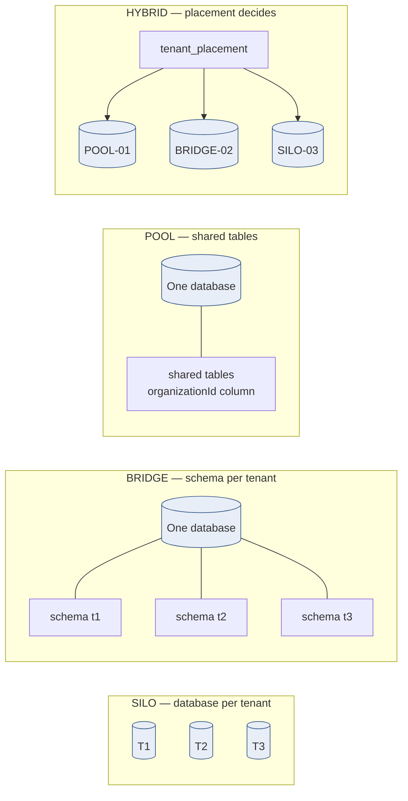
```mermaid
graph LR
    subgraph SILO["SILO — database per tenant"]
        S1[(T1)]:::db
        S2[(T2)]:::db
        S3[(T3)]:::db
    end
    subgraph BRIDGE["BRIDGE — schema per tenant"]
        B[(One database)]:::db
        B --- BS1["schema t1"]
        B --- BS2["schema t2"]
        B --- BS3["schema t3"]
    end
    subgraph POOL["POOL — shared tables"]
        P[(One database)]:::db
        P --- PT["shared tables<br/>organizationId column"]
    end
    subgraph HYBRID["HYBRID — placement decides"]
        H["tenant_placement"] --> HP[(POOL-01)]:::db
        H --> HB[(BRIDGE-02)]:::db
        H --> HS[(SILO-03)]:::db
    end
    classDef db fill:#e8eef7,stroke:#3b5b8c
```

| Model | Isolation | Migration cost | Cost/tenant | Restore one tenant | Ceiling |
|---|---|---|---|---|---|
| **SILO** | Perfect | O(n) — one per tenant | One instance | Trivial | Operational, at a few hundred |
| **BRIDGE** | Strong | O(n) — one per schema | Low | Easy | Postgres catalogue bloat, low thousands **[PATTERN]** |
| **POOL** | Logical only — must be enforced | **O(1)** | **Amortised** | Requires design (§33.4) | Primary write throughput, then shard |
| **HYBRID** | Per tenant, chosen | O(placements) | Mixed | Per model | None in practice |

### 3.2 The decision, and the arithmetic behind it

**Decision: POOL for every tenant in V1, with RLS as the enforcement floor, and the HYBRID indirection built from day one.**

The case against SILO is usually argued on isolation. That is the wrong axis — SILO wins on isolation. It loses on four numbers:

**Migrations.** **[VERIFIED-REPO]** Migration 18 in this repository applied in under a second. At an optimistic 2 s per tenant with 50-way parallelism, 100,000 tenants is ~67 minutes of orchestrated, resumable, partially-failing work **per release**. You would be building and operating a migration platform as a product alongside the accounting product. Pooled: one `ALTER TABLE`.

**Connections.** **[PATTERN]** Connection poolers multiplex sessions *within* a database. They do not multiplex across databases. 100,000 databases is 100,000 pools, however thin. Even at 1% concurrency this has no good answer.

**Operations.** 100,000 backup schedules, 100,000 monitoring targets, 100,000 restore runbooks. Operational cost becomes strictly linear in tenant count — precisely the property **I6** forbids.

**Cost.** **[VENDOR-CHECK]** Managed Postgres bills per instance or per branch. **[JUDGEMENT]** A per-tenant infrastructure floor above roughly ₹50/month destroys a ₹300–3,000/month business. Free-tier and ₹499 tenants cannot each carry an instance. This is the decisive argument, and it is economic rather than technical.

BRIDGE fails for a subtler reason: **[PATTERN]** PostgreSQL's system catalogue is not designed for tens of thousands of schemas each carrying ~74 tables. 100,000 × 74 is 7.4 million `pg_class` entries; `pg_dump`, autovacuum, planning time and connection startup all degrade. BRIDGE is a good model up to low thousands of tenants and a trap beyond it — and choosing it means choosing to migrate again at exactly the moment you are busiest.

**[JUDGEMENT]** Note what the decision does *not* claim. POOL is not more isolated than SILO; it is less. The claim is that POOL plus two independent enforcement layers (§13) reaches an isolation standard sufficient for financial data, at a cost structure that makes the business viable, and that the residual advantages of SILO can be bought back selectively for the tenants who pay for them.

### 3.3 Buying back what SILO gets right

HYBRID is not a hedge. It is the mechanism by which the three genuine SILO advantages are recovered on demand.

| SILO advantage | How the pooled design recovers it |
|---|---|
| Blast radius | Move a tenant to a dedicated placement (§17.4) — no code change, a scheduled migration |
| Single-tenant restore | The restore script of §33.4, made correct by composite foreign keys (§8.3) |
| Noisy-neighbour immunity | Entitlement limits, per-tenant queue caps, statement timeouts (§24.4, §18.5) — and placement as the last resort |
| "Your own database" in a sales conversation | Becomes a **priced SKU** rather than an architectural default |

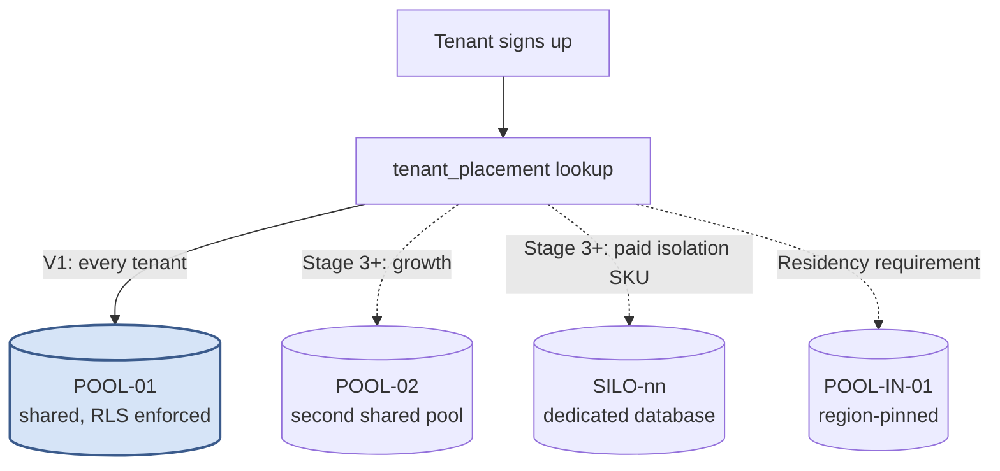
```mermaid
graph TD
    T["Tenant signs up"] --> P["tenant_placement lookup"]
    P -->|"V1: every tenant"| POOL01[("POOL-01<br/>shared, RLS enforced")]
    P -.->|"Stage 3+: growth"| POOL02[("POOL-02<br/>second shared pool")]
    P -.->|"Stage 3+: paid isolation SKU"| SILO[("SILO-nn<br/>dedicated database")]
    P -.->|"Residency requirement"| REG[("POOL-IN-01<br/>region-pinned")]
    style POOL01 fill:#d6e4f7,stroke:#3b5b8c,stroke-width:2px
```

**[JUDGEMENT]** In V1 this lookup returns `POOL-01` for every tenant, unconditionally. It costs roughly two engineer-days to build and it is the difference between "we can move that customer next Tuesday" and "that would be a six-month project". Build it while it is trivial.

***
***

# Part II — The architecture

***

## 4. System context

The outermost view: who uses AccuBook, and what it depends on.

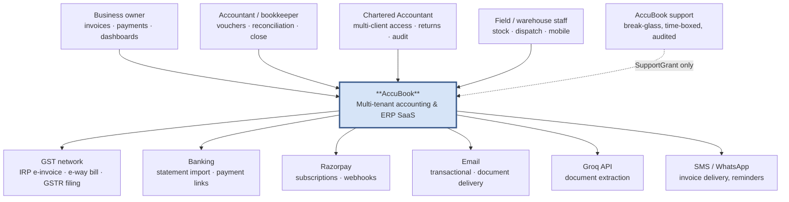
```mermaid
graph TB
    OWNER["Business owner<br/>invoices · payments · dashboards"]
    ACCT["Accountant / bookkeeper<br/>vouchers · reconciliation · close"]
    CA["Chartered Accountant<br/>multi-client access · returns · audit"]
    STAFF["Field / warehouse staff<br/>stock · dispatch · mobile"]
    SUPPORT["AccuBook support<br/>break-glass, time-boxed, audited"]

    AB["**AccuBook**<br/>Multi-tenant accounting & ERP SaaS"]

    OWNER --> AB
    ACCT --> AB
    CA --> AB
    STAFF --> AB
    SUPPORT -.->|"SupportGrant only"| AB

    AB --> GST["GST network<br/>IRP e-invoice · e-way bill · GSTR filing"]
    AB --> BANK["Banking<br/>statement import · payment links"]
    AB --> PAY["Razorpay<br/>subscriptions · webhooks"]
    AB --> MAIL["Email<br/>transactional · document delivery"]
    AB --> AI["Groq API<br/>document extraction"]
    AB --> SMS["SMS / WhatsApp<br/>invoice delivery, reminders"]

    style AB fill:#d6e4f7,stroke:#3b5b8c,stroke-width:3px
```

**[JUDGEMENT]** Two things in this diagram drive architecture that a simpler context view would hide:

1. **The Chartered Accountant is a first-class actor with many tenants.** A CA firm may hold memberships in dozens or hundreds of client organisations and switch between them constantly. This is why identity is global and tenant context is per-*request* (§12), not per-session — the Zoho lesson from §2.2. It is also why the tenant switcher must be cheap: it is on the hot path for the highest-value user segment.
2. **Support access is an architected path, not a database credential.** `SupportGrant` (§7.2) makes support access tenant-scoped, time-boxed, consented and audited. The alternative — an engineer with production database access and good intentions — is the single most common cause of accidental cross-tenant exposure. **[PATTERN]**

## 5. Container view

The deployment units and datastores. This is the whole system at Stage 1–2; §29 shows how it changes at each later stage.

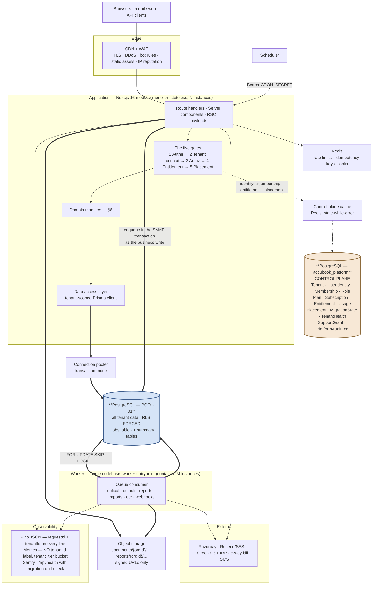
```mermaid
graph TB
    U["Browsers · mobile web · API clients"] --> EDGE

    subgraph EDGE_T["Edge"]
        EDGE["CDN + WAF<br/>TLS · DDoS · bot rules · static assets · IP reputation"]
    end

    EDGE --> APP

    subgraph APP_T["Application — Next.js 16 modular monolith (stateless, N instances)"]
        APP["Route handlers · Server components · RSC payloads"]
        GATE["The five gates<br/>1 Authn → 2 Tenant context → 3 Authz → 4 Entitlement → 5 Placement"]
        MOD["Domain modules — §6"]
        DAL["Data access layer<br/>tenant-scoped Prisma client"]
        APP --> GATE --> MOD --> DAL
    end

    DAL ==> POOLER["Connection pooler<br/>transaction mode"]
    POOLER ==> TDB[("**PostgreSQL — POOL-01**<br/>all tenant data · RLS FORCED<br/>+ jobs table · + summary tables")]

    GATE -.->|"identity · membership · entitlement · placement"| CPCACHE
    CPCACHE["Control-plane cache<br/>Redis, stale-while-error"] -.-> PDB
    PDB[("**PostgreSQL — accubook_platform**<br/>CONTROL PLANE<br/>Tenant · UserIdentity · Membership · Role<br/>Plan · Subscription · Entitlement · Usage<br/>Placement · MigrationState · TenantHealth<br/>SupportGrant · PlatformAuditLog")]

    APP --> RL["Redis<br/>rate limits · idempotency keys · locks"]
    APP ==> OBJ["Object storage<br/>documents/{orgId}/… reports/{orgId}/…<br/>signed URLs only"]

    APP ==>|"enqueue in the SAME transaction<br/>as the business write"| TDB
    TDB ==>|"FOR UPDATE SKIP LOCKED"| WRK

    subgraph WRK_T["Worker — same codebase, worker entrypoint (container, M instances)"]
        WRK["Queue consumer<br/>critical · default · reports · imports · ocr · webhooks"]
    end

    WRK ==> TDB
    WRK ==> OBJ
    WRK --> EXT
    APP --> EXT

    subgraph EXT_T["External"]
        EXT["Razorpay · Resend/SES · Groq · GST IRP · e-way bill · SMS"]
    end

    SCHED["Scheduler"] -->|"Bearer CRON_SECRET"| APP
    APP --> OBS
    WRK --> OBS
    subgraph OBS_T["Observability"]
        OBS["Pino JSON — requestId + tenantId on every line<br/>Metrics — NO tenantId label, tenant_tier bucket<br/>Sentry · /api/health with migration-drift check"]
    end

    style TDB fill:#d6e4f7,stroke:#3b5b8c,stroke-width:2px
    style PDB fill:#f7e8d6,stroke:#8c6a3b,stroke-width:2px
```

### 5.1 Why exactly two deployables

**[JUDGEMENT]** The app and the worker are separated because they have genuinely different runtime shapes, and for no other reason:

| | Application | Worker |
|---|---|---|
| Lifetime | Milliseconds to seconds, bounded by a platform limit | Minutes; a GSTR-1 build or a 50,000-row import legitimately runs long |
| Concurrency | Spiky, autoscaled, unbounded above | Controlled, a known number of consumers |
| Connections | Must hold very few — concurrency × pool is unbounded | Can hold a stable, larger pool |
| Failure | Return 5xx to a waiting human | Retry with backoff, then dead-letter |
| Memory | Small | Large — a report or an import materialises data |

Splitting further — a service per module — is rejected in §6.3.

### 5.2 What is deliberately absent

| Absent | Why | When to reconsider |
|---|---|---|
| Service mesh, Kubernetes | Two deployables. Managed containers cover this entirely | >10 distinct services **and** a platform engineer |
| Kafka / event bus | Postgres `SKIP LOCKED` handles 1000× current volume; transactional enqueue removes the need for an outbox | >100k events/s, or independent consumers needing replay |
| Elasticsearch | Postgres full-text and trigram indexes cover invoice/party/item search to Stage 3 | Search latency exceeds budget on a tuned index |
| Separate reporting service | Reports are a *queue*, not a service (§19) | Never, at this scale |
| GraphQL | REST + typed server actions cover both the UI and the public API | A partner ecosystem demands it |
| Multi-region active-active | Two-phase writes on financial data; enormous complexity | Never for writes. Regional *pods* (§29 Stage 4) instead |

## 6. Module architecture — the modular monolith

### 6.1 The module map

**[VERIFIED-REPO]** The application currently exposes 48 org-scoped route groups. Grouped by transactional cohesion rather than by URL, they form twelve modules:

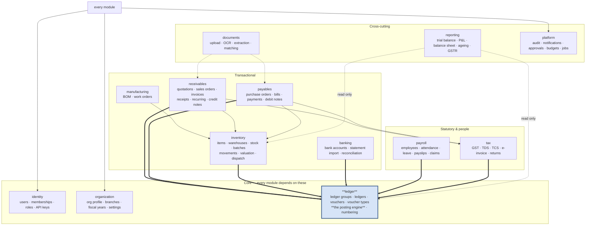
```mermaid
graph TB
    subgraph CORE["Core — every module depends on these"]
        IDN["identity<br/>users · memberships · roles · API keys"]
        ORG["organization<br/>org profile · branches · fiscal years · settings"]
        GL["**ledger**<br/>ledger groups · ledgers · vouchers · voucher types<br/>**the posting engine** · numbering"]
    end

    subgraph TXN["Transactional"]
        AR["receivables<br/>quotations · sales orders · invoices<br/>receipts · recurring · credit notes"]
        AP["payables<br/>purchase orders · bills · payments · debit notes"]
        INV["inventory<br/>items · warehouses · stock · batches<br/>movements · valuation · dispatch"]
        MFG["manufacturing<br/>BOM · work orders"]
        BNK["banking<br/>bank accounts · statement import · reconciliation"]
    end

    subgraph STAT["Statutory & people"]
        TAX["tax<br/>GST · TDS · TCS · e-invoice · returns"]
        HR["payroll<br/>employees · attendance · leave · payslips · claims"]
    end

    subgraph SUPPORT["Cross-cutting"]
        RPT["reporting<br/>trial balance · P&L · balance sheet · ageing · GSTR"]
        DOC["documents<br/>upload · OCR · extraction · matching"]
        PLAT["platform<br/>audit · notifications · approvals · budgets · jobs"]
    end

    AR ==> GL
    AP ==> GL
    INV ==> GL
    MFG --> INV
    BNK ==> GL
    HR ==> GL
    TAX ==> GL
    AR --> INV
    AP --> INV
    AR --> TAX
    AP --> TAX
    DOC -.-> AP
    DOC -.-> AR
    RPT -.->|"read only"| GL
    RPT -.->|"read only"| INV
    ALL["every module"] --> IDN
    ALL --> ORG
    ALL --> PLAT

    style GL fill:#d6e4f7,stroke:#3b5b8c,stroke-width:3px
```

**[JUDGEMENT]** Read the thick arrows. Every transactional module posts to the ledger **inside the same database transaction as its own write**. That single fact is the argument of §6.3.

### 6.2 Module rules

Enforced by lint rule and a CI dependency test, not by convention:

| # | Rule | Rationale |
|---|---|---|
| M1 | A module may import another module's **public interface** only — `src/backend/services/<module>/index.ts` | Prevents the slow decay into a ball of mud |
| M2 | A module may not import another module's internal files or Prisma queries | Data ownership is what makes later extraction possible |
| M3 | The dependency graph must stay acyclic, `ledger` at the root | A cycle means the boundary is wrong |
| M4 | Cross-module writes happen through the owning module's service function, inside the caller's transaction (`tx` is passed in) | Preserves atomicity while preserving ownership. This is already the shape of `posting.ts` **[VERIFIED-REPO]** |
| M5 | No module reads the raw Prisma client; only the tenant-scoped client from the DAL | §13.4 — the isolation guarantee depends on it |
| M6 | A module publishes domain events for *asynchronous* consumers; events never replace a transactional write | Financial writes are not eventually consistent |

**[JUDGEMENT]** M4 is the one that matters most and the one most often violated under deadline. `posting.ts` already demonstrates the correct pattern: it accepts `tx: Prisma.TransactionClient` and does its work inside the caller's transaction **[VERIFIED-REPO]**. Every cross-module write should look like that.

### 6.3 Why not microservices

Consider posting a sales invoice. In one atomic operation it must:

1. Allocate an invoice number from `NumberCounter` without gaps or duplicates
2. Write the `Invoice` and its `InvoiceItem` rows
3. Compute GST — CGST/SGST or IGST by place of supply — and write `InvoiceTax`
4. Reduce `Stock` and write `StockMovement`, honouring the valuation method
5. Create or find the party's ledger, then write a balanced `Voucher` with its `VoucherEntry` rows
6. Update ledger balances
7. Write the `AuditLog`
8. Enqueue e-invoice submission and email delivery

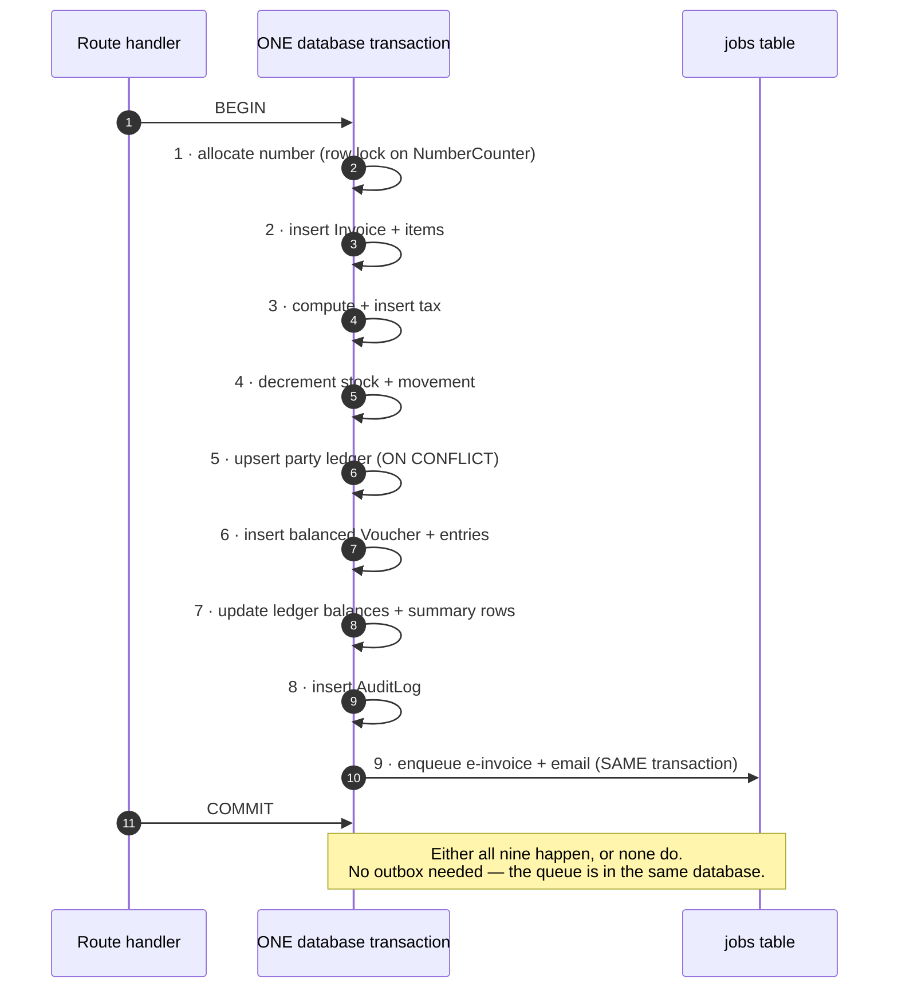
```mermaid
sequenceDiagram
    autonumber
    participant API as Route handler
    participant TX as ONE database transaction
    participant Q as jobs table
    API->>TX: BEGIN
    TX->>TX: 1 · allocate number (row lock on NumberCounter)
    TX->>TX: 2 · insert Invoice + items
    TX->>TX: 3 · compute + insert tax
    TX->>TX: 4 · decrement stock + movement
    TX->>TX: 5 · upsert party ledger (ON CONFLICT)
    TX->>TX: 6 · insert balanced Voucher + entries
    TX->>TX: 7 · update ledger balances + summary rows
    TX->>TX: 8 · insert AuditLog
    TX->>Q: 9 · enqueue e-invoice + email (SAME transaction)
    API->>TX: COMMIT
    Note over TX,Q: Either all nine happen, or none do.<br/>No outbox needed — the queue is in the same database.
```

**[JUDGEMENT]** Split steps 2–8 across services and every one of those database transactions becomes a distributed saga with compensating transactions. For financial data that means a window in which the invoice exists and the ledger entry does not — **an unbalanced trial balance, visible to the customer, in a product whose entire value is that the numbers are right.** A team of 2–5 cannot operate a distributed system and ship an ERP. The monolith is not a compromise here; it is the correct architecture for a densely-coupled transactional domain.

**Reconsider when** one module has a genuinely different scaling profile — OCR/document extraction is the only realistic candidate, because it is CPU-heavy, long-running and *not* transactional with the ledger. It is already isolated behind the `documents` module and its own queue, which is precisely what makes it extractable later without touching anything else.

## 7. The control plane

### 7.1 Why it is a separate database

**[PATTERN]** The control plane governs tenants. It cannot live inside the data it governs.

| Property | Control plane | Data plane |
|---|---|---|
| Security boundary | Platform staff, billing systems | Tenant users only |
| Availability class | Every request depends on it → highest | Degrades per placement |
| Lifecycle | Survives a placement being rebuilt | Can be restored from backup |
| Mobility | Never moves | Moves between placements |
| Blast radius of loss | Total — you cannot route any request | One placement's tenants |
| Size | Small — thousands of rows per table at 100k tenants | Large — hundreds of millions of rows |

**[JUDGEMENT]** In V1 the two databases may live on the same cluster to save cost, provided they are separate *databases* with separate credentials and separate connection pools. What must be true from day one is that **no query joins across them.** That constraint is what allows them to be separated later without a rewrite. It should be enforced by the fact that they are different Prisma clients with different schemas — the type system then makes the join impossible to write.

### 7.2 Control-plane schema

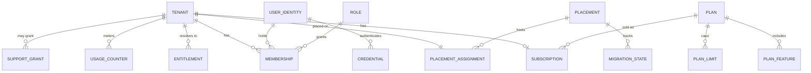
```mermaid
erDiagram
    TENANT ||--o{ MEMBERSHIP : has
    TENANT ||--|| PLACEMENT_ASSIGNMENT : "placed on"
    TENANT ||--o| SUBSCRIPTION : has
    TENANT ||--o{ ENTITLEMENT : "resolves to"
    TENANT ||--o{ USAGE_COUNTER : meters
    TENANT ||--o{ SUPPORT_GRANT : "may grant"
    USER_IDENTITY ||--o{ MEMBERSHIP : holds
    USER_IDENTITY ||--o{ CREDENTIAL : authenticates
    PLAN ||--o{ SUBSCRIPTION : "sold as"
    PLAN ||--o{ PLAN_FEATURE : includes
    PLAN ||--o{ PLAN_LIMIT : caps
    PLACEMENT ||--o{ PLACEMENT_ASSIGNMENT : hosts
    PLACEMENT ||--o{ MIGRATION_STATE : tracks
    ROLE ||--o{ MEMBERSHIP : grants
```

| Table | Holds | Notes |
|---|---|---|
| `tenant` | id, slug, legal name, **status**, region, tier, created/suspended/deleted timestamps | Status is an **enum**: `TRIAL · ACTIVE · PAST_DUE · SUSPENDED · CLOSING · CLOSED`. This replaces today's `isActive` boolean **[VERIFIED-REPO]**, which cannot express "past due but readable" |
| `user_identity` | id, email (citext, unique), name, MFA state, last login | Global. One human, one row, regardless of how many tenants they serve |
| `credential` | identity_id, provider, hashed secret, rotation state | Separated so that adding SSO/OIDC later touches one table |
| `membership` | tenant_id, identity_id, role_id, branch scope, status | **The only source of tenant authority.** `@@unique(tenant_id, identity_id)` |
| `role` | tenant_id **(nullable = system role)**, name, permissions JSON, is_system | Nullable tenant_id is the system-vs-tenant split that fixes the live defect in **[A §2.6]** |
| `plan`, `plan_feature`, `plan_limit` | Catalogue: what is sold, which features, which caps | Data, never code |
| `subscription` | tenant, plan, status, period, trial end, external ref | Razorpay subscription id lives here |
| `entitlement` | tenant, key, value, source (`PLAN` / `OVERRIDE` / `TRIAL` / `PROMO`), expiry | **Materialised.** Answers "why does this tenant have this?" — the audit question §24.2 |
| `usage_counter` | tenant, metric, period, value | Incremented transactionally with the business write |
| `placement` | id (`POOL-01`), kind (`POOL`/`BRIDGE`/`SILO`), region, connection secret ref, status, capacity | The registry §17 reads |
| `placement_assignment` | tenant → placement, since, migration state | The indirection of **I8** |
| `migration_state` | placement, applied migration, checksum, applied_at | Drift detection across placements §17.6 |
| `tenant_health` | tenant, computed score, error rate, p95, storage, job backlog, updated_at | Rows, not metric labels — §27.3 |
| `support_grant` | tenant, identity, scope, reason, granted_by, expires_at, consent ref | Break-glass, time-boxed, audited |
| `platform_audit_log` | actor, action, target tenant, before/after, at | Append-only. Records what *staff* did, separate from tenant audit |

**[JUDGEMENT]** Three notes on this schema.

**Status must be an enum, everywhere.** **[VERIFIED-REPO]** the current schema has **zero** Prisma enums and every status is free text — `Voucher.status`, `Organization.isActive`, and so on. Free-text status is how `"CANCELLED"` and `"CANCELED"` end up in the same column and a filter silently misses rows. In an accounting system that is a wrong report, not a cosmetic bug. Enum or `CHECK` constraint, on every status column, in both planes.

**`role.tenant_id` nullable is doing real work.** `NULL` means a system role shipped by AccuBook; non-null means a tenant's own. Today `Role` is entirely global **[VERIFIED-REPO]**, which means a custom role created by one tenant is assignable by every other tenant and editing it silently changes their permissions. Migration `17_hr_masters_per_tenant` already applied this exact pattern to `Department` and `Designation` — the same fix, applied to `Role`, `VoucherType` and `UnitOfMeasure`.

**Entitlements are materialised rather than computed.** The alternative — resolving plan → features on every request — makes overrides, trials and promotional grants impossible to express and impossible to audit. §24 develops this.

### 7.3 Placement resolution and control-plane availability

Every request reads the control plane. That makes it the highest-availability component in the system and, untreated, a total single point of failure.

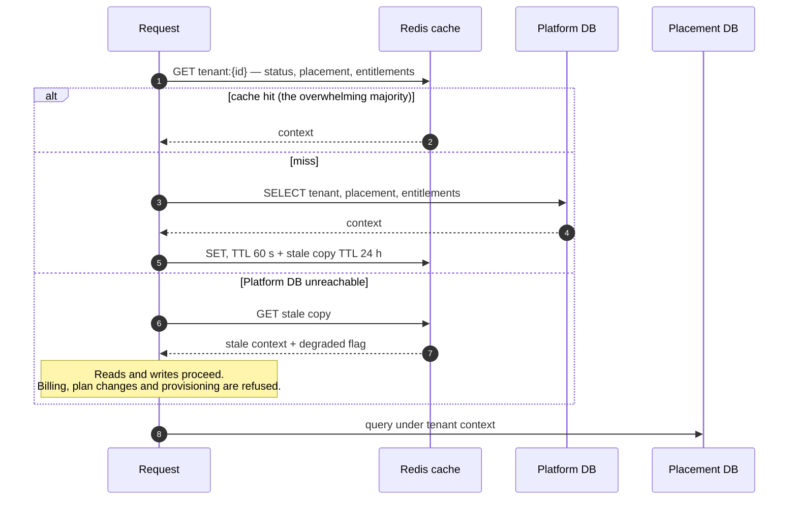
```mermaid
sequenceDiagram
    autonumber
    participant R as Request
    participant C as Redis cache
    participant P as Platform DB
    participant D as Placement DB
    R->>C: GET tenant:{id} — status, placement, entitlements
    alt cache hit (the overwhelming majority)
        C-->>R: context
    else miss
        R->>P: SELECT tenant, placement, entitlements
        P-->>R: context
        R->>C: SET, TTL 60 s + stale copy TTL 24 h
    else Platform DB unreachable
        R->>C: GET stale copy
        C-->>R: stale context + degraded flag
        Note over R: Reads and writes proceed.<br/>Billing, plan changes and provisioning are refused.
    end
    R->>D: query under tenant context
```

**[JUDGEMENT]** **Stale-while-error is the design decision that stops the control plane being a total outage.** Tenant status, placement and entitlements change rarely — a tenant's plan does not change between two requests. Serving a 24-hour-stale copy when the Platform DB is unreachable converts "AccuBook is down" into "AccuBook cannot change plans right now". The cost is bounded and explicit: a suspended tenant may retain access for up to the stale TTL. **[JUDGEMENT]** For a suspension driven by non-payment that is an acceptable trade; for a suspension driven by abuse it is not — so abuse suspensions must also write a deny-list entry that is checked separately and fails closed.

## 8. The data plane

### 8.1 Layout

One PostgreSQL database per placement, holding every tenant's data in shared tables.

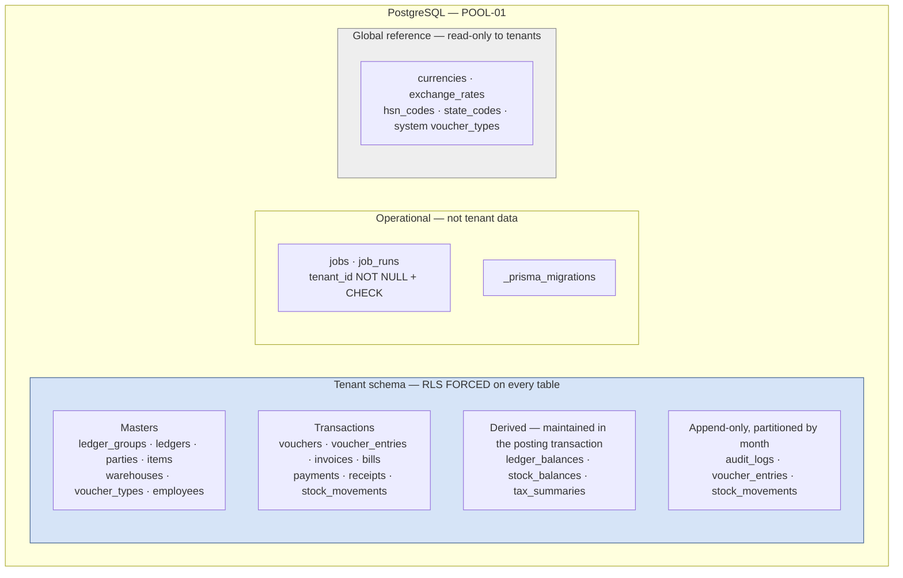
```mermaid
graph TB
    subgraph POOL01["PostgreSQL — POOL-01"]
        subgraph TEN["Tenant schema — RLS FORCED on every table"]
            T1["Masters<br/>ledger_groups · ledgers · parties · items<br/>warehouses · voucher_types · employees"]
            T2["Transactions<br/>vouchers · voucher_entries · invoices · bills<br/>payments · receipts · stock_movements"]
            T3["Derived — maintained in the posting transaction<br/>ledger_balances · stock_balances · tax_summaries"]
            T4["Append-only, partitioned by month<br/>audit_logs · voucher_entries · stock_movements"]
        end
        subgraph OPS["Operational — not tenant data"]
            J["jobs · job_runs<br/>tenant_id NOT NULL + CHECK"]
            M["_prisma_migrations"]
        end
        subgraph REF["Global reference — read-only to tenants"]
            G["currencies · exchange_rates<br/>hsn_codes · state_codes · system voucher_types"]
        end
    end
    style TEN fill:#d6e4f7,stroke:#3b5b8c
    style REF fill:#eeeeee,stroke:#888888
```

### 8.2 The tenant key — invariant I1

**Every tenant-owned table carries `organizationId` directly.** Not through a parent, not through a join — in its own row.

**[VERIFIED-REPO]** Today 41 of 74 models carry it and 33 do not. Those 33 divide three ways, and conflating them is the most common mistake in this kind of migration:

| Category | Models | Treatment |
|---|---|---|
| **Platform / identity** | `User`, `Account`, `Session`, `VerificationToken`, `Organization` | Move to the control plane (§7.2) |
| **Genuinely global reference** | `Currency`, `ExchangeRate` | Stay global. Read-only to tenants, no RLS policy needed, only a grant |
| **Tenant-owned, scoped only via a parent** | `VoucherEntry`, `InvoiceItem`, `InvoiceTax`, `BillItem`, `BillTax`, `InvoicePayment`, `Stock`, `Batch`, `StockMovement`, `SalesOrderItem`, `QuotationItem`, `PurchaseOrderItem`, `BomItem`, `ItemUnit`, `BankTransaction`, `BankReconciliation`, `Attendance`, `Leave`, `Payslip`, `ExpenseClaim`, `BudgetLine`, `ApprovalWorkflowStep`, `FiscalPeriod` | **Backfill `organizationId`** |
| **Global but tenant-shaped — a live defect** | `Role`, `VoucherType`, `UnitOfMeasure` | Split system vs tenant-owned (§7.2) |

**[JUDGEMENT]** `VoucherEntry` is the general-ledger detail table — the single most sensitive table in an accounting system — and it currently has no tenant column at all. Its tenancy is inferred by joining to `vouchers`. An RLS policy *can* be written as a subquery join, but it is evaluated per row, it defeats index-only scans, and it makes the most-queried table in the system the slowest. Denormalising `organizationId` onto it is not a compromise; it is the correct design.

The objection to denormalisation is that it can drift — a child could carry a different `organizationId` from its parent. §8.3 makes that structurally impossible.

### 8.3 Composite foreign keys make drift impossible

```sql
-- The parent's tenant key is part of a unique key it can be referenced by
ALTER TABLE vouchers ADD CONSTRAINT vouchers_org_id_uk
  UNIQUE ("organizationId", id);

-- The child references BOTH columns together
ALTER TABLE voucher_entries
  ADD COLUMN "organizationId" TEXT,      -- expand: nullable
  ADD CONSTRAINT voucher_entries_parent_fk
    FOREIGN KEY ("organizationId", "voucherId")
    REFERENCES vouchers ("organizationId", id) ON DELETE CASCADE;

-- After backfill: contract
ALTER TABLE voucher_entries ALTER COLUMN "organizationId" SET NOT NULL;
```

**[PATTERN]** With this constraint in place, a `voucher_entry` whose `organizationId` differs from its voucher's **cannot be inserted** — the database rejects it. The denormalised column is not a copy that might drift; it is a column the database keeps consistent. Apply the same pattern to all 22 tables.

**[JUDGEMENT]** This constraint also does something subtler and more valuable: it makes the **single-tenant export of §33.4 provably complete.** Every tenant-owned row is reachable by `WHERE "organizationId" = $1` on its own table, with no traversal. That is what makes "restore one tenant" and "erase one tenant under DPDP" tractable in a pooled database — the property that SILO is usually credited with and that most pooled designs genuinely lack.

### 8.4 Indexing — the Salesforce lesson, applied

**[PATTERN]** In a pooled database, **`organizationId` leads every index on a tenant table.** Not "there is an index on organizationId" — it is the *first column* of the composite index that serves each access pattern.

```sql
-- Wrong: an index on date alone scans across all tenants, then filters
CREATE INDEX ON vouchers (date);

-- Right: the tenant is the first partition of the B-tree
CREATE INDEX ON vouchers ("organizationId", date DESC);
CREATE INDEX ON vouchers ("organizationId", status) WHERE "isPosted" = false;
CREATE INDEX ON voucher_entries ("organizationId", "ledgerId", "voucherId");
CREATE INDEX ON invoices ("organizationId", "partyId", "dueDate")
  WHERE status <> 'PAID';   -- partial: ageing reports never see paid rows
```

**[VERIFIED-REPO]** The existing schema already does this correctly in several places — `@@index([organizationId, date])`, `@@index([organizationId, status])` on `Voucher`, `@@index([organizationId, groupId])` on `Ledger`. The rule needs to become universal and CI-enforced (§26.6), including on the 22 newly-backfilled tables.

**Why this matters more under RLS:** the RLS policy adds `organizationId = current_setting('app.current_org')` to every query. If that column leads the index, the policy is *free* — it selects the B-tree subtree the query needed anyway. If it does not, the policy becomes a filter applied after a wider scan. **[JUDGEMENT]** Correct indexing is what makes the RLS overhead budget of ≤5 ms p95 (§13.6) achievable; without it, RLS will be measured as slow and blamed for a problem it did not cause.

## 9. The request lifecycle

Every authenticated request passes five gates, in this fixed order. Each one fails closed.

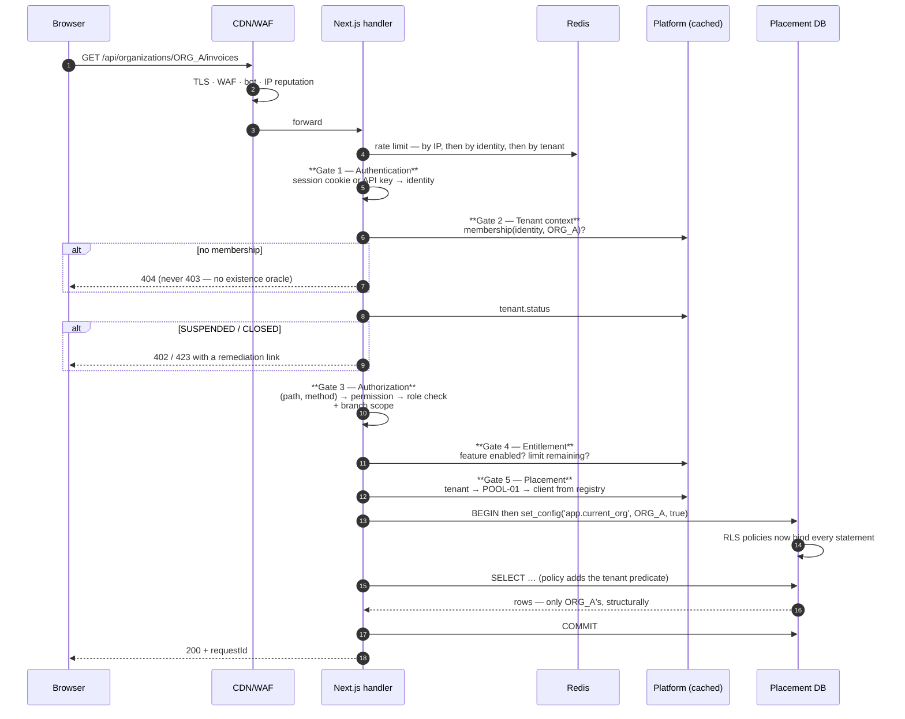
```mermaid
sequenceDiagram
    autonumber
    participant B as Browser
    participant E as CDN/WAF
    participant A as Next.js handler
    participant RL as Redis
    participant P as Platform (cached)
    participant D as Placement DB
    B->>E: GET /api/organizations/ORG_A/invoices
    E->>E: TLS · WAF · bot · IP reputation
    E->>A: forward
    A->>RL: rate limit — by IP, then by identity, then by tenant
    A->>A: **Gate 1 — Authentication**<br/>session cookie or API key → identity
    A->>P: **Gate 2 — Tenant context**<br/>membership(identity, ORG_A)?
    alt no membership
        A-->>B: 404 (never 403 — no existence oracle)
    end
    A->>P: tenant.status
    alt SUSPENDED / CLOSED
        A-->>B: 402 / 423 with a remediation link
    end
    A->>A: **Gate 3 — Authorization**<br/>(path, method) → permission → role check<br/>+ branch scope
    A->>P: **Gate 4 — Entitlement**<br/>feature enabled? limit remaining?
    A->>P: **Gate 5 — Placement**<br/>tenant → POOL-01 → client from registry
    A->>D: BEGIN then set_config('app.current_org', ORG_A, true)
    D->>D: RLS policies now bind every statement
    A->>D: SELECT … (policy adds the tenant predicate)
    D-->>A: rows — only ORG_A's, structurally
    A->>D: COMMIT
    A-->>B: 200 + requestId
```

### 9.1 Gate properties

| Gate | Fails closed by | Cost | Cached |
|---|---|---|---|
| 1 Authentication | No session and no valid key → 401 | ~0 (JWT verify) or one lookup (API key) | Key hash → identity, 60 s |
| 2 Tenant context | No membership → **404** | One cached read | Yes, 60 s + 24 h stale |
| 3 Authorization | Unregistered `(path, method)` → **403, not 200** | In-memory map | Permissions on the membership |
| 4 Entitlement | Feature absent or limit exhausted → 402/429 | One cached read | Yes, 60 s + 24 h stale |
| 5 Placement | No assignment → 503 | One cached read | Yes, 5 min |

**[VERIFIED-REPO]** Gates 1 and 3 already exist and are well built. `withOrgAuth` performs session-or-API-key authentication, membership lookup, `isActive`, same-origin CSRF on mutating session requests, and a role-permission check derived from `(pathname, method)` via `resolveScopeTarget` — in one place, for all 110 org-scoped routes, with **zero** `skipRoleCheck` opt-outs. Critically, **a path not registered in `API_RESOURCE_MAP` returns 403, not 200.** Fail-closed by construction is rare and must be preserved through every change in this document.

**[JUDGEMENT]** **404-not-403 is a deliberate design choice, not an oversight.** Returning 403 for "this tenant exists but you may not see it" is an existence oracle: an attacker enumerates organisation IDs and learns which are real. The codebase already applies this reasoning in `findForeignReferences`, which returns the same answer for "belongs to another tenant" and "does not exist" **[VERIFIED-REPO]**. Make it uniform across all five gates.

## 10. Identity and authentication

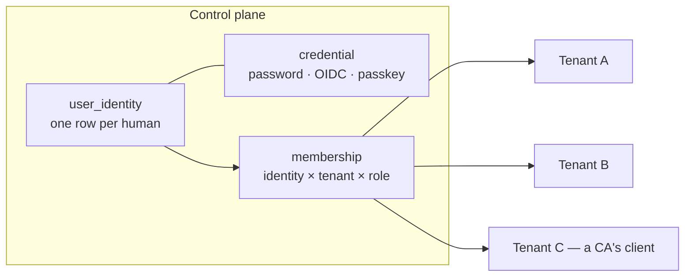
```mermaid
graph LR
    subgraph "Control plane"
        UI["user_identity<br/>one row per human"]
        CR["credential<br/>password · OIDC · passkey"]
        MB["membership<br/>identity × tenant × role"]
    end
    UI --- CR
    UI --> MB
    MB --> T1["Tenant A"]
    MB --> T2["Tenant B"]
    MB --> T3["Tenant C — a CA's client"]
```

| Decision | Choice | Reason |
|---|---|---|
| Identity scope | **Global** — one human, one identity, many memberships | The CA use case of §4. Also how Zoho works |
| Session token | Short-lived JWT holding **identity only** — never tenant, never role, never permissions | **I2.** A tenant claim in a token is a claim you cannot revoke. Membership is read per request, from cache |
| Tenant switching | A request-scoped change; no re-login | The tenant is in the URL path; the membership check is per request anyway |
| MFA | TOTP at Stage 1; enforced by tenant policy at Stage 2 | Accounting data; table stakes for any business customer |
| Rate limiting | Sign-in, password reset, API-key auth, registration | **[VERIFIED-REPO]** only registration is limited today. Sign-in is the credential-stuffing target |
| API keys | Hashed at rest; scopes **intersected with the creating user's role**; per-key rate limit; rotation and revocation | **[VERIFIED-REPO]** the intersection is already implemented — it closes the standard privilege-escalation-by-key-minting hole |
| SSO/OIDC | Deferred; the `credential` split makes it additive | No SMB demand yet; larger tenants will ask at Stage 3 |

**[JUDGEMENT]** The "never put tenant in the token" rule is worth stating as strongly as possible. A JWT with `orgId` inside it is a bearer credential for a tenant that remains valid after the membership is revoked, until it expires. Reading membership per request costs one cached lookup and makes revocation immediate.

## 11. Authorization

Four independent dimensions, all data-driven, evaluated at Gate 3.

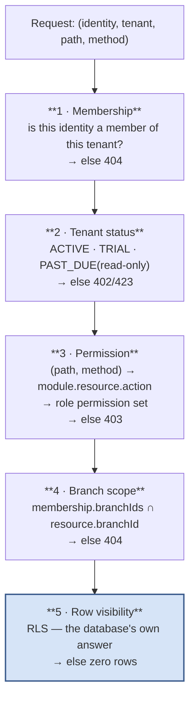
```mermaid
graph TB
    REQ["Request: (identity, tenant, path, method)"]
    REQ --> D1["**1 · Membership**<br/>is this identity a member of this tenant?<br/>→ else 404"]
    D1 --> D2["**2 · Tenant status**<br/>ACTIVE · TRIAL · PAST_DUE(read-only)<br/>→ else 402/423"]
    D2 --> D3["**3 · Permission**<br/>(path, method) → module.resource.action<br/>→ role permission set<br/>→ else 403"]
    D3 --> D4["**4 · Branch scope**<br/>membership.branchIds ∩ resource.branchId<br/>→ else 404"]
    D4 --> D5["**5 · Row visibility**<br/>RLS — the database's own answer<br/>→ else zero rows"]
    style D5 fill:#d6e4f7,stroke:#3b5b8c,stroke-width:2px
```

| Dimension | Where it lives | Notes |
|---|---|---|
| Membership | Control plane | The only source of tenant authority |
| Tenant status | Control plane | `PAST_DUE` must mean **read-only**, not locked out — a customer who cannot see their own books will not pay you to unlock them **[JUDGEMENT]** |
| Permission | `role.permissions` JSON, resolved from a `(path, method)` map | **[VERIFIED-REPO]** already implemented via `API_RESOURCE_MAP` + `resolveScopeTarget` |
| Branch scope | `membership.branchIds` **[VERIFIED-REPO]** | Multi-branch tenants need this; it is currently checked inconsistently across modules |
| Row visibility | The database (§13) | The floor beneath all four |

**Permission naming:** `module.resource.action` — `ledger.voucher.post`, `receivables.invoice.approve`, `payroll.payslip.read`. A CI test asserts that **every** `(path, method)` in the router resolves to a permission in the map; an unmapped route fails the build rather than silently returning 403 in production.

**[JUDGEMENT]** Never `if (role === 'ADMIN')` and never `if (plan === 'PRO')`. Both are the same mistake — a business rule compiled into a deployment. Roles are rows; entitlements are rows. This is the Salesforce lesson from §2.1 and it is the difference between a plan change being a `UPDATE` and being a release.

## 12. Tenant context propagation

The problem: between the membership check and the SQL statement there are dozens of function calls. The tenant must reach the database without being threaded through every signature — because a parameter that must be passed everywhere will eventually not be passed somewhere.

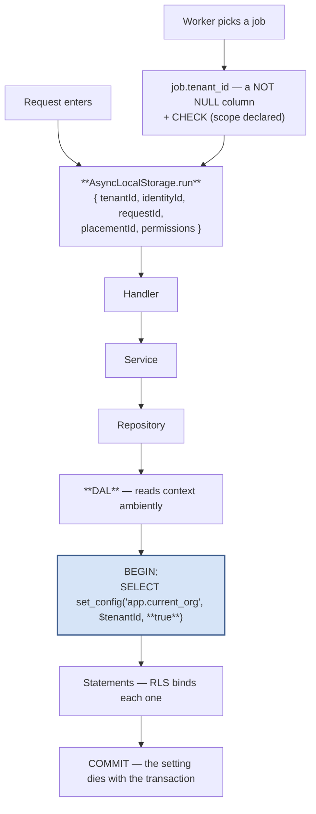
```mermaid
graph TB
    REQ["Request enters"] --> ALS["**AsyncLocalStorage.run**<br/>{ tenantId, identityId, requestId,<br/>placementId, permissions }"]
    ALS --> H["Handler"]
    H --> S["Service"]
    S --> R["Repository"]
    R --> DAL["**DAL** — reads context ambiently"]
    DAL --> TX["BEGIN;<br/>SELECT set_config('app.current_org', $tenantId, **true**)"]
    TX --> Q["Statements — RLS binds each one"]
    Q --> C["COMMIT — the setting dies with the transaction"]

    JOB["Worker picks a job"] --> JC["job.tenant_id — a NOT NULL column<br/>+ CHECK (scope declared)"]
    JC --> ALS

    style TX fill:#d6e4f7,stroke:#3b5b8c,stroke-width:2px
```

| Decision | Choice | Reason |
|---|---|---|
| Mechanism | `AsyncLocalStorage` | **[JUDGEMENT]** Forgetting to thread a parameter yields *no* tenant, which throws — rather than the *previous* tenant, which leaks. Fail-loud beats fail-silent |
| Propagation to SQL | `set_config('app.current_org', …, **true**)` — the third argument is `is_local` | **Transaction-local.** This is what makes it safe behind a transaction-mode pooler, where connections are shared between tenants between transactions |
| Every query in a transaction | Yes, including single reads | Without a transaction there is no scope for the setting to live in |
| Jobs | `tenant_id` is a NOT NULL column on `jobs`, plus a `CHECK` that scope is declared | **[PATTERN]** A background job running in the wrong tenant is the least-tested breach path in most SaaS |
| Platform-scoped jobs | Must declare `tenant_scope = 'PLATFORM'` explicitly | **[VERIFIED-REPO]** the two current crons (`check-overdue`, `run-recurring`) iterate all tenants — legitimate, but it must be a declared intent rather than an omission |

**The failure mode this design chooses:** if context is lost, `current_setting('app.current_org', true)` returns NULL, the RLS policy matches nothing, and the query returns **zero rows**. A visibly broken feature in the developer's own tenant, not an invisible breach in someone else's. **[JUDGEMENT]** Choosing *which way* a system fails is the most consequential decision in isolation design.

## 13. Data isolation — the RLS design

### 13.1 Why the application guard is not enough

The existing guard is good — §9.1. It is still not sufficient, for exactly one reason: **`withOrgAuth` proves who the caller is and which tenant they may act in. It cannot prove that the query the handler then writes stays inside that tenant.**

```ts
// Compiles. Passes withOrgAuth. Passes code review at 3 a.m.
// Returns every tenant's overdue invoices.
const invoices = await prisma.invoice.findMany({ where: { status: "OVERDUE" } });
```

Nothing in the type system prevents this. Nothing in the linter prevents it. The repository already contains `findForeignReferences` **[VERIFIED-REPO]**, written precisely because someone recognised this bug class for client-supplied foreign keys — the right instinct, applied at one layer. RLS applies it at every layer: raw SQL, reports, background jobs, exports, and the code not yet written.

**With RLS, that query returns zero rows.**

### 13.2 Role model

Four database roles, each with the minimum it needs. **[PATTERN]**

```sql
-- Owns the schema. Used ONLY by migrations. Never in the application env.
CREATE ROLE accubook_owner LOGIN PASSWORD :'owner_pw';

-- The application. Cannot bypass RLS. This is the important one.
CREATE ROLE app_tenant LOGIN PASSWORD :'app_pw' NOBYPASSRLS;
GRANT SELECT, INSERT, UPDATE, DELETE ON ALL TABLES IN SCHEMA public TO app_tenant;

-- Reporting: read-only, routed to the replica, own statement_timeout.
CREATE ROLE app_report LOGIN PASSWORD :'rpt_pw' NOBYPASSRLS;
GRANT SELECT ON ALL TABLES IN SCHEMA public TO app_report;
ALTER ROLE app_report SET statement_timeout = '120s';

-- Break-glass. Credential lives in the vault, not in any deployment.
-- Every use is a SupportGrant row and a PlatformAuditLog row.
CREATE ROLE app_admin_support LOGIN PASSWORD :'brk_pw' NOBYPASSRLS;
```

**[JUDGEMENT]** Note that **none** of these roles has `BYPASSRLS`, and the application role is explicitly `NOBYPASSRLS`. The table owner implicitly bypasses RLS unless forced — which is why §13.3 uses `FORCE ROW LEVEL SECURITY`, and why the application must never connect as the owner. A single misconfigured connection string that connects as owner silently disables every policy in the system. This is worth a startup assertion: on boot, the application queries `current_user` and refuses to start if it is the owner.

### 13.3 Policies

```sql
-- Applied to every tenant-owned table.
ALTER TABLE vouchers ENABLE ROW LEVEL SECURITY;
ALTER TABLE vouchers FORCE  ROW LEVEL SECURITY;   -- applies to the owner too

CREATE POLICY tenant_isolation ON vouchers
  USING       ("organizationId" = current_setting('app.current_org', true))
  WITH CHECK  ("organizationId" = current_setting('app.current_org', true));
```

| Clause | Prevents |
|---|---|
| `USING` | **Reading** another tenant's rows |
| `WITH CHECK` | **Writing** a row belonging to another tenant — including an `UPDATE` that moves a row out of your tenant |
| `FORCE` | The table owner silently bypassing the policy |
| `current_setting(…, true)` | The missing-setting case raising an error; it returns NULL, which matches nothing → zero rows |

Global reference tables (`currencies`, `exchange_rates`, `hsn_codes`) get **no policy and no write grant** — only `GRANT SELECT`. That is simpler and stronger than a permissive policy.

### 13.4 The single choke point

**[JUDGEMENT]** RLS only holds if every query goes through a client that sets the context. That requires making the unscoped client unreachable:

```ts
// src/backend/db/index.ts — the ONLY module that constructs a client.
// The raw client is module-private and never exported.
const raw = new PrismaClient({ adapter });

export function db() {
  const ctx = tenantContext.getStore();
  if (!ctx?.tenantId) {
    throw new MissingTenantContextError();   // fail loud, not silently global
  }
  return raw.$extends(tenantScoped(ctx.tenantId));
}

// Platform queries use a different client, against a different database,
// with a different schema — so the type system forbids joining them.
export const platformDb = new PrismaClient({ datasourceUrl: PLATFORM_URL });
```

Enforced by an ESLint rule and a CI test: **no import of `PrismaClient` outside `src/backend/db/`.** Rule M5 of §6.2.

### 13.5 Transaction shape

Because context is transaction-local, every operation is a transaction. The naive implementation costs an extra round trip per query; batching removes it:

```ts
// One round trip carries the context and the statement together.
await raw.$transaction([
  raw.$executeRaw`SELECT set_config('app.current_org', ${tenantId}, true)`,
  raw.invoice.findMany({ where: { status: "OVERDUE" } }),   // policy applies
]);
```

**[VERIFIED-REPO]** The codebase already uses a 20 s transaction timeout with 10 s maxWait, with the reasoning recorded — multi-step GL posting exceeds Prisma's 5 s default against a cold pooler. That tuning stays.

### 13.6 Rollout and budget

**[JUDGEMENT]** RLS is the highest-execution-risk change in the whole programme, because a mistake returns zero rows — or, far worse, the wrong rows. It rolls out per table, behind a flag, in this order:

1. Low-traffic masters first (`voucher_types`, `warehouses`, `cost_centers`) — validate the mechanism where a mistake is cheap
2. Then transactional parents (`vouchers`, `invoices`, `bills`)
3. Then high-volume children (`voucher_entries`, `stock_movements`) — only after the isolation matrix is green
4. Append-only last (`audit_logs`)

**Overhead budget: ≤5 ms at p95** for the added predicate, measured per table before enabling the next. If a table exceeds it, the cause is almost always an index that does not lead with `organizationId` (§8.4) — fix the index rather than dropping the policy. If it genuinely cannot be met, narrow the scope table-by-table, **deliberately and in writing**, recording which tables have only application-layer protection.

### 13.7 What RLS does not solve

**[JUDGEMENT]** Stating the limits honestly, because a control believed to be total is more dangerous than one understood:

| Not solved | Mitigation |
|---|---|
| A compromised application credential with a valid tenant context | Rate limits, anomaly detection, audit; RLS narrows the blast radius to one tenant |
| A bug that sets the *wrong but valid* tenant | Gate 2 — membership is checked before context is set. This is why the order in §9 is fixed |
| Reading another tenant's data through an *aggregate* the app computes | Summary tables carry `organizationId` and are covered by policy like any other table |
| Object storage | Storage is not Postgres. §21 handles it: authorisation by row read under RLS, never by key |
| Logs, traces, error reports, backups | §27 redaction rules and §26 backup credential separation |

***
## 14. The accounting core

**[JUDGEMENT]** This section is the one that cannot be borrowed from a generic SaaS architecture. Everything above it is standard multi-tenancy; what follows is what makes AccuBook an accounting system rather than a CRUD application with money columns in it. Get §14.2 wrong and the tenancy design does not matter, because the numbers are wrong.

### 14.1 The invariants of double entry

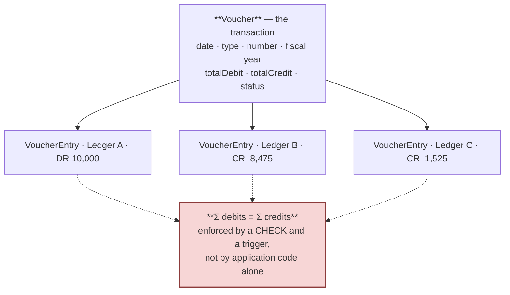
```mermaid
graph TB
    V["**Voucher** — the transaction<br/>date · type · number · fiscal year<br/>totalDebit · totalCredit · status"]
    V --> E1["VoucherEntry · Ledger A · DR 10,000"]
    V --> E2["VoucherEntry · Ledger B · CR  8,475"]
    V --> E3["VoucherEntry · Ledger C · CR  1,525"]
    E1 -.-> INV["**Σ debits = Σ credits**<br/>enforced by a CHECK and a trigger,<br/>not by application code alone"]
    E2 -.-> INV
    E3 -.-> INV
    style INV fill:#f7d6d6,stroke:#8c3b3b,stroke-width:2px
```

| # | Invariant | Enforcement |
|---|---|---|
| **A1** | Every voucher balances: Σ debit = Σ credit | `CHECK (totalDebit = totalCredit)` on `vouchers` + a deferred constraint trigger validating the sum of entries at COMMIT |
| **A2** | An entry is debit **or** credit, never both, never neither | `CHECK ((debitAmount > 0) <> (creditAmount > 0))` |
| **A3** | Money is `Decimal(18,4)`, never a float | **[VERIFIED-REPO]** 169 `Decimal` columns, **0** `Float`. Already correct — protect it with a CI schema test |
| **A4** | A posted voucher is immutable | §14.3 — a trigger, not a code path |
| **A5** | Voucher numbers are unique per tenant, type and fiscal year, with no gaps | **[VERIFIED-REPO]** `@@unique([organizationId, voucherTypeId, voucherNumber, fiscalYearId])` — already correct. §14.4 handles the allocation |
| **A6** | A voucher in a closed period cannot be created or altered | §14.5 — a trigger checking `fiscal_periods.isClosed` |
| **A7** | Every posting writes an audit row in the same transaction | §26.4 |

**[JUDGEMENT]** A1–A2 belong in the database, not only in the service layer. The service layer is where they are *checked*; the database is where they are *guaranteed*. Every bulk import, every migration script, every hotfix executed by an engineer at 2 a.m. bypasses the service layer. None of them bypasses a `CHECK` constraint.

### 14.2 The posting engine

One function, one transaction, one place where the ledger is written.

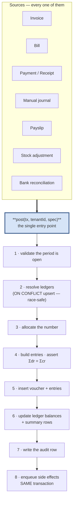
```mermaid
graph TB
    subgraph SRC["Sources — every one of them"]
        I["Invoice"]
        B["Bill"]
        P["Payment / Receipt"]
        J["Manual journal"]
        PY["Payslip"]
        ST["Stock adjustment"]
        BR["Bank reconciliation"]
    end
    SRC ==> PE["**post(tx, tenantId, spec)**<br/>the single entry point"]
    PE --> V1["1 · validate the period is open"]
    V1 --> V2["2 · resolve ledgers<br/>(ON CONFLICT upsert — race-safe)"]
    V2 --> V3["3 · allocate the number"]
    V3 --> V4["4 · build entries · assert Σdr = Σcr"]
    V4 --> V5["5 · insert voucher + entries"]
    V5 --> V6["6 · update ledger balances<br/>+ summary rows"]
    V6 --> V7["7 · write the audit row"]
    V7 --> V8["8 · enqueue side effects<br/>SAME transaction"]
    style PE fill:#d6e4f7,stroke:#3b5b8c,stroke-width:3px
```

**[VERIFIED-REPO]** `src/backend/utils/posting.ts` already implements this shape, and implements it unusually well. It takes `tx: Prisma.TransactionClient` so callers control the transaction boundary, and it resolves ledgers with a raw `INSERT … ON CONFLICT ("organizationId","name") DO UPDATE SET "name" = EXCLUDED."name" RETURNING "id"`. The comment above it records exactly why:

> Two requests posting the first invoice for the same new party both see no ledger, both insert, and the unique constraint rejects the loser with P2002. In Postgres a constraint violation poisons the surrounding transaction, so the loser does not merely fail to create a ledger — **the whole invoice posting is aborted.** Catch-and-retry cannot fix it, because once the transaction is poisoned every later statement fails too. The insert has to not raise in the first place, which means `ON CONFLICT`. Prisma's `upsert` is not sufficient — under the driver adapter it resolves as select-then-insert and loses the same race. An integration test proves it.

**[JUDGEMENT]** This is the standard the rest of the codebase should be held to: a race identified, a fix chosen for a stated reason, an alternative rejected with evidence, and a test that fails if someone reverts it. The `DO UPDATE SET "name" = EXCLUDED."name"` no-op is the correct idiom — `DO NOTHING` returns no row on conflict, so `RETURNING` would be empty in exactly the case you need it.

### 14.3 Immutability and correction

**[PATTERN]** Accounting systems do not edit history. They append corrections.

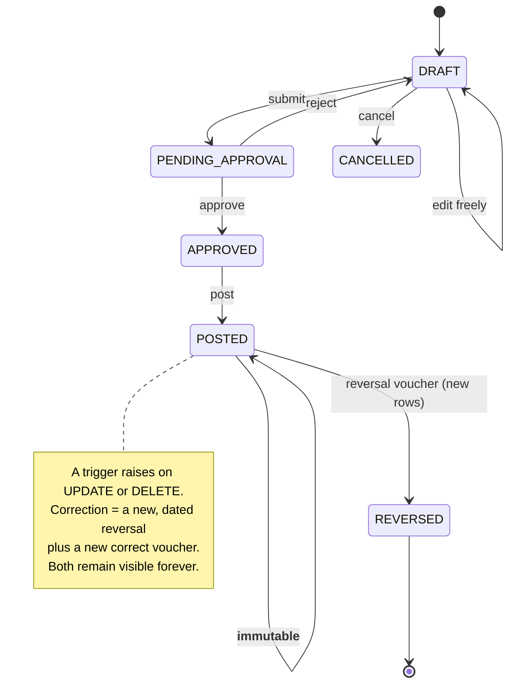
```mermaid
stateDiagram-v2
    [*] --> DRAFT
    DRAFT --> PENDING_APPROVAL: submit
    DRAFT --> DRAFT: edit freely
    PENDING_APPROVAL --> APPROVED: approve
    PENDING_APPROVAL --> DRAFT: reject
    APPROVED --> POSTED: post
    POSTED --> POSTED: **immutable**
    POSTED --> REVERSED: reversal voucher (new rows)
    DRAFT --> CANCELLED: cancel
    REVERSED --> [*]
    note right of POSTED
        A trigger raises on UPDATE or DELETE.
        Correction = a new, dated reversal
        plus a new correct voucher.
        Both remain visible forever.
    end note
```

```sql
CREATE OR REPLACE FUNCTION forbid_posted_mutation() RETURNS trigger AS $$
BEGIN
  IF OLD."isPosted" AND TG_OP IN ('UPDATE','DELETE') THEN
    -- the only permitted transition is POSTED → REVERSED
    IF NOT (TG_OP = 'UPDATE' AND NEW.status = 'REVERSED' AND OLD.status = 'POSTED') THEN
      RAISE EXCEPTION 'voucher % is posted and immutable', OLD.id
        USING ERRCODE = 'restrict_violation';
    END IF;
  END IF;
  RETURN NEW;
END $$ LANGUAGE plpgsql;
```

**[JUDGEMENT]** This is not currently enforced — **[VERIFIED-REPO]** `Voucher.isPosted` is a boolean with no trigger behind it, so any `UPDATE` succeeds. This matters beyond tidiness: statutory filings are computed from posted vouchers. If a posted voucher can change after GSTR-1 has been filed, the filing and the books no longer agree, and reconciling that is the customer's problem to explain to a tax officer.

Note the design's relationship to **[VERIFIED-REPO]** `deletedAt`: there are **zero** soft-delete columns in the schema. For an accounting system that is arguably correct — vouchers are reversed, not deleted — but it must be a *stated* decision, because masters (`Item`, `Party`, `Ledger`) do need retirement without deletion. Use `isActive` for masters, reversal for transactions, and never a hard `DELETE` on either.

### 14.4 Document numbering under concurrency

Statutory numbering must be **gapless per tenant, per voucher type, per fiscal year**. Gaps invite audit questions; duplicates are worse.

**[VERIFIED-REPO]** `NumberCounter` with `@@unique([organizationId, scope])` is the right structure. The allocation must be a locking read inside the posting transaction:

```sql
-- Inside the posting transaction. Serialises only same-tenant, same-scope writers.
INSERT INTO number_counters ("id","organizationId","scope","lastNumber","updatedAt")
VALUES ($1, $2, $3, 1, NOW())
ON CONFLICT ("organizationId","scope")
  DO UPDATE SET "lastNumber" = number_counters."lastNumber" + 1, "updatedAt" = NOW()
RETURNING "lastNumber";
```

| Property | Consequence |
|---|---|
| Contention is scoped to one tenant + one voucher type | Two tenants never block each other — the pooled-model requirement |
| The number is allocated **inside** the posting transaction | A rollback returns the number. No gaps |
| Never allocate before the transaction, never in a separate one | That is exactly how gaps and duplicates appear |
| High-volume tenants at Stage 3 | Contention is bounded by that tenant's own posting rate; if it ever binds, the answer is per-branch scopes, not a sequence |

**[JUDGEMENT]** Do **not** use a Postgres `SEQUENCE`. Sequences are explicitly non-transactional — a rollback consumes the number and leaves a gap, which is precisely what statutory numbering forbids.

### 14.5 Fiscal periods and close

The Tally lesson from §2.3, adapted: fiscal year is a **scoping dimension inside one dataset**, not a physical partition of it.

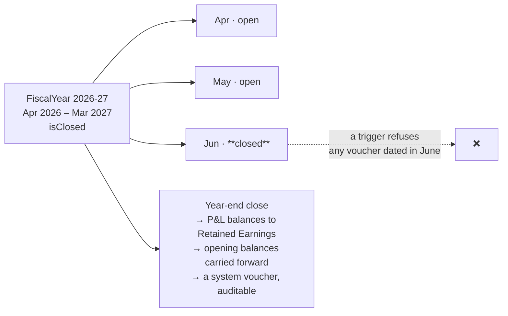
```mermaid
graph LR
    FY["FiscalYear 2026-27<br/>Apr 2026 – Mar 2027<br/>isClosed"] --> P1["Apr · open"]
    FY --> P2["May · open"]
    FY --> P3["Jun · **closed**"]
    P3 -.->|"a trigger refuses<br/>any voucher dated in June"| X["❌"]
    FY --> CL["Year-end close<br/>→ P&L balances to Retained Earnings<br/>→ opening balances carried forward<br/>→ a system voucher, auditable"]
```

**[VERIFIED-REPO]** `FiscalYear` and `FiscalPeriod` both exist with `isClosed` flags. `FiscalPeriod` is one of the 22 tables needing `organizationId` (§8.2). The close itself must be a posted, reversible system voucher — never a batch of `UPDATE`s — so that a mistaken close can be undone by reversal like any other transaction.

### 14.6 Fast balances without caching them

**[JUDGEMENT]** ADR-009 of the assessment says: never cache financial data. A stale ledger balance is a wrong ledger balance, and in this product wrong numbers are the only unrecoverable failure. But a trial balance cannot re-aggregate millions of `voucher_entries` on every dashboard load either.

The resolution is that **summary tables are not a cache** — they are maintained inside the posting transaction, so they cannot be stale:

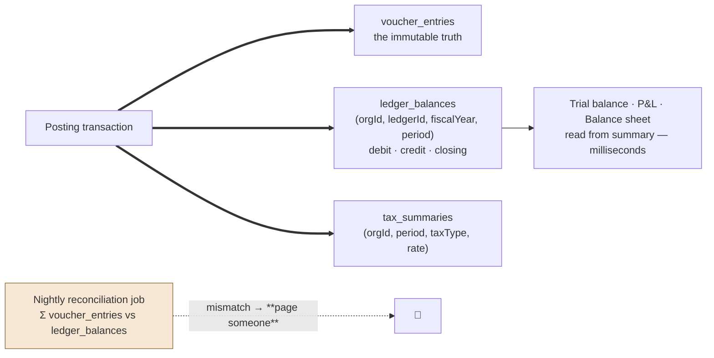
```mermaid
graph LR
    POST["Posting transaction"] ==> VE["voucher_entries<br/>the immutable truth"]
    POST ==> LB["ledger_balances<br/>(orgId, ledgerId, fiscalYear, period)<br/>debit · credit · closing"]
    POST ==> TS["tax_summaries<br/>(orgId, period, taxType, rate)"]
    LB --> RPT["Trial balance · P&L · Balance sheet<br/>read from summary — milliseconds"]
    RECON["Nightly reconciliation job<br/>Σ voucher_entries vs ledger_balances"] -.->|"mismatch → **page someone**"| ALERT["🚨"]
    style RECON fill:#f7e8d6,stroke:#8c6a3b
```

| Property | Design |
|---|---|
| Updated where | In the same transaction as the entry that changes it |
| Can it be stale | **No** — staleness would require the transaction to have partially committed |
| Contention | Row-level, per `(org, ledger, period)`. Hot ledgers (Sales, GST Output) will contend within a tenant at high volume — at Stage 3, shard those rows by adding a bucket column and summing across buckets |
| Verification | A nightly job re-aggregates from `voucher_entries` and compares. **Any mismatch pages a human.** |

**[JUDGEMENT]** That nightly reconciliation alarm is, per unit of effort, one of the most valuable things in this entire document. It is roughly a day of work. It is the difference between discovering a balance-maintenance bug yourself, overnight, on the day it ships — and discovering it three months later from a customer whose filed return does not match their books.

## 15. Extensibility without per-tenant DDL

The Salesforce lesson from §2.1, sized correctly for AccuBook.

**The requirement:** tenants need custom fields — a "Site Code" on an invoice, a "Batch Origin" on an item. **The constraint:** per-tenant DDL is forbidden. 100,000 tenants each adding three columns is 300,000 columns and the end of migrations.

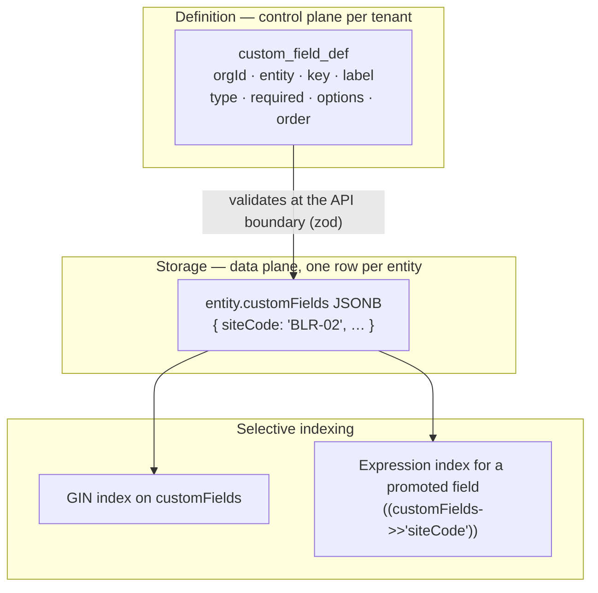
```mermaid
graph TB
    subgraph META["Definition — control plane per tenant"]
        FD["custom_field_def<br/>orgId · entity · key · label<br/>type · required · options · order"]
    end
    subgraph DATA["Storage — data plane, one row per entity"]
        CF["entity.customFields JSONB<br/>{ siteCode: 'BLR-02', … }"]
    end
    subgraph IDX["Selective indexing"]
        GIN["GIN index on customFields"]
        EXPR["Expression index for a promoted field<br/>((customFields->>'siteCode'))"]
    end
    FD -->|"validates at the API boundary (zod)"| CF
    CF --> GIN
    CF --> EXPR
```

| Decision | Choice | Reason |
|---|---|---|
| Storage | A `JSONB` column on the entity | One column, no DDL per tenant, indexable |
| Definition | Rows, per tenant | Drives the UI, validation and export |
| Validation | Zod schema built from the definitions, at the API boundary | Type safety without types |
| Query | `GIN` index generally; an expression index for a field a tenant filters on constantly | Bounded cost |
| **Not** the Salesforce universal data table | Rejected | **[JUDGEMENT]** Correct at Salesforce's scale and customisation depth; enormous complexity for a product whose schema is 95% fixed by accounting standards. AccuBook's schema is *supposed* to be rigid — a chart of accounts is not a customisation surface |

**[VERIFIED-REPO]** The pattern already appears: `Voucher.metadata Json?`, `Voucher.attachments Json?`, `Organization.payrollSettings Json?`. The comment on `payrollSettings` states the rule well — *"held as JSON because the shape is a settings sheet rather than something queried or joined on; it is validated by zod at the API boundary."* That is exactly the right test for JSONB versus a column.

## 16. ORM and connection management

### 16.1 Client topology

**One Prisma client per placement — never per tenant.**

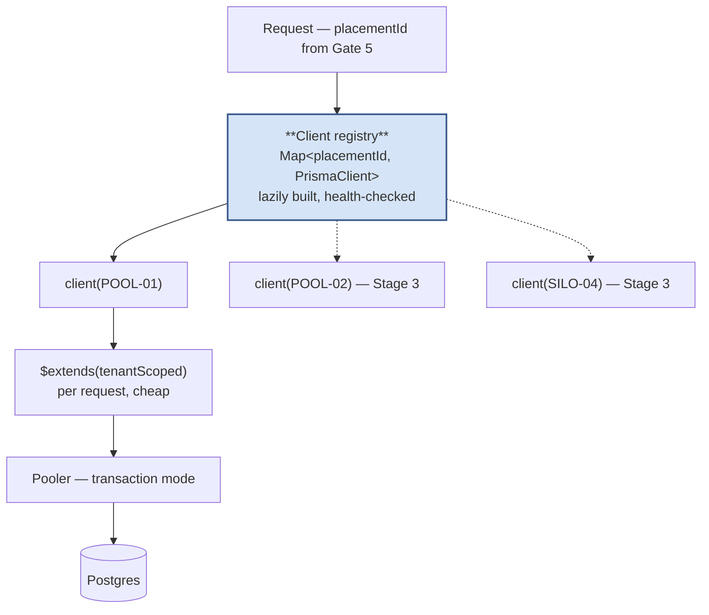
```mermaid
graph TB
    REQ["Request — placementId from Gate 5"] --> REG["**Client registry**<br/>Map&lt;placementId, PrismaClient&gt;<br/>lazily built, health-checked"]
    REG --> C1["client(POOL-01)"]
    REG -.-> C2["client(POOL-02) — Stage 3"]
    REG -.-> C3["client(SILO-04) — Stage 3"]
    C1 --> EXT["$extends(tenantScoped)<br/>per request, cheap"]
    EXT --> POOLER["Pooler — transaction mode"]
    POOLER --> DB[("Postgres")]
    style REG fill:#d6e4f7,stroke:#3b5b8c,stroke-width:2px
```

**[JUDGEMENT]** A client per tenant is the classic mistake in this design space: each client carries a connection pool, so 100,000 tenants is 100,000 pools. The client belongs to the *placement*; the tenant is a runtime property carried by the extension and the transaction-local setting.

### 16.2 Connections — the binding constraint on serverless

**[PATTERN]** This is the constraint that most often surprises teams on serverless.

```
concurrent function instances × pool size per instance = connections demanded
```

Function instances scale with traffic and are effectively unbounded above. Postgres connections are not: **[VENDOR-CHECK]** a managed Postgres instance typically permits hundreds, not thousands, of direct connections, scaling with instance size — verify against neon.tech/docs for the chosen compute size.

| Layer | Setting | Reason |
|---|---|---|
| Serverless app pool | `max = 3` **[VERIFIED-REPO]** | Already a thoughtful choice. Keep it |
| Worker pool | 10–20 per container | Long-lived, countable, predictable |
| Pooler mode | **Transaction** | Session mode holds a backend for the whole session and defeats the purpose |
| `statement_timeout` | 15 s app / 120 s report role | **A runaway query must die on its own.** Currently unset |
| `lock_timeout` | 5 s | A migration or a hot row must not queue the whole application behind it |
| `idle_in_transaction_session_timeout` | 30 s | An abandoned transaction holds locks and blocks vacuum indefinitely |

**[JUDGEMENT]** Those three timeouts are hours of work and are the highest-value operational change available. Without `statement_timeout`, one unindexed report query on one tenant's data can saturate the primary and take down every tenant — the noisy-neighbour failure in its purest form.

### 16.3 What transaction-mode pooling costs

Stating this explicitly, because it removes options people reach for later:

| Unavailable | Consequence | Alternative used here |
|---|---|---|
| `LISTEN` / `NOTIFY` | No push notification from the database | The worker polls with `SKIP LOCKED` — §18 |
| Session-level advisory locks | No cross-transaction mutex | Transaction-level advisory locks, or a Redis lock |
| Session `SET` | Cannot set the tenant per session | `set_config(…, true)` per transaction — which is safer anyway |
| Cross-transaction prepared statements | Minor plan-cache loss | Accepted |

## 17. Placement and sharding

### 17.1 The indirection

```mermaid
graph TB
    REQ["Request for tenant T"] --> LOOK["placement_assignment(T) → placementId"]
    LOOK --> REG["placement registry"]
    REG --> P1[("POOL-01<br/>region ap-south-1<br/>ACTIVE · capacity 40%")]
    REG -.-> P2[("POOL-02<br/>Stage 3")]
    REG -.-> P3[("SILO-04<br/>a paying enterprise tenant")]
    REG -.-> P4[("POOL-IN-01<br/>residency-pinned")]
    style P1 fill:#d6e4f7,stroke:#3b5b8c,stroke-width:2px
```

```ts
// V1, in full. This is the entire implementation, and that is the point.
async function resolvePlacement(tenantId: string): Promise<PlacementId> {
  const a = await platformCache.assignment(tenantId);
  return a?.placementId ?? "POOL-01";
}
```

**[JUDGEMENT]** Two engineer-days. It does nothing in V1. It is the difference between "we can move that customer next Tuesday" and "that would be a six-month project", and between "we can offer data residency" and "we cannot bid for that contract".

### 17.2 Placement states

| State | Meaning | Routing |
|---|---|---|
| `ACTIVE` | Accepting reads, writes and new tenants | Normal |
| `DRAINING` | No new tenants; existing tenants unaffected | Normal |
| `MIGRATING` | This tenant is mid-move | §17.4 |
| `READ_ONLY` | Incident or maintenance | Writes → 503 with a retry hint |
| `RETIRED` | Empty | Refuse |

### 17.3 Choosing a placement for a new tenant

**[JUDGEMENT]** Assignment is a **rule table in the control plane**, not code:

1. Residency requirement → the region's pool
2. Enterprise isolation SKU purchased → a SILO placement
3. Otherwise → the `ACTIVE` pool with the most headroom in the tenant's region

Because it is data, opening a new region or a new pool is an `INSERT`, not a release.

### 17.4 Moving a tenant

```mermaid
sequenceDiagram
    autonumber
    participant CP as Control plane
    participant S as Source placement
    participant D as Destination
    CP->>CP: assignment.state = MIGRATING
    CP->>S: copy tenant rows (WHERE organizationId = T), FK order
    Note over S,D: bulk copy while the tenant keeps working
    CP->>CP: tenant.status = MAINTENANCE (a short, scheduled window)
    CP->>S: copy the delta since the snapshot
    CP->>D: verify — row counts, checksums, trial balance matches
    alt verification passes
        CP->>CP: assignment → destination · cache invalidated
        CP->>CP: tenant.status = ACTIVE
        Note over S: source rows retained for N days, then purged
    else fails
        CP->>CP: roll back · tenant never left the source
    end
```

**[JUDGEMENT]** **The trial balance must match on both sides before the cutover commits.** Row counts prove you copied rows; a matching trial balance proves you copied the *right* rows. For an accounting system that is the only acceptable verification, and it is only possible because §8.3's composite keys make the tenant's data set well-defined.

### 17.5 Region as a first-class attribute

The Zoho lesson (§2.2). A placement has a region from day one, even with one region. **[JUDGEMENT]** Data residency is the most likely trigger for a platform move (§29 Stage 3) — an Indian enterprise or government-adjacent customer asking "where is my data?" is a sales conversation you either can or cannot have, and the answer is set by whether region exists in the model.

### 17.6 Sharding, when it arrives

Sharding is **placement, applied at scale**. There is no separate sharding project.

| Question | Answer |
|---|---|
| Shard key | **`organizationId`.** Never anything else |
| Cross-shard queries | **None.** A tenant lives entirely on one shard. No distributed joins, no distributed transactions |
| Rebalancing | The §17.4 tenant move, run in bulk |
| Routing | The control plane already does it |
| Trigger | Primary write throughput or storage exceeds a single instance — §31 |
| Platform-wide analytics | A separate warehouse fed by CDC, never a cross-shard query |

**[JUDGEMENT]** This is why `organizationId` on every row (**I1**) is non-negotiable. A table without a tenant column cannot be assigned to a shard. The backfill of §8.2 is not only an RLS prerequisite — it is the sharding prerequisite, five years early, at a moment when the tables are small enough to alter.

## 18. Background jobs

### 18.1 The queue is a table

```sql
CREATE TABLE jobs (
  id             BIGSERIAL PRIMARY KEY,
  queue          TEXT NOT NULL,
  kind           TEXT NOT NULL,
  tenant_scope   TEXT NOT NULL,            -- 'TENANT' | 'PLATFORM'
  tenant_id      TEXT,
  payload        JSONB NOT NULL,
  idempotency_key TEXT,
  run_after      TIMESTAMPTZ NOT NULL DEFAULT NOW(),
  attempts       INT NOT NULL DEFAULT 0,
  max_attempts   INT NOT NULL DEFAULT 5,
  status         TEXT NOT NULL DEFAULT 'PENDING',
  locked_by      TEXT,
  locked_at      TIMESTAMPTZ,
  last_error     TEXT,
  CONSTRAINT tenant_scope_required
    CHECK ((tenant_scope = 'TENANT' AND tenant_id IS NOT NULL)
        OR (tenant_scope = 'PLATFORM' AND tenant_id IS NULL))
);
CREATE UNIQUE INDEX ON jobs (idempotency_key) WHERE idempotency_key IS NOT NULL;
CREATE INDEX ON jobs (queue, status, run_after) WHERE status = 'PENDING';
```

**[JUDGEMENT]** `tenant_scope_required` is the most important line. It makes "I forgot which tenant this job is for" a constraint violation at insert time rather than a cross-tenant write at run time. A job that legitimately spans tenants must *say so* — **[VERIFIED-REPO]** the two current crons (`check-overdue`, `run-recurring`) do exactly this and must declare `PLATFORM` scope explicitly.

### 18.2 Why Postgres and not a queue product

```mermaid
graph LR
    TX["Business transaction"] --> W["write the invoice"]
    TX --> E["INSERT INTO jobs"]
    TX --> C{"COMMIT"}
    C -->|success| BOTH["invoice **and** job exist"]
    C -->|failure| NEITHER["neither exists"]
    style BOTH fill:#d6f7d6,stroke:#3b8c3b
```

**[PATTERN]** With an external broker the enqueue is a network call outside the transaction: the invoice commits and the broker call fails, or the broker accepts and the transaction rolls back. The standard fix is a transactional outbox plus a relay — a whole extra moving part. **Putting the queue in the same database removes the problem instead of solving it.** One fewer system to run, one fewer failure mode, and the queue is debuggable with `SELECT`.

**Reconsider at** sustained >5,000 jobs/s, or when queue I/O measurably harms OLTP latency.

### 18.3 Consuming

```sql
UPDATE jobs SET status='RUNNING', locked_by=$worker, locked_at=NOW(), attempts=attempts+1
WHERE id = (
  SELECT id FROM jobs
  WHERE status='PENDING' AND queue=$queue AND run_after <= NOW()
  ORDER BY run_after
  FOR UPDATE SKIP LOCKED         -- concurrent workers never collide
  LIMIT 1
)
RETURNING *;
```

The worker then **establishes tenant context from `tenant_id` before the handler runs** — the same `AsyncLocalStorage` + `set_config` path as an HTTP request (§12). A handler cannot tell whether it is running in a request or a job, which is exactly right.

### 18.4 Queues

| Queue | Work | Concurrency | Timeout |
|---|---|---|---|
| `critical` | E-invoice IRN, payment webhooks | High | 30 s |
| `default` | Email, notifications, recalculation | Medium | 60 s |
| `reports` | Trial balance, P&L, GSTR builds, exports | Low | 15 min |
| `imports` | Bulk CSV/Excel ingest | Low | 30 min |
| `ocr` | Document extraction, LLM calls | Low, cost-capped | 5 min |
| `webhooks` | Outbound delivery with retries | Medium | 30 s |

**[JUDGEMENT]** Separate queues exist so that one tenant importing 50,000 rows cannot delay every other tenant's e-invoice submission. Sharing one queue is the most common way a pooled system becomes unfair.

### 18.5 Fairness — the noisy-neighbour control

```mermaid
graph TB
    Q["reports queue"] --> F{"per-tenant in-flight cap<br/>e.g. 2 concurrent"}
    F -->|"tenant A: 2 running"| SKIP["skip A's remaining jobs<br/>pick the next tenant"]
    F -->|"tenant B: 0 running"| RUN["run B's job"]
    style F fill:#f7e8d6,stroke:#8c6a3b,stroke-width:2px
```

**[PATTERN]** Without a per-tenant cap, one tenant queueing 500 report jobs occupies every worker and every other tenant waits. With it, that tenant's jobs simply take longer — the cost of their behaviour lands on them. The cap is an entitlement (§24), so a larger plan legitimately buys a higher one.

### 18.6 Retries and the dead-letter queue

Exponential backoff with jitter; `max_attempts` then `status = 'DEAD'`. **[JUDGEMENT]** A dead-letter row must page someone if `kind` is in the critical set — a failed e-invoice submission is a statutory problem for the customer within 24 hours, not a background curiosity. Every handler must be idempotent, keyed by `idempotency_key`, because "at least once" is the only delivery guarantee this design offers.

## 19. Reporting

**[JUDGEMENT]** This is where AccuBook is most likely to be compared unfavourably with Zoho Books, and it is where the pooled model's weaknesses surface first: a report is a long, wide, read-heavy query over one tenant's entire history, running on infrastructure shared with everyone else's writes.

### 19.1 Three tiers

```mermaid
graph TB
    R["Report requested"] --> EST["Estimate cost<br/>rows × period × entity count"]
    EST --> T1{"tier"}
    T1 -->|"T1 — small"| SYNC["Synchronous, < 2 s<br/>from summary tables<br/>dashboard · TB · outstanding"]
    T1 -->|"T2 — medium"| STREAM["Streamed / paginated, < 30 s<br/>ledger detail · ageing · stock"]
    T1 -->|"T3 — large"| ASYNC["**Queued job**<br/>→ object storage → signed URL → notify<br/>GSTR-1 · annual P&L · full export"]
    SYNC --> RD[("Read replica<br/>Stage 1+")]
    STREAM --> RD
    ASYNC --> W["Worker"] --> RD
    style ASYNC fill:#f7e8d6,stroke:#8c6a3b
```

| Tier | Latency | Path | Examples |
|---|---|---|---|
| **T1** | < 2 s | Synchronous, reads `ledger_balances` | Dashboard, trial balance, outstanding summary |
| **T2** | < 30 s | Streamed, paginated, cursor-based | Ledger detail, ageing, stock movement, day book |
| **T3** | Minutes | Queued → file → signed URL → notification | GSTR-1/3B, annual P&L and balance sheet, full data export, Form 16 |

**[JUDGEMENT]** The **cost estimate before execution** is what makes this work. A tenant with 200 vouchers and a tenant with 2,000,000 both ask for "P&L for the year"; the same request is T1 for one and T3 for the other. Estimating from row counts and routing accordingly is the mechanism that stops a large tenant's ordinary request behaving like an attack.

### 19.2 Reads go to a replica

From Stage 1, all reporting uses `app_report` against a read replica: read-only, its own `statement_timeout`, its own connection budget. **[PATTERN]** Replication lag is acceptable for reports (seconds) and unacceptable for posting — so posting never reads the replica, and the DAL enforces that by exposing a separate `reportDb()` accessor that cannot write.

### 19.3 Statutory reports are not ordinary reports

GSTR-1, GSTR-3B and Form 16 differ from a P&L in a way that changes the design: **they are filed, and a filed return is a fact about the past.**

| Requirement | Design |
|---|---|
| Reproducible | A generated return is **stored**, with its inputs and the rule version used |
| Versioned rules | Tax rules are date-versioned data. A return for FY 2024-25 uses that year's rules forever |
| Amendable | Amendments are new rows referencing the original, mirroring the GST portal's own model |
| Reconcilable | Books vs filed return, as a report the customer can run themselves |

**[JUDGEMENT]** Tax rates in code are a defect. When a rate changes, every historical recomputation silently changes with it, and last year's return no longer reproduces. `TaxConfig` **[VERIFIED-REPO]** exists per organisation; it needs effective-date ranges so that a rate is a fact about a period rather than a fact about the present.

## 20. Documents, OCR and AI

**[VERIFIED-REPO]** Already shipped: `DocumentExtraction` (org-scoped), `unpdf` (PDF text layer), and Groq's free vision model for photos and scans. There is no paid/LLM escalation tier — a reading that comes back thin is handed to the reviewer as-is rather than re-run against a paid model.

```mermaid
graph LR
    UP["Upload — bill photo or PDF"] --> V["Validate<br/>magic bytes · size · type · **malware scan**"]
    V --> S["Object storage<br/>documents/{orgId}/{uuid}"]
    S --> Q["ocr queue — tenant-scoped, cost-capped"]
    Q --> EX["Extract — text layer, else OCR"]
    EX --> LLM["LLM structuring<br/>vendor · GSTIN · line items · tax"]
    LLM --> CONF{"confidence"}
    CONF -->|high| DRAFT["Draft bill, pre-filled"]
    CONF -->|low| REVIEW["Human review queue"]
    DRAFT --> HUMAN["**A human always confirms<br/>before anything posts**"]
    REVIEW --> HUMAN
    HUMAN ==> POST["post() — §14.2"]
    style HUMAN fill:#f7d6d6,stroke:#8c3b3b,stroke-width:2px
```

| Concern | Design |
|---|---|
| **Nothing auto-posts** | Extraction produces a *draft*. A human confirms. **[JUDGEMENT]** An LLM misreading `1,00,000` as `100,000` and posting it unattended is an unrecoverable customer incident |
| Cost control | Per-tenant monthly page cap as an entitlement, enforced **before** the API call; usage metered per document |
| Tenant isolation | Prompts carry one tenant's document only. Never batch across tenants |
| Data handling | Vendor data-retention terms are a DPDP question — record them in the sub-processor list (§25.4) |
| Model failure | Confidence below threshold → review queue, never a silent guess |
| Extractability | The only module with a genuinely different scaling profile — CPU-heavy, long-running, non-transactional. §6.3's one candidate for later extraction |

## 21. File storage

| Rule | Reason |
|---|---|
| Key layout `documents/{orgId}/{yyyy}/{mm}/{uuid}` | **[JUDGEMENT]** The prefix is for *lifecycle and export*, never for authorisation |
| Authorisation is a **row read under RLS**, then a signed URL | The key must never be the credential. A guessed or leaked key must be worthless |
| Signed URLs, 5–15 minutes | Bounded exposure if a link is forwarded |
| Upload validation | Magic bytes, not the extension; size cap; malware scan before the file is reachable |
| Never served from the app | Bandwidth through a function is the most expensive possible byte |
| Retention | Per document class (§25.3): statutory documents 8 years; OCR source images shorter |

**[VERIFIED-REPO]** This is already implemented correctly — access flows through org-scoped routes rather than direct storage links. Preserve that property through the storage-provider change that Stage 3 will bring (§29).

***
## 22. Caching

**[JUDGEMENT]** The rule is short and absolute: **cache identity and configuration; never cache money.**

```mermaid
graph TB
    subgraph OK["Cacheable — changes rarely, staleness is visible and harmless"]
        C1["tenant status · placement — 60 s + 24 h stale"]
        C2["entitlements · plan — 60 s + 24 h stale"]
        C3["membership · permissions — 60 s"]
        C4["rate-limit counters · idempotency keys"]
        C5["reference data — currencies, HSN, state codes — hours"]
    end
    subgraph NEVER["Never cached"]
        N1["❌ ledger balances"]
        N2["❌ stock quantities"]
        N3["❌ invoice or bill totals"]
        N4["❌ tax liability"]
        N5["❌ anything on a report a customer files"]
    end
    NEVER --> ALT["Acceleration comes from **summary tables**<br/>maintained inside the posting transaction — §14.6<br/>Fast, and structurally incapable of being stale"]
    style NEVER fill:#f7d6d6,stroke:#8c3b3b
    style ALT fill:#d6f7d6,stroke:#3b8c3b
```

**Cache keys are always tenant-prefixed** — `tenant:{orgId}:…` — and a cache client that permits an unprefixed key is a bug. **[JUDGEMENT]** Cross-tenant cache poisoning is a real and under-tested breach path: it does not touch the database at all, so RLS cannot help, and it will not appear in any SQL-based isolation test. It needs its own test row in the isolation matrix.

## 23. API architecture

### 23.1 Surface

| Surface | Consumers | Auth | Notes |
|---|---|---|---|
| `/api/organizations/[orgId]/…` | The web app, integrations | Session or API key | **[VERIFIED-REPO]** 110 routes, all wrapped in `withOrgAuth` |
| `/api/auth/…` | Sign-in, registration, reset | Public, rate-limited | Registration is limited today; sign-in must be too |
| `/api/cron/…` | Scheduler | `Bearer CRON_SECRET` **[VERIFIED-REPO]** | Platform-scoped by declaration |
| `/api/health` | Load balancer, monitoring | None | DB reachability + migration drift |
| `/api/webhooks/…` | Razorpay, banks, GST | Signature verification | Never trust the payload; re-fetch the object |
| Global reference | `currencies`, `units`, `hsn-search` | Session | Read-only, no tenant scope |

**[JUDGEMENT]** The `orgId` in the path is a *routing* device, not an *authorisation* device. It says which tenant the caller is asking about; Gate 2 decides whether they may. Any design in which the path parameter alone determines access is an IDOR, and this codebase already gets that right.

### 23.2 Contract rules

| Rule | Reason |
|---|---|
| Versioned (`/v1/`) for the public API from the first external consumer | Breaking a partner's integration is a support incident you cannot roll back |
| **Idempotency keys mandatory on financial writes** | **[VERIFIED-REPO]** currently absent on all of them. A retried invoice POST creates a duplicate invoice today |
| Cursor pagination, never offset | Offset degrades on large tenants and is inconsistent under concurrent writes |
| Zod validation at every boundary **[VERIFIED-REPO]** | Already done; keep it |
| Errors carry a stable `code` and the `requestId` | Support cannot help without a correlation ID |
| 404 for cross-tenant, uniformly | No existence oracle — §9.1 |
| Per-key rate limits, not just per-IP | One partner integration must not consume a tenant's budget |

### 23.3 Outbound webhooks

Tenants need events (invoice paid, stock low). Delivery is a queue: signed payloads (HMAC + timestamp), exponential backoff, dead-letter after N attempts, per-tenant delivery caps, and a delivery log the tenant can inspect and replay. **[JUDGEMENT]** SSRF is the risk that matters — a tenant-supplied URL pointing at internal infrastructure. Egress must be filtered: block private ranges, link-local, and the cloud metadata endpoint.

## 24. Subscriptions and entitlements

**[VERIFIED-REPO]** There is no `Plan`, `Subscription`, `Feature`, `Entitlement` or `Usage` model in the schema. **AccuBook cannot currently charge anybody.** This is a commercial blocker, not a scaling one, and it arrives before every scaling problem in this document.

### 24.1 The model

```mermaid
graph TB
    P["**Plan** — Free · Starter · Growth · Business"]
    P --> PF["plan_feature<br/>e-invoice · multi-branch · API · payroll"]
    P --> PL["plan_limit<br/>users · invoices/mo · storage · OCR pages<br/>API calls/min · report concurrency"]
    S["**Subscription**<br/>tenant → plan · status · period · trial end<br/>razorpay_subscription_id"]
    P --> S
    S ==> E["**Entitlement** — materialised per tenant<br/>key · value · source · expires_at"]
    O["Override — sales-agreed"] ==> E
    T["Trial grant"] ==> E
    E --> G["**Gate 4** — checked in withOrgAuth"]
    U["usage_counter<br/>incremented in the business transaction"] --> G
    style E fill:#d6e4f7,stroke:#3b5b8c,stroke-width:2px
```

### 24.2 Why entitlements are materialised

**[JUDGEMENT]** Resolving plan → features on every request seems simpler and is a trap. It makes four ordinary business situations inexpressible:

- *"Give this customer e-invoicing for two months while they evaluate"* — an override with an expiry
- *"Grandfather these 40 tenants on old limits"* — an override with no expiry
- *"This trial includes the Business feature set"* — a trial-sourced entitlement
- *"Why does this tenant have API access when they are on Starter?"* — a question a computed value cannot answer

A materialised `entitlement` row with a `source` column answers all four. Recomputation happens on plan change, trial expiry, payment success and payment failure — events, not requests.

### 24.3 Never `if (plan === 'PRO')`

```ts
// ❌ A business rule compiled into a deployment.
if (subscription.plan === "PRO") { … }

// ✅ A business rule that is data.
if (!(await entitled(tenantId, "feature.einvoice"))) throw new NotEntitled();
const cap = await limit(tenantId, "limit.invoices_per_month");
```

Adding a plan, running a promotion or grandfathering a cohort must be an `INSERT`, never a release. This is the Salesforce lesson of §2.1 applied to commerce.

### 24.4 Limits are the noisy-neighbour control

**[PATTERN]** Governor limits are not a way to upsell; they are how a pooled platform stays fair. Every limit in the table below simultaneously protects the platform and defines a plan.

| Limit | Protects against | Enforced at |
|---|---|---|
| API calls / minute | Runaway integration | Gate 4 + Redis |
| Concurrent report jobs | One tenant occupying every worker | §18.5 |
| OCR pages / month | Unbounded LLM spend — **margin risk** | Before the vendor call |
| Storage GB | Unbounded object cost | Upload time |
| Rows per export | A memory-exhausting export | Report tier estimate |
| Users | Commercial | Membership creation |
| Webhook deliveries / hour | Outbound amplification | §23.3 |

**[JUDGEMENT]** The OCR cap is the one to build first. It is the only limit whose absence can produce a *negative-margin tenant* — a customer paying ₹499/month who runs ₹50,000 of model inference. Every other limit costs latency; this one costs money.

### 24.5 Billing flows

| Flow | Design |
|---|---|
| Trial → paid | Entitlements recomputed on payment success |
| Payment failure | `PAST_DUE` → **read-only, not locked out** → dunning emails → suspend after a stated grace period |
| Upgrade | Immediate; prorate; recompute entitlements |
| Downgrade | At period end; **validate current usage against the new limits first** and say what will break |
| Webhooks | Signature-verified, **deduplicated by event id**, and reconciled nightly against the provider |
| Cancellation | `CLOSING` → export offered → retention window → `CLOSED` → erasure per §25.3 |

**[JUDGEMENT]** Never trust a webhook payload as the source of truth. Verify the signature, then re-fetch the subscription from the provider. A replayed or forged webhook that upgrades a plan is a straightforward revenue loss, and webhook endpoints are public by necessity.

## 25. India regulatory architecture

**[JUDGEMENT]** This is the competitive core against Zoho Books and the reason a customer leaves Tally, so it is architecture rather than feature work. **Nothing in this section is legal advice** — confirm each obligation with counsel and a practising CA.

### 25.1 Tax as versioned data

```mermaid
graph TB
    R["**tax_rule** — date-versioned<br/>hsn/sac · rate · cess · effective_from · effective_to<br/>place-of-supply logic · RCM applicability"]
    R --> C["Computation at posting time<br/>reads the rule effective on the **voucher date**"]
    C --> STORE["The applied rate and rule version are<br/>**stored on the tax row**"]
    STORE --> REPRO["Any recomputation, at any future date,<br/>reproduces the original figure exactly"]
    style REPRO fill:#d6f7d6,stroke:#3b8c3b
```

**[JUDGEMENT]** Two properties, both essential. Rates are looked up **by voucher date**, not by today's date — so a rate change does not silently rewrite history. And the rate actually applied is **stored on the row** — so a filed return reproduces even if a rule row is later corrected. Without the second property the first is not enough.

### 25.2 The statutory surface

| Obligation | Architectural consequence |
|---|---|
| **E-invoice (IRP)** | Above the turnover threshold, B2B invoices need an IRN before issue. Synchronous submission is fragile — queue on `critical`, retry, and make IRN state visible on the invoice. The threshold is a **per-tenant configuration**, not a constant |
| **E-way bill** | Movement above a value threshold needs a bill. Triggered from dispatch, not from the invoice |
| **GSTR-1 / 3B / 9** | Period-scoped generated returns, stored, amendable, reconcilable — §19.3 |
| **Composition scheme** | **[VERIFIED-REPO]** already modelled on `Organization` with `compositionScheme` + `compositionRate`, and the comment correctly records that outward GST must not be charged, ITC is not claimable, and CMP-08/GSTR-4 replace GSTR-1/3B. This is a **different posting path**, not a rate change — exactly the right place for the flag to live |
| **TDS / TCS** | Deduction at posting; challan and Form 16A/27D generation; rate tables versioned as §25.1 |
| **Multi-GSTIN** | One legal entity, several state registrations. Modelled as `Branch` with its own `gstNo` **[VERIFIED-REPO]** — correct, and it means branch scope (§11) is a statutory boundary, not only a permission |
| **Fiscal year Apr–Mar** | **[VERIFIED-REPO]** `fiscalYearStart` defaults to 4. Correct |
| **Books retention** | 8 years under the Companies Act **[VENDOR-CHECK — confirm with counsel]** |

### 25.3 DPDP and the retention conflict

**[JUDGEMENT]** This is a genuine architectural conflict and it needs a legal answer before launch, not after.

```mermaid
graph TB
    ERASE["DPDP: a data principal requests erasure"] --> CONFLICT{"conflict"}
    RETAIN["Companies Act / GST:<br/>books retained for 8 years"] --> CONFLICT
    CONFLICT --> RESOLVE["**Resolution, to be confirmed by counsel:**<br/>classify every field as<br/>statutory-record vs personal-data"]
    RESOLVE --> A1["Statutory: retained, access restricted<br/>invoice · GSTIN · amounts · dates"]
    RESOLVE --> A2["Personal, non-statutory: erased on request<br/>contact details · preferences · behavioural data"]
    style CONFLICT fill:#f7d6d6,stroke:#8c3b3b
```

The architecture required either way:

| Requirement | Design |
|---|---|
| Data classification register | Every column tagged: statutory · personal · derived · operational |
| Field-level erasure | Erasure targets fields, not rows — a statutory record survives with its personal fields tombstoned |
| Export on request | The §33.4 single-tenant export, in a machine-readable form |
| Consent and purpose records | Control plane; per identity, versioned |
| Breach notification | §27.2 alerting must detect fast enough to meet the statutory window |
| Sub-processor list | Every vendor touching tenant data — including the LLM provider (§20) |

### 25.4 Residency

**[JUDGEMENT]** Not currently a legal requirement for this data class **[VENDOR-CHECK — confirm]**, but reliably a *sales* requirement from larger customers. §17.5's region-carrying placement is the entire architectural answer; the operational answer is choosing `ap-south-1` when Stage 3 forces a platform decision anyway (§29).

## 26. Security architecture

### 26.1 Layers

```mermaid
graph TB
    L1["**1 · Edge** — TLS 1.3 · WAF · DDoS · bot rules · IP reputation"]
    L2["**2 · Transport** — HSTS · CSP · secure cookies · same-origin CSRF ✅"]
    L3["**3 · Authentication** — hashed credentials · MFA · rate-limited · hashed API keys ✅"]
    L4["**4 · Authorization** — membership · status · permission · branch ✅"]
    L5["**5 · Entitlement** — feature and limit gates"]
    L6["**6 · Application** — Zod at every boundary ✅ · parameterised SQL ✅ · output encoding"]
    L7["**7 · Data** — RLS FORCED · composite FKs · NOBYPASSRLS app role"]
    L8["**8 · Storage** — encryption at rest · signed URLs · malware scan · magic-byte validation"]
    L9["**9 · Audit** — append-only, tenant and platform planes separated"]
    L10["**10 · Operations** — secret rotation · least privilege · break-glass with consent"]
    L1-->L2-->L3-->L4-->L5-->L6-->L7-->L8-->L9-->L10
    style L7 fill:#d6e4f7,stroke:#3b5b8c,stroke-width:2px
```

✅ marks what **[VERIFIED-REPO]** already exists.

### 26.2 Credential separation

**[JUDGEMENT]** The most damaging single credential in this design is a database role that can bypass RLS. It must not exist in any deployment environment.

| Credential | Where it lives | Never |
|---|---|---|
| `app_tenant` | The application environment | Has `BYPASSRLS` |
| `accubook_owner` | The migration runner only | In the app environment |
| `app_report` | Reporting, replica only | Writes |
| `app_admin_support` | A vault; checked out per `SupportGrant` | A long-lived deployment secret |
| Backup credentials | A separate account | Reachable by the application role |

The application asserts at boot that `current_user` is not the owner and refuses to start otherwise — because a single wrong connection string silently disables every policy in the system.

### 26.3 The isolation test matrix

**[JUDGEMENT]** Isolation that is not tested is isolation that is assumed. Every row below is an automated test that must be green before RLS is enabled on a high-traffic table, and must run on every commit thereafter.

| # | Attempt | Expected |
|---|---|---|
| 1 | Read another tenant's invoice by id | 404 |
| 2 | Update another tenant's voucher | 404 / 0 rows |
| 3 | Create a row with a foreign `organizationId` | Rejected by `WITH CHECK` |
| 4 | Reference a foreign ledger in an own-tenant voucher | Rejected by the composite FK |
| 5 | Move a row to another tenant via `UPDATE` | Rejected by `WITH CHECK` |
| 6 | Raw SQL with no tenant predicate | Zero rows |
| 7 | Report query across tenants | Zero rows |
| 8 | Export another tenant's data | 404 |
| 9 | API key from tenant A against tenant B | 404 |
| 10 | Job with a mismatched `tenant_id` | Assertion failure |
| 11 | File download by another tenant's storage key | 404 |
| 12 | Cache key without a tenant prefix | Test fails the build |
| 13 | Aggregate/count leaking a foreign row | Zero |
| 14 | Search across tenants | Zero |
| 15 | Webhook payload containing foreign data | Zero |
| 16 | Suspended tenant attempting a write | 402/423 |
| 17 | Revoked membership using a live session | 404 on the next request |
| 18 | Expired `SupportGrant` | Denied and logged |
| 19 | Connection recycled between tenants by the pooler | Context is not inherited |
| 20 | Missing context | Zero rows, and an alert |
| 21 | Nested transaction losing context | Zero rows |
| 22 | Bulk import with a foreign id in the file | Row rejected, not silently reassigned |

Rows **19, 20 and 21** are the gate: they test the mechanism itself rather than a policy, and they are the ones that catch a pooler or `AsyncLocalStorage` regression.

### 26.4 Audit

Two separate, append-only logs. **[VERIFIED-REPO]** `AuditLog` is org-scoped and already exists.

| Log | Records | Readable by |
|---|---|---|
| `audit_logs` (data plane) | Tenant actions: who posted, approved, changed, exported | The tenant, and support under a grant |
| `platform_audit_log` (control plane) | **Staff** actions: plan changes, suspensions, support access, placement moves | Platform only |

Both are append-only: the application role has `INSERT` and `SELECT`, never `UPDATE` or `DELETE`. **[JUDGEMENT]** Separating them matters because the question "did an AccuBook employee look at my books?" must be answerable, and it cannot be answered from a log that the same employee could plausibly write to.

### 26.5 Secrets

Managed secret store, never `.env` in the repository; rotation without a redeploy; secret scanning in CI and pre-commit; per-environment separation with **no shared credential between preview and production**. **[A §45.3]** records a live instance of exactly this problem — preview deployments still read and write the production database.

### 26.6 CI as an architectural control

**[JUDGEMENT]** These tests encode invariants that code review will not reliably catch, because they fail only in combination:

| Test | Asserts |
|---|---|
| Every org route is wrapped in `withOrgAuth` | Invariant **I2** survives new routes |
| Every tenant table has `organizationId`, NOT NULL, index-leading | **I1** survives new models |
| Every tenant table has an RLS policy | Coverage cannot silently regress |
| Every `(path, method)` maps to a permission | Fail-closed authorisation stays complete |
| No `PrismaClient` import outside `src/backend/db/` | The choke point of §13.4 holds |
| No `Float` in the schema | **I4** |
| Every status column is an enum or has a `CHECK` | §7.2 |
| Migrations follow expand/contract | No destructive migration in one release |
| Secret scanning | §26.5 |

## 27. Observability

### 27.1 The cardinality rule

**[PATTERN]** The single most common observability mistake in multi-tenant systems: putting `tenantId` on a metric label. At 100,000 tenants × a handful of metrics × their own labels, the time-series count explodes and the metrics backend fails — usually during the incident you built it for.

```mermaid
graph LR
    subgraph LOGS["Logs & traces — HIGH cardinality is fine"]
        L["every line carries<br/>requestId · tenantId · identityId<br/>placementId · route · duration"]
    end
    subgraph METRICS["Metrics — LOW cardinality only"]
        M["labels: route · status · placement · **tenant_tier**<br/>❌ never tenantId"]
    end
    subgraph PERTENANT["Per-tenant numbers — as ROWS"]
        R["tenant_health table<br/>error rate · p95 · storage · job backlog<br/>refreshed on a schedule"]
    end
    L --> Q["'Why is tenant X slow?'<br/>→ query logs by tenantId"]
    M --> A["'Is the platform healthy?'<br/>→ dashboards and alerts"]
    R --> H["'Which tenants are unhealthy?'<br/>→ ORDER BY score"]
```

### 27.2 Alerts

Each alert has a runbook. **[JUDGEMENT]** An alert without a runbook is a 3 a.m. research project.

| Alert | Threshold | Runbook answers |
|---|---|---|
| **Trial balance mismatch** | Any | Which tenant, which period, which voucher — §14.6 |
| Migration drift across placements | Any | Which placement, which migration |
| Connection pool saturation | >80% for 5 min | Scale, or find the leak |
| Job queue depth | >N for 10 min, or any critical dead-letter | Which queue, which tenant |
| Replication lag | >30 s | Reporting degrades before posting does |
| Backup age | >24 h | The most-ignored alert in most systems |
| Transaction-ID wraparound | Standard threshold | The one that takes the whole database down |
| Error rate by route | Baseline deviation | |
| E-invoice submission failure | Any sustained | Statutory deadline pressure |
| RLS policy count changed | Any | A policy was dropped; that is a security event |

### 27.3 Per-tenant health, without cardinality

`tenant_health` rows, recomputed on a schedule: error rate, p95 latency, storage, job backlog, failed logins, last activity. **[JUDGEMENT]** This is the table support asks first — "is this customer's problem theirs or ours?" — and it doubles as the churn signal and the noisy-neighbour detector.

### 27.4 Redaction

Structured logging with an explicit allow-list. Never logged: GSTINs, PANs, bank accounts, full names in error payloads, document contents, credentials, session tokens. **[JUDGEMENT]** Error-tracking payloads are the usual leak — a Sentry event containing a full request body is a copy of tenant financial data in a third-party system, and it is outside RLS, outside audit, and inside the sub-processor list whether or not anyone declared it.

## 28. Deployment architecture

### 28.1 Environments

| Environment | Data | Rule |
|---|---|---|
| Local | Seeded fixtures | Never a production dump |
| **Preview (per PR)** | **Its own database branch** | **[A §45.3]** — today previews read and write production. This is the highest-value single fix available |
| Staging | Anonymised, production-shaped | Migration rehearsal, load testing |
| Production | Real | Migrations run only here **[VERIFIED-REPO]** |

### 28.2 Migration discipline

**[PATTERN]** Expand/contract, always, in separate releases:

```mermaid
graph LR
    E["**Expand**<br/>add nullable column<br/>dual-write"] --> B["**Backfill**<br/>batched, resumable<br/>throttled"]
    B --> V["**Verify**<br/>counts + constraints"]
    V --> C["**Contract**<br/>NOT NULL, drop the old<br/>— a LATER release"]
    style C fill:#f7e8d6,stroke:#8c6a3b
```

**[VERIFIED-REPO]** `scripts/migrate-on-deploy.mjs` restricts `prisma migrate deploy` to `VERCEL_ENV=production`, with a comment documenting the incident that caused it — preview builds migrating the production database. Keep this behaviour through any deployment change. The remaining weakness is that migrations still run inside the build: acceptable now, untenable once a migration takes minutes, at which point it becomes a separate gated step.

### 28.3 Release safety

Feature flags per module and per tenant tier; canary by placement once there is more than one; a rollback that does not require a database rollback (which is why contract is a later release); the `/api/health` migration-drift check as a deploy gate.

***
***

# Part III — Scaling 0 → 100,000

***

## 29. The five stages

**[JUDGEMENT]** The premise of this Part is a single claim, and it is the claim the whole design exists to support:

> **Between Stage 0 and Stage 4, the application code does not change. Only deployment topology and hardware change.**

The domain model does not change. The security model does not change. The module boundaries do not change. If a stage transition required editing business logic, the architecture would be wrong — and every decision in Part II was chosen to keep that true.

What follows is, for each stage: the trigger that starts it, the topology, what gets built, what it costs, and what breaks if you arrive there unprepared.

```mermaid
graph LR
    S0["**Stage 0**<br/>0–100 tenants<br/>Prove"] --> S1["**Stage 1**<br/>100–1,000<br/>Commercial"]
    S1 --> S2["**Stage 2**<br/>1k–10k<br/>Operate"]
    S2 --> S3["**Stage 3**<br/>10k–50k<br/>Scale"]
    S3 --> S4["**Stage 4**<br/>50k–100k+<br/>Distribute"]
    S0 -.-> T0["trigger: paying customers"]
    S1 -.-> T1["trigger: reports time out<br/>· support load"]
    S2 -.-> T2["trigger: connections<br/>· table size · noisy neighbours"]
    S3 -.-> T3["trigger: one primary's<br/>write ceiling"]
    S4 -.-> T4["trigger: geography<br/>· regulation"]
    style S0 fill:#e8f7e8,stroke:#3b8c3b
    style S4 fill:#f7e8e8,stroke:#8c3b3b
```

### 29.1 Stage 0 — Prove (0 → 100 tenants)

**Goal:** the numbers are right and the isolation is real. Nothing else matters yet.

```mermaid
graph TB
    U["Users"] --> APP["Next.js — serverless"]
    APP --> POOLER["Pooler"]
    POOLER --> DB[("Postgres<br/>tenant data + platform schema<br/>same cluster, separate databases")]
    APP --> RDS["Redis — rate limits"]
    APP --> OBJ["Object storage"]
    DB --> WRK["Worker — 1 container"]
    WRK --> DB
    style DB fill:#d6e4f7,stroke:#3b5b8c,stroke-width:2px
```

| | |
|---|---|
| **Build** | The five gates; `organizationId` everywhere + composite FKs; RLS on every tenant table; the control-plane schema (same cluster); `tenant_placement` returning `POOL-01`; the jobs table and one worker; the isolation matrix; timeouts; per-PR preview databases |
| **Skip** | Read replicas, partitioning, sharding, multi-placement, autoscaling, a second region |
| **Team** | 2–3 engineers |
| **Cost** | **[VENDOR-CHECK]** roughly ₹15,000–40,000/month all-in at this size — re-verify against current Neon, Vercel and Upstash pricing |
| **Watch** | p95 latency; RLS overhead per table against the 5 ms budget; trial-balance reconciliation |

**[JUDGEMENT]** Every item in "Build" is either an invariant from §1.3 or something that is disproportionately expensive later. Everything in "Skip" is reversible and cheap to add. That asymmetry is the entire basis for the sequencing.

### 29.2 Stage 1 — Commercial (100 → 1,000)

**Trigger:** you have paying customers, or you want them. **[JUDGEMENT]** In practice this stage begins the day someone asks to pay you and you have no mechanism to accept it.

```mermaid
graph TB
    U["Users"] --> APP["Next.js — autoscaled"]
    APP --> POOLER["Pooler"]
    POOLER --> PRI[("Primary<br/>writes + T1 reads")]
    POOLER -.-> REP[("**Read replica**<br/>reports · app_report role")]
    PRI ==>|streaming| REP
    APP --> PDB[("**Platform DB** — its own instance now")]
    APP --> RDS["Redis"]
    PRI --> WRK["Workers — 2–3 containers<br/>queue separation"]
    WRK --> OBJ["Object storage"]
    style REP fill:#e8f0f7,stroke:#3b5b8c
```

| | |
|---|---|
| **Build** | Plans, subscriptions, entitlements, usage metering, Razorpay with deduplicated webhooks; **read replica** for all reporting; T1/T2/T3 report tiering with async T3; hard OCR and storage caps; MFA; observability with runbooks; **backup restore verified and rehearsed** |
| **Trigger detail** | Reports exceeding the function timeout; support handling more than a few tenants manually |
| **Cost** | **[VENDOR-CHECK]** roughly ₹60,000–1,50,000/month |
| **Watch** | Report p95; replication lag; margin per tenant — especially OCR |

**[JUDGEMENT]** Do not launch commercially without the restore rehearsal. An untested backup is not a backup; it is a belief. The first time you need it will be the first time you find out, and the cost of being wrong is every customer's books.

### 29.3 Stage 2 — Operate (1,000 → 10,000)

**Trigger:** connection pressure, tables in the tens of millions of rows, and the first tenant whose behaviour affects everyone else.

```mermaid
graph TB
    U["Users"] --> CDN["CDN + WAF"]
    CDN --> APP["Next.js — N instances"]
    APP --> POOLER["Pooler — tuned"]
    POOLER --> PRI[("Primary — vertically scaled<br/>**partitioned**: voucher_entries<br/>stock_movements · audit_logs")]
    POOLER --> R1[("Replica 1 — reports")]
    POOLER --> R2[("Replica 2 — exports · analytics")]
    PRI ==> R1
    PRI ==> R2
    APP --> PDB[("Platform DB + standby")]
    APP --> RDS["Redis — clustered"]
    PRI --> WQ["Workers — per-queue pools<br/>per-tenant in-flight caps"]
    ARC["Archive — cold storage<br/>closed fiscal years"] -.-> PRI
    style PRI fill:#d6e4f7,stroke:#3b5b8c,stroke-width:2px
```

| | |
|---|---|
| **Build** | Monthly range partitioning on the three append-only tables; archival of closed fiscal years; per-tenant queue caps and quota enforcement; summary-table sharding for hot ledgers; self-serve onboarding and offboarding; **the single-tenant restore script, tested**; a second placement stood up but empty |
| **Cost** | **[VENDOR-CHECK]** roughly ₹3,00,000–8,00,000/month |
| **Watch** | Partition maintenance; autovacuum on the largest tables; per-tenant p95 distribution — the *spread*, not the average |

**[JUDGEMENT]** Partitioning is the change that most rewards being early. Partitioning a 5 million-row table is an afternoon; partitioning a 500 million-row table under load is a project with a rollback plan. The trigger to watch is table size, not tenant count — one 5,000-voucher-a-day tenant reaches it sooner than 1,000 small ones.

### 29.4 Stage 3 — Scale (10,000 → 50,000)

**Trigger:** the primary's vertical headroom is visibly finite — sustained high write utilisation, or storage approaching the instance ceiling.

```mermaid
graph TB
    U["Users"] --> CDN["CDN + WAF"]
    CDN --> APP["Application tier"]
    APP --> CP[("**Control plane** — HA<br/>placement routing")]
    CP -.->|"tenant → placement"| ROUTE{"router"}
    ROUTE --> P1["POOL-01<br/>primary + 2 replicas<br/>~60% of tenants"]
    ROUTE --> P2["**POOL-02**<br/>primary + replicas<br/>new tenants land here"]
    ROUTE --> S1["**SILO-04**<br/>one enterprise tenant<br/>a priced SKU"]
    P1 --- W1["Workers — POOL-01"]
    P2 --- W2["Workers — POOL-02"]
    S1 --- W3["Workers — SILO-04"]
    style CP fill:#f7e8d6,stroke:#8c6a3b,stroke-width:2px
    style P2 fill:#e8f7e8,stroke:#3b8c3b,stroke-width:2px
```

| | |
|---|---|
| **Build** | **A second placement, populated.** The tenant-move machinery of §17.4 run for real; workers scoped per placement; the control plane made highly available; cross-placement observability; a data warehouse fed by CDC for platform analytics; the isolation SKU sold |
| **Decision point** | This is where the platform question is settled — stay on the current provider, or move to `ap-south-1` managed infrastructure. **[JUDGEMENT]** Data residency is the most likely forcing function, and it is a sales requirement before it is a legal one |
| **Cost** | **[VENDOR-CHECK]** roughly ₹10,00,000–25,00,000/month |
| **Watch** | Placement balance; cross-placement latency consistency; the cost of the *move* operation itself |

**[JUDGEMENT]** Stage 3 is where the two engineer-days spent on `tenant_placement` in Stage 0 pay for themselves several hundred times over. Adding a second placement is a configuration change and a series of scheduled tenant moves. Without the indirection it is a rewrite of every data-access path in the application, executed under the pressure of a database that is already at its limit.

### 29.5 Stage 4 — Distribute (50,000 → 100,000+)

**Trigger:** many placements; geography and regulation now shape the topology.

```mermaid
graph TB
    U["Users — routed by tenant region"] --> GEO["Geo DNS"]
    GEO --> R1["**Region: ap-south-1 (Mumbai)**"]
    GEO -.-> R2["**Region: additional**<br/>only if regulation or latency demands"]

    subgraph MUM["ap-south-1"]
        CPM[("Control plane — HA, regional")]
        AM["Application tier"]
        PM1["POOL-IN-01"]
        PM2["POOL-IN-02"]
        PM3["POOL-IN-03 … n"]
        SM["SILO-nn — enterprise tenants"]
        AM --> CPM
        CPM --> PM1 & PM2 & PM3 & SM
    end

    CPM -.->|CDC| DW[("Warehouse<br/>platform analytics<br/>**never a cross-shard query**")]
    style CPM fill:#f7e8d6,stroke:#8c6a3b,stroke-width:2px
    style DW fill:#eeeeee,stroke:#888888
```

| | |
|---|---|
| **Build** | Placement fleet management as a product surface; automated rebalancing; regional control planes; capacity forecasting from `tenant_health`; per-placement independent upgrade |
| **Still true** | One tenant lives entirely on one placement. **No cross-shard queries, ever.** Platform analytics comes from the warehouse |
| **Cost** | **[VENDOR-CHECK]** the meaningful number here is cost *per tenant*, which should be **falling** — §32 |
| **Watch** | Placement count vs. the team's ability to operate it; automate before it hurts |

**[JUDGEMENT]** Note what Stage 4 is *not*: it is not multi-region active-active. Writes stay in one region per tenant. Two-phase writes on financial data across regions is a complexity class this business never needs to enter — and the regional-pod model gives residency and latency without it.

## 30. Data growth

### 30.1 The model

**[ASSUMPTION]** A representative mid-sized tenant: 500 vouchers/month, ~3 entries each, 200 invoices, 300 stock movements, 2,000 audit rows.

| Table | Rows / tenant / year | At 10,000 tenants | At 100,000 tenants |
|---|---|---|---|
| `voucher_entries` | ~18,000 | 180 M / yr | **1.8 B / yr** |
| `audit_logs` | ~24,000 | 240 M / yr | **2.4 B / yr** |
| `stock_movements` | ~3,600 | 36 M / yr | 360 M / yr |
| `vouchers` | ~6,000 | 60 M / yr | 600 M / yr |
| `invoices` | ~2,400 | 24 M / yr | 240 M / yr |

**[JUDGEMENT]** Two conclusions. First, these numbers are **per placement**, and that is the point — at Stage 4 with ten placements, each holds a tenth. Sharding is not only a write-throughput answer; it is the table-size answer. Second, the three append-only tables dominate by an order of magnitude and are the only ones needing special treatment.

### 30.2 Partitioning

```sql
CREATE TABLE voucher_entries (…) PARTITION BY RANGE (created_at);
CREATE TABLE voucher_entries_2026_04 PARTITION OF voucher_entries
  FOR VALUES FROM ('2026-04-01') TO ('2026-05-01');
```

| Decision | Choice | Reason |
|---|---|---|
| Partition key | **Time**, not tenant | **[JUDGEMENT]** Tenant partitioning would create 100,000 partitions — the SILO problem in a different costume. Time partitioning gives a bounded partition count and matches how accounting data is queried: by period |
| Tenant filtering | `organizationId` leads the index **within** each partition | The two mechanisms compose |
| Granularity | Monthly | Aligns with fiscal periods and GST returns |
| Retention | Detach and archive partitions older than the statutory window | Detaching is instant; deleting 100 M rows is not |
| Automation | A job creates next month's partition well in advance | **[JUDGEMENT]** A missing partition is a total write outage for that table. Alert on it |

### 30.3 What archiving actually buys

Detaching closed fiscal years to cold storage shrinks the working set, shortens backups, and speeds autovacuum. **[JUDGEMENT]** It must remain *readable* — a customer under assessment will need FY 2022-23 detail four years later, and "we archived it" is not an answer an accountant accepts.

## 31. Scaling triggers — the operational table

**[JUDGEMENT]** These are the numbers to put on a dashboard. Each is a leading indicator with lead time, not an alarm that fires when it is already too late.

| Signal | Threshold | Action | Lead time |
|---|---|---|---|
| DB CPU sustained | >70% for 1 h | Scale vertically | Days |
| Write IOPS | >70% of provisioned | Scale, then plan a placement | Weeks |
| Connection pool | >80% | Tune pooler; reduce per-instance pool | Hours |
| Largest table | >100 M rows | Partition **now** | Months |
| p95 query latency | >2× baseline | Investigate before adding capacity | Days |
| Replication lag | >30 s | Add or scale a replica | Hours |
| Job backlog | >10 min on `default` | Add worker capacity | Hours |
| Storage | >70% of instance max | Plan the next placement | Weeks |
| Tenants per placement | >~15,000 **[ASSUMPTION]** | Stand up the next placement | Months |
| Single tenant >5% of a placement's I/O | Any | Consider a dedicated placement | Weeks |
| Support tickets/tenant/month | Rising | Automate the top cause | Months |
| Infra cost per tenant | Rising | Investigate — it should fall | Months |

The last two are not infrastructure metrics and are listed deliberately. **[JUDGEMENT]** Support load and unit cost are the two signals that actually determine whether 100,000 tenants is reachable by this team, and they are the two nobody puts on a dashboard.

## 32. Cost model

**[VENDOR-CHECK]** Every figure below is an order-of-magnitude planning estimate, current to May 2026, and must be re-verified before it becomes a budget.

| Component | Stage 0 | Stage 1 | Stage 2 | Stage 3 | Stage 4 |
|---|---|---|---|---|---|
| Application hosting | ₹5k | ₹25k | ₹1.0 L | ₹3.0 L | ₹8 L |
| Database — primary | ₹8k | ₹50k | ₹2.5 L | ₹8.0 L | ₹25 L |
| Replicas | — | ₹20k | ₹1.2 L | ₹4.0 L | ₹12 L |
| Control plane | shared | ₹8k | ₹25k | ₹1.0 L | ₹3 L |
| Workers | ₹3k | ₹15k | ₹60k | ₹2.0 L | ₹6 L |
| Object storage + egress | ₹2k | ₹10k | ₹50k | ₹2.0 L | ₹6 L |
| Redis | ₹1k | ₹5k | ₹25k | ₹80k | ₹2 L |
| Observability | ₹2k | ₹10k | ₹40k | ₹1.5 L | ₹4 L |
| LLM / OCR | variable | ₹15k | ₹75k | ₹3.0 L | ₹8 L |
| **Total / month** | **~₹25k** | **~₹1.6 L** | **~₹7.5 L** | **~₹25 L** | **~₹74 L** |
| Tenants | 100 | 1,000 | 10,000 | 50,000 | 100,000 |
| **Cost per tenant / month** | **₹250** | **₹160** | **₹75** | **₹50** | **₹74** |

```mermaid
graph LR
    A["Stage 0<br/>₹250/tenant"] --> B["Stage 1<br/>₹160"] --> C["Stage 2<br/>₹75"] --> D["Stage 3<br/>₹50"] --> E["Stage 4<br/>₹74"]
    E -.->|"the rise is the<br/>SILO + multi-region mix,<br/>and it is **priced**"| F["priced as an SKU,<br/>not absorbed"]
    style D fill:#d6f7d6,stroke:#3b8c3b
```

**[JUDGEMENT]** Three readings of this table matter more than the absolute numbers.

**The curve bends the right way.** Cost per tenant falls roughly 5× from Stage 0 to Stage 3. That is amortisation, and it is the whole economic argument for pooling in one line. Under SILO this line would be flat at best.

**Stage 0 is not profitable, and should not be.** ₹250/tenant against a ₹499 plan is a thin margin, and at 20 tenants rather than 100 it is negative. That is what early-stage infrastructure costs; it is fixed cost awaiting volume, not a design flaw.

**Stage 4's rise is a mix effect, not a regression.** It reflects SILO placements and possible multi-region — both of which are **sold at a premium**. If the isolation SKU is priced below its cost, this line becomes a real problem; §24 exists partly so that it is not.

**The number to watch is LLM/OCR.** It is the only line that is not roughly proportional to tenants — it is proportional to *behaviour*, and one tenant can move it. This is why the per-tenant OCR cap in §24.4 is the first limit to build.

## 33. What breaks, and what happens then

### 33.1 Failure modes by stage

| Failure | Stage | Blast radius | Design response |
|---|---|---|---|
| Primary database down | Any | One placement | HA failover; Stage 3+ limits it to a fraction of tenants |
| **Control plane down** | Any | **Total** | Stale-while-error cache (§7.3) degrades instead of failing |
| Replica lag or loss | 1+ | Reports only | Fall back to the primary for T1; delay T3 |
| Worker fleet down | Any | Async work only | Jobs queue and drain; nothing is lost |
| Redis down | Any | Rate limits, cache | Fail **open** on rate limits, **closed** on entitlements **[JUDGEMENT]** |
| One tenant's runaway query | 1+ | Was: everyone. Now: themselves | `statement_timeout` + report tiering + replica routing |
| One tenant's import flood | 1+ | Was: every queue. Now: themselves | Per-tenant in-flight caps (§18.5) |
| Object storage outage | Any | Documents and reports | Postings continue; uploads queue |
| A partition not created | 2+ | Writes to that table stop | Create months ahead; alert on absence |
| Migration failure mid-deploy | Any | Potentially total | Expand/contract; pre-migration snapshot; production-only guard ✅ |
| **Cross-tenant leak** | Any | **Existential** | Two independent controls + the 22-row matrix + CI |
| **Backup unrestorable** | Any | **Existential** | Automated weekly restore verification |

**[JUDGEMENT]** The Redis asymmetry is worth stating plainly: if the rate limiter is unavailable, allow the request (a brief loss of protection); if the entitlement cache is unavailable and no stale copy exists, deny the *feature* but not the login. Failing closed on rate limits turns a cache blip into a total outage; failing open on entitlements gives away the product.

### 33.2 Disaster recovery targets

| Scenario | RPO | RTO | Mechanism |
|---|---|---|---|
| Accidental deletion by a tenant user | 0 | Minutes | Reversal, not restore — §14.3 |
| Bad migration | ≤5 min | ≤1 h | Pre-migration snapshot + PITR |
| Placement loss | ≤5 min | ≤4 h | PITR to a new instance; control plane re-points |
| Control-plane loss | ≤5 min | ≤1 h | Small database, fast restore; degraded mode meanwhile |
| Region loss | ≤15 min | ≤24 h | Cross-region backups; documented rebuild |
| Single-tenant corruption | ≤5 min | ≤4 h | §33.4 |

**[JUDGEMENT]** A rehearsed 4-hour RTO is worth more than an unrehearsed 15-minute one. Quarterly rehearsals, timed and written down, with the actual measured time recorded.

### 33.3 Backups

PITR on both databases; immutable, separately-credentialed backup storage so that a compromised application credential cannot delete backups; **automated weekly restore verification** that restores to a scratch instance and asserts row counts and a trial balance; a backup-age alert; cross-region copies from Stage 2.

### 33.4 Single-tenant restore — the SILO capability, recovered

**[JUDGEMENT]** This is the one genuine advantage of database-per-tenant that pooling does not get for free. It must therefore be built deliberately, and it is entirely tractable because of §8.3's composite keys.

```mermaid
sequenceDiagram
    autonumber
    participant OP as Operator
    participant PIT as PITR clone
    participant EXT as Extractor
    participant TGT as Live placement
    OP->>PIT: restore the placement to time T (a scratch instance)
    OP->>EXT: extract WHERE organizationId = T, in FK order
    EXT->>EXT: verify — row counts, referential integrity, **trial balance**
    OP->>TGT: tenant → MAINTENANCE
    EXT->>TGT: delete current tenant rows, insert restored rows (one transaction)
    TGT->>TGT: verify trial balance again
    OP->>TGT: tenant → ACTIVE
    Note over OP,TGT: Written and rehearsed BEFORE it is needed.<br/>The same extractor serves export and DPDP erasure.
```

**Write this script early — before it is needed, in Stage 0 — and run it against staging.** The same extractor serves three requirements: single-tenant restore, customer data export, and DPDP erasure. One piece of machinery, three obligations, and it only works because every tenant-owned row states its own tenant.

## 34. The scaling decision table

**[JUDGEMENT]** One page. If you keep nothing else from Part III, keep this.

| Question | Answer | Never |
|---|---|---|
| How do we add tenant number 100,001? | A row in `tenant` + reference-data seed. Automatic | Provision infrastructure |
| How do we migrate the schema? | One `ALTER TABLE` per placement, expand/contract | Loop over tenants |
| How do we scale reads? | Replicas, then placements | Cache financial data |
| How do we scale writes? | Vertical → partition → **more placements** | Shard on anything but `organizationId` |
| How do we isolate a noisy tenant? | Limits → queue caps → timeouts → dedicated placement | Let them affect others |
| How do we isolate a demanding customer? | A SILO placement, **priced** | Give it away, or refuse it |
| How do we meet residency? | A region-pinned placement | Multi-region writes |
| How do we restore one tenant? | The §33.4 script | Restore the whole placement |
| How do we delete one tenant? | Field-level erasure per the classification register | Ignore DPDP, or delete statutory records |
| How do we know a placement is full? | `tenant_health` + the §31 triggers | Wait for an incident |
| How do we move a tenant? | §17.4, verified by trial balance | Downtime longer than a scheduled window |
| How do we add a region? | An `INSERT` into `placement` | A release |
| How do we add a plan? | An `INSERT` into `plan` | A release |
| How do we know isolation still holds? | The 22-row matrix, on every commit | Assume |

***
***

# Part IV — Getting there

***

## 35. The path from the current codebase

**[JUDGEMENT]** This design is reachable by evolution. There is no point at which the application is rewritten, and no point at which it stops working. That is not luck — it is because the codebase is **already pooled**, already guards every route, and already gets money and concurrency right. The target architecture is a *hardening* of what exists, not a replacement of it.

```mermaid
graph LR
    T["**Today**<br/>pooled · app guard ✅<br/>41/74 models keyed<br/>no control plane<br/>no RLS · no billing"] --> P1["**Keys**<br/>backfill 22 tables<br/>composite FKs<br/>fix Role/VoucherType/UoM"]
    P1 --> P2["**Control plane**<br/>platform DB<br/>identity moves<br/>placement → POOL-01"]
    P2 --> P3["**RLS**<br/>roles · policies<br/>per table, flagged<br/>isolation matrix"]
    P3 --> P4["**Jobs**<br/>queue table<br/>worker container"]
    P2 -.->|"parallel — no RLS dependency"| P5["**Commercial**<br/>plans · entitlements<br/>usage · Razorpay"]
    P3 --> P6["**Reports · Observability<br/>Backup · DR · Hardening**"]
    P5 --> P6
    P6 --> D["**The design in this document**"]
    style T fill:#f7e8d6,stroke:#8c6a3b
    style D fill:#d6f7d6,stroke:#3b8c3b
```

The sequencing, effort and risk for each of these are in **[A §64]** — twelve phases, ~22–28 weeks for 2–3 engineers. Three properties of that path are worth restating here because they are architectural rather than schedule facts:

| Property | Why it holds |
|---|---|
| **Every step is independently valuable** | The backfill is worth doing for sharding and export even if RLS were never enabled |
| **Every step is reversible** | Additive columns; policies droppable per table; the scoping extension is a no-op without policies |
| **Commercial work parallelises** | Plans and entitlements depend on the control plane, not on RLS — so revenue is not blocked behind the riskiest phase |

**The order is not negotiable in one respect:** keys before RLS, RLS before jobs-under-RLS, composite FKs before the restore script. Each is a hard prerequisite, not a preference.

## 36. What not to build, and when to reconsider

**[JUDGEMENT]** Every item here has a real cost that is invisible at the moment of adoption and obvious two years later. Each has a named trigger — so this is a "not yet, and here is how you will know", not a "no".

| Technology | Why not now | Reconsider when |
|---|---|---|
| **Kubernetes** | One app, one worker. K8s runs many heterogeneous services and needs someone to run it | >10 distinct services **and** a dedicated platform engineer |
| **Kafka / event streaming** | A distributed log is not a job queue. Postgres `SKIP LOCKED` handles 1000× current volume, and transactional enqueue removes the outbox | >100k events/s, or multiple independent consumers needing replay |
| **Microservices** | §6.3 — posting is one transaction across five modules | A module has a genuinely different scaling profile (OCR) or the team exceeds ~15 with clear ownership |
| **Elasticsearch** | Postgres FTS + trigram covers invoice/party/item search to Stage 3 | Search latency exceeds budget on a *tuned* index |
| **CQRS / event sourcing** | A general ledger **is** an event store. Adding a second one is duplication | Never, for this domain |
| **Multi-region active-active** | Two-phase writes on financial data | Never for writes; regional pods instead (§29.5) |
| **Database-per-tenant** | §3.2 — the arithmetic | A single tenant pays enough to fund it, at which point it is a SILO placement, priced |
| **GraphQL** | REST + typed server actions serve the UI and the public API | A partner ecosystem demands it |
| **A separate reporting service** | Reports are a queue, not a service | Never, at this scale |
| **Per-tenant Prisma clients** | 100,000 connection pools | Never. This is a bug, not a design |
| **Caching financial data** | A stale balance is a wrong balance | Never. Use summary tables (§14.6) |
| **A metadata-driven universal data table** | §15 — Salesforce's answer to a problem AccuBook does not have | Never. A chart of accounts is not a customisation surface |
| **Tenant-executed code (Apex-style)** | Enormous surface area, no SMB demand | Never, without a security team |

## 37. Open questions

**[JUDGEMENT]** These change the answers above. The first three change §32 and §24 materially; the last is on the critical path for launch.

| # | Question | What it changes |
|---|---|---|
| 1 | What are the actual plan tiers and prices? | §24 entirely, and the cost-per-tenant targets in §32 |
| 2 | Realistic 12-month tenant target? | If 500 rather than 5,000, Stage 2 work defers by a year |
| 3 | Tenant mix — many micro-businesses or fewer larger ones? | Changes §30 and §31 more than tenant count does. 1,000 large tenants hit partitioning before 10,000 small ones |
| 4 | Any named enterprise prospect requiring data isolation? | Moves SILO placement from Stage 3 to Stage 1, and it must be priced |
| 5 | Has any customer asked for data-in-India? | The most likely forcing function for the Stage 3 platform decision |
| 6 | How many engineers over the next 12 months? | The whole roadmap assumes 2–3 |
| 7 | Who owns which modules? | §6.2's boundaries work best when they match ownership |
| 8 | Is Indian counsel engaged for DPDP and the §25.3 retention conflict? | On the critical path for launch. The data classification register cannot be written without an answer |

***

## 38. The design in one page

**[JUDGEMENT]** If AccuBook were built from nothing today, for five years, targeting 100,000 tenants, with two to five engineers:

A **Next.js modular monolith** and a **single companion worker**, backed by **one PostgreSQL cluster per placement** holding all tenant data in **shared tables keyed by `organizationId`**, with **Row-Level Security forced** against a non-superuser application role and tenant context set **per transaction**. A **separate small Platform database** owns tenants, identities, memberships, plans, entitlements, usage, placement and platform audit. Every tenant is resolved **server-side from the authenticated session's membership** and never from a request parameter. A **`tenant_placement` table** returns `POOL-01` for every tenant today and can return `SILO-04` for your largest customer in year three **without a single change to business logic**. A **Postgres-backed job queue** carries tenant context in the payload and asserts it in the worker, enqueued in the same transaction as the business write so no outbox is needed. **Object storage** uses tenant-prefixed keys served only through signed, org-scoped routes after a row read under RLS. **Redis** holds rate limits and control-plane metadata — never financial data; acceleration comes from **summary tables maintained inside the posting transaction**, which cannot be stale. **Observability** puts `tenantId` on every log line and never on a metric label. The **posting engine is one function, one transaction**, and every module that touches money goes through it. **Governor limits** are entitlements, published and enforced, because that is how a pooled platform stays fair. And **tax rules are date-versioned data**, so a return filed in 2026 still reproduces in 2030.

Ship that, and the things that change between 100 and 100,000 tenants are **deployment topology and hardware** — not the domain model, not the security model, and not the code.

***

## Appendix A — The invariant checklist

Print this. It is the review checklist for every new model, endpoint and migration.

| | Check |
|---|---|
| ☐ | Does every new tenant table have `organizationId`, `NOT NULL`? |
| ☐ | Does it have a composite FK `(organizationId, parentId)` to its parent? |
| ☐ | Does `organizationId` **lead** every index on it? |
| ☐ | Does it have an RLS policy, with both `USING` and `WITH CHECK`, and `FORCE`? |
| ☐ | Is every status column an enum or `CHECK`-constrained? |
| ☐ | Is every money column `Decimal(18,4)` — never `Float`, never JS `number`? |
| ☐ | Does the new route go through `withOrgAuth`, and is `(path, method)` in the permission map? |
| ☐ | Does a cross-tenant reference return **404**, never 403? |
| ☐ | Is the financial write **idempotent**, keyed? |
| ☐ | Does the multi-step financial operation run in **one** transaction? |
| ☐ | Does the new job declare `tenant_scope` and carry `tenant_id`? |
| ☐ | Is the cache key tenant-prefixed? |
| ☐ | Is the file authorised by a **row read**, never by its storage key? |
| ☐ | Is the tax rate read **by voucher date**, and the applied rate stored on the row? |
| ☐ | Is the new feature gated by an **entitlement**, not by a plan name in code? |
| ☐ | Does the migration follow expand/contract, with contract in a **later** release? |
| ☐ | Is the new limit both a plan feature **and** a noisy-neighbour control? |
| ☐ | Does the new alert have a runbook? |

## Appendix B — Glossary

| Term | Meaning here |
|---|---|
| **Tenant** | One customer organisation. `Organization` in the current schema; `tenant` in the control plane |
| **Control plane** | The Platform database and the logic governing tenants — identity, plans, entitlements, placement |
| **Data plane** | A placement holding tenant business data |
| **Placement** | One physical home for tenant data — `POOL-01`, `SILO-04`. The unit of scaling |
| **POOL / BRIDGE / SILO** | Shared tables / schema-per-tenant / database-per-tenant |
| **RLS** | PostgreSQL Row-Level Security — policies the database enforces on every statement |
| **Gate** | One of the five ordered checks every request passes (§9) |
| **Entitlement** | A materialised row stating what one tenant may do, and why |
| **Governor limit** | A published, enforced per-tenant cap (the Salesforce term, §2.1) |
| **Summary table** | A pre-aggregated table maintained *inside* the posting transaction — not a cache (§14.6) |
| **Posting** | Writing a balanced voucher to the general ledger (§14.2) |
| **Voucher** | The transaction record. Tally's vocabulary, and the schema's |
| **Expand/contract** | A migration in two releases: add and dual-write, then remove |
| **Stale-while-error** | Serving a cached copy when its source is unreachable (§7.3) |
| **Break-glass** | Time-boxed, consented, audited support access to one tenant |

***

*End of document. Prepared 26 August 2026 against commit `f371d13`. Repository measurements are reproducible with the commands in `docs/Architecture.md` §2.1. No repository changes have been made.*
