# AccuBook 5-Year SaaS Architecture

**Document status:** Architecture research and design proposal. **Not approved. No repository changes have been made.**

**Scope:** the whole technical platform — application, data, infrastructure, security, operations — required to run AccuBook as a commercial India-first accounting/ERP SaaS for five years, with a Version 1 that a small team can actually build and operate.

**Repository state at time of writing:** branch `fix/hr-tenancy-batch-atomicity`, HEAD `f371d13`.

***

## 0. How to read this document

### 0.1 Evidence classes

Every claim in this document is tagged, per Rule 7 of the brief.

| Tag | Meaning |
|---|---|
| **[VERIFIED-REPO]** | Measured directly from this repository on 26 Aug 2026. Commands are shown so you can re-run them. |
| **[VERIFIED-TEST]** | Observed by executing the code (e.g. the test suite). |
| **[PATTERN]** | A well-established industry pattern, documented in multiple authoritative sources. Not vendor-specific. |
| **[VENDOR-CHECK]** | A vendor fact (limit, region, price, feature). Stated from knowledge current to **May 2026** and **must be re-verified** against the official documentation cited in §0.3 before it is used to commit money or capacity. |
| **[ASSUMPTION]** | An input I have chosen because you have not supplied it. Every assumption is labelled with the value used. Change the assumption and the conclusion may change. |
| **[JUDGEMENT]** | My architectural recommendation. Reasoning is always given; you may disagree. |

Where a number is estimated it is given as a **range**. There are no invented precise figures in this document.

### 0.2 A note on the diagrams

Diagrams are Mermaid. In the Markdown edition (`docs/Architecture.md`) they render natively in GitHub, GitLab, VS Code, Obsidian and Typora. In the Word edition (`docs/Architecture.docx`) Mermaid has no native renderer, so the diagram appears as its source text; every diagram is therefore also written to be readable as an indented outline. To produce image versions:

```bash
npm i -D @mermaid-js/mermaid-cli
npx mmdc -i docs/Architecture.md -o docs/Architecture-diagrams.md
```

### 0.3 Verification register — sources to re-check before committing

Everything tagged **[VENDOR-CHECK]** should be confirmed here before it becomes a purchase order or a capacity plan.

| Topic | Official source to verify against |
|---|---|
| PostgreSQL RLS semantics, `set_config`, policy evaluation | postgresql.org/docs — "Row Security Policies", "System Administration Functions" |
| PostgreSQL partitioning, `FOR UPDATE SKIP LOCKED`, isolation levels | postgresql.org/docs — "Table Partitioning", "The Locking Clause", "Transaction Isolation" |
| Prisma driver adapters, `$extends`, transaction behaviour, connection pool | prisma.io/docs — "Driver adapters", "Client extensions", "Transactions", "Connection pool" |
| Neon compute sizes, connection limits, pooler behaviour, PITR window, region list | neon.tech/docs — "Connection pooling", "Compute size and autoscaling", "Branching", "Regions" |
| Vercel function duration/memory limits, cron guarantees, Blob limits, pricing | vercel.com/docs — "Functions", "Cron Jobs", "Blob", "Limits", "Pricing" |
| Next.js 16 App Router runtime, caching, middleware, route handlers | nextjs.org/docs |
| Upstash Redis REST limits and pricing | upstash.com/docs |
| Razorpay subscriptions, webhooks, signature verification | razorpay.com/docs — "Subscriptions", "Webhooks" |
| Resend / AWS SES sending limits and deliverability | resend.com/docs, docs.aws.amazon.com/ses |
| AWS ap-south-1 (Mumbai) service availability, RDS/Aurora limits, S3, KMS | docs.aws.amazon.com |
| GST: e-invoice IRP schema, e-way bill, GSTR-1/3B/9, CMP-08 | einvoice1.gst.gov.in, ewaybillgst.gov.in, gst.gov.in, cbic.gov.in |
| TDS/TCS rates, Form 16A/27D, challan | incometax.gov.in, tin-nsdl |
| DPDP Act 2023 obligations and rules as notified | meity.gov.in |

> **Legal notice.** §48 discusses regulatory *architecture*, not law. Nothing here is legal advice. Every compliance obligation named must be confirmed with Indian counsel and, for GST/TDS specifics, with a practising CA.

***

## 1. Executive Summary

### 1.1 The decision, stated plainly

**AccuBook should be a pooled, single-database, shared-schema multi-tenant application, with PostgreSQL Row-Level Security as the enforcement floor, a separate Platform (control-plane) database, and a tenant → placement indirection layer built in V1 even though V1 will only ever have one placement.**

It should remain a **modular monolith** on Next.js. The only process that should be split out in V1 is a **worker**, because background work has genuinely different runtime requirements from HTTP request handling — not because "services scale better".

Concretely, for V1:

| Decision | Choice | Reason in one line |
|---|---|---|
| Tenancy model | POOL (shared DB, shared tables, `organizationId`) | 100,000 databases is an operational cost no small team survives; 100,000 rows in a partitioned table is free. |
| Isolation enforcement | App guard **+ PostgreSQL RLS** | The guard stops attackers; RLS stops *your own developers*, which is the failure mode that actually leaks data. |
| Control plane | Separate Platform DB | Tenant lifecycle, billing and placement must not live in the books they govern. |
| Placement | `tenant_placement` indirection, all rows → `POOL-01` | Costs ~2 days now. Costs a rewrite in year 3 if skipped. |
| Application shape | Modular monolith + one worker process | Two deployables a team of 2–5 can operate at 2 a.m. |
| Database | Single Postgres, vertical scale first, then read replicas, then partition, then shard | Every step is reversible and none requires application rewrite. |
| Jobs | Postgres-backed queue (`SKIP LOCKED`) with tenant context in the payload | You already have the database. A queue is not a reason to add Redis, Kafka or SQS. |
| Cache | Redis for rate limits, tenant metadata, entitlements — **not** for accounting data | Cached ledger balances are how you ship a wrong trial balance. |
| Deployment | Stay on Vercel + Neon for V1; add a container-hosted worker | The team is small and the app is already there. Migration triggers are defined in §43. |
| Not in V1 | Kubernetes, Kafka, Elasticsearch, microservices, multi-region active-active, CQRS, event sourcing | Each has a named trigger condition in §62. |

### 1.2 Why not database-per-tenant

The brief anticipates that I might say "database-per-tenant". I will not, and this is the single most consequential recommendation in the document.

Database-per-tenant is genuinely attractive: perfect blast-radius isolation, trivial per-tenant restore, no possibility of a `WHERE` clause leaking data. It is also the model most first-time SaaS architects choose. At 100,000 tenants it produces, at minimum:

- **100,000 schema migrations per release.** At an optimistic 2 seconds each and 50-way parallelism, one migration is ~67 minutes of orchestrated, resumable, partially-failing work. Migration 18 in this repo took under a second. You would be building and operating a migration platform as a *product* alongside the accounting product.
- **A connection problem with no good answer.** Even at 1% concurrency, connections are per-database; poolers multiplex within a database, not across databases. Each distinct database is a distinct pool.
- **100,000 backup schedules, 100,000 monitoring targets, 100,000 restore runbooks.** Operational cost becomes strictly linear in tenant count — the exact property Part 95 of the brief asks us to avoid.
- **A cost floor per tenant.** Managed Postgres bills per instance/branch. Your free-tier and ₹499/month tenants cannot each carry one.

The decisive argument is economic, not technical. AccuBook's addressable market — Indian SMEs currently on Tally, Zoho Books, Vyapar and Excel — is a market of ₹300–₹3,000 per month subscriptions. **A per-tenant infrastructure floor above roughly ₹50/month destroys the business model.** Pooled tenancy amortises a single well-run database across thousands of small tenants; silo tenancy does not amortise anything. That is why every mass-market SMB accounting SaaS that has published anything about its architecture describes a pooled model, and why the silo model appears almost exclusively in enterprise-priced products (§8).

What database-per-tenant gets right — blast radius, restore, noisy-neighbour immunity — we recover selectively through §9.4 (placement) at the point where a specific tenant is large enough to pay for it. **That is the hybrid, and it is why the placement indirection must exist from day one even while it does nothing.**

### 1.3 Why RLS, given the code already filters by `organizationId`

The application already has a genuinely good tenant guard. **[VERIFIED-REPO]** all 110 organisation-scoped API route files are wrapped in `withOrgAuth`, and none opts out of the role check:

```bash
find src/app/api/organizations/\[orgId\] -name route.ts | wc -l   # 110
grep -rl 'withOrgAuth' src/app/api --include=route.ts | wc -l     # 110
grep -rl 'skipRoleCheck' src/app/api --include=route.ts | wc -l   # 0
```

That is better than most codebases at this stage. It is still not sufficient, for one reason: **`withOrgAuth` proves who the caller is and which organisation they may act in. It cannot prove that the query the handler then writes actually restricts itself to that organisation.** Nothing in the type system, and nothing in code review at 3 a.m., stops this:

```ts
// Compiles. Passes withOrgAuth. Returns every tenant's invoices.
const invoices = await prisma.invoice.findMany({ where: { status: "OVERDUE" } });
```

The repository already contains `findForeignReferences` **[VERIFIED-REPO]** (`src/backend/utils/tenant-scope.ts`), which exists precisely because someone recognised this class of bug for client-supplied foreign keys. That is the right instinct applied at one layer. RLS applies it at *every* layer, including raw SQL, including reports, including background jobs, including the ones not written yet.

With RLS the query above returns **zero rows**, because the database itself refuses to show rows outside the session's tenant. The mistake becomes a visible bug in the developer's own tenant rather than an invisible breach in someone else's.

This is defence in depth in its strict sense: two independent controls, such that a single mistake in either is not sufficient to cause the loss.

### 1.4 What has to be built before RLS can be switched on

The most important finding in this review, and the reason RLS is Phase 4 rather than Phase 1:

**[VERIFIED-REPO] 33 of 74 Prisma models have no `organizationId` column.** Some are correctly global reference data. Many are tenant-owned rows scoped only *transitively*, through a parent. RLS cannot express "this row belongs to tenant X" for a table that does not say which tenant it belongs to, without a join in the policy — which is both slow and fragile.

The affected tenant-owned tables include `Stock`, `StockMovement`, `Batch`, `InvoiceItem`, `InvoiceTax`, `BillItem`, `BillTax`, `VoucherEntry`, `InvoicePayment`, `BankTransaction`, `BankReconciliation`, `Payslip`, `Attendance`, `Leave`, `ExpenseClaim`, `BudgetLine`, and the order/quotation line tables. **`VoucherEntry` is the general-ledger detail table** — the single most sensitive table in an accounting system — and it currently carries no tenant column at all.

Separately, three tables are *global* but behave as if tenant-owned, which is a live correctness and isolation concern discussed in §2.6: **`Role`** (custom roles are shared across all tenants), **`VoucherType`** (`code` is globally unique, so the first tenant to create voucher code `SALES` blocks every other tenant), and **`UnitOfMeasure`** (`name` is globally unique, same problem).

The work is mechanical and safe — a backfill and a denormalised column, described in §20.5 as an expand/contract migration — but it is **prerequisite**, it touches large tables, and it must be done before RLS is meaningful. This is the concrete answer to "what do we do first".

### 1.5 What will break first, and in what order

**[JUDGEMENT]** Ranked by expected time-to-failure on the current trajectory:

1. **Cross-tenant leak via a hand-written query or report** (§35). Nothing structural prevents it today. Mitigation: RLS + the isolation test matrix in §53.2.
2. **Connection exhaustion under serverless fan-out** (§17). The pool is capped at 3 per instance **[VERIFIED-REPO]**, which is a thoughtful choice, but concurrency × 3 is unbounded above by design in a serverless platform.
3. **Synchronous reports timing out** (§29). Trial Balance / P&L / GSTR-1 over a year of a busy tenant will exceed the function timeout well before 1,000 tenants.
4. **`audit_logs`, `voucher_entries`, `stock_movements` growth** (§18). These are append-only and unbounded. Unpartitioned, they degrade first.
5. **The absence of any subscription or entitlement model** (§23–24). **[VERIFIED-REPO]** there is no `Plan`, `Subscription`, `Feature`, `Entitlement` or `Usage` model in the schema. Today AccuBook cannot charge anybody. This is a commercial blocker, not a scaling one, and it arrives sooner than any scaling problem.
6. **Migration/deploy coupling** (§20). The deploy-time migration guard **[VERIFIED-REPO]** (`scripts/migrate-on-deploy.mjs`) is a good fix to a real incident, but migrations still run inside the build. That is acceptable now and untenable once migrations take minutes.

### 1.6 The one-paragraph answer to the final question

*If I were building AccuBook today, for five years, targeting 100,000 tenants, with a small-to-medium team:* a Next.js modular monolith and a single companion worker process, backed by one PostgreSQL cluster holding all tenant data in shared tables keyed by `organizationId`, with RLS enforced by a non-superuser application role and tenant context set per transaction; a separate small Platform database owning tenants, memberships, plans, entitlements, usage and placement; every tenant resolved server-side from the authenticated session's membership and never from a request parameter; a `tenant_placement` table that today returns `POOL-01` for every tenant and in year three can return `SILO-04` for your largest customer without a single change to business logic; a Postgres-backed job queue with tenant context carried in the payload and asserted by the worker; object storage with tenant-prefixed keys served only through signed, org-scoped routes; Redis for rate limiting and metadata caching only; and observability where `tenantId` is present on every log line and trace but never on a Prometheus label. Ship that, and the things that change between 100 and 100,000 tenants are *deployment topology and hardware* — not the domain model, not the security model, and not the code.

***

## 2. Current System Assessment

Everything in this section was measured on 26 August 2026 at commit `f371d13`. The brief's stated figures were close but are now stale; the verified figures are below.

### 2.1 Inventory — brief vs. reality

| Metric | Brief said | **[VERIFIED-REPO]** actual | Command |
|---|---|---|---|
| Prisma models | 72 | **74** | `grep -c '^model ' prisma/schema.prisma` |
| Prisma enums | — | **0** | `grep -c '^enum ' prisma/schema.prisma` |
| API route files | 102 | **122** (110 org-scoped) | `find src/app/api -name route.ts \| wc -l` |
| Pages | 75 | **77** | `find src/app -name page.tsx \| wc -l` |
| Migrations | 14 | **18** (`0_init` … `17_hr_masters_per_tenant`) | `ls prisma/migrations` |
| Test files | 32 | **62** (43 unit files + 18 integration + 4 Playwright) | `find . -name '*.test.ts*' -o -name '*.spec.ts'` |
| Unit tests passing | — | **640 / 640** **[VERIFIED-TEST]** | `npx vitest run` (2.4 s) |
| Schema size | — | 2,172 lines | `wc -l prisma/schema.prisma` |
| Application TypeScript | — | ~102,300 lines (excluding generated client) | `find src -name '*.ts*' \| grep -v generated \| xargs wc -l` |
| `Decimal` columns | — | **169** | `grep -c '@db.Decimal'` |
| `Float` columns | — | **0** — correct for money | `grep -c 'Float'` |
| `onDelete: Cascade` | — | 70 | `grep -c 'onDelete: Cascade'` |
| Soft-delete columns | — | **0** | `grep -c 'deletedAt'` |

**Read the divergence as a positive signal:** the codebase is ~25% larger and has ~2× the test coverage the brief assumed. This is a more mature starting point than the brief implies, which materially improves the case for evolving it rather than rewriting it.

### 2.2 Stack — verified

**[VERIFIED-REPO]** from `package.json`:

| Layer | Technology | Version |
|---|---|---|
| Framework | Next.js (App Router) | `^16.2.6` |
| UI | React + React Compiler | `19.2.1`, `babel-plugin-react-compiler@1.0.0` |
| Language | TypeScript | `^5` (strict) |
| ORM | Prisma + `@prisma/adapter-pg` + `pg` | `^7.1.0`, `^8.16.3` |
| Database | PostgreSQL (Neon) | driver adapter, `engineType = "library"` |
| Auth | NextAuth + Prisma adapter | `5.0.0-beta.30`, `@auth/prisma-adapter@^2.11.1` |
| Validation | Zod | `^4.1.13` |
| Styling | Tailwind v4 + Radix + shadcn | — |
| Data fetching | TanStack Query + Table | `^5.90.12`, `^8.21.3` |
| Logging | Pino | `^10.3.1` |
| Errors | Sentry | `@sentry/nextjs@^10.52.0` |
| Object storage | Vercel Blob | `@vercel/blob@^2.8.0` |
| Cache / rate limit | Upstash Redis (REST) | via `fetch`, no SDK |
| OCR / documents | unpdf, Groq SDK | `^1.8.1`, current |
| Exports | ExcelJS, qrcode, bwip-js | — |
| Test | Vitest, Playwright | `^4.1.5`, `^1.59.1` |

State management note: `zustand@^5.0.9` is a dependency; `src/frontend/store/` is a scaffold. Not architecturally significant.

### 2.3 Tenancy as it exists today

The current model is **already pooled** — shared database, shared tables, discriminator column. That is the crucial fact for the migration story: the recommended target architecture is a *hardening* of the existing model, not a replacement of it.

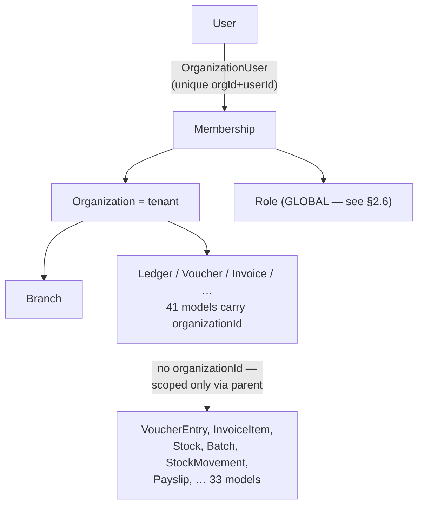

**[VERIFIED-REPO]** The tenant root is `Organization` (cuid PK, `isActive` boolean, no status enum, no plan, no `deletedAt`). Membership is `OrganizationUser` with `@@unique([organizationId, userId])` and a `branchIds String[]` array for branch scoping.

**41 models carry `organizationId`:** `DocumentExtraction, Branch, OrganizationUser, FiscalYear, LedgerGroup, Ledger, Voucher, NumberCounter, CostCenter, Project, Party, ItemCategory, Item, Bom, WorkOrder, Warehouse, SalesOrder, Quotation, PurchaseOrder, Invoice, RecurringInvoice, Bill, Receipt, TcsCollection, Payment, TdsDeduction, BankAccount, TaxConfig, GSTReturn, Employee, Department, Designation, PayrollStructure, LeaveType, Budget, ApprovalWorkflow, Approval, ReportTemplate, Notification, AuditLog, ApiKey`.

**33 models do not.** They divide into three very different categories, and conflating them is a mistake:

| Category | Models | Correct treatment |
|---|---|---|
| **(a) Platform / identity** — belong in the control plane | `User`, `Account`, `Session`, `VerificationToken`, `Organization` | Move to Platform DB (§10) |
| **(b) Genuinely global reference data** — same for every tenant | `Currency`, `ExchangeRate` | Keep global. Read-only to tenants. |
| **(c) Tenant-owned, scoped transitively** — the RLS gap | `VoucherEntry`, `InvoiceItem`, `InvoiceTax`, `BillItem`, `BillTax`, `InvoicePayment`, `Stock`, `Batch`, `StockMovement`, `SalesOrderItem`, `QuotationItem`, `PurchaseOrderItem`, `BomItem`, `ItemUnit`, `BankTransaction`, `BankReconciliation`, `Attendance`, `Leave`, `Payslip`, `ExpenseClaim`, `BudgetLine`, `ApprovalWorkflowStep`, `FiscalPeriod` | **Backfill `organizationId`** (§20.5) |
| **(d) Ambiguous — global but tenant-shaped** | `Role`, `VoucherType`, `UnitOfMeasure` | **Split system vs tenant-owned** (§2.6) |

### 2.4 What is genuinely good and must be preserved

This codebase has already solved several problems that most projects at this stage have not. The target architecture keeps all of them.

1. **A single, central, fail-closed authorisation guard.** `withOrgAuth` **[VERIFIED-REPO]** performs, in one place, for all 110 org-scoped routes: session *or* API-key authentication; membership lookup; `isActive` check; same-origin CSRF check on mutating session requests; and a role-permission check derived from `(pathname, method)` via `resolveScopeTarget`. **A path not registered in `API_RESOURCE_MAP` returns 403, not 200.** Fail-closed by construction is exactly right, and it is rare.

2. **API keys cannot exceed their creator's role.** The key's scopes are intersected with the issuing user's role permissions. This closes the standard privilege-escalation-by-key-minting hole.

3. **Foreign-key tenant validation exists.** `findForeignReferences` **[VERIFIED-REPO]** checks client-supplied `ledgerId`/`partyId`/`branchId`/etc. against the caller's organisation before they reach the database, and deliberately returns the same answer for "belongs to another tenant" and "does not exist" — no existence oracle.

4. **Money is correct.** 169 `Decimal(18,4)` columns, zero `Float`. **[VERIFIED-REPO]** For an accounting product this is table stakes that is frequently got wrong.

5. **Real concurrency handling, with the reasoning recorded.** `posting.ts` **[VERIFIED-REPO]** uses raw `INSERT … ON CONFLICT … DO UPDATE … RETURNING` for ledger creation, with a comment explaining that Prisma's `upsert` under the driver adapter degrades to select-then-insert and loses the race — and an integration test (`tests/integration/ledger-concurrency.test.ts`) that proves it. This is unusually disciplined engineering.

6. **Transaction-timeout tuning with a stated rationale** (20 s timeout / 10 s maxWait, because multi-step GL posting exceeds Prisma's 5 s default against a cold pooler).

7. **A migration guard born from a real incident.** `migrate-on-deploy.mjs` **[VERIFIED-REPO]** restricts `prisma migrate deploy` to `VERCEL_ENV=production` after preview builds migrated the production database. The comment documents the incident. Keep this behaviour through any deployment change.

8. **A health endpoint that detects migration drift**, not just liveness — it compares on-disk migration directories against `_prisma_migrations` and returns 503 on drift. **[VERIFIED-REPO]**

9. **A structured logger with an explicit redaction list** covering passwords, tokens, `authorization`, `cookie`, `DATABASE_URL`, `AUTH_SECRET`, `CRON_SECRET`, `RESEND_API_KEY`. **[VERIFIED-REPO]**

10. **Constant-time cron authentication that fails closed when unset** (503, not "allow"). **[VERIFIED-REPO]**

11. **Centralised, validated environment configuration.** `src/config/env.ts` parses `process.env` through Zod once at import and throws on failure. **[VERIFIED-REPO]**

12. **Integration tests that run against real PostgreSQL in CI**, with a guard that refuses to run unless the target is a local host and a database literally named `accubook_test`. `tests/integration/tenant-scoping.test.ts` and `hr-masters-tenancy.test.ts` already assert cross-tenant denial. **[VERIFIED-REPO]**

### 2.5 Gaps — architecture that does not exist yet

| # | Gap | Evidence | Severity | Section |
|---|---|---|---|---|
| G1 | No RLS. Tenant isolation is application-layer only. | No `ROW LEVEL SECURITY` in any migration | **Critical** | §15 |
| G2 | 22 tenant-owned tables lack `organizationId`, including `VoucherEntry` | §2.3 category (c) | **Critical** | §20.5 |
| G3 | No control plane. Tenant, user, membership and books share one database. | Schema | **High** | §10 |
| G4 | No subscription, plan, feature, entitlement or usage model | `grep '^model (Subscription\|Plan\|Feature\|Entitlement)'` → none | **High (commercial)** | §23–24 |
| G5 | No placement indirection; `DATABASE_URL` is a single global constant | `src/backend/database/client.ts` | **High** | §7 |
| G6 | No job queue. Async work is two Vercel Cron endpoints. | `vercel.json` `crons[2]` | **High** | §25–26 |
| G7 | Reports run synchronously in request handlers | `src/backend/services/reports/registers.ts` | **High** | §29 |
| G8 | Rate limiting applied to only 4 of 122 routes | `grep -rl rate-limit src/app/api` → 4 | **High** | §38 |
| G9 | No tenant status machine — only `Organization.isActive` boolean | Schema | **Medium** | §22 |
| G10 | No soft delete, no retention, no legal hold anywhere | 0 `deletedAt` | **Medium** | §22.4 |
| G11 | `AuditLog` is mutable, `organizationId` nullable, no partitioning | Schema | **Medium** | §36 |
| G12 | **Zero Prisma enums** — every status/type is a free-text `String` | `grep -c '^enum'` → 0 | **Medium** | §15.7 |
| G13 | No `Organization`-scoped index on `GSTReturn`, `ReportTemplate`, `Notification` | schema analysis | **Medium** | §15.7 |
| G14 | `Role`, `VoucherType`, `UnitOfMeasure` are globally unique but tenant-shaped | §2.6 | **High** | §2.6 |
| G15 | No idempotency keys on financial write endpoints | No `Idempotency` model | **High** | §31.5 |
| G16 | No distributed tracing; Sentry present, no OpenTelemetry | `package.json` | **Medium** | §37 |
| G17 | Secrets are environment variables only; no rotation path | `env.ts` | **Medium** | §47 |
| G18 | Restore has never been tested | No runbook artefact | **High** | §41 |
| G19 | No load testing at any scale | No k6/artillery config | **Medium** | §54 |
| G20 | Migrations execute inside the Vercel build | `vercel.json` `buildCommand` | **Medium** | §20 |

### 2.6 The three ambiguous global tables — a live defect, not just a scaling concern

**[VERIFIED-REPO]** This warrants its own section because it is exploitable today.

**`Role`** has no `organizationId`:

```prisma
model Role {
  id          String @id @default(cuid())
  name        String
  permissions Json
  isSystem    Boolean @default(false)
  organizationUsers OrganizationUser[]
}
```

`OrganizationUser.roleId` points at it. So a role row is a **global** object. If tenant A creates a custom role "Branch Accountant", that row is visible to, and assignable by, every other tenant — and if tenant A later edits its permission list, **every tenant that assigned that role has its permissions silently changed**. This is a cross-tenant integrity defect in the authorisation system itself.

**`VoucherType`** has `code String @unique` — *globally* unique. The first tenant to create voucher type code `SALES` permanently prevents every other tenant from doing so. **`UnitOfMeasure`** has `@@unique([name])` with the same consequence for "Box", "Carton", "Nos".

**[JUDGEMENT]** The fix is the standard system-vs-tenant split, and it should be part of the same expand/contract migration wave as G2:

```prisma
model Role {
  organizationId String?  // NULL ⇒ system role, readable by all, writable by none
  // …
  @@unique([organizationId, name])
}
```

with `isSystem = true ⟺ organizationId IS NULL`, and an RLS policy of `organizationId IS NULL OR organizationId = current_org()`. The same shape applies to `VoucherType` and `UnitOfMeasure`. Note that migration `17_hr_masters_per_tenant` **[VERIFIED-REPO]** already applied exactly this treatment to `Department` and `Designation` — so the pattern is established in this repository and merely needs completing.

### 2.7 Dependency map — current

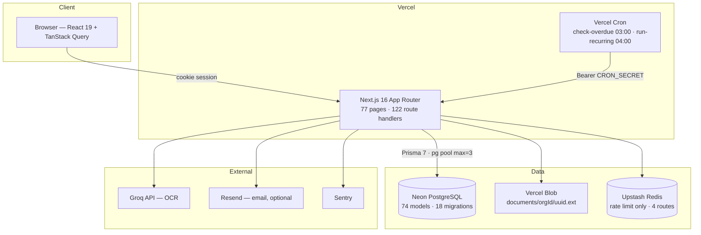

**Single points of failure today:** Neon (all tenants), the Vercel deployment (all tenants), and — because identity, membership and books are one database — a Neon outage takes down authentication *and* data *and* tenant resolution simultaneously. §52.6 addresses this.

### 2.8 Current → Target, at a glance

```
CURRENT STATE                    GAPS                          TARGET STATE
─────────────                    ────                          ────────────
Pooled, shared tables       →    no DB-level isolation    →    Pooled + RLS
organizationId on 41/74     →    22 tenant tables bare    →    organizationId on all tenant tables
withOrgAuth (good)          →    only app layer           →    withOrgAuth + RLS + isolation tests
one DB, one URL             →    no placement concept     →    Platform DB + tenant_placement
Organization.isActive       →    no lifecycle             →    Tenant state machine (11 states)
no billing                  →    cannot charge            →    Plan/Subscription/Entitlement/Usage
2 cron endpoints            →    no queue, no retry       →    Postgres queue + worker + DLQ
sync reports                →    timeouts coming          →    async report jobs → storage → signed URL
Role global                 →    cross-tenant defect      →    system + tenant-owned roles
0 enums, 0 soft-delete      →    weak invariants          →    enums, deletedAt, retention, legal hold
```

***
## 3. Requirements

### 3.1 Functional requirements the architecture must carry

Derived from the shipped code **[VERIFIED-REPO]**, not invented:

| Domain | Evidence in repo | Architectural implication |
|---|---|---|
| Double-entry general ledger | `Voucher`, `VoucherEntry`, `Ledger`, `LedgerGroup`, `posting.ts` | Strict transactionality, immutability after posting (§15.8) |
| Multi-branch, multi-currency | `Branch`, `Currency`, `ExchangeRate`, `exchangeRate` on vouchers | Branch-level authorisation inside tenant scope |
| Sales cycle | `Quotation → SalesOrder → Invoice → Receipt` | Document numbering under concurrency (§15.9) |
| Purchase cycle | `PurchaseOrder → Bill → Payment` | Same |
| Inventory & valuation | `Item`, `Warehouse`, `Stock`, `Batch`, `StockMovement`, `valuation.ts`, `dispatch.ts` | Stock and GL must move in one transaction (§15.8) |
| Manufacturing | `Bom`, `BomItem`, `WorkOrder`, `bom-cost.ts`, `post-wo-journal.ts` | Long-running cost roll-ups → async |
| GST (India) | `gstr1/2b/3b/9`, `cmp08`, `einvoice`, `eway-bill`, `GSTReturn`, `TaxConfig`, composition scheme on `Organization` | Regulatory change without rewrite (§48) |
| TDS / TCS | `TdsDeduction`, `TcsCollection`, `tds.ts`, `form-16a.ts`, `monthly-challan.ts` | FY-scoped threshold aggregates (§29) |
| Payroll | `Employee`, `PayrollStructure`, `Payslip`, `Attendance`, `Leave`, `post-month.ts` | Idempotent monthly posting — tests exist for double-post |
| Banking | `BankAccount`, `BankTransaction`, `BankReconciliation`, `statement-import.ts`, `reconcile.ts` | Bulk import → async (§26.6) |
| Approvals | `ApprovalWorkflow`, `ApprovalWorkflowStep`, `Approval` | `approve` is not expressible as an HTTP method — handled in-handler |
| Documents / OCR | `DocumentExtraction`, `services/ocr/*`, Groq + pdf-text | Long-running, costly, must be async and metered (§25) |
| Migration from Tally | `services/migration/tally.ts` (30 s transaction) | Bulk import architecture (§26.6) |
| Reporting | `services/reports/registers.ts`, `ReportTemplate` | Async generation at scale (§29) |
| API keys | `ApiKey` + `verify-api-key.ts` + `api-scope.ts` | Per-key rate limits and scopes (§31, §38) |
| Audit | `AuditLog` + `audit.ts` | Append-only, partitioned, retained (§36) |

### 3.2 Platform requirements that do not yet exist

R1 Charge money — plans, subscriptions, trials, upgrades, dunning (§23).
R2 Gate features by entitlement, not by `if (plan === "PRO")` (§24).
R3 Provision a tenant end-to-end without an engineer (§21).
R4 Suspend and reactivate a tenant (§22.3).
R5 Delete a tenant and *prove* it (§22.4).
R6 Restore one tenant without touching another (§41.4).
R7 Answer "is tenant X slow?" from a dashboard (§38 obs.).
R8 Stop one tenant consuming the platform (§39).
R9 Export a tenant's complete data on request (§48 DPDP portability).
R10 Support access to a tenant's data that is approved, time-boxed and logged (§35.6).

### 3.3 Explicit non-goals for V1

Multi-region active-active. Real-time collaborative editing. A public developer marketplace. On-premise/self-hosted distribution. Sub-100 ms p99 globally. Offline-first mobile sync. Each is deferrable without architectural regret; §62 records the trigger for reconsidering.

***

## 4. Non-Functional Requirements

**[ASSUMPTION]** Targets below are proposed, not given. They are the numbers I would sign up to for an India-first SMB accounting SaaS. Adjust and the capacity model in §50 moves with them.

### 4.1 Performance

| Metric | V1 target | At 10k tenants | Measured by |
|---|---|---|---|
| API p50 (reads) | ≤ 150 ms | ≤ 150 ms | server-side timing, excl. network |
| API p95 (reads) | ≤ 500 ms | ≤ 400 ms | " |
| API p99 (reads) | ≤ 1,200 ms | ≤ 900 ms | " |
| API p95 (financial write, e.g. post invoice) | ≤ 1,500 ms | ≤ 1,200 ms | " |
| DB query p95 | ≤ 50 ms | ≤ 50 ms | `pg_stat_statements` |
| Page TTFB p75 | ≤ 800 ms | ≤ 600 ms | RUM |
| Interactive report (≤ 1 FY, ≤ 50k entries) | ≤ 3 s sync | ≤ 3 s sync | " |
| Large report (> 1 FY or > 50k entries) | async ≤ 5 min | async ≤ 5 min | job duration |
| Job queue wait p95 | ≤ 30 s | ≤ 30 s | dequeue latency |
| Bulk import 100k rows | ≤ 30 min | ≤ 30 min | job duration |

### 4.2 Availability, durability, correctness

| Property | V1 | Year 3 |
|---|---|---|
| Monthly uptime target (internal) | 99.5% (~3.6 h/mo) | 99.9% (~43 min/mo) |
| Published SLA | none | 99.9% for paid tiers |
| RPO | ≤ 5 min (PITR) | ≤ 1 min |
| RTO — whole platform | ≤ 4 h | ≤ 1 h |
| RTO — single tenant restore | ≤ 8 h | ≤ 2 h |
| Financial data durability | **zero tolerance for silent loss** | same |
| Trial balance must balance | **always, no exception** | same |

**[JUDGEMENT]** Do not publish an SLA in V1. An SLA you cannot measure is a liability. Build the measurement first (§37), publish once you have three consecutive months of data.

### 4.3 Security & compliance NFRs

Tenant isolation must survive a single developer error (§35). All data encrypted in transit (TLS 1.2+) and at rest (§47). No customer financial data in logs (§37.5). Every mutation attributable to a principal (§36). Platform-admin access to tenant books requires approval, expiry and an audit record (§35.6). DPDP-relevant controls as in §48, **subject to legal review**.

### 4.4 Operability NFRs

Two people must be able to run this. Concretely: no runbook step requires SSH to a specific machine; every tenant-affecting action is available through the control plane (§10.6); alerts are actionable (an alert with no runbook link is a bug); a full production deploy is one merge and is revertible in under 10 minutes.

### 4.5 Cost NFRs

**[ASSUMPTION]** Blended infrastructure cost per paying tenant per month should stay under **₹40 (~US$0.45)** at 10,000 tenants, and under **₹25** at 100,000. Free-tier tenants must be near-zero marginal cost — which is by itself a decisive argument for pooled tenancy (§1.2).

***

## 5. Scale Model

Rule 5 of the brief is right and is the most commonly botched part of SaaS capacity planning: **tenant count is not traffic.** They are separate dimensions and they scale differently.

### 5.1 The dimensions, separated

| Dimension | Grows with | Pressures |
|---|---|---|
| Tenant count | sales | rows in `organizations`, migration fan-out, monitoring targets, backups |
| Registered users | tenants × seats | identity table, session volume |
| Daily active users (DAU) | engagement | request volume |
| Concurrent requests | DAU × session shape | compute instances, DB connections |
| Requests per second | concurrency ÷ latency | compute, pooler |
| Write rate | business activity | WAL, locks, index maintenance |
| Data volume | activity × time (**never shrinks**) | storage, index size, vacuum, backup, restore time |
| Job volume | features × tenants | worker count, queue depth |

**[JUDGEMENT]** For accounting SaaS the dimension that hurts most is **data volume**, not RPS. Accounting is a low-RPS, high-durability, high-retention workload: nobody hits an ERP a thousand times a second, but every row written must survive seven years and be reportable. Architect for retention and reporting, not for peak throughput.

### 5.2 Assumptions used throughout this document

**[ASSUMPTION]** — all figures below are inputs, stated so they can be challenged. They are consistent with SMB accounting usage patterns (business hours, weekday-heavy, month-end and quarter-end spikes).

```
A1  Registered tenants                     : N
A2  Paying tenants                         : 30% of N  (70% free/trial/dormant)
A3  Monthly active tenants                 : 40% of N
A4  Daily active tenants                   : 12% of N
A5  Users per active tenant                : 3   (range 1–25)
A6  Daily active users                     : A4 × A5
A7  Peak-hour share of daily traffic       : 18%   (11:00–13:00 and 16:00–18:00 IST)
A8  Requests per active user per day       : 220
A9  Mean server think-time per request      : 180 ms
A10 Read : write ratio                     : 85 : 15
A11 Invoices per active tenant per month   : 60    (range 5–5,000)
A12 Ledger entries per invoice             : 4–8   (avg 6, incl. GST splits)
A13 Rows per tenant-year (all tables)      : ~25,000  (range 2k–2M)
A14 Month-end multiplier                   : 3.5× a normal day
A15 Year-end (Mar–Apr) multiplier          : 6× a normal day
A16 GST filing-day multiplier (11th, 20th) : 4×
```

**A14–A16 matter more than the averages.** Indian accounting traffic is not smooth: it is dominated by GSTR-1 (11th), GSTR-3B (20th), and the March–April financial-year boundary. Capacity must be planned against the **peak**, and the peak is roughly **6× the mean**. Anything that only works at mean load will fail on 20 April.

### 5.3 Derived load at each stage

Computed from A1–A16. Ranges, not point estimates.

| | **100 tenants** | **1,000** | **10,000** | **100,000** |
|---|---|---|---|---|
| Daily active tenants | 12 | 120 | 1,200 | 12,000 |
| Daily active users | ~36 | ~360 | ~3,600 | ~36,000 |
| Requests/day | ~8k | ~79k | ~790k | ~7.9M |
| Mean RPS | <1 | ~1 | ~9 | ~92 |
| **Peak-hour RPS** | ~2 | ~20 | ~200 | ~2,000 |
| **Peak-day RPS (A15, 6×)** | ~12 | ~120 | ~1,200 | **~12,000** |
| Concurrent in-flight requests (peak-day) | ~2 | ~22 | ~215 | ~2,150 |
| Writes/sec (peak-day) | ~2 | ~18 | ~180 | ~1,800 |
| Rows added/year | ~2.5M | ~25M | ~250M | ~2.5B |
| Cumulative rows @ yr 5 | ~12M | ~125M | ~1.2B | ~12B |
| Tenant data (est.) | 3–8 GB | 30–80 GB | 0.3–0.8 TB | **3–8 TB** |
| Documents/files | 20–60 GB | 0.2–0.6 TB | 2–6 TB | 20–60 TB |

**Read these numbers correctly.** 100,000 tenants is **~2,000 RPS at normal peak and ~12,000 RPS on the worst day of the year** — not 100,000 concurrent anything. 2,000 RPS is a workload a single well-tuned PostgreSQL primary with read replicas can serve. 12,000 RPS for a few hours on 20 April is a *burst* problem — solved by autoscaling compute and shedding non-essential load — not a sharding problem.

The number that genuinely forces architecture change is the last two rows: **3–8 TB of relational data and 12 billion rows.** That is what drives partitioning (§18), archival (§18.6) and eventually sharding (§19).

### 5.4 Where each dimension breaks the V1 design

| Dimension | V1 handles to | First failure | Fix | Section |
|---|---|---|---|---|
| Tenants | ~50,000 | control-plane queries, monitoring cardinality | index + aggregate control plane | §10 |
| RPS | ~500 sustained | DB connections, then CPU | pooler + replicas + autoscale | §17–18 |
| Write rate | ~300/s | WAL, index maintenance, lock contention | partition hot tables, batch writes | §18 |
| Data volume | ~500 GB | vacuum, index bloat, backup window, restore time | **partition + archive** | §18.5–18.6 |
| Single tenant size | ~50 GB | noisy neighbour | **promote to BRIDGE/SILO** | §9.4, §39 |
| Jobs | ~50/s | worker saturation | scale workers, priority queues | §25 |
| Files | ~10 TB | none (object storage scales) | lifecycle tiering for cost | §28 |

**[JUDGEMENT]** Note the row that matters: **single-tenant size is the first thing that forces a topology change, and it happens long before aggregate scale does.** One 50 GB tenant among 5,000 small ones will hurt everyone. That is the concrete, non-theoretical justification for placement (§9.4).

***

## 6. Multi-Tenancy Fundamentals

The brief asks to be taught this deeply, and to keep the concepts strictly separate (Rule 4). Precision here prevents a category of expensive mistakes.

### 6.1 What a tenant is

**A tenant is a unit of ownership, isolation, billing and lifecycle.** It is a *business* concept, defined by three properties:

1. **Ownership** — all data belonging to a tenant belongs to one commercial customer.
2. **Isolation** — no tenant may observe or affect another tenant's data.
3. **Lifecycle** — a tenant is created, may be suspended, and may be deleted, as one unit.

In AccuBook the tenant is the **`Organization`** — the legal entity that keeps the books, has a GSTIN and PAN, and files returns.

**A tenant is not a user.** Users are global identities that may hold memberships in several tenants (an accountant serving 40 clients is the normal case in India, and `OrganizationUser` already models it correctly **[VERIFIED-REPO]**).

**A tenant is not a company hierarchy.** AccuBook has `Branch` *within* `Organization`. Branch is a sub-tenant scope, not a tenant: branches share a chart of accounts, a GSTIN context and a subscription.

### 6.2 The separation Rule 4 demands

This is the distinction that most often collapses in discussion, so it is drawn explicitly:

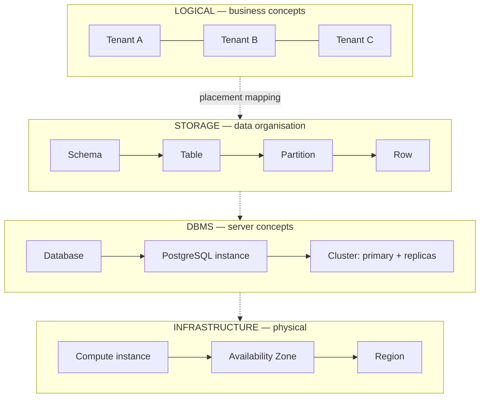

| Term | Definition | AccuBook V1 |
|---|---|---|
| **Tenant** | Business unit of ownership/isolation/billing | `Organization` row |
| **Table** | Relation holding rows | `invoices`, `vouchers`, … |
| **Partition** | Physical sub-table of one logical table | by month on `audit_logs` etc. (§18.5) |
| **Schema** | Postgres namespace of tables | `public` |
| **Database** | Named catalogue inside an instance | `accubook` + `accubook_platform` |
| **PostgreSQL instance** | One running server process | 1 Neon compute |
| **Cluster** | Primary + replicas + failover | 1 primary (+ replicas from stage 3) |
| **Compute instance** | Machine running app code | N Vercel lambdas + 1–2 workers |
| **Availability Zone** | Isolated DC within a region | provider-managed |
| **Region** | Geographic location | 1 (see §45.5 for India residency) |

**Therefore: 1 tenant ≠ 1 database ≠ 1 cluster ≠ 1 server.** In V1, 100,000 tenants live in **one database, on one instance, in one region**, and that is a deliberate, defensible choice — not a compromise.

### 6.3 Isolation, and its four independent layers

"Tenant isolation" is not one thing. It is four, and each can fail independently:

| Layer | Question | Mechanism in target design |
|---|---|---|
| **Data** | Can tenant A's rows be read/written by B? | RLS + `organizationId` + scoped queries |
| **Performance** | Can A's load degrade B? | rate limits, quotas, queue fairness, placement (§38–39) |
| **Security** | Can a compromise of A reach B? | least-privilege DB roles, signed URLs, no shared secrets |
| **Failure** | Does A's failure take B down? | placement blast radius, graceful degradation (§52) |

**[JUDGEMENT]** Pooled tenancy gives excellent *data* isolation (RLS is enforced by the database) but weak *performance* and *failure* isolation. That asymmetry is the entire reason the hybrid model exists.

### 6.4 Tenant context

**Tenant context is the server-side, authenticated fact of which tenant the current unit of work is acting for.** Three properties define it:

1. **Derived, never accepted.** It comes from the session's membership, never from a parameter (§12.2).
2. **Ambient within a unit of work.** Every layer sees it without threading it through every signature.
3. **Mandatory.** Work without tenant context must fail, not default.

Property 3 is the one people get wrong. A background job with no tenant context must *throw*, not "process all tenants".

### 6.5 Control plane vs data plane

Borrowed from network/cloud architecture and exactly right for SaaS:

| | Control plane | Data plane |
|---|---|---|
| Owns | tenants, identities, memberships, plans, entitlements, usage, placement, tenant status | invoices, ledgers, stock, payroll, GST |
| Size | small (~10s of MB even at 100k tenants) | large (TB) |
| Change rate | low | high |
| Read pattern | every request (∴ cacheable) | request-specific |
| Blast radius if down | **potentially everything** | one placement |
| Who accesses | app, platform admins, billing | app on behalf of one tenant |

**[JUDGEMENT]** They must be separate databases. Not for scale — the control plane is tiny — but because they have different security boundaries, different availability requirements, and different people needing access. Mixing them means the billing team's read access is also read access to customer books.

The control plane's availability requirement is *higher* than the data plane's, because it is on the critical path of every request. §52.6 addresses the resulting single-point-of-failure risk with caching.

### 6.6 Pooled, bridge, silo

The three canonical deployment models. (Terminology follows the AWS SaaS Lens / SaaS Factory vocabulary, which is the most widely used. **[PATTERN]**)

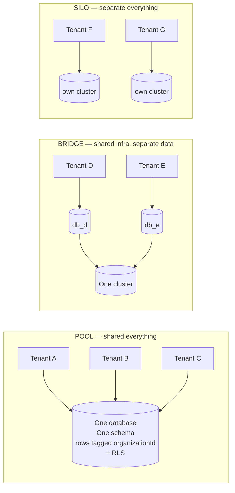

| | POOL | BRIDGE | SILO |
|---|---|---|---|
| Cost per tenant | **lowest** | medium | highest |
| Data isolation | logical (RLS) | strong (separate DB) | **strongest** |
| Performance isolation | weak | medium | **strong** |
| Blast radius | all tenants | one cluster | **one tenant** |
| Per-tenant restore | hard (§41.4) | easy | **trivial** |
| Migration cost | **O(1)** | O(#databases) | O(#tenants) |
| Onboarding time | **instant** | seconds–minutes | minutes–hours |
| Cross-tenant analytics | **trivial** | hard | very hard |
| Ops complexity | **lowest** | medium | highest |
| Fits | free & SMB tiers | mid-market | enterprise, regulated |

**[JUDGEMENT]** The honest summary: POOL optimises for the provider's economics and operational sanity; SILO optimises for the customer's peace of mind. A mature SaaS sells both and charges accordingly. AccuBook should **build POOL, design for BRIDGE/SILO, and sell SILO only when someone pays for it.**

### 6.7 Tenant-aware authorization — five distinct questions

Frequently collapsed into "auth". They are five separate checks in a fixed order, and skipping any one is a vulnerability:

| # | Question | Failure mode if skipped | Where enforced |
|---|---|---|---|
| 1 | **Authentication** — who are you? | anonymous access | NextAuth |
| 2 | **Membership** — may you act in this tenant at all? | **cross-tenant breach** | `withOrgAuth` ✅ exists |
| 3 | **Entitlement** — does this tenant's plan include this? | revenue leak | *missing* → §24 |
| 4 | **Role** — may your role do this operation? | privilege escalation | `checkRolePermission` ✅ exists |
| 5 | **Resource** — is *this specific row* in your tenant/branch? | IDOR | RLS + `findForeignReferences` (partial) |

**[VERIFIED-REPO]** AccuBook does 1, 2 and 4 well; 3 does not exist; 5 exists only for the six kinds validated by `findForeignReferences`. RLS completes 5 universally.

***
## 7. Architecture Alternatives

Each of the seven models from the brief, assessed specifically against AccuBook — an India-first SMB accounting SaaS with ₹300–₹3,000/month price points, a 2–5 person engineering team, and a hard requirement for financial correctness.

### 7.A Shared database + shared tables (discriminator column)

```
accubook (one database, one schema)
 ├── invoices        (organizationId, …)
 ├── vouchers        (organizationId, …)
 ├── voucher_entries (…)      ← today: no organizationId
 └── ledgers         (organizationId, …)
```

This is **what AccuBook has today** **[VERIFIED-REPO]**.

| | |
|---|---|
| **Isolation** | Application-layer only. One missing `where` clause = breach. |
| **Cost** | Lowest possible. Marginal cost of a dormant tenant ≈ one row. |
| **Migrations** | One `ALTER TABLE`, all tenants. O(1). |
| **Onboarding** | Instant — an `INSERT`. |
| **Cross-tenant queries** | Trivial (platform analytics, admin search). |
| **Per-tenant restore** | Painful — requires row-level extraction from a snapshot (§41.4). |
| **Noisy neighbour** | Fully exposed. |
| **Connections** | One pool for everyone. Best possible. |

**Verdict: necessary but not sufficient.** The economics and operations are right; the isolation is not. Adopt as the base and fix isolation with (B).

### 7.B Shared database + shared tables + PostgreSQL RLS ★ **recommended base**

Identical storage layout to (A), plus the database refusing to return rows outside the session's tenant.

**How RLS actually works.** A policy is a boolean expression attached to a table. When RLS is enabled and the querying role is not `BYPASSRLS`/superuser and is not the table owner (unless `FORCE ROW LEVEL SECURITY` is set), PostgreSQL rewrites every query on that table to include the policy predicate — `SELECT`, `INSERT … RETURNING`, `UPDATE`, `DELETE`, joins, sub-selects, CTEs, views and raw SQL alike. **[VENDOR-CHECK: postgresql.org — "Row Security Policies"]**

```sql
ALTER TABLE invoices ENABLE ROW LEVEL SECURITY;
ALTER TABLE invoices FORCE ROW LEVEL SECURITY;   -- applies to the table owner too

CREATE POLICY tenant_isolation ON invoices
  USING      ("organizationId" = current_setting('app.current_org', true))
  WITH CHECK ("organizationId" = current_setting('app.current_org', true));
```

`USING` filters what is visible to reads/updates/deletes; `WITH CHECK` validates what may be written — **you need both**. Without `WITH CHECK`, a tenant can insert rows stamped with another tenant's id.

**Why RLS is categorically different from a Prisma `where` filter:**

| | Prisma filter | RLS |
|---|---|---|
| Enforced by | the developer, every time | the database, always |
| Covers raw SQL (`$queryRaw`) | ❌ no | ✅ yes |
| Covers a forgotten clause | ❌ no | ✅ yes |
| Covers a join to an unfiltered table | ❌ no | ✅ yes |
| Covers background jobs | only if remembered | ✅ yes |
| Covers a future developer | ❌ | ✅ |
| Reviewable | in every diff, forever | once, in the migration |

This matters concretely here: **[VERIFIED-REPO]** `src/backend/utils/posting.ts` already uses `$queryRaw` for the ledger upsert. Raw SQL is exactly where an ORM filter provides no protection and RLS does.

**Session context under connection pooling — the one genuinely hard part.** RLS needs `app.current_org` set for the connection executing the query. With PgBouncer/Neon in *transaction* pooling mode, a connection is returned to the pool at `COMMIT`, so a session-level `SET` leaks to the next tenant's query — a catastrophic bug. The correct construction is **transaction-local** context:

```sql
BEGIN;
SELECT set_config('app.current_org', $1, true);   -- true = transaction-local
-- … queries …
COMMIT;
```

The `true` argument is the whole safety property. §16.3 shows the Prisma client extension that does this on every operation, and §17 quantifies the cost.

**Limitations to be honest about:**

- **Performance.** The policy predicate is appended to every query. With `organizationId` as the leading index column the planner uses the index and overhead is small; measured community reports put it in the low single-digit percent for indexed predicates **[VENDOR-CHECK]**. With a *join-based* policy (needed for tables lacking `organizationId`) it can be far worse — which is precisely why G2 must be fixed first.
- **Every non-transactional query becomes a transaction.** Cost quantified in §17.4.
- **Migrations and admin need a bypass role.** `BYPASSRLS` must exist and must never be the application's role (§35.5).
- **Testing must include a "policy is actually on" test** — enabling RLS but forgetting `FORCE` on an owner-connected table silently does nothing. §53.2 covers this.
- **Connection-pool discipline.** Any code path that acquires a raw `pg` client outside the extension bypasses the context. Lint/CI rule required.

**Verdict: this is the recommendation.** ADR-003.

### 7.C Shared database + separate schemas per tenant

```
accubook
 ├── tenant_a.invoices
 ├── tenant_b.invoices
 └── tenant_c.invoices
```

Superficially attractive — real namespace separation, no discriminator column, `search_path` switching.

**Why it fails at AccuBook's target scale:**
- 74 tables × 100,000 schemas ≈ **7.4 million tables**. PostgreSQL's catalogue (`pg_class`, `pg_attribute`) is itself a set of tables; at this cardinality, planning time, `pg_dump`, autovacuum scheduling and connection startup all degrade badly. Practical community experience puts the comfortable ceiling in the **low thousands** of schemas. **[VENDOR-CHECK / PATTERN]**
- Migrations become O(#schemas) — the database-per-tenant migration problem without the isolation benefit.
- Prisma has no first-class multi-schema-per-tenant story; you would drive `search_path` manually and lose type safety.
- Cross-tenant reporting requires dynamic SQL over thousands of schemas.

**Verdict: no.** It looks like a middle ground and is actually the worst of both — schema-count pain without the blast-radius benefit. It is defensible only up to a few hundred tenants, which AccuBook intends to pass.

### 7.D Shared PostgreSQL cluster + separate database per tenant (**BRIDGE**)

```
cluster
 ├── db_tenant_a
 ├── db_tenant_b
 └── db_tenant_c
```

| | |
|---|---|
| **Isolation** | Strong — a cross-database query is impossible without explicit FDW. |
| **Restore** | Easy — restore one database. |
| **Migrations** | O(#databases) — needs an orchestrator. |
| **Connections** | **The killer.** Pools are per-database. 1,000 databases × even 2 connections = 2,000 connections. Postgres `max_connections` is typically 100–500. |
| **Cost** | Storage per database has fixed overhead (catalogue, WAL); thousands of near-empty databases are wasteful. |

**Verdict: not for V1; yes as a placement tier.** For a *small number* of large or contractually demanding tenants — say 10–200 — BRIDGE is excellent. §9.4 makes it reachable without a rewrite.

### 7.E Dedicated cluster per tenant (**SILO**)

Maximum isolation: own compute, own storage, own backup schedule, own maintenance window, own region if required.

**Verdict: enterprise tier only.** Justifiable only when a customer pays a premium that exceeds the fully-loaded cost of a managed Postgres instance plus its share of operational attention — realistically **₹40,000+/month**. Offer it; do not build it until someone signs.

### 7.F Sharded multi-tenancy

Many pooled databases, tenants distributed by a shard key, with a routing layer.

```
tenant_id → shard_map → shard_07 → postgres_cluster_3
```

This is (B) replicated N times, and it is the **natural growth path** of the recommendation rather than an alternative to it: a shard is just a placement whose strategy is POOL. Sharding solves aggregate data volume and write throughput; it costs you cross-shard queries, cross-shard transactions, rebalancing, and a much harder platform-analytics story.

**Verdict: not V1. Designed for.** §19 defines the trigger conditions and the routing layer. Because placement (§9.4) exists from day one, adding shard 2 is a configuration change plus a data move, not a re-architecture.

### 7.G Hybrid — POOL + BRIDGE + SILO ★ **the target**

```
             ┌──────────────────────────────────────┐
Free / SMB   │ POOL-01  … POOL-0n   (shared + RLS)  │  99% of tenants
Mid-market   │ BRIDGE-01 … db_x     (own database)  │  ~1%
Enterprise   │ SILO-01 … own cluster                │  <0.1%
             └──────────────────────────────────────┘
                    ▲ tenant_placement decides
```

**Verdict: this is the five-year target, and V1 is the degenerate case of it where every tenant maps to `POOL-01`.** That framing is the whole point: build one branch of the hybrid, but build the *branching mechanism*.

### 7.H Summary matrix

| Criterion | A pooled | **B pooled+RLS** | C schemas | D bridge | E silo | F sharded | **G hybrid** |
|---|---|---|---|---|---|---|---|
| Data isolation | ✗ weak | ✓✓ strong | ✓ strong | ✓✓ | ✓✓✓ | ✓✓ | ✓✓✓ |
| Perf isolation | ✗ | ✗ | ✗ | ✓ | ✓✓✓ | ✓ | ✓✓✓ |
| Cost @100k | ✓✓✓ | ✓✓✓ | ✗ | ✗ | ✗✗✗ | ✓✓ | ✓✓✓ |
| Migration cost | ✓✓✓ | ✓✓✓ | ✗✗ | ✗✗ | ✗✗✗ | ✓✓ | ✓✓ |
| Ops @100k | ✓✓✓ | ✓✓✓ | ✗✗ | ✗✗ | ✗✗✗ | ✓ | ✓✓ |
| Per-tenant restore | ✗✗ | ✗✗ | ✓ | ✓✓✓ | ✓✓✓ | ✗✗ | ✓✓ |
| Fits current code | ✓✓✓ | ✓✓✓ | ✗✗ | ✗ | ✗ | ✓ | ✓✓✓ |
| Team of 2–5 can run | ✓✓✓ | ✓✓✓ | ✗ | ✗ | ✗✗ | ✓ | ✓✓ |
| Enterprise-sellable | ✗ | ✓ | ✓ | ✓✓ | ✓✓✓ | ✓ | ✓✓✓ |

***

## 8. Industry Research

**Rule 7 and the brief's own caution apply here in full.** Almost every company below treats its architecture as confidential. What follows separates *what is publicly documented* from *what is inference*, and says plainly where nothing reliable is public.

### 8.1 What vendor architecture guidance actually says

| Source | What it publicly recommends | Confidence |
|---|---|---|
| **AWS SaaS Lens / SaaS Factory** | Defines the **pool / bridge / silo** vocabulary used throughout this document. Recommends pooled for cost efficiency at scale, silo for premium/regulated tiers, and explicitly recommends a **hybrid tiering strategy**. Recommends a separate control plane, and RLS as a pooled-isolation mechanism. | **[VENDOR-CHECK — published guidance, high confidence]** |
| **Microsoft Azure Architecture Center — "Multitenant SaaS patterns"** | Documents sharded-multi-tenant, database-per-tenant and hybrid; provides a "tenant catalog" (= control plane) pattern and shard-map management. Explicitly discusses moving a tenant between shards. | **[VENDOR-CHECK — published, high confidence]** |
| **Google Cloud SaaS architecture guidance** | Similar taxonomy; emphasises tenant isolation, per-tenant observability and cost attribution. | **[VENDOR-CHECK]** |
| **PostgreSQL project** | Documents RLS as the supported mechanism for row-level multi-tenancy. Does not take a position on SaaS topology. | **[VENDOR-CHECK — authoritative]** |
| **Citus / Azure Cosmos DB for PostgreSQL** | Publishes an explicit "multi-tenant SaaS" model: distribute every tenant table by `tenant_id`, colocate, so cross-tenant joins are avoided. This is essentially §19's design, productised. | **[VENDOR-CHECK]** |

**[JUDGEMENT]** The strongest publicly-defensible statement is this: **every major cloud vendor's published SaaS guidance converges on tiered/hybrid tenancy with a separate control plane.** That convergence, not any single company's rumoured internals, is the real evidence.

### 8.2 Named SaaS platforms — what is and is not public

| Company | Publicly documented | Not public |
|---|---|---|
| **Salesforce** | Has published (papers, patents, developer docs) that the Force.com platform historically used a **metadata-driven, heavily shared** storage model with a universal data table and pivot-style indexing, and that tenants are grouped into "pods"/instances. Governor limits are documented and are a form of noisy-neighbour control. | Current internal storage details. Treat published material as historical. |
| **Shopify** | Has publicly blogged about **"pods"** — isolated groups of shops with their own datastores — and about horizontal sharding of MySQL. This is a real, documented shard/placement architecture. | Exact mapping logic and rebalancing internals. |
| **Atlassian** | Has publicly described the move to AWS and a **"Micros"** platform and shard/tenant-context service ("TCS") for Jira/Confluence Cloud, with tenants assigned to shards. | Implementation detail. |
| **Slack** | Has publicly described sharding by team/workspace in MySQL and a **"flannel"** edge cache. Workspace ≈ tenant. | Current details. |
| **HubSpot** | Has publicly blogged about HBase/MySQL usage and multi-tenant infrastructure. | Isolation model specifics. |
| **Zoho (incl. Zoho Books)** | Publishes data-centre and data-residency information (multiple regions incl. India) and general security whitepapers. **The exact internal multi-tenancy implementation is proprietary and not publicly documented.** | Everything architectural. |
| **QuickBooks (Intuit)** | Publishes developer/API docs and some engineering blogs about a services migration to AWS. **The tenancy/storage model is not publicly documented.** | Everything architectural. |
| **Xero** | Some public engineering talks about AWS migration and scale. **Tenancy model not publicly documented.** | Everything architectural. |
| **FreshBooks** | Publicly discussed a rewrite ("BillSpring") and platform modernisation. **Tenancy model not publicly documented.** | Everything architectural. |
| **Tally (TallyPrime)** | **Primarily desktop/on-premise** with its own proprietary object store, not a multi-tenant SaaS in the sense used here. TallyPrime's cloud offerings are largely hosted-desktop. Its relevance to AccuBook is as a **migration source and a UX benchmark**, not an architecture reference. | — |

**[JUDGEMENT]** The honest conclusion from §8.1–8.2:

1. **No public evidence supports database-per-tenant at 100k-tenant scale for SMB-priced products.** Every documented large-scale example (Shopify, Slack, Atlassian, Salesforce) is *sharded pooling* — many tenants per database, many databases.
2. **Every one of them built a tenant catalogue / shard map** (Azure's "tenant catalog", Atlassian's TCS, Shopify's pod mapping). That is §9.4's `tenant_placement`, and its universality is the strongest single argument for building it in V1.
3. **Tiering is real.** Salesforce's governor limits and Shopify's pod isolation are noisy-neighbour controls, which is what §39 designs.

### 8.3 The India-specific reference point

**[JUDGEMENT]** AccuBook's competitors — Zoho Books, Vyapar, myBillBook, Marg, Busy, TallyPrime — compete at ₹200–₹3,000/month. This price band is the architectural constraint that outranks every technical preference in this document. It permits roughly **₹20–₹60/tenant/month of infrastructure at healthy gross margin**, which:

- **rules out** silo-by-default and, at scale, bridge-by-default;
- **requires** near-zero marginal cost for free and dormant tenants (India SMB SaaS carries a large dormant tail);
- **makes GST filing-day burst capacity a first-class requirement**, since the whole market files on the same two days.

***

## 9. Recommended Tenancy Architecture

### 9.1 The recommendation

> **AccuBook V1: a single pooled PostgreSQL database holding all tenant data in shared tables keyed by `organizationId`, with Row-Level Security enforced against a non-superuser application role and tenant context set transaction-locally; a separate small Platform database owning tenants, identities, memberships, plans, entitlements, usage and placement; and a `tenant_placement` indirection that every data access passes through, which in V1 always resolves to `POOL-01`.**

Not "database-per-tenant". Not "RLS or `organizationId`" — **both**, because they defend against different adversaries: the `where` clause defends against the attacker who crafts a request, and RLS defends against the developer who forgets. Not "hybrid now" — **hybrid-capable now, hybrid-populated later**.

### 9.2 Why this wins for AccuBook specifically

1. **It is the smallest change from the code that exists.** 41 models already carry `organizationId`; all 110 org routes already resolve a membership-checked `orgId`. **[VERIFIED-REPO]** The target is reachable by addition, not replacement — which is what "must not force a rewrite" actually means in practice.
2. **It survives a developer mistake.** The stated design goal of Rule "think like a security architect".
3. **It keeps migrations O(1).** The single largest operational cost avoided.
4. **It matches the price point** (§8.3).
5. **It preserves cross-tenant analytics and support search**, which pooled gives free and silo makes expensive.
6. **It has a documented growth path at every scale boundary** — replicas → partitions → archive → shards → placement tiers — with no step requiring a domain-model change.

### 9.3 What we consciously give up, and the compensating control

Rule "do not hide trade-offs":

| Given up | Consequence | Compensating control |
|---|---|---|
| Performance isolation | one tenant's import slows others | quotas, per-tenant rate limits, queue fairness, concurrency caps (§39) |
| Trivial per-tenant restore | restoring tenant A needs extraction, not a `pg_restore` | scripted logical extraction from a PITR branch (§41.4), rehearsed quarterly |
| Blast-radius isolation | one database down = all pooled tenants down | HA + PITR + placement promotion for critical tenants (§42) |
| "Your data is on its own server" sales line | loses some enterprise deals | SILO tier exists and is priced (§9.4) |
| RLS overhead | every query in a transaction | measured, budgeted (§17.4); bypass role for reporting replicas |

### 9.4 Placement — the indirection that makes the rest possible

**This is the highest-leverage recommendation in the document after RLS itself.** It costs roughly two days in V1 and it is the difference between "we can move that customer to their own database next sprint" and "we need a quarter to re-architect".

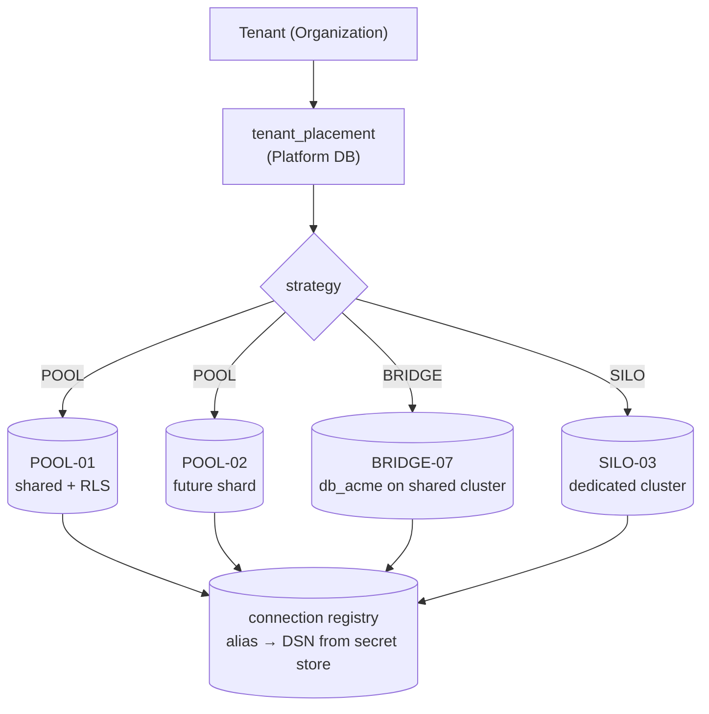

```sql
-- Platform DB
CREATE TABLE tenant_placement (
  tenant_id        text PRIMARY KEY,
  strategy         text NOT NULL CHECK (strategy IN ('POOL','BRIDGE','SILO')),
  placement_id     text NOT NULL,          -- 'POOL-01', 'BRIDGE-07', 'SILO-03'
  schema_version   text NOT NULL,          -- migration this tenant's store is at
  region           text NOT NULL DEFAULT 'ap-south-1',
  status           text NOT NULL,          -- ACTIVE | MIGRATING | READ_ONLY | SUSPENDED
  moved_at         timestamptz,
  created_at       timestamptz NOT NULL DEFAULT now()
);

CREATE TABLE placement (
  placement_id     text PRIMARY KEY,
  strategy         text NOT NULL,
  dsn_secret_ref   text NOT NULL,          -- pointer into the secret store, NEVER the DSN
  replica_secret_ref text,
  max_tenants      int,
  status           text NOT NULL,          -- ACTIVE | DRAINING | RETIRED
  region           text NOT NULL
);
```

Three properties make this worth the effort:

1. **Business logic never learns about it.** Handlers ask for "the database for the current tenant" and receive a client. Whether that client points at a shared pool or a dedicated cluster is invisible above the data-access layer.
2. **Moving a tenant is an operation, not a project** (§19.4).
3. **`dsn_secret_ref` is a reference, never a DSN.** Placement rows are read constantly and appear in logs and admin screens; connection strings must not.

**Critically: in V1 every row says `('POOL','POOL-01')`.** No second database is provisioned. There is no orchestration, no shard map service, no rebalancer. The only thing built is *the question being asked*.

### 9.5 Placement policy — when a tenant is promoted

**[ASSUMPTION]** initial thresholds; tune from real data:

| Signal | Threshold | Action |
|---|---|---|
| Tenant data size | > 20 GB | review for BRIDGE |
| Tenant share of pool CPU (7-day) | > 5% | review for BRIDGE |
| Tenant share of pool write IOPS | > 5% | review for BRIDGE |
| Contractual isolation requirement | any | SILO (priced) |
| Data-residency requirement outside default region | any | SILO in region |
| Enterprise plan | any | eligible for BRIDGE by default |
| Repeated quota breaches (§39) | 3 in 30 days | throttle, then review |

**[JUDGEMENT]** Promotion should be a **human decision assisted by automation**, not an autoscaler. Moving a tenant's database is a high-consequence operation; a threshold crossing should open a ticket, not start a migration.

***
## 10. Control Plane

### 10.1 What the control plane is, and why it is separate

The control plane is the system that knows **which tenants exist, who may act in them, what they have paid for, where their data lives, and what state they are in.** It does not know what is in their books.

**[JUDGEMENT]** It must be a separate PostgreSQL database — `accubook_platform` — for four reasons, none of which is scale:

1. **Different security boundary.** Billing, support and platform-admin tooling need control-plane access. None of them should thereby gain access to customer ledgers.
2. **Different availability class.** It is on the critical path of *every* request, so it needs more caching and a defined degraded mode (§52.6).
3. **Different lifecycle.** Tenant data can be moved, archived, sharded or siloed. Control-plane data must stay in exactly one place, or "where does tenant X live?" becomes unanswerable.
4. **It is the thing that survives.** If a pooled database is lost, the control plane tells you which tenants were affected and where their backups are. Storing that inside the thing that failed is a classic operational mistake.

**[JUDGEMENT]** It should be a separate *database*, and in V1 may live on the *same* PostgreSQL cluster as `POOL-01` — separate database, separate role, separate credentials. That preserves every security and lifecycle benefit while adding zero infrastructure. Move it to its own instance at Stage 3 (§57).

### 10.2 Entity catalogue

For each: purpose, key fields, and — the question the brief asks — **which plane owns it**.

#### Identity & tenancy

| Entity | Purpose | Key fields | Plane | Notes |
|---|---|---|---|---|
| **Tenant** | The tenant record itself | `id`, `slug`, `legal_name`, `country`, `status`, `created_at`, `deleted_at`, `retention_until`, `legal_hold` | **Platform** | Replaces/renames today's `Organization` root. Business attributes (GSTIN, fiscal year start, composition scheme) stay in the tenant DB — see §10.3. |
| **UserIdentity** | A person, globally | `id`, `email` (unique), `password_hash`, `mfa_*`, `email_verified`, `is_active`, `tokens_revoked_at`, `failed_login_attempts`, `locked_until` | **Platform** | Today's `User`. **[VERIFIED-REPO]** already has `tokensRevokedAt`, MFA fields and lockout fields — good. |
| **Membership** | Identity × Tenant, with a role | `id`, `tenant_id`, `user_id`, `role_id`, `branch_ids[]`, `is_active`, `invited_by`, `accepted_at` | **Platform** | Today's `OrganizationUser`. Must be in the control plane: it is read *before* a tenant DB is chosen. |
| **Role** | A named permission set | `id`, `tenant_id NULL`, `name`, `permissions jsonb`, `is_system` | **Platform** | `tenant_id IS NULL` ⇒ system role (§2.6). |
| **Session/Account/VerificationToken** | NextAuth adapter tables | per adapter | **Platform** | Follows `UserIdentity`. |

#### Commercial

| Entity | Purpose | Key fields | Plane |
|---|---|---|---|
| **Plan** | A sellable package | `code`, `name`, `currency`, `price_month`, `price_year`, `trial_days`, `is_public`, `version` | Platform |
| **Feature** | An atomic capability | `code` (`INVOICING`,`GST`,`PAYROLL`,`MANUFACTURING`,`ADVANCED_REPORTS`,`API_ACCESS`,`EINVOICE`), `name` | Platform |
| **PlanFeature** | Which features a plan grants | `plan_id`, `feature_code`, `enabled` | Platform |
| **PlanLimit** | Numeric caps per plan | `plan_id`, `limit_code` (`MAX_USERS`,`MAX_INVOICES_MONTH`,`MAX_STORAGE_MB`,…), `value` (`NULL` = unlimited) | Platform |
| **Subscription** | A tenant's commercial state | `tenant_id`, `plan_id`, `status`, `period_start`, `period_end`, `trial_ends_at`, `cancel_at_period_end`, `grace_until`, `provider_ref` | Platform |
| **Entitlement** | **Resolved, effective** grants | `tenant_id`, `feature_code`, `enabled`, `source` (`PLAN`\|`OVERRIDE`\|`TRIAL`), `expires_at` | Platform |
| **EntitlementLimit** | Resolved numeric caps | `tenant_id`, `limit_code`, `value`, `source` | Platform |
| **Usage** | Metered counters | `tenant_id`, `metric`, `period`, `value`, `updated_at` | Platform |
| **BillingAccount** | Who pays | `tenant_id`, `provider`, `provider_customer_id`, `gstin`, `billing_address`, `email` | Platform |
| **BillingEvent** | Immutable ledger of billing facts | `id`, `tenant_id`, `type`, `payload jsonb`, `provider_event_id` (unique), `occurred_at` | Platform |

**[JUDGEMENT] `Entitlement` is deliberately a materialised resolution of `Plan × PlanFeature × override × trial`, not a computed view.** It exists so the hot path is a single indexed lookup, so an override is expressible without inventing a fake plan, and so an entitlement can be *audited* — "why did tenant X have PAYROLL on 3 April?" is answerable. §24 covers recomputation.

#### Operational

| Entity | Purpose | Key fields | Plane |
|---|---|---|---|
| **DatabasePlacement** | Tenant → placement | as §9.4 | Platform |
| **DatabaseResource** | A placement's physical resource | `placement_id`, `dsn_secret_ref`, `replica_secret_ref`, `region`, `max_tenants`, `status` | Platform |
| **MigrationState** | Schema version per placement | `placement_id`, `applied_migration`, `applied_at`, `status`, `error` | Platform |
| **TenantStatus / TenantHealth** | Operational state | `tenant_id`, `health` (`HEALTHY`\|`DEGRADED`\|`MIGRATION_PENDING`\|`DB_ERROR`\|`SUSPENDED`\|`PROVISIONING`), `checked_at`, `detail` | Platform |
| **PlatformAuditLog** | Platform-operator actions | `actor_id`, `action`, `target_type`, `target_id`, `reason`, `approved_by`, `ip`, `at` | Platform (**append-only**) |
| **SupportGrant** | Break-glass access (§35.6) | `tenant_id`, `operator_id`, `reason`, `approved_by`, `scope`, `expires_at`, `revoked_at` | Platform |

### 10.3 The boundary rule, stated precisely

> **Platform DB owns facts about the tenant *as a customer*. Tenant DB owns facts the tenant *records about its business*.**

Applied to real ambiguities in this codebase:

| Field | Plane | Why |
|---|---|---|
| `Organization.name` | **both** — Platform is authoritative for `legal_name` used on invoices *to* the customer; tenant DB holds display name used *by* the customer | Different purposes |
| `Organization.gstNo`, `panNo`, `tanNo` | **Tenant DB** | Used on every invoice and return. Reading them must not require a control-plane call. |
| `Organization.fiscalYearStart`, `timezone`, `dateFormat`, `baseCurrencyId` | **Tenant DB** | Business configuration, read constantly by domain logic. |
| `Organization.compositionScheme`, `compositionRate` | **Tenant DB** | Directly changes GST posting. |
| `Organization.isActive` | **Platform** (as `Tenant.status`) | Access control decision. |
| Subscription, plan, entitlement | **Platform** | Commercial. |
| `AuditLog` (business actions) | **Tenant DB** | It is the tenant's audit trail and must move with their data. |
| `PlatformAuditLog` (operator actions) | **Platform** | It is *our* record, and must survive tenant deletion. |
| `Notification` | **Tenant DB** when business-related; Platform when account/billing-related | Follows subject matter |
| `ApiKey` | **Platform** | Verified before a tenant DB is selected. |

**[JUDGEMENT]** A small amount of controlled duplication (tenant display name, status) is correct here. Purity would put every read of `gstNo` through the control plane, which is both slower and a worse failure mode.

### 10.4 Control-plane read path and why it must be cached

Every authenticated request needs: identity → membership → tenant status → entitlements → placement. That is four control-plane reads per request. At 2,000 RPS that is 8,000 QPS against a database whose contents change perhaps a hundred times a day.

**[JUDGEMENT]** This must be cached aggressively (§27), and it must have a **defined degraded mode**: if the control plane is unreachable but a valid cached placement and membership exist, requests continue (§52.6). Without that, the control plane is a single point of failure for the entire platform — the exact risk the brief calls out.

### 10.5 Control-plane schema, sketched

```mermaid
erDiagram
    TENANT ||--o{ MEMBERSHIP : has
    USER_IDENTITY ||--o{ MEMBERSHIP : holds
    ROLE ||--o{ MEMBERSHIP : grants
    TENANT ||--|| SUBSCRIPTION : has
    PLAN ||--o{ SUBSCRIPTION : sold_as
    PLAN ||--o{ PLAN_FEATURE : includes
    PLAN ||--o{ PLAN_LIMIT : caps
    TENANT ||--o{ ENTITLEMENT : resolved_to
    TENANT ||--o{ ENTITLEMENT_LIMIT : resolved_to
    TENANT ||--o{ USAGE : meters
    TENANT ||--|| TENANT_PLACEMENT : located_at
    PLACEMENT ||--o{ TENANT_PLACEMENT : hosts
    PLACEMENT ||--o{ MIGRATION_STATE : versioned_by
    TENANT ||--|| BILLING_ACCOUNT : billed_via
    TENANT ||--o{ BILLING_EVENT : records
    TENANT ||--o{ SUPPORT_GRANT : access_granted
    TENANT ||--|| TENANT_HEALTH : monitored_by
```

### 10.6 Control-plane automation — the operations API

The brief's requirement is exactly right: *operations must not require an engineer to SSH anywhere and run per-tenant commands.* Every action below is an authenticated, audited, idempotent control-plane API — used by the admin UI, by runbooks, and by automation.

| Action | Idempotent? | Async? | Audit | Approval |
|---|---|---|---|---|
| `provisionTenant` | yes (by request id) | yes | ✓ | no |
| `suspendTenant(reason)` | yes | no | ✓ | for ABUSE/SECURITY |
| `reactivateTenant` | yes | no | ✓ | yes |
| `changePlan` | yes | no | ✓ | if downgrade breaches usage |
| `setFeatureOverride` | yes | no | ✓ | yes |
| `setLimitOverride` | yes | no | ✓ | yes |
| `recomputeEntitlements` | yes | yes | ✓ | no |
| `movePlacement(target)` | yes (resumable) | yes | ✓ | **yes** |
| `runMigration(placement)` | yes | yes | ✓ | yes |
| `backupNow` / `restoreTenant` | yes | yes | ✓ | **yes** |
| `softDeleteTenant` / `purgeTenant` | yes | yes | ✓ | **yes, two-person** |
| `grantSupportAccess` | no | no | ✓ | **yes, time-boxed** |
| `exportTenantData` | yes | yes | ✓ | yes |

**[JUDGEMENT]** The three requiring two-person approval — purge, restore-over-live, placement move — are the three that can destroy data irrecoverably.

***

## 11. Data Plane

### 11.1 What lives in the tenant database

Everything the tenant records about its business: chart of accounts, vouchers and entries, parties, items, stock, invoices, bills, payments, receipts, GST returns, payroll, manufacturing, banking, approvals, documents metadata, and **the tenant's own audit log**.

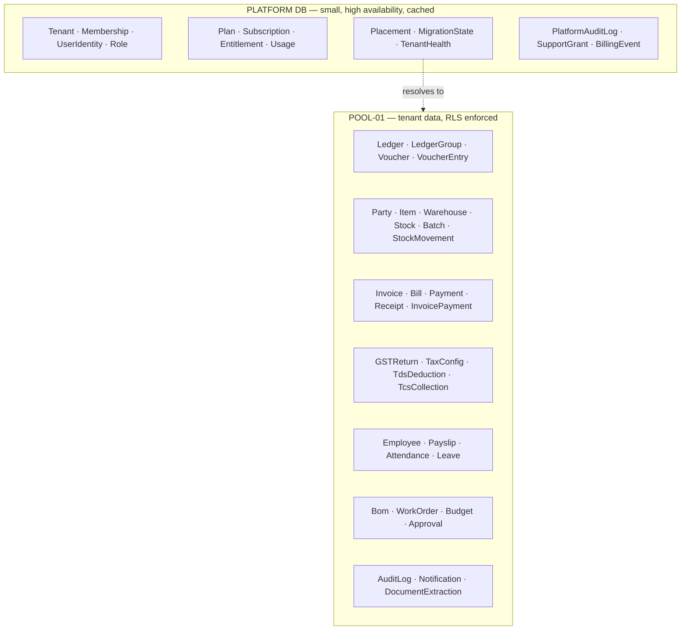

### 11.2 Why the separation is not optional for an accounting product

Three arguments specific to this domain:

1. **Retention divergence.** Indian statute drives multi-year retention of books of account. Commercial records (subscriptions, payments) follow a different rule, and personal data under DPDP follows a third. Mixing them into one database makes "delete this tenant's personal data but retain the statutory books" nearly impossible to execute or prove. **[VENDOR-CHECK / legal review required — §48]**
2. **Access divergence.** Support staff must be able to see "is this tenant's subscription active?" without being able to see a single invoice.
3. **Movement.** Tenant data must be movable (§19.4). Control-plane data must not be. If they share a database they cannot have different mobility.

### 11.3 The tenant-DB contract

Every table in the tenant database must satisfy all of the following before it ships. This is the checklist that makes the model enforceable rather than aspirational:

1. Has a non-nullable `organizationId`, **or** is on the explicit global-reference allow-list (`currencies`, `exchange_rates`, system roles/voucher types/units).
2. Has `organizationId` as the **leading column** of at least one index.
3. Has RLS enabled **and forced**, with `USING` **and** `WITH CHECK` policies.
4. Has an isolation test in the §53.2 matrix.
5. Money columns are `Decimal`, never `Float`. **[VERIFIED-REPO: currently 100% compliant — preserve this]**
6. Append-only tables (`audit_logs`, `voucher_entries`, `stock_movements`) are partitioned once past the §18.5 threshold.
7. Has an entry in the data-classification table (§48.3).

**[JUDGEMENT]** Rules 1–4 should be enforced by an automated schema test in CI, not by review. A test that reads `prisma/schema.prisma` and the migration SQL and fails the build on a violation is ~150 lines and eliminates an entire category of future breach.

***

## 12. Tenant Context

### 12.1 The rule

> **Tenant context is derived from the authenticated principal's membership, is set once per unit of work, is mandatory, and is never accepted from the caller.**

### 12.2 Never trust the tenant id from the browser

The brief singles this out, correctly. Consider:

```
GET /api/invoices?organizationId=ORG_ABC
```

This is dangerous because the identifier is **caller-controlled input being used as an authorisation decision**. If any handler reaches the database with it before a membership check, changing one query parameter reads another company's books. It is the single most common multi-tenant breach, it is trivially discoverable by an attacker, and it is invisible in logs because the request looks well-formed.

**[VERIFIED-REPO] AccuBook already gets the important half of this right.** The `orgId` appears in the *path* (`/api/organizations/[orgId]/...`), and `withOrgAuth` performs a membership lookup on **every** request before the handler runs, returning 403 when absent or inactive. Path-vs-query is cosmetic; **the membership check is the control**, and it is present.

Two residual weaknesses remain:

1. **`orgId` still originates from the URL.** It is validated, so this is safe — but it means every request costs a membership lookup, and it means safety depends on that one function continuing to be applied to every route. The mitigation is the CI test that asserts every route file under `/api/organizations/[orgId]` exports handlers wrapped in `withOrgAuth` (§53.4).
2. **Ids inside the request body are only partly validated.** `findForeignReferences` covers six kinds (`ledger`, `costCenter`, `project`, `branch`, `party`, `fiscalYear`) **[VERIFIED-REPO]**. It does not cover `itemId`, `warehouseId`, `invoiceId`, `billId`, `employeeId`, `bankAccountId`, `batchId`, `voucherId` and others. **RLS closes this completely** — a foreign row simply is not visible, so a write referencing it fails on the foreign key.

**The secure chain:**

```mermaid
sequenceDiagram
    participant B as Browser
    participant A as API route
    participant P as Platform DB (cached)
    participant D as Tenant DB (POOL-01)
    B->>A: GET /api/organizations/ORG_A/invoices  (cookie)
    A->>A: authenticate → userId
    A->>P: membership(userId, ORG_A)?
    alt no membership
        P-->>A: none
        A-->>B: 403 (identical response to "org does not exist")
    else member
        P-->>A: role, branchIds, tenant status, entitlements
        A->>P: placement(ORG_A) → POOL-01
        A->>D: BEGIN; set_config('app.current_org','ORG_A',true); SELECT …; COMMIT
        D-->>A: rows for ORG_A only (RLS)
        A-->>B: 200
    end
```

**Note the `alt` branch:** a non-member and a non-existent organisation must produce the **same** response. Distinguishing them turns the endpoint into an organisation-existence oracle.

### 12.3 Active tenant switching

An Indian CA may hold memberships in dozens of client organisations — this is a primary use case, not an edge case.

**[JUDGEMENT]** Design:

- The session holds `userId` only. It does **not** hold a "current org".
- The active organisation is a property of the **request**, taken from the path, and validated against membership every time.
- The UI stores the last-used org in a cookie *for navigation convenience only*; it is never trusted.
- Switching organisations is a client-side navigation, not a session mutation — which means two browser tabs can be open on two different clients simultaneously, which accountants genuinely need.
- Every response includes the resolved `organizationId` so the client can detect and surface a mismatch.

**Anti-pattern to avoid:** storing `currentOrgId` in the JWT. It creates a stale-permission window (a revoked membership stays valid until the token refreshes), it breaks multi-tab, and it makes revocation dependent on token lifetime. AccuBook's 30-day JWT **[VERIFIED-REPO]** would make that window a month.

### 12.4 Propagation through every execution path

The hard part is not HTTP. It is everything else.

| Path | How context arrives | Failure if absent |
|---|---|---|
| API route | `withOrgAuth` → `ctx.orgId` | 403 |
| Server action | same guard, applied explicitly | throw |
| Service function | receives a tenant-scoped client, not a global one | cannot compile |
| Repository | uses the scoped client | — |
| Transaction | `set_config(..., true)` inside `BEGIN` | RLS returns 0 rows |
| **Background job** | **`tenant_id` is a required column on the job row**, asserted before the handler runs | **job fails and is dead-lettered** |
| Scheduled job | scheduler enumerates tenants and enqueues one job **per tenant** | — |
| Webhook (inbound) | tenant resolved from the endpoint id or the provider ref, then set | reject |
| Export / report | job carries tenant id | fail |
| Email / notification | job carries tenant id | fail |
| File access | key prefix `documents/{orgId}/…` **and** a DB row check under RLS | 404 |

**[JUDGEMENT] The single most dangerous line of code in a multi-tenant SaaS is a background job that iterates all tenants in one context.** AccuBook has two such jobs today — `check-overdue` and `run-recurring` **[VERIFIED-REPO]**, which sweep every active organisation. They are correct as written, because they are *deliberately* platform-wide. The rule must therefore be:

> A job either declares itself **platform-scoped** (and is then forbidden from returning tenant data across the boundary, and must set context per tenant inside its loop) or it is **tenant-scoped** and *must* carry a `tenant_id`. There is no third kind.

### 12.5 Shape of the implementation

```ts
// src/backend/tenancy/context.ts   — proposed
import { AsyncLocalStorage } from "node:async_hooks";

type TenantContext = {
  organizationId: string;
  userId: string;
  placementId: string;
  requestId: string;
  entitlements: ReadonlySet<string>;
};

const als = new AsyncLocalStorage<TenantContext>();

export function runInTenant<T>(ctx: TenantContext, fn: () => Promise<T>) {
  return als.run(ctx, fn);
}

/** Throws rather than returning null. Absence of context is a bug, not a state. */
export function requireTenant(): TenantContext {
  const ctx = als.getStore();
  if (!ctx) {
    throw new Error(
      "No tenant context. Every data access must run inside runInTenant(). " +
      "If this is a platform-wide job, use runInPlatformScope() explicitly."
    );
  }
  return ctx;
}
```

**Why `AsyncLocalStorage` and not a threaded parameter:** threading `orgId` through every signature is what the codebase does today, and it works — until someone adds a function that forgets. ALS makes the context *ambient but mandatory*: you cannot accidentally get the wrong tenant, only no tenant, and no tenant throws loudly.

**What can go wrong:** ALS context is lost across some boundaries — `setTimeout` chains created before `run`, worker threads, and any promise created outside the `run` scope. The mitigation is that ALS is the *convenience* layer while **RLS is the enforcement layer**. If ALS is ever lost, RLS returns zero rows rather than the wrong rows. That combination — ergonomic ambient context, backed by a database that does not trust it — is the whole design.

***
## 13. Authentication

### 13.1 Current state

**[VERIFIED-REPO]** NextAuth v5 beta, JWT session strategy, 30-day sessions, `@auth/prisma-adapter`, bcrypt password hashes, plus a well-designed JWT revocation mechanism: `User.tokensRevokedAt` is compared against the token's issue time on refresh (re-checked at most once per 60 s per session), so ops can force-logout a user without waiting out the token. The `User` model already carries `mfaEnabled`, `mfaSecret`, `failedLoginAttempts`, `lockedUntil`, `lastLoginIp`.

API-key authentication is a second, parallel path: `Authorization: Bearer acb_live_<hex>`, SHA-256 hashed, prefix-indexed, scoped, with an expiry and a revocation reason.

### 13.2 Assessment

| Aspect | State | Verdict |
|---|---|---|
| Password hashing | bcryptjs | ✓ acceptable; consider argon2id at Stage 3 |
| Session strategy | JWT, 30 days | ⚠ long. See below. |
| Revocation | `tokensRevokedAt` + 60 s re-check | ✓ good design |
| MFA | fields exist | ⚠ **verify enrolment/verification flow is implemented, not just modelled** |
| Lockout | fields exist | ⚠ same |
| Rate limiting on auth | `/api/auth/register` only **[VERIFIED-REPO]** | ✗ **must cover sign-in** |
| CSRF | same-origin check on mutating session requests | ✓ good |
| API keys | hashed, scoped, capped by creator's role | ✓ strong |

### 13.3 Recommendations

**[JUDGEMENT]**

1. **Reduce the JWT lifetime to 24 hours with a sliding refresh**, or keep 30 days *only* for a "remember this device" opt-in. A 30-day bearer token is a 30-day breach window; the `tokensRevokedAt` check narrows it to 60 s **for revocation you know about**, which is not the same as narrowing it for a token you do not know is stolen.
2. **Extend rate limiting to sign-in, password reset and MFA verification**, keyed on both IP and email (§38). Today only registration is limited **[VERIFIED-REPO]** — brute force against sign-in is unthrottled.
3. **Confirm MFA is enforceable, and require it for platform administrators without exception.**
4. **Never let authentication depend on a tenant database.** Identity lives in the Platform DB (§10), so a pooled-database outage degrades data access, not login.
5. **Password reset and email verification tokens** must be single-use, short-lived (≤ 30 min), and stored hashed.
6. **Add step-up authentication** for: changing bank details, approving payments above a tenant-configured threshold, exporting the full book, and creating an API key.

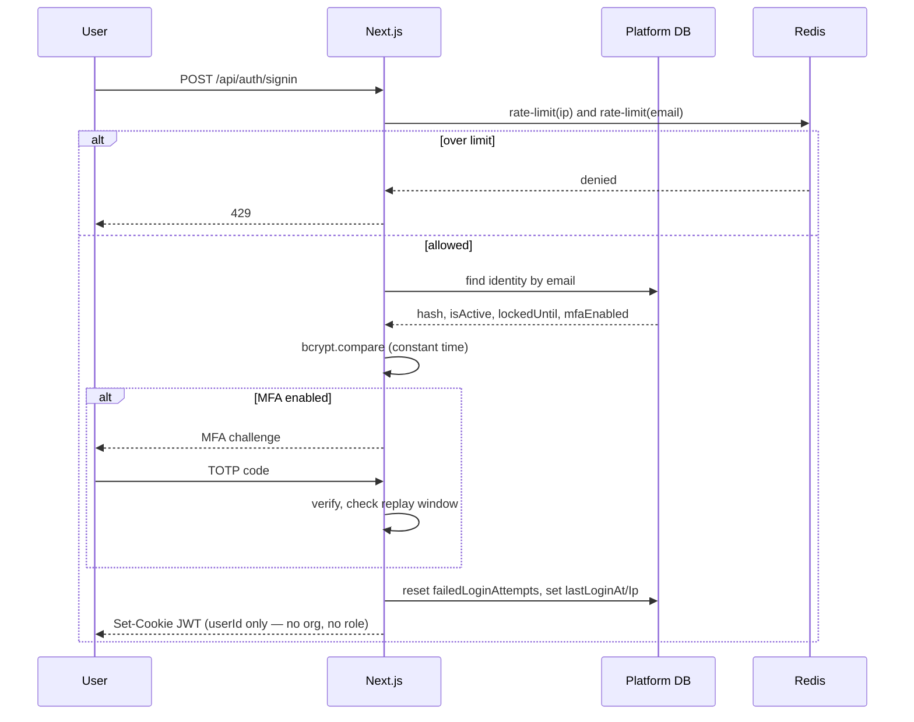

**The JWT must contain `userId` and nothing authorising.** No org, no role, no entitlements. Everything authorising is looked up per request and is therefore revocable immediately (§12.3).

***

## 14. Authorization

### 14.1 The five layers, and where each is enforced

Restating §6.7 as an implementation map:

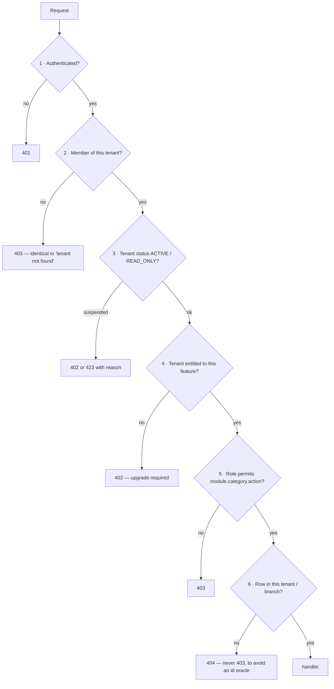

**[VERIFIED-REPO]** layers 1, 2 and 5 are implemented in `withOrgAuth`. Layer 3 exists only as `Organization.isActive`. Layer 4 does not exist. Layer 6 is partial (`findForeignReferences` for six kinds) and becomes complete under RLS.

### 14.2 What is already good and should not be changed

`checkRolePermission` resolves `(pathname, method) → (module, category, action)` through the same `API_RESOURCE_MAP` used for API-key scopes, so a role grant and a key grant describe resources identically. **A path absent from the map yields 403 with `reason: "unmapped_path"`.** **[VERIFIED-REPO]**

**[JUDGEMENT]** This is a genuinely good design and I would not replace it with a policy engine (Casbin, OPA, Cedar) in V1. It is fail-closed, it is one file, it is testable, and it is comprehensible at 2 a.m. Revisit only if per-row conditional policies ("approve only invoices under ₹1 lakh, only for your own branch") become common — that is the trigger for a real policy engine, and it is not V1.

### 14.3 The `Role` defect must be fixed (§2.6)

Recap, because it belongs here too: `Role` is global. Two tenants can share and mutate the same role row. Fix: `organizationId String?` with `NULL` meaning system role, `@@unique([organizationId, name])`, and an RLS policy of `organizationId IS NULL OR organizationId = current_org()` with `WITH CHECK (organizationId = current_org())` so a tenant can never write a system role.

### 14.4 Branch-level authorization

**[VERIFIED-REPO]** `OrganizationUser.branchIds String[]` exists but there is no evidence of central enforcement in `withOrgAuth` — the guard checks module permission, not branch scope.

**[JUDGEMENT]** Branch scope is a second dimension of row-level authorisation and should be enforced the same way tenant scope is: as an RLS policy, not as handler discipline.

```sql
CREATE POLICY branch_scope ON vouchers
  USING (
    "organizationId" = current_setting('app.current_org', true)
    AND (
      current_setting('app.branch_scope', true) = '*'          -- all-branch role
      OR "branchId" IS NULL                                     -- org-level record
      OR "branchId" = ANY (string_to_array(current_setting('app.branch_scope', true), ','))
    )
  );
```

Set `app.branch_scope` in the same `set_config` block as `app.current_org`. Applies only to the ~12 tables carrying `branchId`.

### 14.5 Permission model shape

Keep the existing `module.category.action` tuple. Recommended additions:

- **Deny wins.** Add explicit denies for high-risk actions so an inherited grant cannot be widened by accident.
- **Permissions are data, not code.** Already true (`Role.permissions Json`). Keep it — it means a new module needs a seed row, not a deploy.
- **Version the permission catalogue.** When a new action code is introduced, existing roles must not silently gain it. Store `permissions_version` on `Role` and require an explicit migration to grant new codes.

***

## 15. Database Architecture

### 15.1 Topology — V1

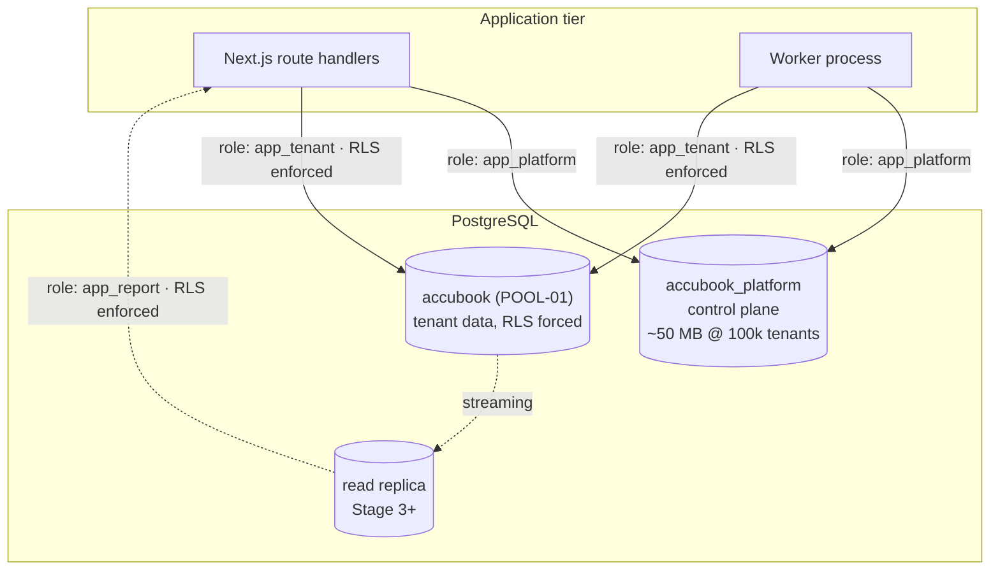

### 15.2 Database roles — least privilege

**[JUDGEMENT]** This is the control that makes RLS real. RLS does nothing against a superuser or a table owner without `FORCE`.

| Role | Used by | Privileges | RLS |
|---|---|---|---|
| `accubook_owner` | migrations only, via CI | DDL on tenant schema | `BYPASSRLS` — never used at runtime |
| `app_tenant` | **the application and worker** | `SELECT/INSERT/UPDATE/DELETE` on tenant tables. **No DDL. No `BYPASSRLS`. Not the table owner.** | **enforced** |
| `app_platform` | app and worker, control plane only | DML on platform tables | n/a |
| `app_report` | reporting/replica reads | `SELECT` only | **enforced** |
| `app_admin_support` | break-glass only, via SupportGrant | `SELECT` on tenant tables, RLS enforced, context set to the granted tenant | **enforced** |
| `backup` | backup tooling | `SELECT` + replication | `BYPASSRLS` (needs full dump) |

**The single most important line in this section:** the runtime application role must **not** own the tables. If it does, RLS is skipped unless every table also has `FORCE ROW LEVEL SECURITY`. Use both belts: a non-owner runtime role **and** `FORCE`.

### 15.3 RLS rollout — the safe sequence

Enabling RLS on a live system is a change that can return *zero rows* if done wrong. The sequence matters:

1. **Backfill `organizationId`** onto the 22 tenant tables that lack it (§20.5). Expand/contract; no downtime.
2. **Add indexes** with `organizationId` leading, `CONCURRENTLY`.
3. **Create the `app_tenant` role**; grant DML; transfer ownership to `accubook_owner`.
4. **Deploy the Prisma extension** that sets `app.current_org` on every operation — *before* any policy exists. It is a no-op until step 6, so it can be verified in production safely.
5. **Enable RLS in permissive mode on one low-risk table** (`notifications`), verify no behaviour change, and verify the negative test (context unset ⇒ zero rows).
6. **Roll out table by table**, highest-risk last (`voucher_entries`, `invoices`, `ledgers`), each behind a feature flag, each with the §53.2 isolation test green.
7. **Add the CI schema test** that fails the build if a tenant table has no policy.

**[JUDGEMENT]** Steps 4 and 5 exist so that the *mechanism* is proven in production before the *enforcement* is switched on. Doing it the other way round is how teams take a multi-hour outage.

### 15.4 What RLS costs, honestly

| Cost | Magnitude | Mitigation |
|---|---|---|
| Predicate on every query | low single-digit % when `organizationId` leads an index **[VENDOR-CHECK]** | correct indexes; verify with `EXPLAIN` |
| Every query in a transaction | ~1 extra round trip; see §17.4 | batch via `$transaction([...])` |
| Migrations need a bypass role | one more credential | already required for DDL |
| Debugging is less obvious ("why no rows?") | developer time | log the resolved `app.current_org` on every query in dev |
| A join to a table without a policy leaks | **real risk** | CI schema test (§11.3) |

### 15.5 Tables that must **not** have tenant RLS

`currencies`, `exchange_rates`, and the system rows of `roles`/`voucher_types`/`units_of_measure`. These are global reference data. They get `SELECT` to all, `INSERT/UPDATE/DELETE` to nobody at runtime — writable only by migrations.

### 15.6 Key design decisions to keep

**[VERIFIED-REPO]** and correct: `Decimal(18,4)` for all money (169 columns), zero `Float`, `Decimal(18,8)` for exchange rates, `NumberCounter` with `@@unique([organizationId, scope])` for document numbering, `onDelete: Cascade` on tenant-owned children (70 uses).

### 15.7 Database design for scale — what actually matters at 100,000 tenants

**Identifier strategy.** **[VERIFIED-REPO]** 73 models use `cuid()`; none use `uuid()`; no `bigint` surrogate keys.

| Option | Index locality | Size | Guessable | Distributed generation | Verdict |
|---|---|---|---|---|---|
| `bigserial` | ✓✓ perfect | 8 B | ✗ enumerable | ✗ needs DB | **no** — enumerable ids in a public API are an IDOR magnifier |
| UUID v4 | ✗✗ random inserts fragment B-tree | 16 B | ✓ | ✓ | no |
| **UUID v7** | ✓ time-ordered | 16 B | ✓ | ✓ | **recommended for new tables** |
| ULID | ✓ time-ordered | 16 B (26 char text) | ✓ | ✓ | equivalent; UUIDv7 has native PG support |
| **cuid2 / cuid** | ~ partially ordered | 24–32 B as `text` | ✓ | ✓ | **acceptable; keep** |

**[JUDGEMENT] Do not migrate the existing 73 `cuid()` primary keys. The cost is enormous and the benefit is marginal.** cuid is monotonic-ish (timestamp-prefixed), so insert locality is far better than UUIDv4. Do adopt **UUIDv7 stored as native `uuid`** for *new* high-volume tables (jobs, partitioned audit/ledger tables, idempotency keys), where the 8–16 bytes saved per row per index is multiplied by billions.

**Other decisions that matter at scale:**

| Decision | Current **[VERIFIED-REPO]** | Recommendation |
|---|---|---|
| **Enums** | **0 enums — every status/type is free-text `String`** | **Add real enums** for `Voucher.status`, `Invoice.status`, `StockMovement.movementType`, `AuditLog.action`, etc. Today a typo (`"POSTEd"`) is a silently valid value; every report filtering on status is one typo away from wrong. This is a correctness issue as much as a scale one. |
| **Index leading column** | 38 of 41 org tables ✓; `GSTReturn`, `ReportTemplate`, `Notification` ✗ | add `@@index([organizationId, …])` to those three |
| **Soft delete** | 0 `deletedAt` | add to tenant-visible masters (`Party`, `Item`, `Ledger`, `Employee`); **never** to posted financial documents — those are reversed, not deleted (§15.8) |
| **Partition keys** | none | `audit_logs`, `stock_movements`, `voucher_entries`, `notifications` by month (§18.5) |
| **JSONB** | 24 uses | fine for `permissions`, `metadata`, OCR payloads. **Never** for anything that must be aggregated, filtered at scale, or is financially load-bearing. |
| **`String[]`** | 2 (`branchIds`, and one other) | acceptable; add a GIN index if it is ever filtered on |
| **Timestamps** | `createdAt`/`updatedAt` widely present | ensure `timestamptz`, never `timestamp` |
| **FK indexes** | Prisma does not auto-index all FKs | audit: every FK used in a join needs an index |

### 15.8 Accounting data integrity

**[JUDGEMENT]** AccuBook is not CRUD SaaS, and the architecture must reflect that. Five invariants:

**I1 — Double entry always balances.** For every voucher, `Σ debit = Σ credit`. Enforce in three places, not one:
```sql
ALTER TABLE vouchers ADD CONSTRAINT voucher_balanced
  CHECK ("totalDebit" = "totalCredit");
```
plus an application check before insert, plus a nightly reconciliation job that recomputes `Σ voucher_entries` per voucher and alerts on any mismatch. Three layers because a `CHECK` on the header does not prove the *lines* sum to the header.

**I2 — A posted voucher is immutable.** Corrections happen by **reversal**, never by `UPDATE`. Enforce with a database trigger:
```sql
CREATE OR REPLACE FUNCTION forbid_posted_mutation() RETURNS trigger AS $$
BEGIN
  IF OLD."isPosted" AND (TG_OP = 'DELETE' OR NEW."isPosted") THEN
    RAISE EXCEPTION 'Posted voucher % is immutable; post a reversal instead', OLD.id;
  END IF;
  RETURN NEW;
END $$ LANGUAGE plpgsql;
```
**[VERIFIED-REPO]** `Voucher.isPosted` and `postedAt` already exist; the enforcement does not. This is a small, high-value addition.

**I3 — Every financial mutation is one transaction.** Posting an invoice writes: the invoice, its lines, its taxes, the voucher, the voucher entries, ledger balance effects, stock movements and the audit row. All or none. **[VERIFIED-REPO]** `post-invoice.ts` and `post-bill.ts` already do this, and the 20 s transaction timeout was raised deliberately for it — good.

**I4 — Fiscal periods can be locked.** `FiscalPeriod` exists **[VERIFIED-REPO]**; add `isLocked` and refuse posting into a locked period, enforced in the database.

**I5 — The audit log is append-only.** Revoke `UPDATE`/`DELETE` on `audit_logs` from `app_tenant` (§36).

### 15.9 Concurrency

The accounting-specific races, and the correct control for each:

| Race | Correct mechanism | Status **[VERIFIED-REPO]** |
|---|---|---|
| Two invoices claim the same number | `UPDATE number_counters SET lastNumber = lastNumber + 1 … RETURNING` inside the posting transaction — the row lock serialises it | `NumberCounter` + `@@unique([organizationId, scope])` present |
| Two requests create the same ledger | `INSERT … ON CONFLICT … RETURNING` | ✅ **solved**, with a test proving `upsert` is insufficient |
| Two dispatches consume the same stock | `SELECT … FOR UPDATE` on the `stocks` row inside the transaction, or a `CHECK (quantity >= 0)` plus retry | tests exist (`stock-dispatch`, `batch-stock-atomicity`) |
| Payroll posted twice for a month | unique constraint on `(organizationId, employeeId, period)` | tests exist (`payroll-double-post`, `payroll-double-payment`) |
| Work order relieved twice | unique/state guard | test exists (`wo-double-relief`) |
| Same webhook delivered twice | unique `provider_event_id` | **missing** → §32 |
| Client retries "create invoice" | **idempotency key** | **missing** → §31.5 |

**Isolation level: keep READ COMMITTED (the default).** **[JUDGEMENT]** `SERIALIZABLE` would eliminate several of these races automatically but introduces serialisation failures that every write path must then retry, and it costs throughput. Explicit locking and unique constraints at the few genuine contention points is the better trade for this workload — and it is what the codebase already does.

**Numbering deserves a specific warning.** Document numbers must be **gapless** for GST purposes (a missing invoice number is a question from a tax officer). A gapless sequence *cannot* use a Postgres `SEQUENCE`, because sequences do not roll back. The `UPDATE … RETURNING` inside the posting transaction is correct precisely because a rolled-back invoice also rolls back its number. The cost is that concurrent invoice creation within one tenant serialises on that row — acceptable, because it is per-tenant-per-scope and tenants do not create thousands of invoices per second.

***

## 16. Prisma Architecture

### 16.1 Current setup

**[VERIFIED-REPO]** `src/backend/database/client.ts`: Prisma 7 with `PrismaPg` driver adapter over a `pg.Pool`, `max: 3` in production / `10` in dev, `connectionTimeoutMillis: 15000` for Neon cold starts, `idleTimeoutMillis: 10000`, transaction defaults `timeout: 20000` / `maxWait: 10000`, a `globalThis` singleton in non-production, and `withDbRetry` retrying a fixed set of transient error codes (`ETIMEDOUT`, `ECONNRESET`, `ECONNREFUSED`, `EPIPE`, `P1001`, `P1017`) with exponential backoff, deliberately restricted to idempotent reads.

**[JUDGEMENT]** This is thoughtful, well-reasoned code. The pool sizing rationale in the comment is correct. Three changes are needed to reach the target architecture, and none of them discards this work.

### 16.2 Change 1 — a client *registry* keyed by placement, not one global client

```ts
// src/backend/database/registry.ts  — proposed
const clients = new Map<string, PrismaClient>();   // placementId → client

export function clientForPlacement(placementId: string): PrismaClient {
  let c = clients.get(placementId);
  if (!c) {
    const dsn = resolveDsn(placementId);           // from secret store, cached
    c = buildClient(dsn);
    clients.set(placementId, c);
  }
  return c;
}
```

**The brief warns explicitly against one PrismaClient per tenant, and it is right.** 100,000 clients means 100,000 pools and certain connection exhaustion. **One client per *placement*** is the correct granularity: V1 has exactly one, and even a mature deployment has tens.

### 16.3 Change 2 — a tenant-scoping client extension

This is the mechanism that makes RLS work with a pooled connection.

```ts
// src/backend/database/tenant-client.ts — proposed
export function tenantClient(orgId: string, branchScope: string) {
  const base = clientForPlacement(placementFor(orgId));

  return base.$extends({
    query: {
      $allOperations({ args, query }) {
        // set_config(..., true) is TRANSACTION-LOCAL. The `true` is the entire
        // safety property: without it the setting survives the connection's
        // return to the pool and the NEXT TENANT'S QUERY inherits it.
        return base.$transaction(async (tx) => {
          await tx.$executeRaw`SELECT set_config('app.current_org',   ${orgId},      true)`;
          await tx.$executeRaw`SELECT set_config('app.branch_scope',  ${branchScope}, true)`;
          return query(args);
        });
      },
    },
  });
}
```

**Why it exists:** so that no developer has to remember. **Where it belongs:** the only sanctioned way to obtain a tenant-data client; the raw client is not exported. **Which boundary it protects:** the tenant data boundary — it is the bridge between application context and database enforcement. **What can go wrong:** (a) omitting `true` on `set_config` — catastrophic cross-tenant leak, so it needs a dedicated test that runs two tenants' queries on a one-connection pool and asserts no bleed; (b) a code path that acquires a raw `pg` client and bypasses this — a lint rule must forbid importing the base client outside this module; (c) nested transactions, since Prisma does not support them — the extension must detect it is already inside a transaction and set the config without opening another. **How to test:** the §53.2 matrix, plus a specific "pool reuse" test with `max: 1`.

### 16.4 Change 3 — batch the context-setting round trip

The naive extension costs two extra round trips per query (`BEGIN`+`set_config`, then `COMMIT`). Use Prisma's **array form** of `$transaction`, which pipelines the statements in a single round trip:

```ts
const [, , rows] = await base.$transaction([
  base.$executeRaw`SELECT set_config('app.current_org',  ${orgId}, true)`,
  base.$executeRaw`SELECT set_config('app.branch_scope', ${scope}, true)`,
  query,
]);
```

**[VENDOR-CHECK — verify against prisma.io/docs "Transactions"; measure, do not assume.]** §17.4 gives the budget.

### 16.5 What to keep exactly as it is

`withDbRetry` and its deliberate restriction to idempotent operations. The transaction timeout rationale. The `globalThis` singleton in dev. The driver-adapter choice (which is what makes `$queryRaw` with `ON CONFLICT` work correctly).

### 16.6 Prisma across deployment models

| Environment | Client lifetime | Pool size | Note |
|---|---|---|---|
| Vercel serverless (V1) | per instance, reused across warm invocations | small (3) ✓ current | pool per *instance*, not per request |
| Long-running worker container | process lifetime | larger (10–20) | steady, predictable |
| Local dev | `globalThis` singleton | 10 ✓ current | survives hot reload |
| CI | per test worker | 2–5 | `TEST_DATABASE_URL` pin already enforced **[VERIFIED-REPO]** |

***

## 17. Connection Management

The brief calls this "extremely important". It is, and it is where the naive database-per-tenant design dies.

### 17.1 The core misconception

**100,000 tenants does not mean 100,000 connections.** Connections are consumed by *in-flight queries*, not by tenants. From §5.3:

```
100,000 tenants
  → 12,000 daily active users
  → ~2,150 concurrent in-flight requests at peak-day
  → but a request holds a DB connection only for the ~15–40 ms it is querying
  → ≈ 2,150 × (30 ms / 180 ms think-time) ≈ 350–450 concurrently-held connections
```

**[ASSUMPTION]** 30 ms mean DB-busy time per request out of 180 ms total. So even 100,000 tenants at peak needs **a few hundred** database connections — reachable with a pooler in front of one primary. That is the number that makes pooled tenancy viable and database-per-tenant impossible.

### 17.2 Tenant temperature

| Class | Share **[ASSUMPTION]** | Connection cost |
|---|---|---|
| Hot — active right now | ~0.2% | shares the pool |
| Warm — active today | ~12% | shares the pool |
| Cold — active this month | ~28% | **zero** |
| Dormant | ~60% | **zero** |

In a pooled architecture a dormant tenant costs exactly one row in `organizations`. In database-per-tenant it costs a database, a catalogue, a backup schedule and a monitoring target — **whether or not anyone ever logs in.** That asymmetry, compounded over the 60% dormant tail typical of Indian SMB SaaS, is decisive.

### 17.3 The serverless connection-explosion problem

Vercel scales lambdas independently; each holds its own pool. Connections ≈ `instances × pool_max`.

| Concurrent instances | `max=3` | With pooler |
|---|---|---|
| 10 | 30 | 30 client-side, few server-side |
| 100 | 300 | ~50 server-side |
| 500 | **1,500 — exceeds most limits** | ~150 server-side |
| 2,000 | **6,000 — fails** | ~300 server-side |

**[JUDGEMENT]** Three mitigations, in order:

1. **Always connect through a transaction-mode pooler.** Neon's pooled endpoint (PgBouncer) or a self-managed PgBouncer/`pgcat`. Non-negotiable at any scale above trivial. **[VENDOR-CHECK: Neon pooled connection limits]**
2. **Keep `max` small** — 3 is right for serverless; do not raise it.
3. **Move sustained work off serverless.** Workers and report generation belong in long-lived containers with a modest, stable pool — which also removes the largest source of connection spikes.

**Transaction-mode pooling constrains you:** no session-level `SET`, no `LISTEN/NOTIFY`, no session advisory locks, no prepared-statement reuse across transactions. All are compatible with the design here **because** context is set transaction-locally (§16.3). This is not a coincidence — it is why that design was chosen.

### 17.4 The RLS round-trip budget

| Approach | Extra round trips/query | At 30 ms DB time |
|---|---|---|
| Naive interactive transaction | 2 (`BEGIN`+`SET`, `COMMIT`) | +8–20 ms — **too much** |
| **`$transaction([...])` array form** | ~0 (pipelined) | **+1–3 ms — acceptable** |
| Session-level `SET` | 0 | **UNSAFE under transaction pooling — forbidden** |

**[JUDGEMENT]** Budget **≤ 5 ms p95** for tenant-context overhead. Measure it in staging before the rollout in §15.3 reaches a high-traffic table; if it exceeds budget, the fallback is to apply RLS only to the highest-risk tables and rely on app filters plus the CI schema test elsewhere — a documented, deliberate reduction, not a silent one.

### 17.5 Capacity model

**[ASSUMPTION]** 30 ms DB-busy per request; pooler in transaction mode; `max_connections` per §17.6.

| Scenario | Peak RPS | Concurrent requests | Concurrent DB conns | Server-side conns behind pooler | Verdict |
|---|---|---|---|---|---|
| 100 tenants | 12 | ~2 | ~1 | 5–10 | trivial |
| 1,000 | 120 | ~22 | ~4 | 10–20 | trivial |
| 10,000 | 1,200 | ~215 | ~36 | 40–80 | 1 primary comfortably |
| 100,000 | 2,000 (normal peak) | ~360 | ~60 | 80–150 | 1 primary + 2 replicas |
| 100,000 | **12,000 (20 Apr / GST day)** | ~2,150 | ~360 | **300–500** | primary + 3–4 replicas, **or shard** |

**Read the last row carefully:** it is the only row that forces sharding, it happens a handful of days a year, and it is a *burst*. Autoscaling replicas and shedding non-critical load (§39) is a cheaper answer than sharding, and should be tried first.

### 17.6 Settings to standardise

| Setting | V1 | 10k | 100k | Note |
|---|---|---|---|---|
| App pool `max` (serverless) | 3 | 3 | 3 | keep |
| App pool `max` (worker) | 10 | 15 | 20 | per worker process |
| Pooler mode | transaction | transaction | transaction | required |
| Postgres `max_connections` | 100 | 200 | 400–500 | ceiling is memory |
| `idle_in_transaction_session_timeout` | 30 s | 30 s | 15 s | **set this** — a leaked open transaction holds locks and blocks vacuum |
| `statement_timeout` (app role) | 15 s | 15 s | 10 s | **set this** — bounds runaway queries |
| `statement_timeout` (report role) | 120 s | 120 s | 120 s | reports run on the replica |
| `lock_timeout` | 5 s | 5 s | 3 s | fail fast rather than pile up |

**[JUDGEMENT]** `statement_timeout` and `idle_in_transaction_session_timeout` are the two highest-value, lowest-effort database settings available and neither appears to be configured today. They convert an unbounded outage into a bounded error.

***
## 18. Database Scaling

### 18.1 The order of operations

**[JUDGEMENT]** Apply these in order. Do not skip ahead; each is cheaper and less risky than the next, and skipping to sharding is the single most common over-engineering mistake in SaaS.

```
1. Correct indexes            ← free, do continuously
2. Query and N+1 elimination  ← free
3. Vertical scale             ← money, minutes, reversible
4. Read replicas              ← money, low risk
5. Partition hot tables       ← engineering, low risk, big payoff
6. Archive cold data          ← engineering, medium risk
7. Placement tiering          ← §9.4, solves single-large-tenant
8. Shard                      ← LAST RESORT (§19)
```

### 18.2 Vertical scaling — first and best

**[VENDOR-CHECK]** Managed PostgreSQL scales to very large instances (hundreds of GB of RAM, dozens of vCPU). A single well-tuned primary comfortably serves thousands of writes/second and tens of thousands of reads/second for an OLTP workload of this shape.

**[JUDGEMENT]** For AccuBook, one primary handles **everything up to roughly 50,000 tenants**, provided §18.5 (partitioning) is done. Vertical scaling is cheap in engineering time, immediately reversible and requires no code change. Exhaust it.

### 18.3 Read replicas

**When:** read:write is 85:15 **[ASSUMPTION]** and reports are read-only and heavy. A replica absorbs them without touching the primary's ability to accept writes.

**Route to the replica:** all report generation, all exports, all analytics, the platform-admin search, GST return preparation reads.
**Never route to the replica:** anything that reads-then-writes (numbering, stock check-then-deduct, approval state), any post-write read-your-own-writes path.

**Replication lag is the trap.** A user posts an invoice and immediately opens the invoice list; if the list reads a lagging replica the invoice is missing and the user believes it failed. **[JUDGEMENT]** Rule: **for 30 seconds after a tenant's write, that tenant's reads go to the primary.** Track last-write time per tenant in Redis; it is a few lines and it eliminates the entire class of complaint.

### 18.4 Indexing

Required now **[VERIFIED-REPO]**: add `organizationId`-leading indexes to `GSTReturn`, `ReportTemplate`, `Notification`.

Principles:
- `organizationId` leads every tenant-table index. Under RLS the predicate is always present, so a non-leading `organizationId` means an extra filter step on every query.
- Composite indexes ordered `(organizationId, <selective column>, <sort column>)`.
- Partial indexes for hot narrow queries: `WHERE "isPosted" = true`, `WHERE status = 'OVERDUE'`.
- Always `CREATE INDEX CONCURRENTLY` in production.
- Review `pg_stat_user_indexes` quarterly and **drop unused indexes** — every index slows every write and enlarges every backup.

### 18.5 Partitioning — the highest-value scaling work

**[JUDGEMENT]** These four tables grow without bound and are the ones that will hurt:

| Table | Growth driver | Strategy | Threshold |
|---|---|---|---|
| `audit_logs` | every mutation | **RANGE by month** on `createdAt` | > 50 M rows or > 20 GB |
| `stock_movements` | every stock event | RANGE by month on `date` | > 50 M rows |
| `voucher_entries` | 4–8 per voucher — **the largest table** | RANGE by month on voucher date (needs the date denormalised onto the row) | > 100 M rows |
| `notifications` | per event per user | RANGE by month, aggressive drop | > 20 M rows |

Why partitioning pays here specifically:
- **Old partitions are read-only.** Accounting data does not change after the period closes, so vacuum has nothing to do on them.
- **Reports are period-scoped.** "P&L for FY 2025-26" prunes to 12 partitions and ignores everything else.
- **Retention becomes `DROP TABLE`** — instantaneous — instead of a `DELETE` of a hundred million rows that bloats the table and blocks vacuum for hours.
- **Backups and restores get cheaper**, because cold partitions can live on cheaper storage.

**Do not partition by `organizationId`.** It is tempting and it is wrong here: `HASH` partitioning by tenant does not help the queries AccuBook actually runs (which are period-scoped), it does not enable retention drops, and it produces skew because tenant sizes vary by three orders of magnitude. Range-by-time matches both the access pattern and the retention pattern. Revisit only under §19 sharding, where tenant-based distribution is the point.

### 18.6 Archival

**[JUDGEMENT]** After the statutory retention period, and subject to §48 legal review:

```
Live (partitioned)  →  Cold partitions on cheap storage  →  Export to object storage (Parquet)  →  Drop
      0–2 years                2–8 years                          8+ years                     after legal hold clears
```

Cold data must remain *producible* — a tax officer's question about FY 2019-20 must be answerable. Producible is not the same as queryable in the app: an export in object storage, indexed by tenant and period, satisfies it.

### 18.7 Vacuum and bloat

At 12 billion rows this becomes an operational discipline, not a background detail.

| Concern | Control |
|---|---|
| Autovacuum falling behind on hot tables | per-table `autovacuum_vacuum_scale_factor = 0.01` on `voucher_entries`, `stock_movements`, `audit_logs` |
| Long transactions blocking vacuum | `idle_in_transaction_session_timeout` (§17.6) |
| Index bloat | quarterly `REINDEX CONCURRENTLY` on the hottest indexes |
| Transaction-ID wraparound | monitor `age(datfrozenxid)`; alert at 500 M |
| Table bloat | monitor via `pgstattuple` / a bloat query; alert above 30% |

**[JUDGEMENT]** Wraparound monitoring is the one that ends companies. It is a single alert. Add it in V1.

### 18.8 What to do at each scale

| Stage | Action |
|---|---|
| 0–1,000 tenants | one primary; indexes; PITR on; **restore rehearsal** |
| 1,000–10,000 | vertical scale; `pg_stat_statements`; slow-query alerts; **partition `audit_logs`** |
| 10,000–30,000 | add a read replica; route reports; partition `stock_movements` + `voucher_entries` |
| 30,000–60,000 | second replica; archival live; placement tiering for the top 1% of tenants |
| 60,000–100,000+ | evaluate sharding (§19); or add POOL-02 for new tenants only |

**[JUDGEMENT]** Note the last option, which is under-appreciated: **"POOL-02 for new tenants only"** gives most of sharding's benefit for a fraction of the effort, because it requires no rebalancing — existing tenants never move. With placement (§9.4) already built, it is a configuration change.

***

## 19. Sharding

### 19.1 Do not shard in V1

**[JUDGEMENT]** Sharding is the most expensive architectural decision available and it is irreversible in practice. Every capability it costs you — cross-tenant queries, cross-shard transactions, simple backups, easy analytics, straightforward migrations — is a capability you will miss. From §17.5, one primary plus replicas serves 100,000 tenants at normal peak. **Do not shard until the numbers force it.**

### 19.2 Trigger conditions — shard only when at least two are true

1. The largest affordable single instance is above 70% sustained CPU **or** above 70% of provisioned IOPS.
2. Total pooled data exceeds **~2 TB** and backup or restore time breaches the RTO in §4.2.
3. Write throughput exceeds what one primary sustains (~2,000–5,000 writes/s for this workload **[ASSUMPTION]**).
4. Vacuum cannot keep up despite partitioning and tuning.
5. Blast radius is commercially unacceptable — a single outage affecting 100% of tenants has become a contractual problem.

### 19.3 Shard key — by tenant, and only by tenant

| Candidate | Verdict |
|---|---|
| **`organizationId`** | ✅ **correct.** Every query is already tenant-scoped; no query needs to cross tenants except platform analytics, which uses the analytics store (§30). Colocation is perfect by construction. |
| Time | ✗ that is partitioning, not sharding; a shard would go hot each month |
| Entity type | ✗ this is microservice-per-entity in disguise; breaks transactions across invoices/vouchers |
| Region | ✓ **as a secondary dimension** for data residency (§48) — shard by region first, then by tenant within region |

**[JUDGEMENT]** Shard on `organizationId`, hashed into a bucket, with the bucket→placement mapping stored in the control plane rather than computed. Computed mapping (`hash(id) % N`) is fatal: changing `N` moves every tenant. Stored mapping means adding a shard moves only the tenants you choose.

### 19.4 Routing and tenant movement

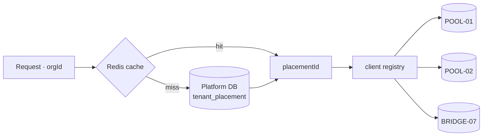

Moving a tenant between placements — the operation that makes the whole design flexible:

```mermaid
sequenceDiagram
    participant Op as Operator
    participant CP as Control plane
    participant SRC as Source placement
    participant DST as Target placement
    Op->>CP: movePlacement(tenant, DST)   [two-person approval]
    CP->>CP: status = MIGRATING
    CP->>SRC: snapshot tenant rows (consistent, ordered by FK depth)
    SRC->>DST: bulk copy
    CP->>CP: status = READ_ONLY   ← the only user-visible impact
    CP->>SRC: capture and apply the delta since snapshot
    CP->>DST: verify — row counts, checksums, trial balance equality
    alt verification passes
        CP->>CP: tenant_placement → DST; invalidate cache
        CP->>CP: status = ACTIVE
        Note over CP,SRC: source rows retained read-only for 7 days, then purged
    else verification fails
        CP->>CP: status = ACTIVE on SRC (roll back, nothing lost)
    end
```

**[JUDGEMENT]** Accept a **brief read-only window** (target: under 5 minutes) rather than building dual-write. Dual-write for a financial system means two sources of truth during cutover and a reconciliation problem if they diverge — a genuinely dangerous complexity for a benefit (zero downtime) that an SMB accounting customer does not need. Schedule moves for off-peak, notify the tenant, keep it short.

**Verification must include a domain check, not just row counts.** "The trial balance on the target equals the trial balance on the source" is the assertion that actually proves the move was correct.

***

## 20. Migrations

### 20.1 The scale question, answered directly

The brief asks for the difference between one shared migration and 10,000 tenant migrations:

| | Pooled (recommended) | Database-per-tenant |
|---|---|---|
| Units to migrate at 100k tenants | **1** | 100,000 |
| Wall-clock | seconds to minutes | hours, orchestrated |
| Partial failure | impossible | **normal** — 99,997 succeed, 3 fail |
| Version skew | none | **permanent** — tenants sit at different schema versions |
| Rollback | one statement | 100,000 operations, some already serving traffic |
| Orchestrator required | no | **yes — it is a product** |

**[JUDGEMENT]** This single table is the strongest operational argument in the entire document for pooled tenancy. Everything else is a trade-off; this is a difference in kind.

Under the hybrid (§9.4) the real number is `1 + #bridge + #silo` — perhaps 1 + 50 + 5 = 56 units. That is orchestrable by a small team. 100,000 is not.

### 20.2 Current state

**[VERIFIED-REPO]** 18 migrations, applied by `prisma migrate deploy` inside the Vercel build, guarded by `scripts/migrate-on-deploy.mjs` so only `VERCEL_ENV=production` migrates. CI applies the full chain to a fresh Postgres on every PR. `/api/health` compares on-disk migrations to `_prisma_migrations` and returns 503 on drift.

**This is a good setup for the current stage.** Its two limits: migrations run *inside the build*, so a slow migration slows or fails deploys; and there is no per-placement migration state, which the hybrid will need.

### 20.3 Target migration platform

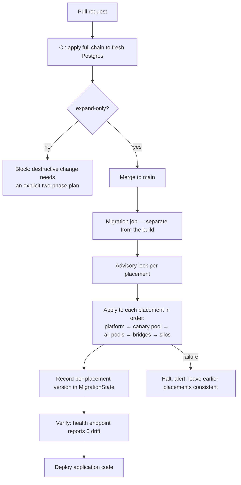

**[JUDGEMENT]** Three changes from today:

1. **Separate migration from build.** A migration is a database operation, not a build step. Run it as its own job that must succeed before the deploy proceeds. Keep the existing production-only guard.
2. **Add per-placement `MigrationState`** (§10.2) so "which placements are at which version?" is a query.
3. **Enforce expand/contract in CI.** A migration containing `DROP COLUMN`, `DROP TABLE`, a narrowing `ALTER TYPE`, or a `NOT NULL` addition without a default fails the build unless a marker file explicitly declares the two-phase plan.

### 20.4 Expand/contract — the only safe pattern

Because old and new application code run simultaneously during any rolling deploy, **every migration must be backward compatible with the currently-running code**:

```
Release N   : ADD nullable column, backfill in batches, dual-write   (expand)
Release N+1 : read from the new column, stop reading the old
Release N+2 : stop writing the old column
Release N+3 : DROP the old column                                    (contract)
```

Four releases to remove a column. That is the price of zero-downtime, and it is not negotiable once real customers' books are live.

### 20.5 The `organizationId` backfill — the concrete V1 migration

This is the prerequisite for RLS (§1.4) and the largest single piece of schema work.

**Tables:** `voucher_entries`, `invoice_items`, `invoice_taxes`, `bill_items`, `bill_taxes`, `invoice_payments`, `stocks`, `batches`, `stock_movements`, `sales_order_items`, `quotation_items`, `purchase_order_items`, `bom_items`, `item_units`, `bank_transactions`, `bank_reconciliations`, `attendances`, `leaves`, `payslips`, `expense_claims`, `budget_lines`, `approval_workflow_steps`, `fiscal_periods`.

**Sequence per table:**

```sql
-- Phase 1 — expand (fast, no lock of consequence)
ALTER TABLE voucher_entries ADD COLUMN "organizationId" text;

-- Phase 2 — backfill in bounded batches, off-peak, resumable
UPDATE voucher_entries e
   SET "organizationId" = v."organizationId"
  FROM vouchers v
 WHERE v.id = e."voucherId"
   AND e."organizationId" IS NULL
   AND e.id IN (SELECT id FROM voucher_entries
                 WHERE "organizationId" IS NULL LIMIT 10000);
-- repeat until 0 rows affected

-- Phase 3 — application dual-writes the column (deploy)

-- Phase 4 — constrain and index
CREATE INDEX CONCURRENTLY idx_ve_org_voucher
  ON voucher_entries ("organizationId", "voucherId");

ALTER TABLE voucher_entries
  ADD CONSTRAINT ve_org_not_null CHECK ("organizationId" IS NOT NULL) NOT VALID;
ALTER TABLE voucher_entries VALIDATE CONSTRAINT ve_org_not_null;   -- no full-table lock

-- Phase 5 — the invariant that prevents a mis-stamped child row
ALTER TABLE voucher_entries
  ADD CONSTRAINT ve_org_matches_parent
  FOREIGN KEY ("organizationId", "voucherId")
  REFERENCES vouchers ("organizationId", id);   -- requires a composite unique on vouchers

-- Phase 6 — RLS
ALTER TABLE voucher_entries ENABLE ROW LEVEL SECURITY;
ALTER TABLE voucher_entries FORCE ROW LEVEL SECURITY;
CREATE POLICY tenant_isolation ON voucher_entries
  USING      ("organizationId" = current_setting('app.current_org', true))
  WITH CHECK ("organizationId" = current_setting('app.current_org', true));
```

**Phase 5 is the subtle and important one.** A composite foreign key on `(organizationId, parentId)` makes it structurally impossible for a child row to claim a different tenant from its parent. Without it, a bug could stamp a `voucher_entry` with tenant B while its `voucher` belongs to tenant A — and RLS would then faithfully hide that row from its own owner while showing it to the wrong tenant. The composite FK converts a possible data-corruption bug into an immediate constraint violation.

**`NOT VALID` then `VALIDATE`** is used deliberately: it avoids the full-table `ACCESS EXCLUSIVE` lock that a plain `SET NOT NULL` takes.

**Effort estimate [ASSUMPTION]:** 23 tables × (~1 h engineering + backfill time proportional to rows). At current data volumes this is **3–5 engineering days plus off-peak backfill windows**. At 100 M rows it would be weeks — which is the argument for doing it **now**.

### 20.6 Migration safety rules

1. Never `DROP` in the same release that stops using something.
2. Never add `NOT NULL` without a default in one step.
3. Never rename — add, dual-write, migrate reads, drop.
4. Always `CREATE INDEX CONCURRENTLY` in production.
5. Every migration must be tested against a **production-sized** dataset before release.
6. Every migration must state its expected duration; anything over 60 s runs as a background job, not a deploy step.
7. Keep the existing production-only guard **[VERIFIED-REPO]** — it exists because of a real incident.
8. Keep the health-endpoint drift check and alert on it.

***

## 21. Provisioning

### 21.1 The flow

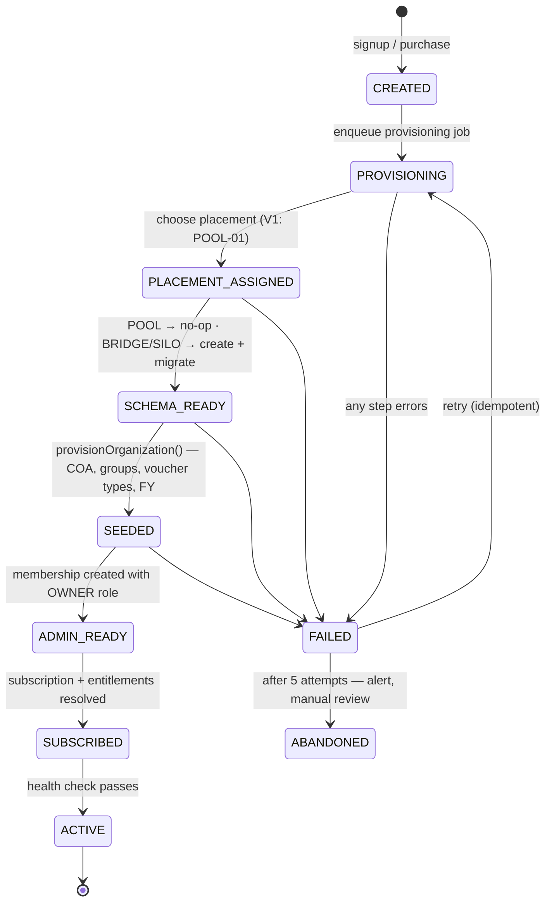

### 21.2 Failure handling at each step

**[JUDGEMENT]** Every step must be **idempotent** and the whole flow **resumable**, because partial provisioning is the normal failure and it must never leave a half-usable tenant.

| Step | Failure | Handling |
|---|---|---|
| Create tenant row | duplicate slug | unique constraint; return existing on same request id |
| Assign placement | no capacity | queue, alert; do not fail the signup |
| Create schema (BRIDGE/SILO) | provisioning error | retry with backoff; after 5, alert and fall back to POOL |
| Migrate | migration error | halt, alert; tenant stays `PROVISIONING`, never `ACTIVE` |
| **Seed** | partial seed | **idempotent upsert — already true [VERIFIED-REPO]** |
| Create admin membership | user already member | idempotent |
| Activate subscription | payment webhook late | activate on **trial**, upgrade on webhook (§33) |
| Resolve entitlements | compute error | retry; deny-by-default until resolved |
| Health check | fails | remain `PROVISIONING`, alert |

### 21.3 What already exists and is right

**[VERIFIED-REPO]** `src/backend/services/organization/provision.ts` is a genuinely good piece of design. Its docstring records that `prisma/seed.ts` and `POST /api/auth/register` previously built tenants differently, and that self-registered tenants were consequently unable to record a single payment because the posting layer looks up ledger groups *by name* and those names were missing. It now defines `POSTING_CRITICAL_GROUPS` explicitly and is idempotent by upsert.

**[JUDGEMENT]** Keep this exactly as it is; it is already the "seed" step of the state machine above. Two additions: (1) invoke it from the provisioning **job** rather than inline in the registration request, so a slow seed does not slow signup and a failed seed is retryable; (2) add a **verification step** that asserts every `POSTING_CRITICAL_GROUP` exists before the tenant is marked `ACTIVE` — turning a runtime error into a provisioning error.

### 21.4 Provisioning must be asynchronous

Today registration provisions inline. At V1 volumes that is fine. **[JUDGEMENT]** Move it to a job before launch anyway: signup latency should be ~200 ms, provisioning takes seconds and will take longer as the default chart of accounts grows, and an inline failure leaves a half-created tenant with no retry path. The user experience is "your workspace is being prepared" for two seconds — which is also the correct UX for BRIDGE/SILO tenants later, where it genuinely takes minutes.

***

## 22. Tenant Lifecycle

### 22.1 States

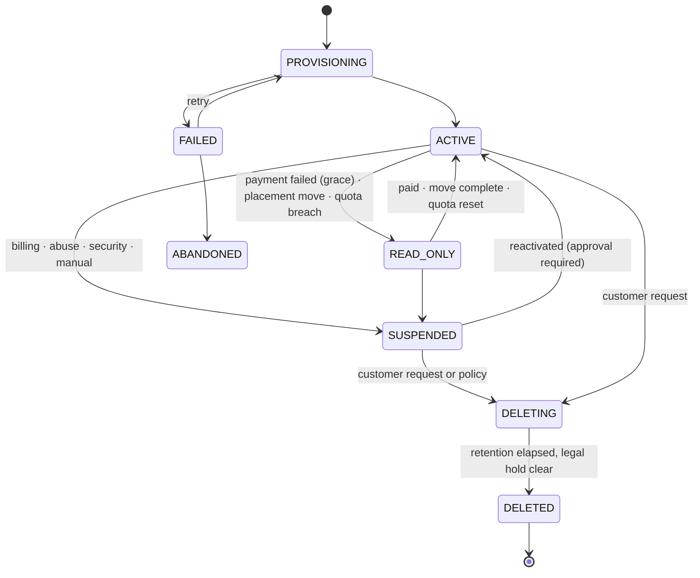

**[VERIFIED-REPO]** Today this is one boolean, `Organization.isActive`. That is not enough to run a business: it cannot express "payment failed, still in grace", "being moved", or "deleted but within retention".

### 22.2 What each state permits

| State | Read | Write | Login | Jobs | Exports | API keys | Billed |
|---|---|---|---|---|---|---|---|
| `PROVISIONING` | ✗ | ✗ | ✗ | setup only | ✗ | ✗ | ✗ |
| `ACTIVE` | ✓ | ✓ | ✓ | ✓ | ✓ | ✓ | ✓ |
| `READ_ONLY` | ✓ | ✗ | ✓ | reads only | ✓ | read scopes | ✓ |
| `SUSPENDED` | ✗ | ✗ | ✓ (to billing page only) | ✗ | ✓ **on request** | ✗ | depends |
| `DELETING` | ✗ | ✗ | ✗ | purge only | ✗ | ✗ | ✗ |
| `DELETED` | ✗ | ✗ | ✗ | ✗ | ✗ | ✗ | ✗ |

**[JUDGEMENT] `READ_ONLY` is the most important state and the one most often missing.** For an accounting product, cutting off access to the books over a failed card is disproportionate and, during GST filing week, actively harmful to the customer. Read-only preserves their legal ability to see and export their records while creating real pressure to pay. It is also the correct state during a placement move (§19.4).

**Even in `SUSPENDED`, data export must remain possible on request.** These are the customer's statutory books. Holding them hostage is both wrong and, quite possibly, a legal problem — §48, legal review required.

### 22.3 Suspension

| Reason | Trigger | Grace | Notification | Reversal |
|---|---|---|---|---|
| Billing | payment failed after N retries | 7–14 days `READ_ONLY` first | day 1, 3, 7, 14 | automatic on payment |
| Abuse | detection or report | none | immediate | manual, approval required |
| Security | credential compromise suspected | none | immediate | after investigation |
| Manual | operator | n/a | immediate | approval required |
| Legal | order | none | as advised | as advised |

Every suspension writes a `PlatformAuditLog` row with actor, reason and approval. **[JUDGEMENT]** Suspension must be *reversible without data loss* in every case — nothing about suspension may delete or degrade data.

### 22.4 Deletion, and proving it happened

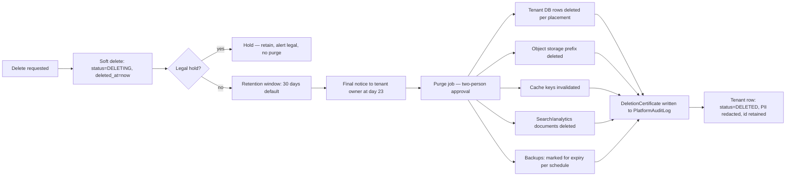

**Proving deletion.** The brief asks for this specifically. A **DeletionCertificate** is an immutable `PlatformAuditLog` record containing: tenant id, requester, approvers (two), timestamp, per-store row/object counts deleted, checksums of the pre-deletion export if one was taken, the backup expiry date after which the data is unrecoverable, and the operator identities. It is retained after the tenant is gone — that is its purpose.

**Backups are the honest caveat.** Data in an encrypted backup persists until that backup expires. **[JUDGEMENT]** Say so explicitly in the privacy policy: "deleted within 30 days from live systems; purged from backups within N days as backups roll off". Claiming instant total erasure while backups exist is a false statement. **[Legal review required — §48]**

**Retention conflict.** Indian statute may require retention of books of account for a number of years *after* a user asks for deletion under DPDP. **[JUDGEMENT]** Architecture must support "delete the personal data, retain the statutory financial records in a form that does not identify the individual" — which requires classifying every column (§48.3). **This is the single compliance area most likely to require real legal input, and it should get it before launch, not after the first request.**

***
## 23. Subscription

### 23.1 Current state and the commercial consequence

**[VERIFIED-REPO]** There is no `Plan`, `Subscription`, `Feature`, `Entitlement`, `Usage` or `BillingAccount` model. **AccuBook cannot currently charge anyone, gate anything, or meter anything.** For a product that is otherwise this far along — 74 models, GST returns, e-invoicing, payroll, manufacturing — this is the most consequential gap in the system, and it is commercial rather than technical.

### 23.2 Model

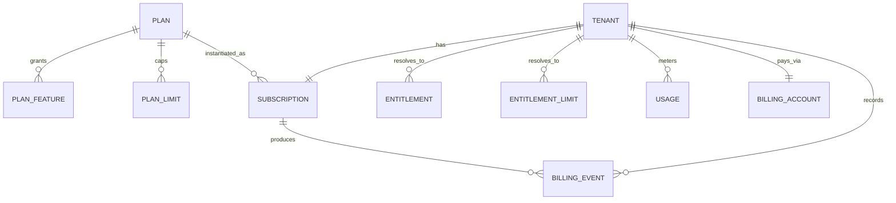

### 23.3 Plans **[ASSUMPTION — commercial input required]**

| | FREE | STARTER | PRO | ENTERPRISE |
|---|---|---|---|---|
| Users | 1 | 3 | 15 | unlimited |
| Branches | 1 | 1 | 5 | unlimited |
| Invoices/month | 25 | 300 | 3,000 | unlimited |
| Storage | 100 MB | 2 GB | 20 GB | negotiated |
| INVOICING | ✓ | ✓ | ✓ | ✓ |
| GST returns | view only | ✓ | ✓ | ✓ |
| E-invoice / e-way bill | ✗ | ✗ | ✓ | ✓ |
| INVENTORY | ✗ | basic | ✓ | ✓ |
| PAYROLL | ✗ | ✗ | ✓ | ✓ |
| MANUFACTURING | ✗ | ✗ | ✗ | ✓ |
| ADVANCED_REPORTS | ✗ | ✗ | ✓ | ✓ |
| API_ACCESS | ✗ | ✗ | ✓ | ✓ |
| Placement | POOL | POOL | POOL | BRIDGE/SILO |
| Support | community | email | priority | dedicated |

### 23.4 Lifecycle

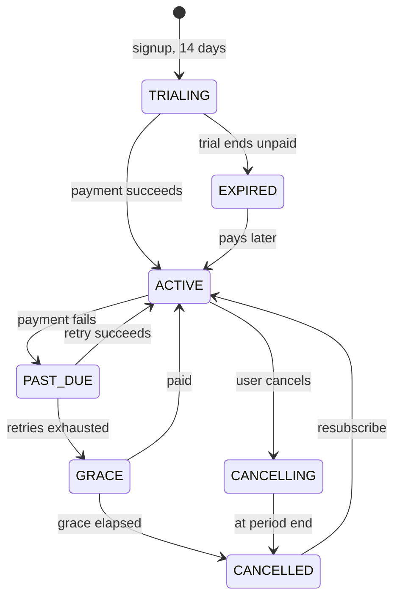

**[JUDGEMENT]** Map subscription state onto tenant state (§22): `TRIALING`/`ACTIVE` → tenant `ACTIVE`; `PAST_DUE` → `ACTIVE` (do not punish a failed retry immediately); `GRACE` → `READ_ONLY`; `CANCELLED`/`EXPIRED` → `READ_ONLY` for 30 days, then `SUSPENDED`. **Never delete data on cancellation.**

### 23.5 Upgrades, downgrades, dunning

**Upgrade:** immediate, prorated, entitlements recomputed synchronously so the feature is usable the moment payment succeeds.

**Downgrade:** takes effect **at period end**, and requires a **pre-check**: if the tenant currently has 12 users and the target plan allows 3, the downgrade must be refused with a specific message ("remove 9 users first"), not silently accepted and then enforced destructively.

**[JUDGEMENT] Never destroy data because of a downgrade.** A tenant dropping from PRO to STARTER keeps its payroll records; it simply cannot access the payroll module. Grandfather existing data, gate new writes. Deleting a customer's records because they paid less is indefensible for an accounting product.

**Dunning:** retry on days 1, 3, 5, 7 (**[VENDOR-CHECK — align with Razorpay's own retry schedule to avoid double-charging**]), with in-app and email notice at each step and a clear statement of what happens next.

***

## 24. Entitlements

### 24.1 The anti-pattern, and why it is worth avoiding properly

The brief is emphatic and correct. This is what not to do:

```ts
if (subscription.plan === "PRO") { /* allow payroll */ }
```

It fails because: a new plan requires a code change in every such site; a one-off customer concession is impossible without inventing a fake plan; a trial cannot grant a feature temporarily; the check cannot be audited; and nobody can answer "what does this tenant actually have?" without reading the whole codebase.

### 24.2 The model

**Four layers, resolved into one flat lookup:**

```
Plan (what you bought)
  + Overrides (what we granted you specifically)
  + Trial grants (temporary)
  + Add-ons (purchased separately)
  ────────────────────────────────
  = Entitlement (the effective, resolved answer)
```

```ts
// Feature gate — boolean
if (!ctx.entitlements.has("PAYROLL")) {
  return paymentRequired("Payroll requires the Pro plan", { feature: "PAYROLL" });
}

// Limit gate — numeric, checked against metered usage
const check = await checkLimit(ctx.organizationId, "MAX_INVOICES_MONTH");
if (check.exceeded) {
  return paymentRequired(
    `Monthly invoice limit reached (${check.limit}). Upgrade or wait until ${check.resetsAt}.`,
    { limit: "MAX_INVOICES_MONTH", used: check.used, limit_value: check.limit }
  );
}
```

**Where it belongs:** in `withOrgAuth`, as layer 4 of §14.1, resolved once per request from cache and attached to the tenant context — so a handler cannot forget it any more than it can forget the membership check.

**Which boundary it protects:** the commercial boundary. A leak here is revenue, not data — but it is also a support burden ("why did it work last week?").

**What can go wrong:** a stale cache after an upgrade means a paying customer cannot use what they just bought — the worst possible failure. **Mitigation: entitlement changes invalidate the cache synchronously and are also short-TTL'd (§27).** Fail *open* on cache errors for **read** operations and *closed* for **write** operations that create billable records.

**How to test:** a table-driven test asserting, for each plan, exactly which feature codes resolve true and false; plus a test that an override survives a plan change; plus a test that a trial grant expires.

### 24.3 Resolution and recomputation

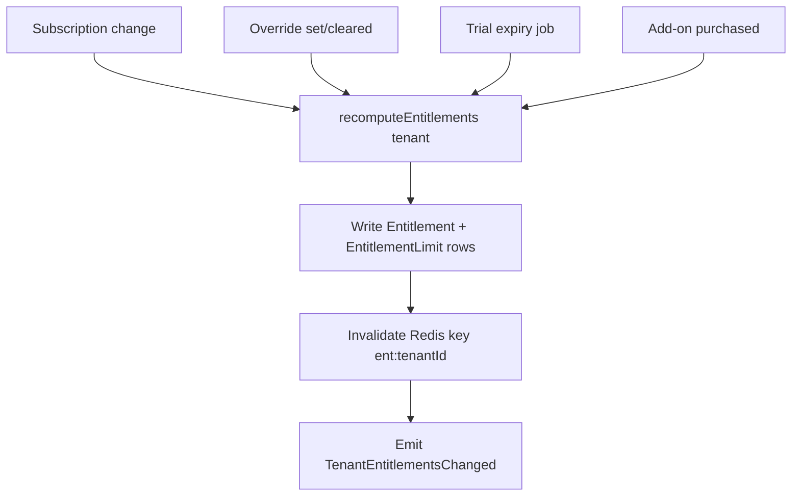

**[JUDGEMENT]** Resolved entitlements are materialised, not computed per request, for three reasons: the hot path becomes one cached lookup; overrides are expressible without fake plans; and history is auditable — "why did tenant X have PAYROLL on 3 April?" is answerable from the row and its `source`.

### 24.4 Usage metering

| Metric | Counted when | Reset | Enforcement |
|---|---|---|---|
| `INVOICES_CREATED` | invoice posted | monthly | hard block at limit |
| `USERS_ACTIVE` | membership active | continuous | block new invites |
| `BRANCHES` | branch created | continuous | block creation |
| `STORAGE_BYTES` | file uploaded/deleted | continuous | block upload at limit |
| `API_CALLS` | per authenticated key request | monthly | rate-limit, then block |
| `OCR_PAGES` | document extracted | monthly | hard block (real per-unit cost) |
| `EXPORTS` | export job completed | monthly | soft limit, alert |

**[JUDGEMENT]** Metering must be **incremental and transactional with the action**, not a nightly `COUNT(*)`. Increment the counter in the same transaction that posts the invoice; a nightly recount becomes a full scan of the largest tables, and it lets a tenant exceed a limit all day before anyone notices.

**`OCR_PAGES` deserves special attention** because it maps to a real external cost. **[VERIFIED-REPO]** `services/ocr/pricing.ts` already exists, which suggests this was anticipated. Metered, hard-limited, and surfaced to the tenant before they hit it.

***

## 25. Background Jobs

### 25.1 Current state

**[VERIFIED-REPO]** Two Vercel Cron endpoints — `/api/cron/check-overdue` (03:00) and `/api/cron/run-recurring` (04:00) — authenticated by `CRON_SECRET` with a constant-time compare that fails closed when unset. Both sweep every active organisation. There is no queue, no retry, no dead-letter, no visibility, and no way to run anything on demand.

**[JUDGEMENT]** This is correct for what it does and insufficient for what is coming. The functions that will force the issue are already in the repository: OCR extraction (seconds to minutes, costs money), Tally import (30 s transaction), bank statement import, GST return generation, payroll month-end posting, and report generation. All of these are already too slow or too costly to run inside an HTTP request at scale.

### 25.2 Recommendation — a PostgreSQL-backed queue

**[JUDGEMENT]** Use PostgreSQL with `SELECT … FOR UPDATE SKIP LOCKED`, either directly or via `pg-boss`. Not Redis, not SQS, not Kafka, not BullMQ.

Reasons, in order of importance:

1. **Transactional enqueue.** Enqueueing a job in the *same transaction* as the business write eliminates the entire class of "the invoice posted but the email never queued" bugs — for free, with no outbox table (§26.5).
2. **One fewer system.** No new datastore, no new failure mode, no new backup, no new dashboard.
3. **Sufficient throughput.** `SKIP LOCKED` handles thousands of jobs/second, which is orders of magnitude beyond §5.3's requirement (~50/s at 100k tenants).
4. **Durability by default.** Jobs survive restarts because they are rows in a database you already back up.
5. **Debuggable with SQL.** "Show me every failed job for tenant X this week" is a query, not a vendor dashboard.

**Why not the alternatives:** Redis queues lose jobs on failover unless carefully configured, and add a datastore. SQS is durable and cheap but cannot be enqueued transactionally with a Postgres write, forcing an outbox. Kafka is a log, not a job queue, and is enormous operational surface for a small team. BullMQ is good but requires Redis and is Node-specific.

**Revisit when** sustained throughput exceeds ~5,000 jobs/second or job data outgrows the primary — neither of which occurs on the trajectory in §5.3.

### 25.3 Schema

```sql
CREATE TABLE jobs (
  id             uuid PRIMARY KEY DEFAULT gen_random_uuid(),
  queue          text NOT NULL DEFAULT 'default',
  type           text NOT NULL,
  -- Tenant scope. NULL is legal ONLY when scope='PLATFORM'; the CHECK enforces it.
  tenant_id      text,
  scope          text NOT NULL CHECK (scope IN ('TENANT','PLATFORM')),
  payload        jsonb NOT NULL,
  idempotency_key text,
  priority       int  NOT NULL DEFAULT 100,       -- lower runs first
  run_at         timestamptz NOT NULL DEFAULT now(),
  attempts       int  NOT NULL DEFAULT 0,
  max_attempts   int  NOT NULL DEFAULT 5,
  status         text NOT NULL DEFAULT 'PENDING',  -- PENDING RUNNING SUCCEEDED FAILED DEAD CANCELLED
  locked_by      text,
  locked_at      timestamptz,
  last_error     text,
  created_at     timestamptz NOT NULL DEFAULT now(),
  completed_at   timestamptz,
  CONSTRAINT tenant_scope_required
    CHECK ((scope = 'TENANT' AND tenant_id IS NOT NULL)
        OR (scope = 'PLATFORM' AND tenant_id IS NULL))
);

CREATE INDEX idx_jobs_claim ON jobs (queue, priority, run_at)
  WHERE status = 'PENDING';
CREATE UNIQUE INDEX idx_jobs_idem ON jobs (tenant_id, type, idempotency_key)
  WHERE idempotency_key IS NOT NULL;
```

**`tenant_scope_required` is the most important line in this schema.** It makes "a background job without tenant context" — the failure mode the brief calls out — **impossible to insert**. A tenant job with no tenant is rejected by the database. A platform job must declare itself as such, explicitly, in writing, in the row.

### 25.4 Claiming a job

```sql
UPDATE jobs SET status='RUNNING', locked_by=$1, locked_at=now(), attempts=attempts+1
WHERE id = (
  SELECT id FROM jobs
   WHERE status='PENDING' AND run_at <= now() AND queue = $2
   ORDER BY priority, run_at
   FOR UPDATE SKIP LOCKED
   LIMIT 1
)
RETURNING *;
```

`SKIP LOCKED` is what makes many workers safe without any coordination: each skips rows another worker holds. No Redis, no leader election, no distributed lock.

### 25.5 Worker: tenant context is asserted, not assumed

```ts
async function runJob(job: Job) {
  if (job.scope === "TENANT") {
    if (!job.tenant_id) throw new Error("TENANT job without tenant_id");   // belt and braces
    const tenant = await getTenant(job.tenant_id);
    if (tenant.status !== "ACTIVE" && tenant.status !== "READ_ONLY") {
      return cancel(job, `tenant ${tenant.status}`);   // don't work for suspended tenants
    }
    return runInTenant({ organizationId: job.tenant_id, /* … */ }, () =>
      handlers[job.type](job.payload)
    );
  }
  // PLATFORM scope: explicit, audited, and forbidden from returning tenant rows.
  return runInPlatformScope(() => handlers[job.type](job.payload));
}
```

**Why it exists:** to make the dangerous case loud. **What can go wrong:** a handler registered under the wrong scope — mitigated by a startup assertion that every handler declares its scope and that the declaration matches every enqueue site. **How to test:** enqueue a `TENANT` job for tenant A, run it, assert it cannot read tenant B (part of the §53.2 matrix).

### 25.6 Job catalogue

| Job | Scope | Priority | Idempotency | Max attempts |
|---|---|---|---|---|
| `provision.tenant` | PLATFORM | 10 | request id | 5 |
| `email.send` | TENANT | 50 | message id | 5 |
| `invoice.send` | TENANT | 50 | invoice id + version | 3 |
| `report.generate` | TENANT | 100 | params hash | 2 |
| `export.generate` | TENANT | 100 | params hash | 2 |
| `import.process` | TENANT | 100 | upload id | 1 (resumable inside) |
| `ocr.extract` | TENANT | 80 | document id | 3 |
| `gst.return.generate` | TENANT | 60 | period + type | 3 |
| `payroll.post.month` | TENANT | 30 | org + period | 1 (**strict**) |
| `recurring.invoice.run` | TENANT | 40 | schedule + date | 3 |
| `overdue.check` | TENANT | 90 | date | 3 |
| `usage.rollup` | PLATFORM | 90 | period | 3 |
| `entitlement.recompute` | PLATFORM | 20 | tenant + version | 5 |
| `tenant.purge` | PLATFORM | 10 | tenant id | 1 (**approval-gated**) |
| `placement.move` | PLATFORM | 10 | tenant + target | 1 (resumable) |

**Note the change of shape for scheduled work:** today's crons sweep all tenants in one execution. The target replaces each with a **platform-scoped scheduler job that enqueues one tenant-scoped job per tenant.** One tenant's failure then affects only that tenant, each retries independently, and progress is visible per tenant. That is the single most valuable change in this section.

### 25.7 Retries, DLQ, idempotency

Exponential backoff with jitter: `min(2^attempts × 30 s, 1 h) ± 20%`. Jitter matters — without it, a downstream outage produces synchronised retry storms.

After `max_attempts` → `status='DEAD'`, alert, and require an operator to inspect and requeue. **[JUDGEMENT] Never auto-purge the dead-letter queue.** A dead job for a financial operation is evidence.

**Every handler must be idempotent**, because at-least-once delivery is the only guarantee a durable queue can give cheaply. Mechanisms: unique constraints (`payroll` per org+period), idempotency keys (external calls), and state checks (`if (invoice.status === 'SENT') return`).

***

## 26. Queues

### 26.1 Queue topology

| Queue | Workers | Concurrency | Why separate |
|---|---|---|---|
| `critical` | 2 | 4 each | provisioning, entitlements, payments — must never wait behind an import |
| `default` | 2 | 8 each | email, notifications, ordinary work |
| `reports` | 1–2 | 2 each | CPU/memory heavy; low concurrency prevents OOM |
| `imports` | 1 | 2 | long-running; **isolated so one tenant's 100k-row import cannot starve anything** |
| `ocr` | 1 | 4 | external API bound; concurrency limited by the provider's rate limit |

**[JUDGEMENT]** Separate queues are the cheapest and most effective noisy-neighbour control available (§39). One tenant importing 100,000 transactions cannot delay another tenant's password-reset email, because they are not in the same queue.

### 26.2 Fairness within a queue

Priority alone is not fair: a tenant enqueuing 10,000 jobs at priority 100 starves every other tenant at priority 100. **[JUDGEMENT]** Add a per-tenant in-flight cap:

```sql
-- claim only if this tenant has fewer than N jobs RUNNING in this queue
AND (SELECT count(*) FROM jobs j2
      WHERE j2.tenant_id = jobs.tenant_id
        AND j2.queue = jobs.queue
        AND j2.status = 'RUNNING') < 3
```

Simple, effective, and it converts "one tenant blocked everyone" into "one tenant's own work took longer".

### 26.3 Scheduled jobs

Replace Vercel Cron's direct endpoint invocation with a scheduler that **enqueues**:

```mermaid
graph LR
    C[Scheduler tick] --> S[Platform job: schedule.dispatch]
    S --> E{for each ACTIVE tenant}
    E --> J1[enqueue overdue.check tenant=A]
    E --> J2[enqueue overdue.check tenant=B]
    E --> J3[…]
    J1 & J2 & J3 --> W[Workers, fairly scheduled]
```

Benefits over today: per-tenant failure isolation, per-tenant retry, visible progress, natural rate-limiting, and no single 10-minute function that must not time out.

**Keep the existing `CRON_SECRET` constant-time authentication** **[VERIFIED-REPO]** — it is correct, and it now protects the scheduler trigger instead of the work itself.

### 26.4 Long-running jobs

Vercel functions have a hard duration ceiling **[VENDOR-CHECK]**. Bulk import, OCR of a large PDF, and full-year report generation will exceed it.

**[JUDGEMENT]** This is the reason for a **separate long-running worker process** — a small container on Fly.io / Railway / Render / ECS running the same codebase with a different entrypoint. This is the *only* process split recommended for V1, and it is justified by a runtime constraint, not by an architectural preference.

### 26.5 The outbox pattern — and why AccuBook mostly does not need it

The outbox pattern exists to solve: *the database transaction committed but the message was never published* (or vice versa).

**[JUDGEMENT] With a PostgreSQL-backed queue, the problem disappears by construction**, because enqueueing *is* a database write in the same transaction:

```ts
await prisma.$transaction(async (tx) => {
  const invoice = await postInvoice(tx, data);      // business write
  await enqueue(tx, "invoice.send", { id: invoice.id });  // same transaction
});
// Either both happened or neither did. No outbox. No dual-write problem.
```

**This is a significant, concrete argument for the Postgres queue over SQS/Redis** and is worth stating plainly: choosing SQS would require building and operating an outbox and its relay. Choosing Postgres makes the outbox unnecessary.

An outbox becomes necessary only if AccuBook later publishes to an external broker (Kafka, SNS) for third-party consumers. At that point, the `jobs` table *is* the outbox and a relay drains it.

### 26.6 Bulk imports

The riskiest job class: large, slow, partially-failing, and financially consequential. **[VERIFIED-REPO]** `services/migration/tally.ts` and `services/banking/statement-import.ts` already exist and already push against transaction limits.

```mermaid
graph TD
    U[Upload file] --> S[Store in object storage · tenant prefix]
    S --> V[Validate: format, size, row count, encoding]
    V --> ST[Stage rows in import_rows with status=PENDING]
    ST --> P[Preview to user: N valid, M invalid, with reasons]
    P --> C{User confirms?}
    C -->|no| X[Discard staged rows]
    C -->|yes| B[Process in batches of 500, each its own transaction]
    B --> R[Per-row result recorded: OK / ERROR with reason]
    R --> D[Report: X imported, Y failed, downloadable error CSV]
```

Principles: **stage, then commit** — never write directly from an uploaded file; **batch transactions** — one transaction for 100,000 rows will time out and will hold locks for minutes; **partial success is a first-class outcome** — report exactly which rows failed and why; **resumable** — a worker restart continues from the last committed batch; **cancellable** — a user must be able to stop a running import, and cancellation must be safe.

**[JUDGEMENT] For opening balances specifically, partial success is *not* acceptable** — half-imported opening balances leave the books unbalanced. That import must be all-or-nothing, which means it must be size-limited so it fits in one transaction, or staged and applied as a single balanced journal.

***
## 27. Caching

### 27.1 Does AccuBook need Redis?

**[JUDGEMENT] Yes — but for a narrow, specific set of uses, and not as a database.** **[VERIFIED-REPO]** Upstash Redis is already integrated for rate limiting.

| Use | Needed? | Why |
|---|---|---|
| **Rate limiting** | ✅ **yes** | Requires shared state across serverless instances. In-memory counters do not work when there are 200 lambdas. |
| **Tenant metadata cache** | ✅ **yes** | 4 control-plane reads on every request (§10.4) |
| **Entitlement cache** | ✅ **yes** | Same path, changes rarely |
| **Placement cache** | ✅ **yes** | Same path, changes almost never |
| **Distributed locks** | ⚠️ **prefer Postgres advisory locks** | Redis locks are subtly wrong under failover; Postgres advisory locks are correct and already available |
| **Session store** | ❌ no | JWT sessions; adding a session store would be a step backwards |
| **Job queue** | ❌ no | §25.2 |
| **Idempotency records** | ❌ no | Must be durable and transactional → Postgres |
| **Report cache** | ⚠️ **object storage instead** | Reports are large; Redis is expensive per MB |
| **Ledger balances / financial data** | ❌ **never** | See §27.4 |

### 27.2 What to cache, with TTLs

| Key | Contents | TTL | Invalidated by |
|---|---|---|---|
| `tenant:{id}` | status, name, placement, plan code | 5 min | tenant/subscription change |
| `ent:{tenantId}` | resolved feature set + limits | 5 min | entitlement recompute |
| `member:{userId}:{tenantId}` | role id, permissions, branch scope | 2 min | membership/role change |
| `placement:{tenantId}` | placement id | 1 h | placement move |
| `rl:{scope}:{key}` | rate-limit counter | window | expiry |
| `usage:{tenantId}:{metric}:{period}` | counter | 1 min write-behind | rollup |
| `lastwrite:{tenantId}` | timestamp, for replica routing (§18.3) | 30 s | expiry |

**[JUDGEMENT]** Short TTLs **plus** explicit invalidation. TTL alone means a revoked membership stays valid for its TTL — unacceptable for an authorisation decision. Explicit invalidation alone means a missed invalidation is permanent. Both together mean a missed invalidation self-heals within minutes.

### 27.3 Cache failure behaviour

**[JUDGEMENT]** This must be decided deliberately per key class, and it is the kind of decision that gets made by accident otherwise:

| Key class | On Redis failure | Rationale |
|---|---|---|
| Rate limits | **fail open** (allow) | **[VERIFIED-REPO]** current behaviour, and correct — locking out every user because Upstash hiccuped is worse than letting a brute-forcer through for a few minutes |
| Tenant metadata | fall through to Platform DB | correctness over speed |
| Entitlements | fall through to DB; if DB also unreachable, **deny writes, allow reads** | a brief inability to create an invoice beats granting unpaid features |
| Membership | **fall through to DB — never fail open** | this is an authorisation decision |
| Placement | fall through to DB; if unavailable, use the last known value with an alert | §52.6 |

### 27.4 What must never be cached

**[JUDGEMENT]** Ledger balances, trial balance, P&L, balance sheet, stock quantities, invoice totals, GST liability, TDS/TCS thresholds.

The reason is not performance. It is that **a cached financial figure is a wrong financial figure waiting to be displayed.** A user posts a journal and the trial balance still shows the old number: they now believe either the posting failed or the books are wrong. Both destroy trust in an accounting product, and trust is the entire product.

Where reports genuinely need acceleration, use **materialised summary tables refreshed inside the posting transaction** (§29.4) — which are always consistent with the ledger because they are updated by the same transaction — not a TTL cache which is, by definition, sometimes stale.

***

## 28. File Storage

### 28.1 Current state

**[VERIFIED-REPO]** `src/backend/services/documents/storage.ts`: two drivers — Vercel Blob when `BLOB_READ_WRITE_TOKEN` is present, local filesystem otherwise. Keys are `documents/{orgId}/{uuid}.{ext}`. The extension is sanitised against `/^[a-z0-9]{1,8}$/`, and local path resolution refuses anything escaping the upload root. The docstring states that blob URLs are never handed to the browser: files are served through an org-scoped API route.

**[JUDGEMENT]** This is a good design and the two most important properties — **tenant-prefixed keys** and **never exposing the raw storage URL** — are already right.

### 28.2 Target

```mermaid
graph LR
    U[User] -->|1 · request upload| A[API · withOrgAuth + entitlement + storage quota]
    A -->|2 · presigned PUT, ≤5 min, content-type + size pinned| U
    U -->|3 · PUT direct to storage| S[(Object storage)]
    U -->|4 · confirm| A
    A -->|5 · verify object exists, size, type| S
    A -->|6 · row in documents, usage += size| D[(Tenant DB)]
    A -->|7 · enqueue scan + ocr| Q[(jobs)]
```

Downloads mirror it: the API checks membership, role and the **row's own `organizationId` under RLS**, then issues a short-lived presigned GET.

**[JUDGEMENT] The single most important rule: a signed URL is issued only after the database row has been read under RLS.** The key prefix (`documents/{orgId}/`) is a convenience for listing and lifecycle; **it is not an access control.** If authorisation is ever derived from the key string rather than from a row the caller is allowed to see, a path-manipulation bug becomes a cross-tenant file breach.

### 28.3 Controls

| Control | V1 | Later |
|---|---|---|
| Tenant-prefixed keys | ✅ exists | — |
| Unguessable object names (uuid) | ✅ exists | — |
| Signed URLs only, short expiry | via API route ✅ | presigned direct (≤ 5 min) |
| Server-side encryption at rest | provider default | customer-managed keys for SILO |
| TLS in transit | ✅ | — |
| Content-type allow-list | ⚠ extension only today | validate magic bytes, not extension |
| Size limit | ⚠ verify | per-plan, enforced in the presign |
| **Malware scanning** | ❌ | ClamAV or a scanning API in the `ocr` queue; quarantine until clean |
| Storage quota per tenant | ❌ | `STORAGE_BYTES` metering (§24.4) |
| Lifecycle tiering | ❌ | infrequent-access after 90 d, archive after 1 y |
| Deletion on tenant purge | ❌ | prefix delete + certificate (§22.4) |
| CDN | ❌ | only for public assets — **never** for tenant documents |

**[JUDGEMENT] Malware scanning is the notable gap.** AccuBook accepts uploads (invoices, receipts, bank statements) and OCRs them. An uploaded file that is later downloaded by an accountant is a plausible malware vector, and "we scanned it" is a question enterprise buyers ask. Not V1-blocking, but before enterprise sales.

**Content-type validation by extension is insufficient.** `evil.exe` renamed `invoice.pdf` passes the current regex. Validate magic bytes.

### 28.4 Storage provider

| Option | V1 | Notes |
|---|---|---|
| **Vercel Blob** | ✅ **current, keep for V1** | Zero ops, already integrated. **[VENDOR-CHECK: size limits, pricing at TB scale]** |
| Cloudflare R2 | strong Stage 3 candidate | S3-compatible, **no egress fees** — significant at 20–60 TB (§5.3) |
| AWS S3 (ap-south-1) | Stage 4 | Best when the rest moves to AWS; India residency |

**[JUDGEMENT]** Keep Vercel Blob for V1; the migration trigger is cost — model it once storage passes ~1 TB. Because access already goes through an org-scoped API route rather than raw URLs, swapping the driver is a contained change (the file already has a `StorageDriver` abstraction **[VERIFIED-REPO]**).

***

## 29. Reporting

### 29.1 Why this is the hardest scaling problem in the product

Accounting reporting is not CRUD reading. A trial balance aggregates every posted entry for a period. A balance sheet needs opening balances, which need every prior entry. GSTR-1 needs every outward supply with HSN, place-of-supply and rate breakdowns. These are **the queries most likely to time out, most likely to be run on the busiest days (GST filing dates), and least tolerant of being wrong.**

**[VERIFIED-REPO]** `services/reports/registers.ts` and the GST services run synchronously inside request handlers.

### 29.2 Tiering

**[JUDGEMENT]** Three tiers by expected cost:

| Tier | Criterion | Execution | Target |
|---|---|---|---|
| **T1 — instant** | single period, ≤ ~10k entries | sync, read replica | < 1 s |
| **T2 — interactive** | ≤ 1 FY, ≤ ~50k entries | sync with a hard `statement_timeout`, streamed | < 3 s |
| **T3 — heavy** | > 1 FY, > 50k entries, or any full-book export | **async job → object storage → signed URL** | < 5 min |

Route by an **estimated** cost — count of `voucher_entries` in range, available from the partition statistics — computed *before* running. A T3 request returns `202 Accepted` with a job id, not a timeout.

### 29.3 Async report flow

```mermaid
sequenceDiagram
    participant U as User
    participant A as API
    participant Q as jobs (Postgres)
    participant W as Worker
    participant R as Read replica
    participant S as Object storage
    U->>A: POST /reports/trial-balance {FY 2025-26}
    A->>A: estimate cost → T3
    A->>Q: enqueue report.generate (tenant_id REQUIRED)
    A-->>U: 202 {jobId}
    W->>Q: claim (SKIP LOCKED)
    W->>W: runInTenant(tenant_id) — RLS context set
    W->>R: aggregate (statement_timeout 120s)
    W->>S: write PDF/XLSX to reports/{orgId}/{jobId}.xlsx
    W->>Q: SUCCEEDED
    W->>U: notification (in-app + email)
    U->>A: GET /reports/{jobId}/download
    A->>A: verify membership + row under RLS
    A-->>U: 302 → signed URL, 5 min expiry
```

**Tenant isolation is maintained at four points and each must be tested:** the job row carries `tenant_id` (NOT NULL by constraint); the worker sets RLS context; the storage key is tenant-prefixed; and the download route re-checks membership and reads the job row under RLS. **The last one is the one people forget** — without it, a valid `jobId` from another tenant downloads their trial balance.

### 29.4 Summary tables — the accounting-safe acceleration

**[JUDGEMENT]** Do not use materialised views with periodic refresh for financial figures; they are stale between refreshes, and stale is wrong (§27.4). Use **incrementally-maintained summary tables updated inside the posting transaction**:

```sql
CREATE TABLE ledger_period_balance (
  "organizationId" text NOT NULL,
  ledger_id        text NOT NULL,
  fiscal_year_id   text NOT NULL,
  period_month     int  NOT NULL,
  debit_total      numeric(18,4) NOT NULL DEFAULT 0,
  credit_total     numeric(18,4) NOT NULL DEFAULT 0,
  entry_count      int NOT NULL DEFAULT 0,
  PRIMARY KEY ("organizationId", ledger_id, fiscal_year_id, period_month)
);
```

Updated by the same transaction that writes `voucher_entries`, so it is **always exactly consistent with the ledger** — never stale. A trial balance becomes a sum over ~12 rows per ledger instead of a scan of millions of entries.

**The safeguard:** a nightly job recomputes the summaries from `voucher_entries` and **alerts on any discrepancy**. If the summary and the ledger ever disagree, that is a serious bug and you need to know within a day, not at year-end.

**Cost:** one extra `UPDATE … ON CONFLICT` per voucher entry inside an already-existing transaction, and per-tenant-per-ledger-per-month row contention. For AccuBook's write rates (§5.3: ~1,800 writes/s at peak *across all tenants*) this is comfortable.

### 29.5 OLTP vs OLAP

**[JUDGEMENT]** Everything in §29 is OLTP — it must be exact and current. Real OLAP (cross-tenant trends, cohort analysis, product usage) belongs in §30 and must never touch the primary.

***

## 30. Analytics

### 30.1 Three distinct things, frequently conflated

| Kind | Question | Consistency | Store |
|---|---|---|---|
| **Operational reporting** | "What is my trial balance?" | **exact, current** | tenant DB / replica (§29) |
| **Platform analytics** | "How many tenants churned in Q2?" | eventually consistent | analytics store |
| **Product analytics** | "Do users who try payroll retain better?" | eventually consistent | analytics store |

### 30.2 What V1 needs

**[JUDGEMENT] Almost nothing.**

- Platform analytics at 100–1,000 tenants: **SQL against the Platform DB**, or a read replica of it. The control plane is tiny. This is genuinely sufficient for a long time.
- Product analytics: a lightweight event pipeline (PostHog, or an `events` table) capturing feature usage, **with no financial values in the payload**.
- **Do not** build a warehouse, CDC pipeline, ClickHouse cluster or dbt project in V1. There is no question you have that they answer.

### 30.3 When a warehouse becomes justified

Two or more of: analytical queries measurably affecting production performance; cross-tenant analysis over >100 M rows needed regularly; a data or growth team exists to use it; or customers are asking for benchmarking features ("how does my gross margin compare to similar businesses?" — a genuinely valuable, and genuinely privacy-sensitive, product idea).

### 30.4 If and when it is built

```mermaid
graph LR
    P[(Primary)] -->|logical replication or CDC| L[Landing]
    L --> T[Transform: aggregate, pseudonymise]
    T --> W[(Warehouse)]
    W --> B[BI]
    P -.->|nightly export| S[Object storage — Parquet, partitioned by tenant+period]
```

**[JUDGEMENT]** Start with the dotted line, not the solid one: a nightly export to Parquet in object storage, queryable with DuckDB, costs almost nothing and answers most questions. CDC is a production dependency that can break production; earn it before you build it.

**Choice, when required:** ClickHouse for cost-efficient self-hosted analytics at scale; BigQuery for zero-ops with unpredictable query volume. **[VENDOR-CHECK]** Decide on data-residency grounds too (§48) — cross-tenant analytics leaving India may have DPDP implications.

**Non-negotiable: cross-tenant analytics must be aggregated or pseudonymised.** A benchmarking feature that lets one tenant infer another's revenue is a data breach with a product manager's name on it.

***

## 31. API Architecture

### 31.1 Current state

**[VERIFIED-REPO]** 122 route handlers; 110 under `/api/organizations/[orgId]/…`, all wrapped in `withOrgAuth`. Twelve are not org-scoped: `auth/*` (3), `cron/*` (2), `organizations`, `profile` (2), `currencies`, `units`, `hsn-search`, `health`. API keys exist with prefix + SHA-256 hash + scopes + expiry + revocation.

**[JUDGEMENT]** The URL design is good: putting `orgId` in the path makes the tenant boundary visible in every log line, every trace and every route file, which is worth more than the aesthetic appeal of inferring it from the session.

### 31.2 What V1 needs

| Concern | V1 | Later |
|---|---|---|
| REST | ✅ | — |
| GraphQL | ❌ not needed | only on strong client demand |
| Versioning | **add `/api/v1/…` now** | v2 when breaking |
| Pagination | **standardise cursor-based** | — |
| **Idempotency keys** | **add — financial writes** | all writes |
| Error format | **standardise** | RFC 9457 problem+json |
| Rate limiting | **extend to all routes** (§38) | per-plan tiers |
| Public API | keys exist ✅ | docs, sandbox, SDK |
| OAuth | ❌ | for third-party apps |
| Webhooks out | ❌ | §32 |

### 31.3 Versioning

**[JUDGEMENT]** Introduce `/api/v1/` **before** the public API has customers, because it is free now and expensive later. Internal UI routes may stay unversioned — but if the same handlers serve both, version them all. Rule: **additive changes never bump the version; removing or changing the meaning of a field always does.**

### 31.4 Pagination

Offset pagination degrades badly (`OFFSET 100000` scans 100,000 rows) and is unstable under concurrent inserts — a user paging through invoices while another is created sees duplicates. **[JUDGEMENT]** Use keyset/cursor pagination on `(createdAt, id)` with an opaque, signed cursor. Cap `limit` at 100. Return `nextCursor`, never a total count on large tables (`COUNT(*)` over millions of rows is itself the slow query).

### 31.5 Idempotency — required for financial operations

**[VERIFIED-REPO] This does not exist and it should, before launch.** An accounting system cannot tolerate duplicate operations, and duplicates are not hypothetical: a user double-clicks; a mobile client retries on a flaky connection; a gateway times out at 30 s while the server commits at 31 s and the client retries.

```sql
CREATE TABLE idempotency_keys (
  "organizationId" text NOT NULL,
  key            text NOT NULL,
  endpoint       text NOT NULL,
  request_hash   text NOT NULL,        -- detects key reuse with a different body
  status         text NOT NULL,        -- IN_PROGRESS | COMPLETED
  response_code  int,
  response_body  jsonb,
  created_at     timestamptz NOT NULL DEFAULT now(),
  expires_at     timestamptz NOT NULL,
  PRIMARY KEY ("organizationId", key)
);
```

Semantics: client sends `Idempotency-Key: <uuid>`. The server inserts the key **in the same transaction as the business write**. On conflict: if `COMPLETED` and `request_hash` matches, **replay the stored response**; if `IN_PROGRESS`, return **409** (a retry is racing the original); if the hash differs, return **422** (the key was reused for a different request — a client bug worth surfacing).

**Where it belongs:** a wrapper composed with `withOrgAuth`, applied to every financial mutation. **Which boundary it protects:** financial correctness. **What can go wrong:** storing the key outside the business transaction — then a crash between the two produces either a duplicate or a permanently-blocked key. **How to test:** fire the same request twice concurrently and assert exactly one invoice exists and both responses are identical (`tests/integration/support/concurrency.ts` **[VERIFIED-REPO]** already provides the harness).

**Apply to:** create/post invoice, bill, payment, receipt, journal voucher; payroll month post; stock adjustment; any import trigger; every inbound webhook.

### 31.6 Error format

```json
{
  "type":   "https://docs.accubook.in/errors/limit-exceeded",
  "title":  "Monthly invoice limit reached",
  "status": 402,
  "detail": "Your Starter plan allows 300 invoices per month. You have used 300.",
  "instance": "req_01J8XYZ",
  "limit": "MAX_INVOICES_MONTH", "used": 300, "resets_at": "2026-09-01T00:00:00+05:30"
}
```

**[JUDGEMENT]** Errors are product surface. "Something went wrong" in an accounting application at 11 p.m. on the 20th of the month is a support ticket and a churn risk. Every error should say what happened, why, and what to do next. Never leak internal details, stack traces, SQL, or the existence of other tenants' data.

***

## 32. Webhooks

### 32.1 Inbound

Sources: payment provider (Razorpay), email provider (bounces, complaints), later the GST IRP.

```mermaid
graph LR
    P[Provider] -->|POST| E[/api/webhooks/razorpay/]
    E --> V{Signature valid?}
    V -->|no| R1[401 · log · alert on repeats]
    V -->|yes| T{Timestamp within 5 min?}
    T -->|no| R2[400 · replay rejected]
    T -->|yes| I{provider_event_id seen?}
    I -->|yes| R3[200 · already processed]
    I -->|no| S[Store raw event · enqueue handler]
    S --> R4[200 immediately]
```

**[JUDGEMENT]** Five rules, each of which has burned somebody:

1. **Verify the signature before parsing the body.** Use the raw bytes; JSON round-tripping changes them and breaks HMAC comparison.
2. **Return 200 fast.** Store the raw event and enqueue; do not process inline. Providers time out and retry, and a slow handler becomes a duplicate storm.
3. **Deduplicate on the provider's event id** with a unique index. Providers deliver at-least-once, and re-deliver during their own incidents.
4. **Reject stale timestamps** — replay protection.
5. **Resolve the tenant from the event's stored mapping**, never from a tenant id inside the payload.

**Never trust frontend payment status.** The brief says this and it is the most important sentence in §33. The browser saying "payment succeeded" means the user's browser said so. Only the verified webhook (or a server-to-server verification call) may change subscription state.

### 32.2 Outbound — not V1

**[JUDGEMENT]** Defer until customers ask. When built: HMAC-signed with a per-endpoint secret, versioned payloads, at-least-once with exponential backoff over ~24 h, a dead-letter view the tenant can see and replay, an event id for consumer-side dedup, per-tenant delivery isolation (one tenant's dead endpoint must not delay another's), and **SSRF protection** — validate destination URLs against private IP ranges and metadata endpoints, resolve DNS at request time and re-check.

***

## 33. Payments

### 33.1 Provider

**[JUDGEMENT] Razorpay for V1.** Reasons: India-first — UPI, RuPay, netbanking across Indian banks, NACH e-mandates for recurring; INR-native settlement; a native Subscriptions product; GST-compliant invoicing for your own billing; and local support in the same timezone. Stripe is the better global product and has an India entity, but for a domestic INR SMB product Razorpay's payment-method coverage is the deciding factor. **[VENDOR-CHECK: current fees, subscription features, e-mandate rules, settlement timelines.]**

Alternatives worth a look: Cashfree, PayU, Instamojo. **[JUDGEMENT]** Abstract the provider behind a thin internal interface (`createSubscription`, `cancel`, `verifyWebhook`, `getInvoice`) so a switch is a week, not a quarter — but do **not** build a multi-provider abstraction in V1.

### 33.2 Flow

```mermaid
sequenceDiagram
    participant U as User
    participant A as AccuBook
    participant R as Razorpay
    participant W as Webhook handler
    participant P as Platform DB
    U->>A: choose plan
    A->>R: create subscription (server-side)
    R-->>A: subscription id + checkout token
    A-->>U: checkout
    U->>R: pay (UPI / card / netbanking)
    R-->>U: "success" (UI only — NOT authoritative)
    R->>W: subscription.charged (signed)
    W->>W: verify signature · check timestamp · dedup on event id
    W->>P: BillingEvent · Subscription ACTIVE · recompute entitlements
    P-->>A: entitlement cache invalidated
    U->>A: refresh — features now available
```

**[JUDGEMENT]** The UI may *optimistically* show success and poll for the webhook's effect, but **subscription state changes only on the verified webhook.** Provide a reconciliation job that queries the provider for any subscription whose local state has not changed in N minutes after a checkout — webhooks do get lost.

### 33.3 India specifics

**[VENDOR-CHECK — verify all of these; they change]** RBI rules on card-on-file tokenisation and recurring-payment mandates (including additional-factor authentication and pre-debit notification requirements) materially affect subscription UX in India. **[JUDGEMENT]** UPI Autopay and NACH e-mandates are generally better fits than card recurring for Indian SMB subscriptions. Your own invoices to customers must be GST-compliant, which means capturing customer GSTIN and place of supply at checkout — note that AccuBook must do for itself exactly what it does for its customers.

***

## 34. Notifications

### 34.1 Channels

| Channel | V1 | Use |
|---|---|---|
| In-app | ✅ `Notification` model exists **[VERIFIED-REPO]** | approvals, stock alerts, job completion |
| Transactional email | ✅ Resend integrated, optional **[VERIFIED-REPO]** | invoices, reminders, OTP, reset, billing |
| WhatsApp | ❌ | **strong Stage 2 candidate for India** |
| SMS | ❌ | OTP fallback |
| Push | ❌ | with a mobile app |

**[JUDGEMENT]** WhatsApp Business is worth more than SMS in the Indian SMB market — payment reminders sent over WhatsApp are read; email to a small trader's inbox often is not. It is a genuine product differentiator, not just a channel. **[VENDOR-CHECK: WhatsApp Business API template approval, pricing, and provider (Gupshup / Twilio / Meta direct).]**

### 34.2 Email provider

**[VERIFIED-REPO]** Resend, no-op when unset — a good default.

**[JUDGEMENT]** Keep Resend for V1 (excellent DX, good deliverability, simple). Evaluate AWS SES at scale on cost **[VENDOR-CHECK]**. The architecture point: **send through an internal `email.send` job, never by calling the provider from a request handler.** That gives retry, rate limiting, provider abstraction, suppression-list handling, and an audit trail of what was sent to whom — the last of which matters when a customer says "I never received the invoice".

### 34.3 Deliverability is architecture

**[JUDGEMENT]** For a product whose core loop is *emailing invoices to your customers' customers*, deliverability is a functional requirement:

- SPF, DKIM and DMARC on the sending domain — non-negotiable.
- **Separate subdomains for transactional and bulk** (`mail.accubook.in` vs `notify.accubook.in`) so a marketing send cannot damage invoice deliverability.
- Honour bounces and complaints via webhook into a suppression list.
- **Never send on behalf of the tenant's own domain without verified DKIM delegation** — sending `from: accounts@customer.com` without it is how you get listed.
- Surface delivery status per invoice in the UI. "Sent, delivered, opened" is a feature, and it deflects support.

***
## 35. Security

### 35.1 Threat model

Assets, ranked by what their loss would cost: **tenant financial data** (existential — an accounting SaaS that leaks books is finished), authentication credentials, platform-admin credentials, database credentials, payment credentials, tenant documents, and the platform's own availability.

Adversaries: an external unauthenticated attacker; an authenticated user of tenant A targeting tenant B (**the primary threat for multi-tenant SaaS**); a malicious or compromised insider; a compromised dependency; and an attacker holding leaked credentials.

### 35.2 Threat → control matrix

| # | Threat | Impact | Current **[VERIFIED-REPO]** | Target control |
|---|---|---|---|---|
| T1 | **Broken access control / cross-tenant read** | **critical** | `withOrgAuth` membership check on all 110 org routes | + **RLS** + §53.2 matrix + CI route-coverage test |
| T2 | **IDOR on a nested id** | critical | `findForeignReferences` for 6 kinds only | RLS makes foreign rows invisible; 404 not 403 |
| T3 | Tenant breakout via raw SQL | critical | `$queryRaw` used in `posting.ts` | RLS applies to raw SQL too |
| T4 | SQL injection | critical | Prisma parameterises; raw uses tagged templates ✅ | ban string concatenation; CI grep; SAST |
| T5 | **Background job runs in the wrong tenant** | critical | crons are platform-wide by design | `tenant_scope_required` CHECK (§25.3) + assertion + test |
| T6 | Privilege escalation via API key | high | key capped by creator's role ✅ **good** | + per-key rate limit, expiry enforcement, rotation |
| T7 | Session/credential theft | high | JWT 30 d ⚠, `tokensRevokedAt` ✅ | shorten JWT, MFA, step-up, device list |
| T8 | Brute force / enumeration | high | rate limit on `register` only | **extend to signin/reset/MFA** (§38) |
| T9 | CSRF | medium | same-origin check on mutations ✅ | keep; add SameSite=Strict where possible |
| T10 | XSS | high | React escapes by default | CSP tightening (currently permissive by design ⚠), no `dangerouslySetInnerHTML` on tenant data |
| T11 | **SSRF** | high | OCR/e-invoice call external URLs | allow-list egress; block private ranges + metadata IPs; re-resolve DNS |
| T12 | Compromised platform admin | **critical** | no separate admin plane | separate admin app, MFA required, break-glass (§35.6) |
| T13 | Leaked DB credentials | critical | env vars only | secret manager, rotation, IP allow-list, no prod creds locally (§47) |
| T14 | Insecure file URLs | high | served via org-scoped route ✅ **good** | short-lived signed URLs, row-check before signing |
| T15 | Webhook forgery / replay | high | none yet | signature + timestamp + event-id dedup (§32) |
| T16 | Export abuse (mass exfiltration) | high | none | per-tenant export quotas, alert on volume anomaly, audit every export |
| T17 | Malicious upload | medium | extension regex only | magic-byte validation, malware scan, quarantine |
| T18 | Dependency compromise | high | Dependabot? verify | lockfile audit, `npm audit` in CI, provenance |
| T19 | **Bad migration destroys data** | critical | production-only guard ✅ **good** | + expand/contract enforcement + pre-migration snapshot |
| T20 | Denial of wallet (OCR/LLM cost) | medium | `ocr/pricing.ts` exists | hard per-tenant `OCR_PAGES` cap (§24.4) |

### 35.3 The defence-in-depth argument, stated once, precisely

Rule "think like a security architect" asks: *what happens if the developer makes a mistake?*

| Layer | Stops | Fails when |
|---|---|---|
| 1 · Session auth | anonymous access | token stolen |
| 2 · Membership check | cross-tenant access via URL | guard not applied to a route |
| 3 · Role check | over-privileged action | permission map wrong |
| 4 · Scoped query (`where organizationId`) | most accidental leaks | **developer forgets** |
| 5 · **RLS** | **everything above it, at the database** | RLS not enabled on a table, or context not set |
| 6 · Composite FK `(organizationId, parentId)` | mis-stamped child rows | constraint missing |
| 7 · CI schema test | tables shipped without a policy | test not written |
| 8 · Isolation test matrix | regressions | matrix incomplete |

**Layer 4 is where humans fail, and layers 5–8 exist because of it.** That is the whole security argument for RLS, and it is the reason it is worth the round-trip cost in §17.4.

### 35.4 The 404-vs-403 rule

**[JUDGEMENT]** When a caller requests a resource that exists but belongs to another tenant, return **404**, not 403. A 403 confirms the id exists, turning any endpoint into an id-existence oracle and enabling enumeration. **[VERIFIED-REPO]** `findForeignReferences` already applies this principle ("both deserve the same answer") — apply it uniformly. Under RLS this becomes automatic: the row is simply not visible, so the natural response is 404.

Correspondingly, a non-member requesting a valid `orgId` must get exactly the response a member would get for a non-existent org.

### 35.5 The RLS bypass role

**[JUDGEMENT]** `BYPASSRLS` must exist (migrations, backups, and cross-tenant platform jobs need it) and must be treated as a production secret of the highest sensitivity:

- Never used by application code. Enforced by using a different DSN, held in a different secret, not present in the application's environment at all.
- Used only by the migration job and backup tooling.
- Every use logged to `PlatformAuditLog`.
- Rotated on any suspected compromise and on personnel change.

### 35.6 Platform admin and break-glass support access

The brief's requirement — *platform admins must not automatically have unrestricted access to customer accounting data* — is exactly right and is where most SaaS products quietly fail.

```mermaid
sequenceDiagram
    participant S as Support engineer
    participant AP as Admin plane
    participant AR as Approver (second person)
    participant P as Platform DB
    participant T as Tenant DB
    S->>AP: request access(tenant, reason, ticket, duration ≤ 4h)
    AP->>AR: approval request
    AR-->>AP: approve (or deny)
    AP->>P: SupportGrant{tenant, operator, reason, approver, scope, expires_at}
    AP->>S: time-boxed session, read-only, scoped to that tenant
    S->>T: queries run as app_admin_support with RLS context = that tenant
    Note over T: every query logged with grant id
    AP->>P: on expiry or revoke → grant closed, session terminated
    AP->>S: notify tenant owner that support accessed their account
```

**[JUDGEMENT]** Non-negotiable properties:

1. **No standing access.** Nobody holds permanent read on tenant books. Access is granted, not possessed.
2. **Two-person approval** for anything beyond read, and for read into a tenant that has flagged sensitivity.
3. **Time-boxed** — 4 hours maximum, auto-expiring.
4. **Reason and ticket required** — free text is not enough; link the support case.
5. **Read-only by default.** Write access is a separate, rarer, more heavily approved grant.
6. **Fully logged** — every query attributable to the grant.
7. **Tenant is notified.** This is the control customers care about most, it is cheap, and it is a differentiator in enterprise sales.
8. **The admin plane is a separate application** with its own auth, mandatory MFA, and ideally its own hostname — so a session-fixation or XSS bug in the customer app cannot reach admin functions.

**[JUDGEMENT]** Build items 1, 3, 4 and 6 in V1 even at 100 tenants. They are far easier to build before there is a support team with habits than after.

### 35.7 Security headers

**[VERIFIED-REPO]** `next.config.ts` sets HSTS (2 years, includeSubDomains, preload), `X-Content-Type-Options: nosniff`, `X-Frame-Options: SAMEORIGIN`, `Referrer-Policy: strict-origin-when-cross-origin`, `Permissions-Policy` disabling camera/mic/geolocation, and `poweredByHeader: false`. The comment notes CSP is deliberately permissive for v1.

**[JUDGEMENT]** Good baseline. Add a real CSP before handling enterprise data — start in `Content-Security-Policy-Report-Only` with a nonce-based script policy, measure violations, then enforce. This is a day of work and closes the residual XSS risk that React alone does not.

***

## 36. Audit

### 36.1 Current state

**[VERIFIED-REPO]** `AuditLog` with `organizationId` (**nullable**), `userId`, `action`, `entityType`, `entityId`, `oldData`/`newData` JSONB, `ipAddress`, `userAgent`, indexed on `(organizationId, createdAt)` and `(entityType, entityId)`. `writeAudit(tx, …)` is designed to be called **inside the business transaction**, so the audit row rolls back with a failed mutation — correct.

### 36.2 Required changes

| Change | Why |
|---|---|
| **`organizationId` NOT NULL** on tenant audit rows | a nullable tenant column on the audit table is an isolation hole; platform actions go to `PlatformAuditLog` instead |
| **Append-only**: `REVOKE UPDATE, DELETE ON audit_logs FROM app_tenant` | an audit log the application can rewrite is not an audit log |
| **Partition by month** (§18.5) | growth and retention |
| **Retention policy** with legal hold | §22.4, §48 |
| **Split platform vs tenant audit** | different owners, different lifetimes, different deletion rules |
| **Add `requestId`, `apiKeyId`, `sessionId`, `reason`** | the "where" and "why" the brief asks for |
| Enum the `action` column | §15.7 |

### 36.3 The six questions

| Question | Field |
|---|---|
| **Who?** | `userId`, `apiKeyId`, `supportGrantId`, `isSystem` |
| **What?** | `action`, `entityType`, `entityId` |
| **When?** | `createdAt` (timestamptz) |
| **Where?** | `ipAddress`, `userAgent`, `requestId` |
| **Before / After?** | `oldData`, `newData` |
| **Why?** | `reason` — mandatory for reversals, approvals, deletions and support access |

**[JUDGEMENT]** "Why" is the field usually missing and the one an auditor asks about. Requiring a reason on reversals in particular converts a mystery into a record.

### 36.4 What must be audited

Always: every financial posting and reversal; approvals and rejections; master-data changes (ledger, party, item, employee, tax config); user and role changes; API key creation and revocation; every export and report download; every login, failed login and password change; and every support-grant use.

**Never in the audit payload:** password hashes, tokens, API keys, full payment card data, or the full document body of a large import. **[JUDGEMENT]** `oldData`/`newData` on wide rows must be **field-filtered**, not dumped whole, or the audit table becomes both enormous and a secondary copy of sensitive data with weaker access controls than the original.

***

## 37. Observability

### 37.1 Current state

**[VERIFIED-REPO]** Pino with a substantial redaction list; Sentry (`@sentry/nextjs`); `/api/health` checking DB reachability **and** migration drift. No metrics backend, no tracing, no dashboards, no alerting rules in the repository.

### 37.2 Target — the three pillars, sized for a small team

| Pillar | V1 | Stage 3 |
|---|---|---|
| **Logs** | Pino JSON → Vercel/host log drain; structured, correlated by `requestId` | ship to a searchable store (Better Stack / Datadog / Loki) with 30-day retention |
| **Metrics** | host metrics + a small set of custom counters | Prometheus-compatible + Grafana, or a managed equivalent |
| **Traces** | ❌ | **OpenTelemetry** — the single highest-value addition at Stage 3 |
| **Errors** | ✅ Sentry | + release tracking, source maps, tenant tagging |
| **Uptime** | external check on `/api/health` | multi-region checks + status page |

**[JUDGEMENT]** Order of investment: (1) alerting on what exists — most systems have logs nobody reads and no alerts; (2) the RED metrics below; (3) tracing. Tracing is the most *interesting* and the least *urgent*.

### 37.3 What every log line and span must carry

```
requestId · traceId · spanId · userId · tenantId · placementId ·
route · method · status · durationMs · dbMs · queueMs · jobId · apiKeyId
```

**[JUDGEMENT]** `tenantId` on every line is what makes "is tenant X slow?" answerable at all. It costs nothing in logs. It costs a great deal in metrics — see §37.4.

### 37.4 Tenant-aware observability without cardinality explosion

The brief identifies the trap precisely. A Prometheus label with 100,000 values multiplied across route × status × method produces millions of time series and will take down the metrics backend before it takes down the application.

**[JUDGEMENT]** The resolution — three tiers:

| Tier | Mechanism | Cardinality | Answers |
|---|---|---|---|
| **Metrics** | **no `tenantId` label.** Label by `route`, `status`, `method`, `placement`, and a **`tenant_tier`** bucket (`free`/`starter`/`pro`/`enterprise`) | bounded, small | "is the platform healthy?" |
| **Logs** | `tenantId` on **every** line | unbounded but cheap; logs are not time series | "what happened to tenant X?" |
| **Traces** | `tenantId` as a span **attribute**, sampled | bounded by sampling | "why was tenant X's request slow?" |
| **Per-tenant aggregates** | a periodic job writing p95 latency, error rate, job backlog and storage **per tenant into a Postgres table** | one row per tenant per period | "which tenants are unhealthy?" — feeds the health score (§37.6) |

The fourth row is the key move: **per-tenant time-series data belongs in your own database as rows, not in your metrics system as labels.** It is queryable, joinable to plan and placement, and costs nothing in cardinality.

**Exception:** it is acceptable to add a `tenantId` label for a *small allow-list* of enterprise tenants with contractual SLAs — bounded, deliberate, and reviewed.

### 37.5 Logging privacy

**Never log:** passwords or hashes, tokens, session cookies, API keys, `DATABASE_URL` or any DSN, payment card data, full request/response bodies of financial documents, customer PII beyond an identifier, OCR'd document contents, or bank account numbers.

**[VERIFIED-REPO]** The existing Pino redaction list covers passwords, tokens, authorization, cookie, `AUTH_SECRET`, `NEXTAUTH_SECRET`, `DATABASE_URL`, `RESEND_API_KEY`, `CRON_SECRET`, `apiKey`. **[JUDGEMENT]** Extend with: `gstNo`, `panNo`, `tanNo`, `accountNumber`, `ifsc`, `aadhaar`, `otp`, `*.body`, `*.payload`, `extractedText`.

Log **identifiers, not values**: `invoiceId`, not the invoice. If a debugging session needs the values, that is a break-glass access (§35.6) with an audit trail — not a log line that persists for 30 days in a searchable store that support staff can read.

### 37.6 Alerts that are worth waking up for

**[JUDGEMENT]** An alert with no runbook is a bug. Page only on the first group.

| Alert | Threshold | Page? |
|---|---|---|
| Availability < 99% over 5 min | — | **yes** |
| API 5xx rate > 2% over 5 min | — | **yes** |
| DB connections > 80% of limit | — | **yes** |
| Replication lag > 60 s | — | **yes** |
| Migration drift detected (`/api/health` 503) | any | **yes** |
| **Trial balance out of balance** (nightly reconciliation) | any | **yes — this is a correctness alarm** |
| Summary table ≠ ledger (§29.4) | any | **yes** |
| Transaction-ID wraparound age > 500 M | — | **yes** |
| Job queue depth > 1,000 or oldest job > 15 min | — | no, ticket |
| Dead-letter queue non-empty | any | no, ticket |
| p95 latency > 2× baseline over 15 min | — | no, ticket |
| Disk > 80% | — | no, ticket |
| Failed logins spike | 10× baseline | no, ticket + security review |
| Export volume anomaly for one tenant | 10× that tenant's baseline | no, ticket + security review |
| Tenant health DEGRADED | any | no, dashboard |

**The two correctness alarms are the ones a generic SRE checklist will not give you**, and for an accounting product they matter more than latency.

***

## 38. Rate Limiting

### 38.1 Current state and the gap

**[VERIFIED-REPO]** A fixed-window Upstash limiter with a deliberate fail-open policy, applied to exactly **4 of 122 routes**: `auth/register`, `documents/extractions`, `extractions/[id]/reprocess`, `gst-returns/gstr2b/reconcile`.

**[JUDGEMENT]** The implementation is fine; the coverage is not. **Sign-in is not rate limited**, which is the single most important endpoint to protect.

### 38.2 Target dimensions

| Dimension | Key | Limit **[ASSUMPTION]** | Failure |
|---|---|---|---|
| Per IP, auth endpoints | `rl:ip:{ip}:auth` | 10 / 15 min | 429 |
| Per email, sign-in | `rl:email:{hash}` | 5 / 15 min, then lockout | 429 |
| Per user, global | `rl:user:{id}` | 600 / min | 429 |
| **Per tenant, global** | `rl:tenant:{id}` | plan-based: 300/1,000/5,000 per min | 429 + upgrade hint |
| Per tenant, writes | `rl:tenant:{id}:w` | 1/3 of global | 429 |
| Per API key | `rl:key:{id}` | plan-based | 429 + `Retry-After` |
| Per expensive endpoint | `rl:{tenant}:{endpoint}` | reports 10/h, exports 20/h, OCR per plan | 429 |
| Per IP, global | `rl:ip:{ip}` | 1,000 / min | 429 |

**[JUDGEMENT] The per-tenant limit is the important one** — it is the primary noisy-neighbour control (§39) and it is plan-aware, so it doubles as an upsell signal.

### 38.3 Implementation notes

**Keep fail-open for authentication rate limits** — the existing reasoning is sound. **[JUDGEMENT]** But **fail-closed for per-tenant quota limits on expensive operations** (report generation, OCR, exports): if Redis is down, running unlimited OCR is a real financial loss, and refusing with "try again shortly" is the safer error.

Move from fixed-window to **sliding-window or token-bucket** for the tenant-level limits once traffic justifies it — fixed windows allow a 2× burst at the boundary, which for a per-minute limit is a genuine spike.

Always return `Retry-After`, `X-RateLimit-Limit`, `X-RateLimit-Remaining` and `X-RateLimit-Reset`. A 429 with no guidance is indistinguishable from an outage to the client.

***

## 39. Noisy Neighbour Protection

### 39.1 The scenario, concretely

Tenant A imports 100,000 Tally transactions on 19 April. It consumes CPU, database connections, IO, worker capacity and queue slots. Tenant B — a different business, on a different plan, with a GSTR-1 deadline the next day — finds the application slow. **In a pooled architecture this is the defining risk, and it is not hypothetical: `services/migration/tally.ts` exists and runs a 30-second transaction [VERIFIED-REPO].**

### 39.2 Layered controls

```mermaid
graph TD
    R[Tenant A: heavy load] --> C1[1 · Per-tenant rate limit — §38]
    C1 --> C2[2 · Queue isolation — imports have their own queue]
    C2 --> C3[3 · Per-tenant in-flight job cap — §26.2]
    C3 --> C4[4 · statement_timeout + lock_timeout — §17.6]
    C4 --> C5[5 · Batch size caps on imports — §26.6]
    C5 --> C6[6 · Usage quotas — §24.4]
    C6 --> C7[7 · Detection: per-tenant resource attribution — §37.4]
    C7 --> C8[8 · Placement promotion — §9.4]
```

| # | Control | Effort | Effectiveness | V1 |
|---|---|---|---|---|
| 1 | Per-tenant rate limits | low | high | ✅ |
| 2 | Separate queues per workload class | low | **very high** | ✅ |
| 3 | Per-tenant in-flight cap | low | **very high** | ✅ |
| 4 | `statement_timeout` / `lock_timeout` | **trivial** | high | ✅ |
| 5 | Import batch caps | low | high | ✅ |
| 6 | Usage quotas | medium | medium | ✅ (with §24) |
| 7 | Per-tenant resource attribution | medium | (detection) | Stage 2 |
| 8 | Placement promotion | high | **complete** | Stage 3 |
| 9 | Postgres resource groups / separate DB roles with limits | medium | medium | Stage 3 |

**[JUDGEMENT]** Controls 1–5 cost perhaps a week in total and remove most of the risk. Control 4 alone — two configuration settings — converts "one tenant's runaway query hung the database for eleven minutes" into "one tenant's query failed after fifteen seconds". It is the best effort-to-value ratio available anywhere in this document.

### 39.3 Detection

Per-tenant attribution requires: `pg_stat_statements` correlated to tenant via a query comment (`/* tenant=xyz */` injected by the Prisma extension), per-tenant request counts and latencies from logs, per-tenant job counts and durations from the `jobs` table, and per-tenant storage from usage metering. Aggregate nightly into the per-tenant metrics table (§37.4).

**[JUDGEMENT]** The query comment is a small trick with outsized value: it makes `pg_stat_statements` tenant-attributable without a separate tracing system.

### 39.4 Response ladder

```
Detected → 1 · Throttle (rate limit tightened for that tenant)
         → 2 · Contact the customer — often it is a mistake or a one-off migration
         → 3 * Offer a scheduled window for the heavy operation
         → 4 · Offer an upgrade (more quota, higher limits)
         → 5 · Promote to BRIDGE/SILO placement
         → 6 · Suspend (abuse only, with approval)
```

**[JUDGEMENT]** Step 2 is skipped far too often. Most noisy neighbours are not attacking you; they are a customer doing something legitimate at a bad time, and a phone call solves it faster than any engineering control.

***
## 40. Disaster Recovery

### 40.1 Targets

| | V1 | Stage 3 | Stage 5 |
|---|---|---|---|
| **RPO** (data loss tolerated) | ≤ 5 min | ≤ 1 min | ≤ 1 min |
| **RTO** — whole platform | ≤ 4 h | ≤ 1 h | ≤ 30 min |
| **RTO** — one tenant | ≤ 8 h | ≤ 2 h | ≤ 1 h |
| **RTO** — one placement | n/a | ≤ 2 h | ≤ 1 h |

**[JUDGEMENT]** These are honest targets for a small team, not aspirational ones. **A 4-hour RTO you can actually meet is worth more than a 15-minute RTO you have never rehearsed.** Publish nothing until §41.5 has passed twice.

### 40.2 Scenario playbook

| Scenario | Detection | Immediate action | Recovery | RTO |
|---|---|---|---|---|
| **Region failure** | uptime checks | status page; assess provider ETA | V1: wait + communicate. Stage 4: fail over to standby region | 4 h → 1 h |
| **Primary DB failure** | health check, alerts | verify not a transient | managed failover to standby | 5–30 min |
| **DB corruption** | integrity checks, user reports | **stop writes immediately** | PITR to just before corruption | 1–4 h |
| **Application failure (bad deploy)** | error rate, Sentry | **roll back first, diagnose after** | previous deployment | < 10 min |
| **Bad migration** | health drift, errors | roll back app; assess if data changed | if destructive: PITR | 30 min – 4 h |
| **Object storage unavailable** | upload/download errors | degrade gracefully (§52.5) | provider recovery | n/a |
| **Queue backlog / worker failure** | queue depth alert | scale workers; jobs are durable | drain | 30 min |
| **Platform DB failure** | every request affected | serve from cache in degraded mode (§52.6) | failover / PITR | 15 min – 2 h |
| **One tenant's data corrupted** (bad import, user error) | user report | freeze that tenant to `READ_ONLY` | single-tenant restore (§41.4) | 8 h |
| **Credential compromise** | anomaly, disclosure | **rotate immediately**, revoke sessions | forensics, notify | hours |
| **Ransomware / destructive insider** | anomaly | isolate, freeze | restore from **immutable** backup | 4–24 h |

**[JUDGEMENT]** Two lines deserve emphasis. **"Roll back first, diagnose after"** — during an incident, restoring service takes priority over understanding it; the diagnosis is easier with the logs you already have. And **"stop writes immediately"** on suspected corruption — every write after corruption begins makes PITR lossier, because the recovery point must precede the corruption.

### 40.3 The failure the design specifically prevents

**[JUDGEMENT]** A single tenant's bad data must never require a platform-wide restore. In a naive pooled design it can: if tenant A's import corrupts shared reference data, or if the only recovery tool is "restore the whole database", then tenant A's mistake costs every tenant their last hour of work.

The design prevents this through: RLS and composite FKs (tenant A cannot write outside its own rows); single-tenant restore (§41.4) as a rehearsed procedure; and `READ_ONLY` tenant status, so one tenant can be frozen while everyone else keeps working.

***

## 41. Backup and Restore

### 41.1 What is backed up

| Store | Method | Frequency | Retention **[ASSUMPTION]** | Encrypted |
|---|---|---|---|---|
| Platform DB | full + WAL/PITR | continuous | 30 d PITR, 12 monthly fulls | ✓ |
| Tenant DB (pooled) | full + WAL/PITR | continuous | 30 d PITR, 12 monthly fulls | ✓ |
| Tenant DB (bridge/silo) | as above, per placement | continuous | per contract | ✓ |
| Object storage | versioning + cross-region replication | continuous | 90 d versions | ✓ |
| Per-tenant logical export | `pg_dump`-style extract filtered by tenant | weekly for enterprise; on demand for all | 90 d | ✓ |
| Secrets | secret-manager native versioning | on change | 90 d | ✓ |
| Infrastructure definition | Git | on commit | forever | n/a |

**[VENDOR-CHECK: Neon's PITR retention window varies by plan — verify before relying on 30 days.]**

### 41.2 Backup integrity

**[JUDGEMENT]** A backup that has never been restored is a hypothesis, not a backup.

- **Weekly automated restore verification**: restore the latest backup into a scratch database, run a checksum query set (row counts per table, `SUM(totalDebit)` and `SUM(totalCredit)` per tenant, latest voucher per tenant), assert equality, tear down. Fully automatable; roughly two days to build.
- **Backups must be immutable** and stored in an account or project with separate credentials, so a compromise of production cannot delete them. This is the specific control against ransomware and destructive insiders.
- **Cross-region copy** of at least the monthly fulls.
- **Alert on backup age** — "last successful backup > 25 h" is a page.

### 41.3 Restore procedures

| Type | Procedure | Rehearsal |
|---|---|---|
| Full platform | provision, restore Platform DB + pooled DB to a consistent point, replay WAL, verify, redirect DNS | quarterly |
| Point-in-time | create a branch/clone at timestamp T, verify, promote | quarterly |
| **Single tenant** | §41.4 | **quarterly — the most likely to be needed** |
| Single object | restore from version | on demand |

### 41.4 Single-tenant restore in a pooled database — the hard case

The brief asks directly: *how do we restore tenant A without affecting tenant B?* In a pooled architecture this is genuinely harder than in a silo, and it must be solved deliberately.

```mermaid
graph TD
    A[Tenant A needs restore to T] --> B[Set tenant A to READ_ONLY — B..Z unaffected]
    B --> C[Create a PITR branch/clone of the pooled DB at T]
    C --> D[Connect to the clone as a BYPASSRLS role]
    D --> E["Extract tenant A only: ordered by FK depth,<br/>WHERE organizationId = A"]
    E --> F[Load into a staging schema in production]
    F --> G[Verify: row counts, trial balance at T, voucher continuity]
    G --> H{Verified?}
    H -->|no| X[Abort — tenant A returns to ACTIVE, nothing changed]
    H -->|yes| I[Swap: delete A's live rows, insert staged rows,<br/>in ONE transaction, FK order respected]
    I --> J[Tenant A → ACTIVE · certificate written to PlatformAuditLog]
```

**[JUDGEMENT]** Three things make this feasible rather than terrifying:

1. **The extraction script must exist and be tested before it is needed.** It is a topological sort of the 74-model graph plus a `WHERE organizationId = $1` per table — mechanical, generatable from the Prisma schema, and about a day's work. **Write it in V1.** Discovering at 2 a.m. that you do not have it is the actual disaster.
2. **The composite FKs from §20.5 make the extraction correct.** Without `(organizationId, parentId)` guarantees, extracting "tenant A's rows" from child tables requires joining up to the parent for every table, and any mis-stamped row is silently missed.
3. **Verify with a domain assertion, not just row counts.** "Tenant A's trial balance after restore equals its trial balance at time T" is the check that proves it worked.

**Honest statement of the trade-off:** this is meaningfully harder than `pg_restore -d tenant_a`. It is the principal operational price of pooled tenancy, it is bounded (one script, one rehearsal cadence), and it is worth paying for everything §1.2 lists.

### 41.5 Restore rehearsal

**[JUDGEMENT]** Quarterly, with a written report. Measure: time to first byte restored, time to verified, total elapsed, and whether the documented runbook was actually sufficient. **Do the first rehearsal before launch.** **[VERIFIED-REPO] G18 records that restore has never been tested — this is the highest-value unglamorous work available.**

***

## 42. High Availability

### 42.1 What V1 actually needs

**[JUDGEMENT]** Considerably less than instinct suggests. Do not buy HA infrastructure without justification.

| Component | V1 | Justification |
|---|---|---|
| Application | ✅ multiple instances (automatic on Vercel) | free |
| Load balancer | ✅ platform-provided | free |
| **Database** | **single primary with automated backup + PITR** | a managed failover is minutes; the cost of a hot standby is not justified at V1 revenue |
| Read replica | ❌ V1 | add at ~10k tenants |
| Redis | single instance, **fail-open** | it is a cache; the app must work without it |
| Queue | ✅ in Postgres — inherits DB availability | free |
| Object storage | ✅ provider-redundant | free |
| Multi-AZ | ✅ if the provider offers it by default | usually free |
| Multi-region | ❌ | §62 |

### 42.2 Growth

| Stage | Add | Why |
|---|---|---|
| 1k tenants | automated failover on the database | reduce DB RTO to minutes |
| 10k | read replica | reports + read scaling + a warm failover candidate |
| 30k | second replica; workers in ≥ 2 AZs | remove worker SPOF |
| 60k | Redis HA; standby region for the Platform DB | Platform DB is the SPOF (§52.6) |
| 100k | warm standby region for the whole platform | RTO to 30 min |

### 42.3 Design for graceful degradation, not for never failing

**[JUDGEMENT]** For a team of this size, **degradation is a better investment than redundancy.** A system that keeps 90% of its function when a dependency fails is worth more than one that has a hot standby for everything and falls over completely when something unexpected breaks. §52 defines exactly what degrades and how.

***

## 43. Deployment

### 43.1 V1 — stay on Vercel, add a worker

**[JUDGEMENT]** The brief asks not to choose on popularity. The reasoning here is team size and current investment, and it points at staying:

| Criterion | Vercel + Neon | AWS (ECS/RDS) | Fly.io | Railway/Render |
|---|---|---|---|---|
| Next.js fit | ✅ native | manual | good | good |
| Ops burden for 2–5 people | ✅ minimal | **high** | low | low |
| Long-running workers | ❌ **needs a companion** | ✅ | ✅ | ✅ |
| Background job duration limits | ❌ hard ceiling | ✅ none | ✅ none | ✅ none |
| **India region** | edge yes; **verify function + DB region** | ✅ ap-south-1 | ✅ | partial |
| Postgres | Neon (managed) | RDS/Aurora | Fly Postgres / Neon | managed |
| Cost at 100 tenants | low | medium (fixed floor) | low | low |
| Cost at 100k tenants | **high** | medium | medium | medium |
| Vendor lock-in | medium | low | low | low |

**Recommendation: Vercel (web) + a small container-hosted worker + Neon (Postgres) for V1.** The worker is the only addition, and it is required by §26.4 regardless of hosting choice.

### 43.2 Migration triggers — decide by evidence, not by mood

**[JUDGEMENT]** Move off Vercel when **two or more** are true:

1. Vercel spend exceeds ~2× the modelled cost of equivalent container hosting.
2. Function duration or memory limits are constraining product decisions.
3. Data residency requires application compute in India and the platform cannot guarantee it. **[VENDOR-CHECK]**
4. An enterprise customer requires VPC peering / private networking to the database.
5. The team has grown enough to carry infrastructure work (roughly 8+ engineers).

**[JUDGEMENT]** Trigger 3 is the most likely to arrive first, and it is worth checking early: DPDP-driven residency expectations are a live commercial question in Indian enterprise sales even where the law does not strictly compel it.

### 43.3 Five-year evolution

```
Stage 1–2   Vercel + Neon + 1 worker container                    ← V1
Stage 3     Vercel + Neon (+ replica) + 2–3 workers + Redis
Stage 4     Consider: containers (ECS/Fly) in ap-south-1
            + managed Postgres in ap-south-1 + workers + Redis
Stage 5     Multi-placement, possibly multi-region for enterprise
```

**[JUDGEMENT] Kubernetes does not appear at any stage.** It is justified when you have many heterogeneous services and a platform team to run it. AccuBook has a monolith and a worker. Managed containers cover it. Revisit if the service count exceeds roughly ten *and* there is a dedicated platform engineer. (§62)

### 43.4 Deployment strategy

| Strategy | Use | Note |
|---|---|---|
| **Preview per PR** | ✅ already | **[VERIFIED-REPO]** and correctly barred from migrating production |
| Rolling | default for web | platform-managed |
| **Canary** | Stage 3+ | route 5% for 10 min, watch error rate, then proceed |
| Blue/green | for risky releases | full environment swap |
| **Instant rollback** | ✅ **required now** | must be under 10 minutes, and **rehearsed** |
| **Feature flags** | ✅ **required now** | decouple deploy from release (§43.5) |

**[JUDGEMENT] The most important property is that a deploy is revertible in minutes without a database rollback.** That is exactly what expand/contract (§20.4) buys, and it is why the discipline is non-negotiable.

### 43.5 Feature flags

Needed for: RLS rollout table by table (§15.3), new module launches, per-tenant beta access, and **emergency kill switches** (disable OCR if the provider is down; disable exports under load; disable a broken report).

**[JUDGEMENT]** Do not buy a flag service in V1. A `feature_flags` table in the Platform DB, cached in Redis with a 30-second TTL, with global / plan / tenant / percentage scopes, is roughly 200 lines. It integrates with entitlements (§24), which a third-party service will not.

**Kill switches are the underrated half.** When the OCR provider is failing and every request is timing out, a switch that disables the feature and shows "document reading is temporarily unavailable" is far better than an incident.

***

## 44. CI/CD

### 44.1 Current pipeline

**[VERIFIED-REPO]** `.github/workflows/ci.yml`: on push to `main` and on every PR, with a `postgres:16-alpine` service — `npm ci` → `prisma generate` → **typecheck** → **lint** → **unit tests** → `prisma migrate deploy` against the test DB → **integration tests** → **build**. The integration config pins `DATABASE_URL` to `TEST_DATABASE_URL` before app modules load, and a guard refuses to run unless the host is local and the database is named `accubook_test`.

**[JUDGEMENT] This is a genuinely good pipeline** — better than most at this stage. Applying the real migration chain to a fresh database on every PR catches migration defects at the right moment. The test-database guard prevents the catastrophic accident of an integration suite truncating production.

### 44.2 Additions

```mermaid
graph LR
    PR[PR] --> A[typecheck · lint]
    A --> B[unit tests]
    B --> C[migrate fresh DB]
    C --> D[integration tests]
    D --> E["★ tenant isolation matrix — §53.2"]
    E --> F["★ schema conformance — §11.3"]
    F --> G["★ migration safety — expand-only"]
    G --> H["★ secret scan · npm audit · SAST"]
    H --> I[build]
    I --> J[preview deploy]
    J --> K["★ smoke tests on preview"]
    K --> M{merge}
    M --> N["★ migration job (separate from build)"]
    N --> O[production deploy]
    O --> P["★ post-deploy verification: /api/health, drift, canary"]
    P -->|fail| Q[auto rollback]
```

★ = new. **[JUDGEMENT]** In priority order: the **isolation matrix** (E) and the **schema conformance test** (F) are the two that prevent the breach class this whole document is about. **Secret scanning** (H) is trivial and prevents a common, expensive mistake. **Post-deploy verification with auto-rollback** (P) converts a bad deploy from an incident into a blip.

### 44.3 Branching and release

**[JUDGEMENT]** Trunk-based with short-lived branches, protected `main` requiring CI green and one review, squash merges, conventional commits, and — for a team this size — **continuous deployment to production on merge**, with feature flags carrying the risk instead of a release process. Batching releases increases the change-set per deploy, which increases the difficulty of attributing a regression. Small and frequent is safer.

**Database changes are the exception:** migrations run as their own gated job (§20.3), and a release containing a migration deploys only after the migration is verified.

***

## 45. Infrastructure

### 45.1 V1 topology

```mermaid
graph TB
    U[Users — browsers, mobile web] --> DNS[DNS]
    DNS --> CDN[CDN + WAF · static assets, DDoS, bot rules]
    CDN --> APP[Next.js on Vercel<br/>77 pages · 122 routes<br/>auto-scaled instances]
    APP --> POOLER[Postgres connection pooler<br/>transaction mode]
    POOLER --> PG[(Neon PostgreSQL)]
    PG --- PLATDB[(accubook_platform)]
    PG --- TENDB[(accubook · POOL-01 · RLS)]
    APP --> REDIS[(Redis — rate limits, metadata cache)]
    APP --> BLOB[Object storage — tenant-prefixed]
    APP --> SENTRY[Sentry]
    APP --> LOGS[Log drain]
    SCHED[Scheduler] --> APP
    APP -->|enqueue in-transaction| TENDB
    WORKER[Worker container<br/>same codebase, worker entrypoint] --> POOLER
    WORKER --> BLOB
    WORKER --> EXT
    subgraph EXT[External]
        RZP[Razorpay]
        RES[Resend]
        ANT[Groq — OCR]
        GST[GST IRP / e-way bill]
    end
    APP --> EXT
```

### 45.2 Component justification

For each: *why do we need it, what does it solve, why this technology, what are the alternatives, what happens if it fails, is it V1?*

| Component | Why | Alternatives | If it fails | V1 |
|---|---|---|---|---|
| **CDN + WAF** | static delivery, DDoS, bot mitigation | Cloudflare / Vercel edge / CloudFront | static assets slow; app still reachable | ✅ |
| **Next.js app** | the product | — | **total outage** | ✅ |
| **Pooler** | prevents serverless connection exhaustion (§17.3) | Neon pooler / PgBouncer / pgcat | DB unreachable | ✅ |
| **PostgreSQL** | system of record; ACID is non-negotiable for a ledger | MySQL (no RLS parity), CockroachDB (cost, maturity for this use) | **total outage** | ✅ |
| **Platform DB** | control plane (§10) | same cluster, separate DB in V1 | degraded mode (§52.6) | ✅ |
| **Redis** | shared rate-limit + metadata cache | Upstash / managed Redis | fail-open on limits; DB fallback for cache | ✅ |
| **Object storage** | documents, reports, exports | Vercel Blob / R2 / S3 | uploads and downloads fail; the rest works | ✅ |
| **Worker container** | long-running jobs beyond function limits | Fly / Railway / Render / ECS | jobs queue up durably and drain on recovery | ✅ |
| **Scheduler** | periodic dispatch | Vercel Cron / cloud scheduler | scheduled work delayed, not lost | ✅ |
| **Sentry** | error aggregation | — | blind to errors | ✅ |
| **Log drain** | searchable logs | — | blind | ✅ |
| Read replica | offload reports | — | reports slow / fall back to primary | ❌ Stage 3 |
| Analytics store | §30 | — | analytics stale | ❌ Stage 4 |

### 45.3 Environments

| Env | Purpose | Data | DB |
|---|---|---|---|
| Local | development | seeded fake | local Postgres or a Neon dev branch |
| CI | verification | ephemeral | `postgres:16-alpine` service ✅ |
| **Preview** | per-PR review | ⚠️ **currently shares the production DB** | **should be a per-PR branch** |
| Staging | pre-production, load tests | anonymised copy | own instance |
| Production | live | real | Neon |

**[JUDGEMENT] Fix the preview environment.** **[VERIFIED-REPO]** `migrate-on-deploy.mjs` documents that preview deployments share the production `DATABASE_URL`, and that this is how migrations 12 and 13 reached production from an unmerged branch. The guard prevents preview *migrations*, which was the urgent fix — but **preview code still reads and writes production data.** A preview of a branch with a bug can corrupt live customer books. Neon's branching makes per-PR databases cheap; this should be done before launch.

### 45.4 Infrastructure as code

**[JUDGEMENT] Terraform, and not yet.**

In V1 the infrastructure is: a Vercel project, a Neon project, an Upstash database, a worker service, and DNS. That is a one-page README, and Terraform over five managed SaaS products adds provider-version friction without preventing any realistic mistake.

**Adopt Terraform when** the environment count exceeds three, or a second region appears, or an enterprise contract requires a reproducible environment, or the team exceeds ~5 engineers. **Then** codify: databases and roles, networking, storage buckets and lifecycle rules, queues, cache, secrets (references, never values), DNS, monitors and alert rules.

**[JUDGEMENT]** Do **not** provision production infrastructure from this document. Architecture first, approval second, infrastructure third — as the brief requires.

### 45.5 India region and data residency

**[VENDOR-CHECK — verify all of this; it is commercially significant.]** Confirm: which region the Vercel functions execute in for your project; whether Neon offers an India (ap-south-1) region and whether your project can be placed there; where Vercel Blob objects physically reside; where Upstash data resides; and where Sentry and log data are stored.

**[JUDGEMENT]** Even where the law does not compel residency, **enterprise buyers in India increasingly ask**, and the answer "our database is in Singapore" loses deals. This is the most likely trigger for the §43.2 migration to AWS ap-south-1, and it is worth modelling the cost of that move early rather than discovering it mid-negotiation.

***

## 46. Networking

### 46.1 V1

**[JUDGEMENT]** In a managed-platform V1 there is little network to design, and pretending otherwise is over-engineering. What matters:

| Control | V1 |
|---|---|
| TLS everywhere (public and DB) | ✅ enforce `sslmode=require` minimum |
| Database not publicly reachable without credentials + TLS | ✅ + **IP allow-list where the platform supports it** |
| Secrets not in the repository | ✅ **[VERIFIED-REPO]** `env.ts` reads from the environment |
| **Egress allow-list** for outbound calls (SSRF, §35.2 T11) | ⚠️ **add** |
| Security headers | ✅ **[VERIFIED-REPO]** |
| WAF / bot rules | ✅ platform-provided |

### 46.2 When compute moves to a VPC (Stage 4)

```mermaid
graph TB
    I[Internet] --> WAF[WAF + CDN]
    WAF --> ALB[Load balancer — public subnet]
    subgraph VPC
        subgraph PUB[Public subnets]
            ALB
            NAT[NAT gateway]
        end
        subgraph PRIV[Private subnets — app]
            APP[App containers]
            WRK[Worker containers]
        end
        subgraph DATA[Private subnets — data, no internet route]
            PG[(PostgreSQL)]
            RD[(Redis)]
        end
    end
    ALB --> APP
    APP --> PG
    APP --> RD
    WRK --> PG
    APP --> NAT --> EXT[External APIs]
```

Rules: databases in subnets with **no route to the internet**; app→DB allowed only from the app security group; **no SSH** (use session-manager-style access, audited); VPC endpoints for object storage so traffic stays off the public internet; VPC flow logs on.

***

## 47. Secrets

### 47.1 Current state

**[VERIFIED-REPO]** All secrets are environment variables validated by Zod at import: `DATABASE_URL`, `AUTH_SECRET`/`NEXTAUTH_SECRET` (min 32 chars), `CRON_SECRET` (min 32, with a comment saying "rotate quarterly"), `RESEND_API_KEY`, `UPSTASH_*`, `SENTRY_DSN`, `BLOB_READ_WRITE_TOKEN`, `GROQ_API_KEY`.

**[JUDGEMENT]** Centralised, validated, fail-fast configuration is a genuinely good pattern and better than scattered `process.env` access. The gaps are **rotation**, **access control** and **audit** — not storage format.

### 47.2 Target

| Secret | Rotation | Store | Blast radius |
|---|---|---|---|
| `DATABASE_URL` (app role) | 90 d | secret manager | full tenant data — **highest** |
| DB owner / `BYPASSRLS` DSN | 90 d, **separate store** | secret manager, restricted | **catastrophic** — never in the app env |
| `AUTH_SECRET` | 180 d, **rolling** (accept old + new) | secret manager | all sessions |
| `CRON_SECRET` | 90 d | secret manager | can trigger jobs |
| Razorpay keys + webhook secret | on compromise | secret manager | payments |
| Storage token | 90 d | secret manager | documents |
| `GROQ_API_KEY` | 90 d | secret manager | cost |
| Per-tenant placement DSNs | 90 d | secret manager, one entry per placement | that placement |

### 47.3 Recommendation

**[JUDGEMENT]** V1: keep platform-native encrypted environment variables (Vercel's), **plus** three disciplines that cost nothing: (1) **no production secret ever exists on a developer machine** — local development uses a local or branched database; (2) a documented rotation runbook with a calendar reminder; (3) **secret scanning in CI and on pre-commit**.

Stage 3: move to a real secret manager (AWS Secrets Manager, or Infisical/Doppler if staying multi-vendor) for versioning, automated rotation, per-service access policies and access audit.

**Rotation must be non-breaking by design.** `AUTH_SECRET` rotation in particular must accept the previous secret for a grace period, or every user is logged out — which is why it needs a rolling mechanism rather than a straight swap.

**[JUDGEMENT] The single highest-value item here is separating the `BYPASSRLS` credential from the application entirely.** If the application's environment never contains a credential that can bypass tenant isolation, then a full application compromise still cannot read across tenants in one query.

***

## 48. Compliance (including India regulatory architecture)

> **Not legal advice.** This section describes architecture that *supports* compliance. Every obligation named must be confirmed with Indian counsel and, for tax matters, a practising CA. **[Legal review required before launch.]**

### 48.1 India-specific accounting requirements the architecture must accommodate

**[VERIFIED-REPO]** AccuBook already implements a substantial amount of this: GSTR-1, GSTR-2B, GSTR-3B, GSTR-9, CMP-08, e-invoice, e-way bill, TDS, TCS, Form 16A, monthly challan, composition scheme, HSN library.

| Requirement | Architectural implication |
|---|---|
| GST: CGST/SGST/IGST/UTGST split by place of supply | tax computation must be **versioned by date**, since rates change |
| GSTIN validation and state code | reference data, updatable without deploy |
| **E-invoicing (IRP)** — applicability by turnover threshold | external dependency with downtime → must be async, queued, retryable; IRN stored immutably |
| E-way bill above value thresholds | same |
| GSTR-1 (11th), GSTR-3B (20th) | **the load spike in §5.3 A16** |
| Financial year Apr–Mar | **[VERIFIED-REPO]** `fiscalYearStart` defaults to 4 ✅ |
| TDS/TCS thresholds, FY-cumulative | aggregate queries scoped to org + FY + party (**already tested** per `update.md`) |
| Form 16A / 27D | generated documents → object storage |
| Indian numbering (lakh/crore) and rounding | presentation + `roundOff` column ✅ present |
| Audit trail requirement for accounting software | §36 — **and note that immutability of posted entries (§15.8) is directly relevant here** |
| Books-of-account retention | §18.6, §22.4 |

**[JUDGEMENT] The most important architectural property is that tax rules must be data and versioned, not code.** A rate change, a threshold change or a new return format must be a configuration and a job — not a deploy that rewrites how historical periods are computed. Concretely: every tax computation must take an **effective date** and resolve the rules that applied **then**, so reprinting an FY2023-24 invoice produces the FY2023-24 figures. **[VERIFIED-REPO]** `TaxConfig` exists per organisation; verify it is date-versioned, and if not, that is a high-priority correctness change.

### 48.2 DPDP Act 2023 — architectural readiness

**[VENDOR-CHECK / legal review]** Obligations commonly discussed for the DPDP Act, and what each implies architecturally:

| Concept | Architectural support needed |
|---|---|
| Notice and consent | consent records with timestamp, version, purpose |
| Purpose limitation | data classification (§48.3) |
| Right to access / correction | tenant data export (§10.6), profile editing ✅ |
| **Right to erasure** | §22.4 — **including the statutory-retention conflict** |
| Data-principal grievance | a documented process and an owner |
| Breach notification | §52 incident response, contact list, timeline |
| Security safeguards | encryption, access control, audit — this document |
| Data-processor obligations | AccuBook processes data on behalf of its tenants → **DPAs with customers, and with sub-processors** |
| Significant-data-fiduciary duties (if designated) | DPO, audits, impact assessments |

**[JUDGEMENT] The erasure-versus-retention conflict is the one to resolve with counsel before launch.** An employee whose payroll records are in a tenant's books asks for erasure; the tenant is required to retain books of account. The architecture must be able to **redact personal identifiers while retaining the financial record** — which requires knowing, column by column, which fields are personal data. That is §48.3, and it cannot be retrofitted cheaply.

### 48.3 Data classification

| Class | Examples | Handling |
|---|---|---|
| **Public** | marketing pages, HSN codes, currency list | no controls |
| **Internal** | aggregate metrics, plan definitions | employee access |
| **Tenant confidential** | party names, item masters, org profile | tenant isolation, encryption at rest |
| **Financial sensitive** | vouchers, ledgers, invoices, bank transactions, GST returns, payroll | tenant isolation, RLS, audit every access, **never in logs**, break-glass only |
| **Personal data (DPDP)** | employee PAN/Aadhaar/address/bank, customer contact details | + consent, + erasure capability, + redaction path |
| **Authentication sensitive** | password hashes, MFA secrets, API key hashes, session tokens | hashed/encrypted, never logged, never exported |
| **Platform sensitive** | DB credentials, `BYPASSRLS` DSN, payment keys, `AUTH_SECRET` | secret manager, rotation, access audit |

**[JUDGEMENT]** Produce this as a **column-level register** derived from `prisma/schema.prisma` and keep it in the repository. It is the artefact that makes erasure, export, redaction and logging rules mechanically checkable rather than a matter of memory. Roughly two days of work; it pays for itself the first time someone asks a compliance question.

***
## 49. Performance

### 49.1 Targets

As §4.1. Measured server-side, excluding client network, at the 95th percentile over a rolling 7 days, **segmented by tenant tier** so a slow enterprise tenant does not hide behind a fast median.

### 49.2 Where the time goes, and where to spend effort

**[JUDGEMENT]** For this workload, ranked by expected contribution to p95:

1. **N+1 queries** — the single largest source of latency in ORM applications. An invoice list that loads party and currency per row is 100 queries instead of 3. Detect with query-count assertions in tests, not by reading code.
2. **Missing or wrong indexes** — especially `organizationId` not leading (§18.4).
3. **Unbounded result sets** — "list all vouchers" without pagination.
4. **Aggregations at request time** — solved by summary tables (§29.4).
5. **Serverless cold starts** — **[VERIFIED-REPO]** already mitigated by a 15 s connect timeout and `withDbRetry`; keep bundles small and avoid heavy top-level imports.
6. **RLS overhead** — §17.4, budgeted at ≤ 5 ms.
7. **Decimal arithmetic in JS** — correct and slower than floats. Never trade it for speed.

### 49.3 Measurement

Server timing on every response (`Server-Timing: db;dur=23, total;dur=142`); `pg_stat_statements` with tenant attribution via query comments (§39.3); RUM for the frontend; and a **synthetic check exercising a realistic accounting flow** — sign in, list invoices, open one, post a payment — because that is what the customer experiences, and a healthy `/api/health` is not evidence of a healthy product.

**[JUDGEMENT]** Set a **performance budget in CI**: the integration suite asserts that posting an invoice issues fewer than N queries. Query-count regressions are the earliest and cheapest signal of the N+1 problem, and they are invisible in latency metrics until production traffic finds them.

***

## 50. Capacity Planning

All figures derive from §5.2's assumptions. **Ranges, with assumptions labelled — no invented precision.**

### 50.1 Per stage

| | **100 tenants** | **1,000** | **10,000** | **100,000** |
|---|---|---|---|---|
| **Peak-day RPS** | ~12 | ~120 | ~1,200 | ~2,000 normal / **~12,000 peak-day** |
| App instances (concurrent) | 1–3 | 3–10 | 20–60 | 150–400 (burst) |
| Worker containers | 1 | 1–2 | 3–6 | 15–40 |
| **DB primary** | 1–2 vCPU / 4–8 GB | 2–4 vCPU / 8–16 GB | 8–16 vCPU / 32–64 GB | 32–64 vCPU / 128–256 GB |
| Read replicas | 0 | 0 | 1 | 2–4 |
| Server-side DB connections | 5–10 | 10–20 | 40–80 | 300–500 |
| **Relational data** | 3–8 GB | 30–80 GB | 0.3–0.8 TB | **3–8 TB** |
| Object storage | 20–60 GB | 0.2–0.6 TB | 2–6 TB | **20–60 TB** |
| Redis | 100 MB | 250 MB | 1–2 GB | 8–16 GB |
| Jobs/day | ~1k | ~10k | ~120k | ~1.2M |
| Log volume/day | ~100 MB | ~1 GB | ~12 GB | ~120 GB |
| Backup storage | ~50 GB | ~0.5 TB | ~4 TB | **~40 TB** |
| **Engineers** | 1–2 | 2–4 | 5–10 | 15–30 |

### 50.2 What each row implies

- **DB primary** stays within a single instance at every stage — the argument against premature sharding (§19).
- **Connections** peak in the low hundreds, not the tens of thousands — the argument against database-per-tenant (§17.1).
- **Relational data at 3–8 TB** is the row that forces partitioning and archival (§18.5–18.6). It is the real scaling constraint.
- **Log volume at 120 GB/day** is a genuine cost line; sample aggressively, retain hot logs for 7 days and archive the rest.
- **Backup storage at ~40 TB** is often forgotten in cost models and is not small.
- **Engineers** is included because operational cost is dominated by people, and an architecture that needs 30 engineers at 100k tenants is a different business from one that needs 15.

### 50.3 Assumption sensitivity

**[JUDGEMENT]** The estimates are most sensitive to:

| Assumption | If wrong by 2× | Effect |
|---|---|---|
| A4 daily-active tenants (12%) | 24% | **doubles all compute and connection figures** |
| A11 invoices/tenant/month (60) | 120 | doubles data volume and write rate |
| A15 year-end multiplier (6×) | 12× | peak capacity must double; may force sharding earlier |
| A13 rows/tenant-year (25k) | 50k | doubles storage, backup and restore time |

The tenant *mix* matters more than the count: **1,000 tenants each issuing 5,000 invoices a month is a larger system than 100,000 tenants issuing 5.** Track average and p99 tenant size from day one, because they determine when §9.4 promotion becomes necessary.

***

## 51. Cost Model

**[ASSUMPTION] Rough order-of-magnitude ranges in USD/month, at knowledge cutoff May 2026. Every figure must be re-verified against current vendor pricing (§0.3) before use in a budget.** Ranges are wide deliberately: false precision here is worse than none.

### 51.1 Infrastructure

| Category | 100 tenants | 1,000 | 10,000 | 100,000 | Growth |
|---|---|---|---|---|---|
| Compute (web) | $20–60 | $100–400 | $600–2,500 | $5,000–20,000 | ~linear with traffic |
| Compute (workers) | $10–30 | $30–100 | $200–800 | $1,500–6,000 | ~linear |
| **Database** | $30–100 | $150–500 | $1,000–4,000 | $8,000–30,000 | **stepwise** |
| Read replicas | — | — | $500–2,000 | $4,000–15,000 | stepwise |
| Object storage | $5–20 | $20–80 | $150–600 | $1,500–6,000 | linear |
| **Bandwidth/egress** | $5–20 | $30–120 | $300–1,200 | $3,000–15,000 | linear — **watch this** |
| Redis | $10–25 | $25–80 | $100–400 | $600–2,500 | sub-linear |
| Monitoring + logs | $0–50 | $50–200 | $400–1,500 | $3,000–12,000 | **super-linear if unmanaged** |
| Backups | $10–30 | $50–200 | $400–1,500 | $3,000–12,000 | linear with data |
| Email | $0–20 | $20–80 | $150–600 | $1,500–6,000 | linear with volume |
| **OCR / LLM** | $10–100 | $100–1,000 | $1,000–10,000 | $10,000–100,000 | **linear and unpredictable** |
| CDN + WAF | $0–20 | $20–50 | $100–400 | $800–3,000 | sub-linear |
| Payment fees | % of revenue | " | " | " | % |
| **Total (excl. payment %)** | **$100–500** | **$600–2,800** | **$5,000–25,000** | **$40,000–190,000** | |
| **Per tenant/month** | $1.00–5.00 | $0.60–2.80 | $0.50–2.50 | **$0.40–1.90** | |
| **Per tenant (₹, @₹85)** | ₹85–425 | ₹50–240 | ₹42–212 | **₹34–160** | |

### 51.2 How costs grow

| Growth shape | Categories | Management |
|---|---|---|
| **Linear** | storage, bandwidth, email, backups, OCR | efficiency work; lifecycle rules; caps |
| **Sub-linear** | Redis, CDN, base compute | amortised — the benefit of pooling |
| **Stepwise** | database instances, replicas, placements | plan the steps; each is a decision |
| **Super-linear if unmanaged** | **logs and monitoring** | sample; retain hot 7 d; archive |
| **Unpredictable** | **LLM/OCR**, egress | **hard per-tenant caps (§24.4)** |

**[JUDGEMENT] Two lines deserve the most attention and are the ones most often missed.**

**OCR/LLM cost is the only category that can exceed the customer's subscription for a single tenant.** A tenant uploading 10,000 pages a month can cost more than they pay. **[VERIFIED-REPO]** `services/ocr/pricing.ts` exists, which suggests awareness — it must be wired to a **hard, plan-based cap** that blocks rather than warns.

**Monitoring cost is the classic surprise.** Per-GB log pricing at 120 GB/day is ~$3,600/month before anyone notices. Sampling and retention tiering are worth designing before the bill, not after.

### 51.3 Infrastructure cost vs engineering cost

**[JUDGEMENT]** The comparison the brief asks for, and the one that decides architecture:

| | 1,000 tenants | 10,000 | 100,000 |
|---|---|---|---|
| Infrastructure / yr | $7k–34k | $60k–300k | $480k–2.3M |
| Engineers | 2–4 | 5–10 | 15–30 |
| Engineering cost / yr (India-based) **[ASSUMPTION]** | $40k–120k | $120k–400k | $400k–1.2M |
| **Engineering as share of technical cost** | **~80%** | **~60%** | **~40%** |

**At every realistic stage, people cost more than servers.** This is the decisive argument for every simplification in this document. Kubernetes, Kafka, microservices and database-per-tenant do not primarily cost money — **they cost engineers**, and engineers are the scarcer resource. An architecture that needs 30 engineers at 100k tenants instead of 15 costs more than the entire infrastructure bill.

***

## 52. Failure Scenarios

### 52.1 Dependency failure matrix

| Dependency | Failure | Blast radius | Customer impact | Degraded behaviour | Auto recovery | Manual recovery |
|---|---|---|---|---|---|---|
| **Tenant DB (POOL-01)** | unavailable | all pooled tenants | **total for those tenants** | maintenance page; queued jobs hold | failover | PITR restore |
| **Tenant DB (BRIDGE/SILO)** | unavailable | **one tenant** | total for that tenant only | that tenant sees an error; **everyone else unaffected** | failover | restore |
| **Platform DB** | unavailable | **potentially all** | see §52.6 | serve from cache; deny new sessions and writes | failover | restore |
| Redis | unavailable | all | minimal | rate limits **fail open**; cache falls through to DB | reconnect | restart |
| **Job queue (in Postgres)** | unavailable | all async | async delayed, **not lost** | sync paths work; jobs accumulate | with DB | drain |
| Worker | crash / all down | all async | delayed | jobs stay `PENDING` | restart | scale up |
| Object storage | unavailable | uploads/downloads | cannot upload or view documents | app works; upload disabled with a clear message | provider | — |
| Email provider | unavailable | notifications | invoices not emailed | **queued and retried** | retry | switch provider |
| **Payment provider** | unavailable | signups, renewals | cannot subscribe | **existing tenants unaffected; extend grace** | retry | manual |
| OCR / LLM provider | unavailable | document reading | extraction fails | **kill switch → manual entry** | retry | disable feature |
| GST IRP / e-way bill | unavailable (**common**) | e-invoicing | IRN not generated | **queue and retry; allow the invoice to be created** | retry | manual |
| CDN | unavailable | static assets | slow / broken styling | serve from origin | provider | — |
| Sentry / logs | unavailable | observability | none to customers | app unaffected | provider | — |
| DNS | unavailable | everything | total | none | provider | secondary DNS |

**[JUDGEMENT]** Two rows encode important product decisions. **The GST IRP is genuinely unreliable** and is outside your control — the architecture must let a user create an invoice and obtain the IRN asynchronously, never block invoice creation on an external government API. And **a payment-provider outage must never lock out paying customers** — extend grace automatically rather than suspending.

### 52.2 Application failure

Roll back first, diagnose after. Auto-rollback on post-deploy verification failure (§44.2) keeps customer impact under 10 minutes. Instances are stateless, so an individual crash is invisible.

### 52.3 Queue failure

Because the queue lives in PostgreSQL, its failure *is* database failure — the queue adds no independent failure mode. Synchronous paths (creating an invoice) continue working; asynchronous effects (emailing it) are delayed but not lost, because pending jobs are durable rows. **[JUDGEMENT]** This coupling is a feature, not a compromise: one fewer system that can fail on its own, and one fewer system to monitor at 2 a.m.

Operations that continue synchronously: every read, every financial posting, every report in tiers T1–T2. Operations that become delayed: email, invoice sending, OCR, T3 reports, exports, imports, recurring invoices. Operations that fail safely: none — nothing is dropped, because enqueue and the business write share a transaction (§26.5).

### 52.4 Migration failure

Halt the rollout; earlier placements stay consistent; the application does not deploy. Because every migration is expand/contract (§20.4), the currently-running code still works against the pre-migration schema, so a halted migration is a delay rather than an outage.

### 52.5 Object storage failure

Disable uploads with a specific message ("document upload is temporarily unavailable — you can still create invoices and add documents later") and keep the rest of the application working. Documents already extracted remain usable because their *data* lives in the database; only the original file is unreachable. **[JUDGEMENT] Never block invoice creation on an attachment upload** — the attachment is evidence, the invoice is the transaction, and the transaction must not wait on the evidence.

### 52.6 Platform DB failure — the single point of failure, addressed

The brief flags this as extremely important, and it is: the control plane is on the critical path of every request, so a naive design makes it a total-outage dependency.

**[JUDGEMENT]** Design for degradation:

```mermaid
graph TD
    R[Request] --> C{Platform data in cache?}
    C -->|hit| OK[Proceed — membership, entitlements, placement from cache]
    C -->|miss| P{Platform DB reachable?}
    P -->|yes| Q[Query, cache, proceed]
    P -->|no| D{Stale cache entry available?}
    D -->|yes| DEG["DEGRADED MODE:<br/>• existing sessions continue<br/>• reads allowed<br/>• writes allowed for ACTIVE tenants<br/>• NO new logins<br/>• NO plan/entitlement changes<br/>• NO provisioning<br/>• NO placement moves<br/>• banner shown, alert paged"]
    D -->|no| F[503 with a clear message]
```

Making this work requires three deliberate choices:

1. **Cache platform data with a long *stale-while-error* window** — 5 minutes fresh, but usable for up to 60 minutes when the source is unreachable.
2. **Fail closed on anything that changes commercial state** (plan changes, provisioning, new logins) and **fail open on continuing existing work**. A tenant that was `ACTIVE` a minute ago is still `ACTIVE`.
3. **Never let tenant data depend on the Platform DB being *writable*** — only readable, and only for facts that change rarely.

**[JUDGEMENT]** With this, a Platform DB outage becomes: existing users keep working, new logins fail, admin functions are unavailable. That is a serious incident but not a total outage — a materially different Tuesday.

***

## 53. Testing Strategy

### 53.1 Current state and the pyramid

**[VERIFIED-REPO]** 640 unit tests across 43 files (passing in 2.4 s **[VERIFIED-TEST]**), 18 integration test files against real PostgreSQL, 4 Playwright specs. Integration tests already cover ledger concurrency, batch/stock atomicity, payroll double-post and double-payment, work-order double-relief, dispatch posting, cron auth and scope, HR-master tenancy, and tenant scoping.

**[JUDGEMENT]** This is a strong test suite for a product at this stage, and it is testing the right things — races and atomicity in financial code, which is exactly where a generic test suite would test CRUD instead. The gap is a **systematic** isolation matrix and structural tests that prevent whole classes of defect.

### 53.2 The tenant isolation test matrix

**This is the most important test asset in a multi-tenant SaaS**, and it must be exhaustive, generated rather than hand-written, and run on every PR.

**Fixture:** three tenants — A, B, C — each with a full set of records. Users: `alice` (A only), `bob` (B only), `carol` (A **and** B, never C), `admin` (platform admin, no membership anywhere).

| # | Operation | Actor | Target | Expected |
|---|---|---|---|---|
| 1 | READ a record by id | alice | B's invoice | **404** |
| 2 | LIST | alice | — | **only A's rows** |
| 3 | UPDATE | alice | B's invoice | 404, **B unchanged** |
| 4 | DELETE | alice | B's ledger | 404, **B unchanged** |
| 5 | CREATE with a foreign FK | alice | body references B's `partyId` | **400/404, nothing written** |
| 6 | REPORT | alice | trial balance | **A's figures only; totals match A's ledger** |
| 7 | EXPORT | alice | full export | **zero rows of B in the file** |
| 8 | FILE download | alice | B's document id | **404** |
| 9 | FILE via key manipulation | alice | `documents/B/...` | **404 — key is not authorisation** |
| 10 | **BACKGROUND JOB** | job with `tenant_id=A` | attempts to touch B | **0 rows affected** |
| 11 | Job without tenant | enqueue `TENANT` scope, `tenant_id=NULL` | — | **INSERT rejected by CHECK constraint** |
| 12 | API KEY | A's key | B's endpoint | **403** |
| 13 | API KEY scope | A's read key | A's write endpoint | **403** |
| 14 | TENANT SWITCH | carol (A+B) | C's data | **404** |
| 15 | TENANT SWITCH leakage | carol acting in A | — | **no B rows appear** |
| 16 | PLATFORM ADMIN | admin, no grant | any tenant data | **denied — no standing access** |
| 17 | PLATFORM ADMIN with grant | admin, grant for A | A's data | allowed, **logged**; B still **denied** |
| 18 | Grant expiry | admin, expired grant | A | **denied** |
| 19 | **RAW SQL** | alice, `$queryRaw` with no filter | — | **RLS returns A's rows only** |
| 20 | **NO CONTEXT** | query with `app.current_org` unset | — | **0 rows** |
| 21 | **POOL REUSE** | pool `max=1`; A's query then B's query | — | **no bleed between them** |
| 22 | SUSPENDED tenant | alice, A suspended | any write | **403** |
| 23 | READ_ONLY tenant | alice, A read-only | write | **403**; read **200** |
| 24 | ENTITLEMENT | alice on FREE | payroll endpoint | **402** |
| 25 | LIMIT | alice at invoice cap | create invoice | **402, nothing written** |
| 26 | BRANCH scope | user limited to branch X | branch Y voucher | **404** |
| 27 | Notification | alice | B's notification | **404** |
| 28 | Audit | alice | B's audit log | **404** |

**[JUDGEMENT]** Rows **19, 20 and 21 are the ones that only RLS can pass**, and they are the reason for the whole recommendation. Row 21 in particular — two tenants' queries on a single pooled connection — is the test that catches a missing `true` in `set_config`, which is the one mistake in this design that would be catastrophic.

**Generate rows 1–4 for every model.** A hand-written matrix covers the tables someone remembered. A generated one covers all 74, including the one added next week.

### 53.3 The pyramid

| Level | Count now | Target | What belongs here |
|---|---|---|---|
| Unit | 640 ✅ | keep growing | tax calculations, payroll formulas, GST logic, money arithmetic, date/FY handling |
| **Integration (real PG)** | 18 files ✅ | **+ isolation matrix** | transactions, races, constraints, RLS, tenant scoping |
| Contract | 0 | webhook payloads, external API shapes | provider changes |
| E2E (Playwright) | 4 | ~15 critical journeys | signup → invoice → payment → report |
| Load | 0 | §54 | capacity validation |
| Chaos | 0 | §56 | dependency failure |

### 53.4 Structural tests — the ones that prevent classes of bug

**[JUDGEMENT]** These are cheap, unusual, and disproportionately valuable:

1. **Route coverage:** every `route.ts` under `/api/organizations/[orgId]` exports handlers wrapped in `withOrgAuth`. Fails the build otherwise. **[VERIFIED-REPO]** the invariant currently holds at 110/110 — lock it in before it does not.
2. **Schema conformance (§11.3):** every tenant table has `organizationId`, an index leading with it, and an RLS policy — or is on an explicit allow-list.
3. **Migration safety:** no destructive DDL without a declared two-phase plan.
4. **Permission-map completeness:** every route path resolves in `API_RESOURCE_MAP` (today an unmapped path 403s at runtime; a test moves that discovery to CI).
5. **No raw client import:** nothing outside `src/backend/database/` imports the un-scoped Prisma client.
6. **Query-count budget:** posting an invoice issues fewer than N queries (§49.3).
7. **Money type check:** no `Float` in the schema; every money column is `Decimal`.

***

## 54. Load Testing

### 54.1 Scenarios — realistic, not synthetic

**[JUDGEMENT]** Load-testing `GET /api/health` proves nothing. Test what customers actually do, and especially what they do on the worst day.

| Scenario | Mix | Target |
|---|---|---|
| **Normal business hours** | 85% read / 15% write, across list, detail, dashboard, create-invoice | sustain 100 → 500 → 1,000 → 5,000 RPS |
| **Month-end close** | heavy reports, bulk posting, reconciliation | 3.5× normal |
| **GST filing day (11th / 20th)** | GSTR-1/3B generation + invoice listing, **concentrated in 4 hours** | 4× normal |
| **Year-end (Mar–Apr)** | everything at once + year-end closing entries | **6× normal** |
| **Concurrent invoice creation, one tenant** | 50 users, same tenant, same series | **numbering must stay gapless and unique** |
| **Bulk import while others work** | one tenant imports 100k rows; measure **others'** p95 | others degrade < 20% |
| **Report storm** | 100 tenants request annual P&L simultaneously | queue absorbs; no timeouts |
| **Cold start** | traffic after idle | p95 within budget |

### 54.2 Method

Tool: **k6** — scriptable, CI-friendly, good multi-scenario support. Run against **staging with production-shaped data**: the same tenant-size distribution (a few very large, many tiny), not 1,000 identical tenants — a uniform dataset hides exactly the noisy-neighbour and index-selectivity problems you are looking for.

Measure at each step: p50/p95/p99 latency, error rate, DB connections in use, DB CPU, replication lag, queue depth, and **the point at which each of these degrades**. The output that matters is not "we handled 1,000 RPS" but **"the first thing to break was X, at Y RPS"**.

**[JUDGEMENT]** Run the full suite before launch, then quarterly, then before any architectural change. **Scenario 6 — measuring the *victim's* latency during a heavy import — is the one that validates §39**, and it is the one most likely to be skipped.

***

## 55. Security Testing

| Type | Tool | Cadence | V1 |
|---|---|---|---|
| **Secret scanning** | gitleaks / trufflehog, pre-commit + CI | every commit | ✅ |
| **Dependency scanning** | `npm audit`, Dependabot | daily | ✅ |
| **SAST** | CodeQL / Semgrep | every PR | ✅ |
| **Tenant isolation testing** | §53.2 | every PR | ✅ **highest priority** |
| DAST | OWASP ZAP against staging | weekly | Stage 2 |
| API security testing | authz fuzzing — every endpoint with a foreign id | every PR (generated) | ✅ |
| Database security review | roles, privileges, RLS coverage | quarterly | ✅ |
| **Penetration test** | external firm, scoped to include **multi-tenant isolation** | annually, first before enterprise sales | Stage 2 |
| Dependency provenance | lockfile review, npm provenance | on change | Stage 3 |

**[JUDGEMENT]** When commissioning a penetration test, **explicitly scope multi-tenant isolation into it and give the testers two tenant accounts.** A standard web-app pentest with one account will not find cross-tenant bugs, which for this product is the only class that really matters.

***

## 56. Chaos Testing

**[JUDGEMENT]** Chaos engineering is valuable and it is **not** V1 work for a team of this size. What *is* V1 work is **knowing** what happens on failure, which §52 establishes by design and a few cheap tests confirm.

| Experiment | V1 | Stage 3 | Stage 5 |
|---|---|---|---|
| Kill Redis → verify fail-open, verify no 500s | ✅ **manual, once** | automated | continuous |
| Kill worker mid-job → verify the job is retried, not lost | ✅ **manual, once** | automated | continuous |
| Object storage returns 500 → verify graceful degradation | ✅ manual | automated | continuous |
| Platform DB unreachable → verify degraded mode (§52.6) | ✅ **manual — this one matters most** | automated | continuous |
| Add 500 ms DB latency | ❌ | ✅ | ✅ |
| Kill the primary → measure real failover time | ❌ | ✅ | ✅ |
| Deploy a deliberately broken build → verify auto-rollback | ❌ | ✅ | ✅ |
| Simulate a failed migration → verify halt and recovery | ❌ | ✅ | ✅ |
| Region failure | ❌ | ❌ | ✅ |

**[JUDGEMENT]** The four "manual, once" experiments are perhaps a day's work in total and each validates a design assumption that would otherwise be discovered during a real incident. Do them before launch; write down what happened.

***

## 57. Five-Year Scaling Roadmap

### Stage 1 — 0 to 100 tenants (V1 launch)

**Architecture:** Next.js monolith + one worker; Neon Postgres (Platform DB + POOL-01); Redis; object storage.
**Focus:** correctness, isolation, the ability to charge money.
**Build:** `organizationId` backfill; RLS; Platform DB; placement indirection; subscription + entitlements; job queue; async reports; idempotency; isolation matrix; restore rehearsal.
**Team:** 1–3. **Infra:** $100–500/mo.
**Exit when:** paying customers exist, isolation matrix is green, restore has been rehearsed.

### Stage 2 — 100 to 1,000

**Architecture:** unchanged. **Focus:** operability and product breadth.
**Build:** full observability with per-tenant metrics; alerting with runbooks; feature flags; tenant health score; per-PR preview databases; support break-glass; WhatsApp notifications; first load test; first pentest.
**Team:** 2–5. **Infra:** $600–2,800/mo.
**Exit when:** MTTD < 5 min and MTTR < 30 min for common incidents.

### Stage 3 — 1,000 to 10,000

**Architecture:** + read replica, + more workers, + partitioning.
**Build:** replica routing with read-your-writes; partition `audit_logs`, `stock_movements`, `voucher_entries`; summary tables; OpenTelemetry tracing; secret manager; canary deploys; automated backup verification; **first BRIDGE tenant**.
**Team:** 5–10 (first dedicated infra/SRE). **Infra:** $5k–25k/mo.
**Exit when:** the pool's p95 is stable and per-tenant attribution is reliable.

### Stage 4 — 10,000 to 50,000

**Architecture:** + second replica, + archival, + placement tiers in real use; **evaluate the move to ap-south-1 containers**.
**Build:** archival pipeline; automated placement promotion recommendations; multi-placement migration orchestration; analytics store; SOC2-style controls if enterprise demands it; regional deployment if residency requires.
**Team:** 10–20. **Infra:** $25k–100k/mo.
**Exit when:** one primary approaches its ceiling.

### Stage 5 — 50,000 to 100,000+

**Architecture:** + POOL-02 (new tenants), then sharding if required; standby region.
**Build:** shard routing (already abstracted); rebalancing; cross-shard platform analytics; multi-region for enterprise; full DR automation.
**Team:** 15–30. **Infra:** $40k–190k/mo.

**[JUDGEMENT]** Note what **never** appears: Kubernetes, Kafka, a service mesh, microservices, event sourcing, CQRS. Not because they are bad, but because at no point on this trajectory does AccuBook have the problem any of them solves.

***
## 58. V1 Architecture

### 58.1 The V1 architecture diagram

```mermaid
graph TB
    U["Users — browsers · accountants · CAs"]
    U --> DNS[DNS]
    DNS --> CDN["CDN + WAF<br/>TLS · DDoS · bot rules · static assets"]
    CDN --> APP

    subgraph APPTIER["Application — Next.js 16 modular monolith"]
        APP["Route handlers · Server components"]
        AUTH["1 · Authentication — NextAuth JWT"]
        TC["2 · Tenant context — membership resolved server-side"]
        AZ["3 · Authorization — role · module.category.action"]
        ENT["4 · Entitlement — feature + limit"]
        PLC["5 · Placement resolution"]
        APP --> AUTH --> TC --> AZ --> ENT --> PLC
    end

    PLC --> DL["Data layer — tenant-scoped Prisma client<br/>set_config('app.current_org', …, true)"]
    DL --> POOLER["Connection pooler — transaction mode"]
    POOLER --> TDB[("PostgreSQL · POOL-01<br/>tenant data · RLS FORCED<br/>+ jobs table")]

    AUTH -.->|identity| PDB
    TC   -.->|membership| PDB
    ENT  -.->|entitlements| PDB
    PLC  -.->|placement| PDB
    PDB[("PostgreSQL · accubook_platform<br/>CONTROL PLANE<br/>Tenant · Membership · Plan · Subscription<br/>Entitlement · Usage · Placement · PlatformAudit")]

    APP --> RDS[("Redis — rate limits ·<br/>tenant/entitlement/placement cache")]
    APP --> OBJ["Object storage<br/>documents/{orgId}/… · reports/{orgId}/…"]

    TDB -->|"SKIP LOCKED"| WRK["Worker container<br/>same codebase · worker entrypoint<br/>queues: critical · default · reports · imports · ocr"]
    WRK --> TDB
    WRK --> OBJ
    WRK --> NOTIF["Notifications — email · in-app"]
    SCHED["Scheduler"] -->|"Bearer CRON_SECRET"| APP
    APP -->|"enqueue in the SAME transaction<br/>as the business write"| TDB

    APP --> OBS
    WRK --> OBS
    subgraph OBS["Observability"]
        LG["Pino JSON — requestId · tenantId on every line"]
        MT["Metrics — no tenantId label; tenant_tier bucket"]
        SN["Sentry"]
        HL["/api/health — DB + migration drift"]
    end

    APP --> EXT
    WRK --> EXT
    subgraph EXT["External"]
        RZ["Razorpay — subscriptions + webhooks"]
        RE["Resend — transactional email"]
        AI["Groq — OCR extraction"]
        GS["GST IRP · e-way bill"]
    end
```

### 58.2 Request lifecycle, end to end

```mermaid
sequenceDiagram
    autonumber
    participant B as Browser
    participant C as CDN/WAF
    participant N as Next.js
    participant R as Redis
    participant P as Platform DB
    participant D as POOL-01
    B->>C: GET /api/organizations/ORG_A/invoices
    C->>C: TLS · WAF · bot rules
    C->>N: forward
    N->>N: verify JWT → userId (no org, no role in token)
    N->>R: rate limit — ip · user · tenant
    alt over limit
        N-->>B: 429 + Retry-After
    end
    N->>R: membership(userId, ORG_A) · entitlements · placement
    alt cache miss
        N->>P: query, cache with short TTL
    end
    alt not a member
        N-->>B: 403 — identical to "org not found"
    end
    N->>N: tenant status ACTIVE? · entitlement? · role permits invoices.read?
    N->>N: runInTenant({orgId, branchScope, requestId})
    N->>D: $transaction([ set_config('app.current_org','ORG_A',true), set_config('app.branch_scope',…,true), SELECT … ])
    D->>D: RLS appends organizationId = current_setting(...)
    D-->>N: ORG_A rows only
    N->>N: log { requestId, tenantId, route, status, durationMs, dbMs }
    N-->>B: 200 + Server-Timing
```

### 58.3 Final component catalogue

| Component | Purpose | V1? | Technology | Scaling strategy | Failure mode |
|---|---|---|---|---|---|
| DNS | name resolution | ✅ | provider | n/a | total outage |
| CDN + WAF | static, DDoS, bots | ✅ | Cloudflare / Vercel edge | provider | assets slow |
| Web application | the product | ✅ | Next.js 16 on Vercel | horizontal auto-scale | total outage |
| **Worker** | long jobs beyond function limits | ✅ | container (Fly/Railway/Render) | horizontal | jobs delay, not lost |
| Scheduler | periodic dispatch | ✅ | Vercel Cron → enqueue | n/a | jobs delayed |
| Connection pooler | prevent connection exhaustion | ✅ | Neon pooler / PgBouncer | vertical | DB unreachable |
| **Tenant DB (POOL-01)** | system of record | ✅ | PostgreSQL (Neon) | vertical → replicas → partition → shard | total for pooled tenants |
| **Platform DB** | control plane | ✅ | PostgreSQL, separate DB | vertical (tiny) | degraded mode (§52.6) |
| Read replica | offload reports | ❌ St3 | PostgreSQL | add replicas | reports slow |
| **Job queue** | async work | ✅ | Postgres `SKIP LOCKED` | worker count | with DB |
| Redis | rate limits + metadata cache | ✅ | Upstash | vertical | fail open / DB fallback |
| Object storage | documents, reports | ✅ | Vercel Blob → R2/S3 | unlimited | uploads fail |
| Secret store | credentials | ✅ env → St3 manager | platform → Secrets Manager | n/a | deploy blocked |
| Email | transactional | ✅ | Resend → SES | provider | queued, retried |
| Payments | subscriptions | ✅ | Razorpay | provider | signups blocked |
| OCR | document reading | ✅ | Groq (free tier) | rate/cost caps | kill switch |
| GST IRP / e-way | statutory | ✅ | Govt APIs | n/a | **queue + retry** |
| Errors | error aggregation | ✅ | Sentry | provider | blind |
| Logs | structured logs | ✅ | Pino → drain | sampling | blind |
| Metrics | platform health | ✅ basic | host + custom | bounded cardinality | blind |
| Tracing | request tracing | ❌ St3 | OpenTelemetry | sampling | blind |
| Analytics store | product/platform analytics | ❌ St4 | Parquet → ClickHouse/BigQuery | — | stale analytics |
| Search engine | full-text | ❌ | Postgres FTS suffices | — | — |
| Kubernetes | — | ❌ **never on this trajectory** | — | — | — |
| Kafka | — | ❌ **never on this trajectory** | — | — | — |

### 58.4 Final data-ownership table

| Data | Platform DB | Tenant DB | Cache | Object storage | Analytics |
|---|---|---|---|---|---|
| Tenant record, status, retention | **✓ owner** | display copy | ✓ | — | ✓ aggregated |
| User identity, credentials, MFA | **✓ owner** | — | — | — | ✗ never |
| Membership, role assignment | **✓ owner** | — | ✓ short TTL | — | ✓ counts |
| Role definitions | **✓ owner** | — | ✓ | — | — |
| Plan, subscription, billing | **✓ owner** | — | ✓ | invoices to customer | ✓ |
| Entitlements, limits, usage | **✓ owner** | — | ✓ | — | ✓ |
| Placement, migration state, health | **✓ owner** | — | ✓ long TTL | — | ✓ |
| Platform audit, support grants | **✓ owner** | — | — | archive | ✓ |
| Org business profile (GSTIN, PAN, FY, timezone) | — | **✓ owner** | ✓ | — | ✗ |
| Chart of accounts, ledgers, groups | — | **✓ owner** | ✗ | — | ✓ pseudonymised |
| **Vouchers, voucher entries** | — | **✓ owner** | **✗ never** | export only | ✓ aggregated |
| Invoices, bills, payments, receipts | — | **✓ owner** | ✗ never | PDFs | ✓ aggregated |
| Parties, items, warehouses | — | **✓ owner** | ✗ | — | ✓ pseudonymised |
| Stock, batches, movements | — | **✓ owner** | ✗ | — | ✓ aggregated |
| GST returns, TDS, TCS | — | **✓ owner** | ✗ | filed JSON | ✗ |
| Payroll, employees, payslips | — | **✓ owner** | ✗ | payslip PDFs | ✗ **never** |
| Tenant audit log | — | **✓ owner** | ✗ | archive | ✗ |
| Documents / attachments | metadata ✗ | **✓ metadata** | ✗ | **✓ bytes** | ✗ |
| Reports, exports | — | job record | ✗ | **✓ artefacts** | ✗ |
| Jobs / queue | — | **✓ owner** | ✗ | — | ✓ counts |

### 58.5 Final security-boundary table

| Layer | Responsibility | Enforcement | Fails when |
|---|---|---|---|
| **Transport** | confidentiality in transit | TLS 1.2+, HSTS preload | misconfiguration |
| **Edge** | DDoS, bots, geo rules | CDN/WAF | novel attack |
| **Authentication** | who the caller is | NextAuth JWT + bcrypt + MFA + `tokensRevokedAt` | token theft |
| **CSRF** | no cross-origin cookie ride | same-origin check on mutations ✅ | header stripping (rejected) |
| **Rate limiting** | abuse and brute force | Redis, per ip/user/tenant/key | Redis down (fails open by design) |
| **Tenant resolution** | which tenant this request is for | membership lookup, **never a body parameter** | guard not applied |
| **Membership** | may this user act in this tenant | `withOrgAuth` on all 110 routes ✅ | new route without the wrapper → **CI test §53.4** |
| **Tenant status** | is the tenant permitted to act | status check | not implemented yet |
| **Entitlement** | has this tenant paid for it | resolved entitlements | not implemented yet |
| **Role** | may this role do this | `checkRolePermission`, **fail-closed on unmapped** ✅ | map incomplete → CI test |
| **Branch scope** | may this user act on this branch | RLS policy on `branchId` | not implemented yet |
| **Row isolation** | is this row this tenant's | **RLS `USING` + `WITH CHECK`, FORCED, non-owner role** | policy missing → CI test §53.4 |
| **Referential tenancy** | can a child row claim another tenant | composite FK `(organizationId, parentId)` | constraint missing |
| **File isolation** | can this file be read | **row read under RLS, then a short-lived signed URL** | authorising from the key string |
| **API key** | scoped machine access | hash + scope ∩ creator's role ✅ | key leak → rotation |
| **DB privilege** | least privilege | separate roles; app role has **no `BYPASSRLS`, no DDL, not owner** | shared superuser |
| **Admin access** | support access to books | **SupportGrant: approval + expiry + audit + tenant notice** | standing access |
| **Secrets** | credential protection | secret store, rotation, no prod creds locally | secret in the repo → CI scan |
| **Audit** | attribution | append-only tenant + platform logs | mutable log |

### 58.6 Final failure matrix

| Failure | Scope | Customer impact | Automatic recovery | Manual recovery | RTO |
|---|---|---|---|---|---|
| Application instance crash | one instance | none | replaced | — | seconds |
| **Bad deploy** | all | errors until rollback | **auto-rollback on post-deploy check** | manual rollback | < 10 min |
| **Bad migration** | all | errors / wrong data | halt rollout | rollback app; PITR if destructive | 30 min – 4 h |
| **Platform DB down** | all | **degraded — no new logins, existing work continues** | cache serves stale-on-error | failover / restore | 15 min – 2 h |
| **Tenant DB (POOL) down** | all pooled | total for them | managed failover | PITR | 5 min – 4 h |
| **Tenant DB (SILO) down** | **one tenant** | total for that tenant only | failover | restore | 30 min – 2 h |
| Redis down | all | negligible | fail open / DB fallback | restart | minutes |
| Queue backlog | async work | delayed | workers scale | drain | 30 min |
| Worker fleet down | async | delayed, **not lost** | restart | scale | 30 min |
| Object storage down | uploads/downloads | cannot handle files | — | provider | provider |
| Email provider down | notifications | invoices not emailed | **queued + retried** | switch provider | hours |
| Payment provider down | signups/renewals | cannot subscribe; **existing unaffected, grace extended** | retry | manual | hours |
| GST IRP down (**common**) | e-invoicing | IRN delayed; **invoices still created** | queue + retry | manual upload | hours–days |
| Region failure | all | total | — | restore in another region | 4 h (V1) |
| **Credential compromise** | scope of the credential | potential breach | — | **rotate, revoke, forensics, notify** | hours |
| **Data corruption (one tenant)** | one tenant | wrong figures | — | freeze `READ_ONLY` + single-tenant restore | ≤ 8 h |
| Cross-tenant leak | **catastrophic** | breach | — | **incident response, disclosure** | — |

***

## 59. V1 Production Readiness

**"Feature complete" is not "production ready".** These are the gates. **[JUDGEMENT]** Each is binary and each is verifiable — no item says "good enough".

### 59.1 Security & isolation

- [ ] RLS enabled and **forced** on every tenant table; application role is **non-owner, no `BYPASSRLS`, no DDL**
- [ ] `organizationId` present, non-null, indexed-leading on every tenant table
- [ ] Composite FKs `(organizationId, parentId)` on child tables
- [ ] **Isolation test matrix (§53.2) fully green in CI**, including rows 19–21
- [ ] Structural CI tests (§53.4) 1–7 present and green
- [ ] Rate limiting on **all** auth endpoints and per tenant
- [ ] Secret scanning in CI; no production secret on any developer machine
- [ ] MFA available; **mandatory for platform admins**
- [ ] Break-glass support access with approval, expiry, audit, tenant notice
- [ ] `404` (not `403`) for foreign resources, uniformly
- [ ] Security headers + CSP at least in report-only

### 59.2 Data integrity

- [ ] All money is `Decimal`; **zero `Float`** ✅ **[VERIFIED-REPO] currently true — keep it**
- [ ] Posted vouchers immutable (trigger enforced)
- [ ] Voucher balance constraint + nightly ledger reconciliation with an alert
- [ ] Summary tables reconcile to the ledger nightly, with an alert
- [ ] Idempotency keys on every financial write endpoint
- [ ] Document numbering proven gapless and unique under concurrent load
- [ ] Fiscal-period locking enforced in the database

### 59.3 Backup & recovery

- [ ] PITR enabled and verified on both databases
- [ ] Backups **immutable** and in a separately-credentialed location
- [ ] **Automated weekly restore verification**
- [ ] **Full restore rehearsed at least once, documented, timed**
- [ ] **Single-tenant restore script written and rehearsed** (§41.4)
- [ ] Backup-age alert

### 59.4 Operations

- [ ] Alerts for every §37.6 "page" row, each with a runbook link
- [ ] On-call rotation and escalation, even if it is two people
- [ ] `/api/health` monitored externally; status page ready
- [ ] Rollback rehearsed, under 10 minutes
- [ ] Feature flags with kill switches for OCR, exports, reports
- [ ] Per-tenant health score visible
- [ ] `statement_timeout`, `lock_timeout`, `idle_in_transaction_session_timeout` set
- [ ] Transaction-ID wraparound monitored
- [ ] Preview environments no longer share the production database

### 59.5 Commercial

- [ ] Plans, subscriptions, entitlements, usage metering live
- [ ] Payment webhooks verified, deduplicated, replay-protected; reconciliation job
- [ ] Trial, upgrade, downgrade, dunning, grace, `READ_ONLY` all exercised end to end
- [ ] Hard caps on OCR and storage
- [ ] Tenant data export available on request

### 59.6 Compliance & legal

- [ ] Data classification register complete (§48.3)
- [ ] Retention and deletion implemented, with certificates
- [ ] **Legal review of DPDP obligations and the retention/erasure conflict**
- [ ] DPA template and sub-processor list
- [ ] Privacy policy accurate about backups
- [ ] Incident response plan with named owners

### 59.7 Performance

- [ ] Load tests at 100 / 500 / 1,000 RPS pass §4.1
- [ ] Noisy-neighbour test passes (victim degrades < 20%)
- [ ] No synchronous endpoint can exceed the function timeout
- [ ] Query-count budgets in CI

***

## 60. Architecture Decision Records

Each ADR: context, problem, options, decision, reasoning, trade-offs, consequences, and **the trigger that would make us reconsider**.

### ADR-001 — Multi-tenancy model
**Context** India-first accounting SaaS, ₹300–3,000/mo, 2–5 engineers, target 100k tenants. Existing pooled code with `organizationId` on 41 models.
**Problem** Which tenancy model supports 5 years without a rewrite?
**Options** (A) pooled shared tables · (B) pooled + RLS · (C) schema-per-tenant · (D) database-per-tenant · (E) cluster-per-tenant · (F) sharded · (G) hybrid.
**Decision** **B now; G as the designed target.** POOL for all tenants in V1, with placement indirection enabling BRIDGE/SILO later.
**Reasoning** Cost per tenant must be ≲₹40/mo (§8.3); migrations must stay O(1) (§20.1); the existing codebase is already pooled; every publicly-documented large SaaS uses sharded pooling, not per-tenant databases (§8.2).
**Trade-offs** Weak performance isolation; harder single-tenant restore; no "your own database" sales line.
**Consequences** Must build: RLS, quotas, noisy-neighbour controls, a single-tenant restore script.
**Reconsider if** an enterprise segment emerges paying >₹40k/mo *and* demanding isolation (→ populate SILO), or a regulator mandates per-customer isolation.

### ADR-002 — Database engine and layout
**Decision** PostgreSQL. Two databases: `accubook_platform` (control plane) and `accubook` (POOL-01). Same cluster in V1, separable later.
**Reasoning** RLS, partitioning, `SKIP LOCKED`, `ON CONFLICT`, JSONB, `numeric` and mature managed offerings — every one of which this design uses. MySQL lacks RLS parity; distributed SQL adds cost and operational novelty for a problem we do not have.
**Trade-offs** Vertical scaling ceiling; sharding eventually needed at extreme scale.
**Reconsider if** §19.2 triggers fire.

### ADR-003 — Tenant isolation enforcement
**Decision** **Defence in depth: application guard (`withOrgAuth`) + `organizationId` filters + PostgreSQL RLS forced against a non-owner role + composite FKs + CI schema tests + isolation matrix.**
**Reasoning** The guard stops attackers; RLS stops developers. Isolation must survive a single mistake (§35.3). RLS covers raw SQL, joins and background jobs, which application filters cannot.
**Trade-offs** ~1–3 ms/query; every query inside a transaction; a bypass role must exist and be protected.
**Consequences** Prerequisite: backfill `organizationId` onto 22 tables (§20.5).
**Reconsider if** measured overhead exceeds 5 ms p95 — then reduce scope table-by-table, deliberately and in writing.

### ADR-004 — Separate control plane
**Decision** A separate Platform database for tenants, identities, memberships, plans, entitlements, usage, placement and platform audit.
**Reasoning** Different security boundary, availability class, lifecycle and mobility (§10.1). It is also what survives a data-plane loss.
**Trade-offs** Two databases; cross-database joins impossible (intentionally); a new SPOF requiring §52.6.
**Reconsider if** — this is foundational; do not.

### ADR-005 — Tenant context
**Decision** `AsyncLocalStorage` for ambient context; derived from membership; mandatory; propagated to the database via transaction-local `set_config`. Background jobs carry `tenant_id` as a NOT-NULL column enforced by a `CHECK`.
**Reasoning** Threading a parameter fails when someone forgets; ALS makes forgetting produce *no* tenant (which throws) rather than the *wrong* tenant.
**Trade-offs** ALS can be lost across some async boundaries — mitigated because RLS then returns zero rows, not wrong rows.
**Reconsider if** Node's ALS proves lossy in practice; the fallback is explicit context objects, with RLS unchanged.

### ADR-006 — Prisma strategy
**Decision** Keep Prisma. One client **per placement** (not per tenant), obtained from a registry, wrapped in a `$extends` tenant-scoping extension. Raw client not exported.
**Reasoning** 74 models and 122 routes already depend on it; type safety is valuable; the driver adapter already enables the raw-SQL patterns in use.
**Trade-offs** Prisma's transaction semantics constrain the RLS mechanism; some raw SQL remains necessary (`ON CONFLICT`).
**Reconsider if** Prisma's overhead becomes material at the p99, or its multi-database support regresses.

### ADR-007 — Connection pooling
**Decision** Transaction-mode pooler in front of Postgres; small application pool (`max=3` serverless, 10–20 worker); tenant context set transaction-locally.
**Reasoning** Serverless connection explosion (§17.3) is the binding constraint. Transaction pooling forbids session `SET` — which is precisely why context is transaction-local.
**Trade-offs** No `LISTEN/NOTIFY`, no session advisory locks, no cross-transaction prepared statements.
**Reconsider if** moving off serverless removes the constraint — but keep the transaction-local mechanism regardless; it is safer.

### ADR-008 — Background jobs
**Decision** PostgreSQL-backed queue using `FOR UPDATE SKIP LOCKED`, worked by a container. Not Redis, SQS or Kafka.
**Reasoning** **Transactional enqueue removes the need for an outbox** (§26.5); one fewer system; ample throughput; SQL-debuggable.
**Trade-offs** Queue load shares the primary; throughput ceiling ~thousands/s.
**Reconsider if** sustained load exceeds ~5,000 jobs/s or queue IO measurably harms OLTP.

### ADR-009 — Caching
**Decision** Redis for rate limits and control-plane metadata only. **No caching of financial data, ever.**
**Reasoning** A stale ledger balance is a wrong ledger balance (§27.4). Acceleration comes from transactionally-maintained summary tables, which cannot be stale.
**Trade-offs** Reporting needs summary-table engineering rather than a TTL cache.
**Reconsider if** — do not, for financial figures.

### ADR-010 — Object storage
**Decision** Tenant-prefixed keys; access only via org-scoped routes after a row read under RLS; short-lived signed URLs; Vercel Blob in V1.
**Reasoning** Already implemented well **[VERIFIED-REPO]**; the key prefix is for lifecycle, not authorisation.
**Trade-offs** Provider migration needed at scale for egress cost.
**Reconsider if** storage exceeds ~1 TB (evaluate R2/S3).

### ADR-011 — Observability
**Decision** Logs carry `tenantId`; metrics do **not** (use `tenant_tier`); per-tenant aggregates stored as **rows in Postgres**; OpenTelemetry at Stage 3.
**Reasoning** Avoids cardinality explosion while still answering "which tenant is unhealthy?" (§37.4).
**Trade-offs** Per-tenant metrics are minutes-fresh, not seconds.
**Reconsider if** contractual SLAs require real-time per-tenant metrics — then allow-list those tenants as labels.

### ADR-012 — Deployment
**Decision** Vercel + Neon + one worker container for V1. No Kubernetes.
**Reasoning** Team size dominates. Ops burden is the scarce resource (§51.3).
**Trade-offs** Vendor lock-in; cost grows faster at scale; function limits force the worker.
**Reconsider if** two or more §43.2 triggers fire — most likely India data residency.

### ADR-013 — Disaster recovery
**Decision** RPO ≤ 5 min via PITR; RTO ≤ 4 h V1; **single-tenant restore as a written, rehearsed script**; quarterly rehearsals; immutable backups.
**Reasoning** A rehearsed 4-hour RTO beats an unrehearsed 15-minute one.
**Trade-offs** Single-tenant restore is genuinely harder when pooled — the accepted price of ADR-001.
**Reconsider if** enterprise contracts demand tighter RTO — that is a SILO conversation, and it should be priced.

### ADR-014 — Subscription and entitlements
**Decision** Plan → Feature/Limit → **materialised Entitlement**, with overrides and trials; metered usage; **never `if (plan === 'PRO')`**.
**Reasoning** Plans change constantly; code should not. Overrides and trials are business realities. Auditability answers "why did they have this?"
**Trade-offs** More models; recomputation and cache invalidation to get right.
**Reconsider if** — foundational.

### ADR-015 — Modular monolith vs microservices
**Decision** **Modular monolith + one worker.** Enforced module boundaries in-process; no service extraction in V1.
**Reasoning** Accounting is a densely-coupled transactional domain — posting an invoice touches invoices, GL, stock, tax and audit **in one transaction**. Splitting that across services replaces a database transaction with a distributed saga, which for financial data means eventual consistency where strong consistency is required. A team of 2–5 cannot operate a distributed system and ship an ERP.
**Trade-offs** One deployable; a bad release affects everything (mitigated by flags and fast rollback); scaling is coarse-grained.
**Reconsider if** a single module has a genuinely different scaling profile (OCR is the most likely candidate), or team size exceeds ~15 with clear ownership boundaries.

***
## 61. Risks

### 61.1 Top 20 architectural risks

Ranked by severity × likelihood on the current trajectory.

| # | Risk | Sev | Likelihood | Impact | Mitigation | Section |
|---|---|---|---|---|---|---|
| 1 | **Cross-tenant data leak** | **Critical** | **Medium** without RLS | existential | RLS + composite FKs + isolation matrix + CI schema test + 404-not-403 | §35, §53.2 |
| 2 | **Restore fails when needed** | **Critical** | Medium (**never tested**) | permanent data loss | automated restore verification + quarterly rehearsal + immutable backups | §41 |
| 3 | **Bad migration destroys data** | **Critical** | Medium | data loss | expand/contract enforced in CI + pre-migration snapshot + production-only guard ✅ | §20 |
| 4 | **Financial inconsistency** (unbalanced books, duplicate posting) | **Critical** | Medium | trust destroyed | balance constraints + immutability trigger + idempotency + nightly reconciliation alarm | §15.8, §31.5 |
| 5 | **Background job runs in the wrong tenant** | **Critical** | Medium | breach | `tenant_scope_required` CHECK + assertion + matrix row 10 | §25.3 |
| 6 | **Platform DB is a SPOF** | High | Medium | total outage | stale-while-error cache + degraded mode + HA at Stage 4 | §52.6 |
| 7 | **DB connection exhaustion** | High | **High** without a pooler | outage | transaction pooler + small pools + workers off serverless | §17 |
| 8 | **Noisy neighbour** | High | **High** | churn | rate limits + queue isolation + in-flight caps + timeouts + placement | §39 |
| 9 | **Cannot charge / revenue leak** | High | **Certain today** | no business | build subscription + entitlements before launch | §23–24 |
| 10 | **Reports time out at scale** | High | **High** | unusable at month-end | tiering + async jobs + summary tables + replica | §29 |
| 11 | **`Role`/`VoucherType`/`UnitOfMeasure` global collision** | High | **Certain — present today** | integrity + isolation defect | system-vs-tenant split | §2.6 |
| 12 | **Preview environments share production data** | High | **Certain — present today** | corruption of live books | per-PR database branches | §45.3 |
| 13 | **Unbounded table growth** (`voucher_entries`, `audit_logs`) | High | High | degradation, long backups | partition + archive | §18.5 |
| 14 | **Runaway LLM/OCR cost** | High | Medium | margin destroyed | hard per-tenant caps, metered | §24.4, §51.2 |
| 15 | **Credential compromise (`BYPASSRLS`)** | **Critical** | Low | total breach | separate credential, never in the app env, rotation, audit | §35.5, §47 |
| 16 | **Privilege escalation via API key** | High | Low (**already mitigated ✅**) | breach | keep scope ∩ creator-role; add per-key limits | §31 |
| 17 | Migration drift across placements | Medium | Medium | inconsistent behaviour | `MigrationState` + health drift check ✅ | §20.3 |
| 18 | Vendor lock-in / cost escalation | Medium | Medium | margin | abstractions at the storage and provider layer; §43.2 triggers | §43 |
| 19 | Uncontrolled infrastructure growth | Medium | Medium | ops burden | §62; every component justified in §45.2 | §62 |
| 20 | Regulatory change (GST/DPDP) | Medium | **High** | rework | tax rules as **date-versioned data**, not code; data classification register | §48 |

### 61.2 Architectural red flags — patterns to stop and reconsider

The brief asks for this list. Each is a pattern that, if seen in the repository, should halt work. **[VERIFIED-REPO]** annotations record whether it is present today.

**Tenancy**
1. `organizationId` taken from the request body or a query parameter and used without a membership check. *(not present ✅)*
2. A query against a tenant table with no tenant predicate and no RLS. *(possible today — the reason for RLS)*
3. A background job that iterates all tenants without setting context per tenant. *(the two crons are deliberately platform-scoped — acceptable, but must be declared)*
4. `tenantId` cached in a JWT or session and trusted. *(not present ✅)*
5. A "global" table that tenants can write to. **(present: `Role`, `VoucherType`, `UnitOfMeasure` — §2.6)**
6. A child table with no tenant column and no composite FK to its parent. **(present: 22 tables — §20.5)**
7. Authorising a file by its storage key rather than by a row read under RLS.
8. Any `SELECT` in an admin tool that omits a tenant filter "just to check something".

**Data & correctness**
9. `Float` or JS `number` used for money. *(not present ✅ — 169 `Decimal`, 0 `Float`)*
10. An `UPDATE` on a posted voucher. *(possible today — no trigger)*
11. A financial write endpoint with no idempotency key. **(present — all of them)**
12. A ledger balance read from a cache.
13. A document number generated outside the posting transaction.
14. A status column with no enum and no check constraint. **(present — 0 enums)**
15. A multi-step financial operation not wrapped in one transaction. *(not present ✅)*
16. A `DELETE` on `audit_logs` reachable by the application role.

**Operations**
17. A migration that drops or narrows a column in the same release that stops using it.
18. A migration run manually against production by a person.
19. A backup that has never been restored. **(present — §41.5)**
20. An alert with no runbook.
21. A synchronous endpoint whose runtime grows with tenant data size. **(present — reports)**
22. A preview or staging environment pointed at the production database. **(present — §45.3)**
23. A secret in `.env` committed, or a production credential on a laptop.
24. A `catch {}` that swallows an error in a financial path.

**Architecture**
25. A new datastore introduced without a written justification against §45.2's questions.
26. A microservice extracted for scaling reasons before its module was measured.
27. A distributed transaction across services in a financial flow.
28. An event bus added with no consumer that needs it.
29. A plan check hardcoded as `if (plan === "PRO")`.
30. A per-tenant Prisma client.

***

## 62. What NOT to Build in V1

The brief makes this mandatory. Each entry: why not now, and **the specific signal that would change the answer**.

| Technology | Why not now | Signal to reconsider |
|---|---|---|
| **Kubernetes** | One app + one worker. K8s is a platform for running many heterogeneous services and needs someone to run it. Managed containers cover this entirely. | >10 distinct services **and** a dedicated platform engineer |
| **Kafka** | It is a distributed log, not a job queue. Enormous operational surface. Postgres `SKIP LOCKED` handles 1000× current volume. | >100k events/s, or multiple independent consumers needing replay |
| **Elasticsearch / OpenSearch** | Postgres full-text search with `tsvector` + GIN handles searching invoices, parties and items for a long time. A second datastore means a second sync problem and a second isolation problem. | Search p95 > 1 s on Postgres FTS, or fuzzy/faceted requirements Postgres cannot express |
| **Microservices** | §ADR-015. Accounting is densely transactional; splitting it converts database transactions into sagas. | A module with a genuinely different scaling profile (OCR first), plus team > 15 |
| **Multi-region active-active** | Multi-master with financial data means conflict resolution on money. India-first means one region serves users with acceptable latency. | Regulatory requirement, or a genuinely global customer base |
| **Service mesh** | Two services do not need a mesh. | Follows Kubernetes |
| **Event sourcing / CQRS** | The audit log gives auditability without it. Event sourcing makes every query harder and every migration a replay problem. | A genuine need for time-travel state reconstruction beyond audit |
| **GraphQL** | REST + TanStack Query is working across 122 routes. GraphQL adds N+1 risk, complexity-limiting and a new authorisation surface — and **field-level tenant authorisation in GraphQL is a known source of leaks**. | Third-party developers demand it |
| **Separate auth service** | NextAuth is working. An auth service is a critical-path SPOF you now operate. | SSO/SAML for enterprise — and even then, buy it |
| **Data warehouse / CDC** | No question exists that a nightly Parquet export cannot answer. CDC is a production dependency that can break production. | §30.3 conditions |
| **Redis as a queue** | Postgres gives transactional enqueue for free (§26.5). | Postgres queue throughput exhausted |
| **Database-per-tenant** | §1.2, §20.1. | An enterprise segment that pays for it → SILO placement, not a global change |
| **Sharding** | §19.1. One primary serves 100k tenants at normal peak. | Two or more §19.2 triggers |
| **Terraform** | Five managed SaaS products and one README. | >3 environments, or a second region, or team > 5 |
| **Custom feature-flag service** | A table + Redis is ~200 lines and integrates with entitlements. | Flags become a product surface for customers |
| **Policy engine (OPA/Cedar)** | The existing `(module, category, action)` map is fail-closed and comprehensible. | Per-row conditional policies become common |
| **Mobile apps** | Responsive web serves the Indian SMB market; a mobile app is a second release train. | Field-sales or delivery workflows requiring offline |
| **On-premise distribution** | Destroys the operational model this entire document is built on. | Never, without a separate product decision |

**[JUDGEMENT]** The unifying principle: **every one of these is a permanent operational cost that buys capacity you do not yet need.** For a team of 2–5, an unnecessary component is not neutral — it consumes the attention that should go to correctness, isolation and the accounting features customers pay for.

***

## 63. Final Recommendation

### 63.1 The answers, directly

**What tenancy architecture should AccuBook use?**
Pooled, shared-database, shared-schema multi-tenancy with PostgreSQL RLS, a separate control plane, and placement indirection enabling a POOL/BRIDGE/SILO hybrid later.

**Why?**
It is the only model that simultaneously fits the price point (₹300–3,000/mo), keeps migrations O(1), keeps operations sub-linear in tenant count, survives a developer mistake, and is reachable from the existing codebase by addition rather than replacement.

**Should we use database-per-tenant?** **No.** 100,000 migrations per release, per-database connection pools, and a per-tenant cost floor that exceeds the subscription. Offer it as a **priced SILO tier** to enterprise customers only.

**Should we use RLS?** **Yes — it is the single most important recommendation in this document.** Application filters stop attackers; RLS stops your own developers, which is how tenant data actually leaks. Prerequisite: backfill `organizationId` onto 22 tables (§20.5).

**Should we use a hybrid architecture?** **Yes, in design; no, in V1 population.** Build `tenant_placement` now; every row says `POOL-01`. The mechanism costs ~2 days; retrofitting it costs a quarter.

**Should we keep `organizationId`?** **Yes, absolutely — do not remove it.** It is on 41 models, every query uses it, and RLS *needs* it as the policy predicate. RLS and `organizationId` are complementary, not alternatives. The work is to **add** it to the 22 tables that lack it.

**Should V1 remain a modular monolith?** **Yes.** Plus exactly one worker process, justified by function duration limits — not by architectural preference.

**Which services are actually required?** Web app, worker, PostgreSQL (two databases), a connection pooler, Redis, object storage, and the external providers (payments, email, OCR, GST). That is the whole list.

**Which infrastructure is required?** §58.3.

**How does this scale to 100,000 tenants?** Vertical scaling → read replicas → partitioning → archival → placement tiering → (only if forced) sharding. At 100k tenants the load is ~2,000 RPS normally and ~12,000 on the worst day of the year, against 3–8 TB of data and a few hundred database connections. One primary plus replicas covers the first; partitioning and archival cover the second.

**What will break first?** In order: a cross-tenant leak from a hand-written query; connection exhaustion under serverless fan-out; synchronous reports timing out; unbounded growth of `voucher_entries`/`audit_logs`; and — before any of those — the fact that **there is no way to charge anybody.**

**How do we solve those problems?** RLS + isolation matrix; transaction pooler + workers off serverless; report tiering + async jobs + summary tables; partitioning + archival; the subscription and entitlement model.

**What should be implemented first?** §64 Phase 0–2: the `organizationId` backfill, RLS, the control plane, and subscriptions.

**What should explicitly NOT be implemented yet?** §62 — Kubernetes, Kafka, Elasticsearch, microservices, multi-region, event sourcing, CQRS, GraphQL, a warehouse, sharding, database-per-tenant.

### 63.2 The decisive answer to the brief's final question

> *"If I were building AccuBook today with the goal of operating it for the next 5 years and eventually serving 100,000 tenants, what exact architecture would I choose with a small-to-medium engineering team, avoiding both premature overengineering and dangerous underengineering?"*

**FINAL ARCHITECTURE**

A **Next.js 16 modular monolith** and **one worker container**, sharing one codebase. **PostgreSQL** as the only system of record, in two databases: a small **Platform DB** (tenants, identities, memberships, plans, entitlements, usage, placement, platform audit) and a pooled **tenant DB** (`POOL-01`) holding every tenant's books in shared tables keyed by `organizationId`, with **RLS enabled and forced** against a **non-owner application role with no `BYPASSRLS` and no DDL**, and tenant context set **transaction-locally** via `set_config(..., true)` behind a Prisma client extension. Every request resolves its tenant from the **authenticated user's membership**, never from a parameter, and passes five ordered gates: authentication, membership, tenant status, entitlement, role — then hits the database, where RLS is the sixth. A **`tenant_placement`** table sits between tenant and database and today returns `POOL-01` for everyone. Background work runs on a **PostgreSQL job queue** (`SKIP LOCKED`) whose rows carry a `tenant_id` that a `CHECK` constraint makes mandatory, enqueued **in the same transaction as the business write** — which is why no outbox is needed. **Redis** holds rate limits and control-plane metadata, and **never financial data**. **Object storage** holds documents under tenant-prefixed keys, served only through org-scoped routes after the row has been read under RLS. Logs carry `tenantId` on every line; metrics never do. Reports tier into instant, interactive and asynchronous, with **transactionally-maintained summary tables** instead of caches.

**WHY**

Because the price point permits ~₹40/tenant/month of infrastructure, which rules out per-tenant databases; because migrations must stay one statement, not 100,000; because a team of two to five must be able to operate it at 2 a.m.; because financial correctness requires real database transactions, which rules out splitting the posting path across services; and because tenant isolation must survive one developer forgetting one `where` clause — which only the database can guarantee.

**WHAT TO BUILD NOW**
`organizationId` on all 22 remaining tenant tables, with composite FKs. RLS everywhere, forced, non-owner role. The Platform DB and placement indirection. Subscriptions, entitlements and usage metering. The Postgres job queue and the worker. Async reports. Idempotency keys. The isolation test matrix and the structural CI tests. `statement_timeout` and friends. The single-tenant restore script — and a rehearsal.

**WHAT TO DEFER**
Read replicas, partitioning, archival, tracing, analytics, secret manager, canary deploys, BRIDGE/SILO population, sharding, multi-region — each with the trigger recorded in §57 and §62.

**WHAT WILL SCALE**
The domain model, the security model, the tenant-context mechanism, the queue, the placement abstraction, and the modular monolith. **None of these need to change between 100 and 100,000 tenants.**

**WHAT WILL NEED TO CHANGE**
Deployment topology (serverless → containers, probably in ap-south-1), database topology (one primary → replicas → partitions → possibly shards), storage provider (egress economics), observability stack (logs → traces), and eventually placement population. **All are infrastructure changes. None is an application rewrite. That distinction is the entire point of this document.**

**It does not depend.** It is the above. Reconsider it when, and only when, one of the trigger conditions recorded in §57, §62 and the ADRs actually fires.

***

## 64. Implementation Roadmap

**Sequenced by dependency.** **[ASSUMPTION]** effort assumes 2–3 engineers. Nothing here should start before this document is reviewed and approved.

### Phase 0 — Architecture foundation *(1 week)*
**Objective** Approve this document; establish guard-rails before any code changes.
**Deliverables** Approved ADRs; structural CI tests (§53.4) 1, 4, 7 — which lock in invariants that currently hold; `statement_timeout`, `lock_timeout`, `idle_in_transaction_session_timeout`; transaction-ID wraparound alert; secret scanning; per-PR preview databases (**fixes risk 12**).
**Dependencies** none. **Risk** low. **Rollback** trivial.
**Why first** these are cheap, prevent regressions, and fix a live risk.

### Phase 1 — Tenant data completeness *(2–3 weeks)*
**Objective** Every tenant table can be RLS-protected.
**Deliverables** `organizationId` backfilled on 22 tables (§20.5) via expand/contract; composite FKs `(organizationId, parentId)`; `organizationId`-leading indexes including the three missing ones; **system-vs-tenant split for `Role`, `VoucherType`, `UnitOfMeasure` (fixes risk 11)**; schema conformance test (§53.4 #2).
**Dependencies** Phase 0. **Risk** medium — large-table backfills. **Rollback** columns are additive and nullable until the final step.
**Tests** existing 640 unit + 18 integration must stay green; new: no orphan rows, no tenant mismatch between child and parent.

### Phase 2 — Control plane *(3–4 weeks)*
**Objective** A place for tenants, plans and placement to live.
**Deliverables** `accubook_platform` database; Tenant, UserIdentity, Membership, Role, Placement, MigrationState, TenantHealth, PlatformAuditLog, SupportGrant; migrate identity and membership out of the tenant DB; `tenant_placement` returning `POOL-01`; the client registry (§16.2); control-plane caching with stale-while-error (§52.6).
**Dependencies** Phase 1. **Risk** high — identity migration touches authentication. **Rollback** dual-read from both databases during transition; keep the old tables until cut over.

### Phase 3 — Authorization completeness *(2 weeks)*
**Objective** All six gates enforced centrally.
**Deliverables** tenant status gate; branch scope; 404-not-403 uniformly; permission-map completeness test; break-glass SupportGrant flow (§35.6); admin plane separated.
**Dependencies** Phase 2.

### Phase 4 — Data isolation (RLS) *(3–4 weeks)*
**Objective** The database enforces tenant isolation.
**Deliverables** `app_tenant` / `app_platform` / `app_report` / `app_admin_support` roles; the Prisma tenant-scoping extension (§16.3) with the batched round trip (§16.4); RLS rolled out per §15.3, table by table, flagged; **the full isolation test matrix (§53.2)**; measured overhead against the ≤5 ms budget.
**Dependencies** Phases 1–3. **Risk** **highest in the programme** — a mistake returns zero rows or, far worse, the wrong rows.
**Rollback** per-table policy drop; the extension is a no-op without policies.
**Gate** matrix rows 19, 20 and 21 must be green before any high-traffic table is enabled.

### Phase 5 — Background jobs *(2–3 weeks)*
**Objective** Async work with tenant context and retries.
**Deliverables** `jobs` table with `tenant_scope_required`; worker container; queue separation (§26.1); per-tenant in-flight cap; retries, backoff, DLQ; **convert the two crons to per-tenant enqueue**; job observability.
**Dependencies** Phase 4 (so job handlers run under RLS).

### Phase 6 — Commercial *(3–4 weeks)*
**Objective** AccuBook can charge money. **(Fixes risk 9)**
**Deliverables** Plan, Feature, Limit, Subscription, Entitlement, Usage, BillingAccount, BillingEvent; entitlement resolution and caching; the entitlement gate in `withOrgAuth`; usage metering incremented transactionally; **hard OCR and storage caps (fixes risk 14)**; Razorpay integration with verified, deduplicated webhooks and a reconciliation job; trial/upgrade/downgrade/dunning/grace.
**Dependencies** Phase 2.
**[JUDGEMENT]** This can run in parallel with Phases 4–5 if there are enough people; it has no dependency on RLS.

### Phase 7 — Reporting and exports *(2–3 weeks)*
**Objective** Reports do not time out.
**Deliverables** T1/T2/T3 tiering with cost estimation; async report jobs → object storage → signed URL, with the download-route ownership check; **summary tables maintained in the posting transaction + the nightly reconciliation alarm**; async exports; async bulk imports with staging and partial-failure reporting.
**Dependencies** Phase 5.

### Phase 8 — Observability *(2 weeks)*
**Deliverables** `requestId`/`tenantId` on every log line and span; the §37.6 alert set with runbooks; per-tenant aggregate metrics table; tenant health score; dashboards; extended log redaction; on-call rotation.
**Dependencies** Phases 4–5.

### Phase 9 — Backup and restore *(2 weeks)*
**Objective** **(Fixes risk 2)**
**Deliverables** PITR verified on both databases; immutable, separately-credentialed backup storage; automated weekly restore verification; **the single-tenant restore script (§41.4)**; backup-age alert; a rehearsed, timed, written full-restore runbook.
**Dependencies** Phase 4 (composite FKs make extraction correct).
**[JUDGEMENT] Do not launch without this phase complete.**

### Phase 10 — Disaster recovery *(1–2 weeks)*
**Deliverables** the §40.2 playbook written and reviewed; degraded-mode implementation and test (§52.6); the four manual chaos experiments (§56); incident response plan with named owners; status page.

### Phase 11 — Load testing *(2 weeks)*
**Deliverables** k6 suite for all §54.1 scenarios; production-shaped staging data; **the noisy-neighbour test**; documented breaking points; capacity model validated against §50.

### Phase 12 — Production hardening *(2–3 weeks)*
**Deliverables** every §59 checkbox; CSP enforced; malware scanning; magic-byte content validation; penetration test scoped to include multi-tenant isolation; data classification register; legal review of DPDP and the retention/erasure conflict; DPA and sub-processor list.

### Summary

| Phase | Weeks | Can parallelise with | Blocks launch? |
|---|---|---|---|
| 0 Foundation | 1 | — | **yes** |
| 1 Tenant data completeness | 2–3 | — | **yes** |
| 2 Control plane | 3–4 | 6 | **yes** |
| 3 Authorization | 2 | 6 | **yes** |
| 4 **RLS** | 3–4 | 6 | **yes** |
| 5 Jobs | 2–3 | 6 | **yes** |
| 6 Commercial | 3–4 | 3,4,5 | **yes** |
| 7 Reporting | 2–3 | 8 | **yes** |
| 8 Observability | 2 | 7 | **yes** |
| 9 **Backup/restore** | 2 | 10 | **yes** |
| 10 DR | 1–2 | 9 | recommended |
| 11 Load testing | 2 | 12 | recommended |
| 12 Hardening | 2–3 | — | **yes** |
| **Total (2–3 engineers, some parallelism)** | **~22–28 weeks** | | |

**[JUDGEMENT]** Roughly **five to seven months** to a defensible V1 for a small team, on top of a codebase that is already substantially complete. If that must be compressed, the order to cut is: Phase 11 (do it after launch, at low volume), then Phase 10 (write the playbook, defer the automation), then parts of Phase 8. **Phases 1, 4 and 9 cannot be cut** — they are isolation, isolation, and the ability to recover from your own mistakes.

***

## Appendix A — Prioritised action list

Highest value per unit of effort, for the first fortnight:

| # | Action | Effort | Value | Section |
|---|---|---|---|---|
| 1 | Set `statement_timeout`, `lock_timeout`, `idle_in_transaction_session_timeout` | **hours** | **very high** | §17.6 |
| 2 | Give preview deployments their own database branch | **1 day** | **very high** | §45.3 |
| 3 | Extend rate limiting to sign-in and password reset | 1 day | **very high** | §38 |
| 4 | CI test: every org route is wrapped in `withOrgAuth` | 1 day | **very high** | §53.4 |
| 5 | Transaction-ID wraparound + backup-age alerts | hours | high | §18.7, §41.2 |
| 6 | Secret scanning in CI and pre-commit | hours | high | §55 |
| 7 | Add `organizationId` indexes to the three tables missing them | hours | medium | §18.4 |
| 8 | Write (do not yet run) the single-tenant extraction script | 2 days | **very high** | §41.4 |
| 9 | Immutability trigger on posted vouchers | 1 day | high | §15.8 |
| 10 | Nightly trial-balance reconciliation alarm | 1 day | **very high** | §37.6 |

**[JUDGEMENT]** Items 1, 2, 3 and 10 together are under a week and remove four of the twenty risks in §61.1.

## Appendix B — Open questions for you

1. **Commercial:** what are the actual plan tiers and prices? §23.3 is my assumption and it drives the entitlement model.
2. **Scale:** what is the realistic 12-month tenant target? If it is 500 rather than 5,000, Phases 7, 8 and 11 can be deferred.
3. **Tenant mix:** are you targeting many micro-businesses, or fewer larger ones? This changes §50 more than tenant count does.
4. **Enterprise:** is there a named prospect requiring data isolation? If so, BRIDGE moves up the roadmap.
5. **Residency:** has any customer asked for data-in-India? This is the most likely trigger for the §43.2 platform move.
6. **Team:** how many engineers over the next 12 months? The roadmap assumes 2–3.
7. **Achyut and collaborators:** who owns which modules? Module boundaries (§ADR-015) work best when they match ownership.
8. **Legal:** is Indian counsel engaged for DPDP and the retention/erasure conflict (§48.2)? This is on the critical path for launch.

***

*End of document. Prepared 26 August 2026 against commit `f371d13`. All repository measurements are reproducible with the commands shown in §2.1. No repository changes have been made.*
